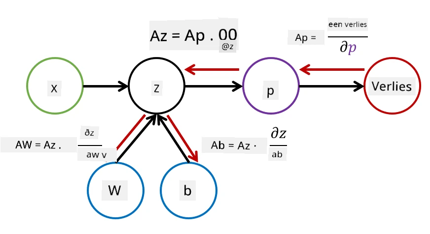

# Introductie tot Neurale Netwerken. Multi-Layered Perceptron

In de vorige sectie heb je geleerd over het eenvoudigste model van een neuraal netwerk: de éénlaagse perceptron, een lineair tweeklassen-classificatiemodel.

In deze sectie breiden we dit model uit naar een flexibeler raamwerk, waarmee we:

* **multiklassen-classificatie** kunnen uitvoeren naast tweeklassen-classificatie
* **regressieproblemen** kunnen oplossen naast classificatie
* klassen kunnen scheiden die niet lineair scheidbaar zijn

We zullen ook ons eigen modulaire raamwerk in Python ontwikkelen, waarmee we verschillende architecturen van neurale netwerken kunnen bouwen.

## [Pre-lecture quiz](https://ff-quizzes.netlify.app/en/ai/quiz/7)

## Formalisatie van Machine Learning

Laten we beginnen met het formaliseren van het Machine Learning-probleem. Stel dat we een trainingsdataset **X** hebben met labels **Y**, en we moeten een model *f* bouwen dat de meest nauwkeurige voorspellingen maakt. De kwaliteit van de voorspellingen wordt gemeten door de **verliesfunctie** &lagran;. De volgende verliesfuncties worden vaak gebruikt:

* Voor regressieproblemen, waarbij we een getal moeten voorspellen, kunnen we **absolute fout** &sum;i|f(x(i))-y(i)| gebruiken, of **kwadratische fout** &sum;i(f(x(i))-y(i))2
* Voor classificatie gebruiken we **0-1 verlies** (wat in wezen hetzelfde is als de **nauwkeurigheid** van het model), of **logistisch verlies**.

Voor een éénlaagse perceptron werd de functie *f* gedefinieerd als een lineaire functie *f(x)=wx+b* (hierbij is *w* de gewichtenmatrix, *x* de vector van invoerkenmerken, en *b* de biasvector). Voor verschillende architecturen van neurale netwerken kan deze functie een complexere vorm aannemen.

> In het geval van classificatie is het vaak wenselijk om waarschijnlijkheden van de corresponderende klassen als netwerkoutput te krijgen. Om willekeurige getallen om te zetten naar waarschijnlijkheden (bijvoorbeeld om de output te normaliseren), gebruiken we vaak de **softmax**-functie &sigma;, en wordt de functie *f* *f(x)=&sigma;(wx+b)*

In de definitie van *f* hierboven worden *w* en *b* **parameters** genoemd &theta;=⟨*w,b*⟩. Gegeven de dataset ⟨**X**,**Y**⟩, kunnen we een totale fout op de hele dataset berekenen als een functie van de parameters &theta;.

> ✅ **Het doel van het trainen van een neuraal netwerk is om de fout te minimaliseren door de parameters &theta; te variëren**

## Optimalisatie met Gradient Descent

Er is een bekende methode voor functie-optimalisatie genaamd **gradient descent**. Het idee is dat we een afgeleide (in het geval van meerdere dimensies een **gradiënt** genoemd) van de verliesfunctie kunnen berekenen ten opzichte van de parameters, en de parameters zodanig kunnen aanpassen dat de fout afneemt. Dit kan als volgt worden geformaliseerd:

* Initialiseer de parameters met willekeurige waarden w(0), b(0)
* Herhaal de volgende stap meerdere keren:
    - w(i+1) = w(i)-&eta;&part;&lagran;/&part;w
    - b(i+1) = b(i)-&eta;&part;&lagran;/&part;b

Tijdens het trainen worden de optimalisatiestappen verondersteld te worden berekend op basis van de hele dataset (onthoud dat verlies wordt berekend als een som over alle trainingssamples). In de praktijk nemen we echter kleine delen van de dataset, zogenaamde **minibatches**, en berekenen we de gradiënten op basis van een subset van de data. Omdat de subset elke keer willekeurig wordt genomen, wordt deze methode **stochastic gradient descent** (SGD) genoemd.

## Multi-Layered Perceptrons en Backpropagation

Een éénlaagse netwerk, zoals we hierboven hebben gezien, is in staat om lineair scheidbare klassen te classificeren. Om een rijker model te bouwen, kunnen we meerdere lagen van het netwerk combineren. Wiskundig betekent dit dat de functie *f* een complexere vorm krijgt en in meerdere stappen wordt berekend:
* z1=w1x+b1
* z2=w2&alpha;(z1)+b2
* f = &sigma;(z2)

Hierbij is &alpha; een **niet-lineaire activatiefunctie**, &sigma; een softmax-functie, en parameters &theta;=<*w1,b1,w2,b2*>.

Het gradient descent-algoritme blijft hetzelfde, maar het wordt moeilijker om de gradiënten te berekenen. Gegeven de kettingregel voor differentiatie, kunnen we de afgeleiden berekenen als:

* &part;&lagran;/&part;w2 = (&part;&lagran;/&part;&sigma;)(&part;&sigma;/&part;z2)(&part;z2/&part;w2)
* &part;&lagran;/&part;w1 = (&part;&lagran;/&part;&sigma;)(&part;&sigma;/&part;z2)(&part;z2/&part;&alpha;)(&part;&alpha;/&part;z1)(&part;z1/&part;w1)

> ✅ De kettingregel voor differentiatie wordt gebruikt om de afgeleiden van de verliesfunctie ten opzichte van de parameters te berekenen.

Merk op dat het meest linkse deel van al deze uitdrukkingen hetzelfde is, en dat we dus effectief de afgeleiden kunnen berekenen door te beginnen bij de verliesfunctie en "achterwaarts" door de computationele grafiek te gaan. Daarom wordt de methode voor het trainen van een multi-layered perceptron **backpropagation** genoemd, of 'backprop'.

> TODO: afbeelding bronvermelding

> ✅ We zullen backpropagation veel gedetailleerder behandelen in ons notebookvoorbeeld.  

## Conclusie

In deze les hebben we onze eigen bibliotheek voor neurale netwerken gebouwd, en we hebben deze gebruikt voor een eenvoudige tweedimensionale classificatietaak.

## 🚀 Uitdaging

In het bijbehorende notebook implementeer je je eigen raamwerk voor het bouwen en trainen van multi-layered perceptrons. Je zult in detail kunnen zien hoe moderne neurale netwerken werken.

Ga verder naar het [OwnFramework](OwnFramework.ipynb) notebook en werk het door.

## [Post-lecture quiz](https://ff-quizzes.netlify.app/en/ai/quiz/8)

## Review & Zelfstudie

Backpropagation is een veelgebruikte algoritme in AI en ML, en het is de moeite waard om [in meer detail](https://wikipedia.org/wiki/Backpropagation) te bestuderen.

## [Opdracht](lab/README.md)

In dit lab wordt je gevraagd om het raamwerk dat je in deze les hebt gebouwd te gebruiken om MNIST handgeschreven cijferclassificatie op te lossen.

* [Instructies](lab/README.md)
* [Notebook](lab/MyFW_MNIST.ipynb)

---

