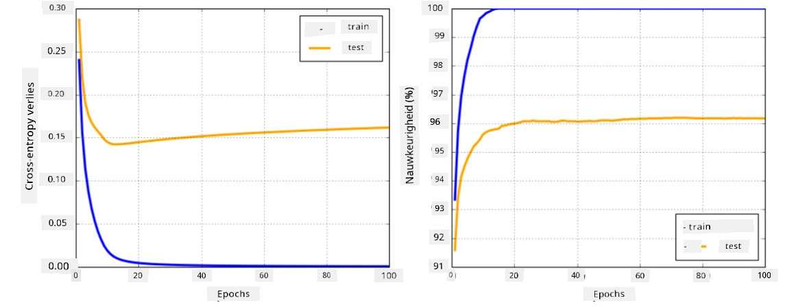

# Neural Netwerk Frameworks

Zoals we al hebben geleerd, moeten we twee dingen doen om neurale netwerken efficiënt te kunnen trainen:

* Werken met tensors, bijvoorbeeld vermenigvuldigen, optellen en functies zoals sigmoid of softmax berekenen.
* Gradienten berekenen van alle uitdrukkingen om optimalisatie via gradient descent uit te voeren.

## [Pre-lecture quiz](https://ff-quizzes.netlify.app/en/ai/quiz/9)

Hoewel de `numpy`-bibliotheek het eerste deel kan uitvoeren, hebben we een mechanisme nodig om de gradienten te berekenen. In [ons framework](../04-OwnFramework/OwnFramework.ipynb) dat we in de vorige sectie hebben ontwikkeld, moesten we handmatig alle afgeleide functies programmeren in de `backward`-methode, die backpropagation uitvoert. Idealiter zou een framework ons de mogelijkheid moeten bieden om de gradienten van *elke uitdrukking* die we kunnen definiëren te berekenen.

Een ander belangrijk aspect is de mogelijkheid om berekeningen uit te voeren op een GPU, of andere gespecialiseerde rekenunits zoals [TPU](https://en.wikipedia.org/wiki/Tensor_Processing_Unit). Het trainen van diepe neurale netwerken vereist *heel veel* berekeningen, en het parallel uitvoeren van deze berekeningen op GPU's is cruciaal.

> ✅ De term 'paralleliseren' betekent het verdelen van berekeningen over meerdere apparaten.

De twee meest populaire neurale frameworks op dit moment zijn: [TensorFlow](http://TensorFlow.org) en [PyTorch](https://pytorch.org/). Beide bieden een low-level API om met tensors te werken op zowel CPU als GPU. Naast de low-level API is er ook een high-level API, respectievelijk [Keras](https://keras.io/) en [PyTorch Lightning](https://pytorchlightning.ai/).

Low-Level API | [TensorFlow](http://TensorFlow.org) | [PyTorch](https://pytorch.org/)
--------------|-------------------------------------|--------------------------------
High-level API| [Keras](https://keras.io/) | [PyTorch Lightning](https://pytorchlightning.ai/)

**Low-level APIs** in beide frameworks stellen je in staat zogenaamde **computational graphs** te bouwen. Deze grafiek definieert hoe de output (meestal de verliesfunctie) wordt berekend met gegeven inputparameters, en kan worden uitgevoerd op een GPU, indien beschikbaar. Er zijn functies om deze computational graph te differentiëren en gradienten te berekenen, die vervolgens kunnen worden gebruikt om modelparameters te optimaliseren.

**High-level APIs** beschouwen neurale netwerken grotendeels als een **reeks lagen** en maken het construeren van de meeste neurale netwerken veel eenvoudiger. Het trainen van het model vereist meestal het voorbereiden van de data en vervolgens het aanroepen van een `fit`-functie om het werk te doen.

De high-level API stelt je in staat om typische neurale netwerken zeer snel te construeren zonder je zorgen te maken over veel details. Tegelijkertijd bieden low-level APIs veel meer controle over het trainingsproces, en worden ze daarom veel gebruikt in onderzoek, wanneer je werkt met nieuwe neurale netwerkarchitecturen.

Het is ook belangrijk te begrijpen dat je beide APIs samen kunt gebruiken, bijvoorbeeld door je eigen netwerklaagarchitectuur te ontwikkelen met de low-level API en deze vervolgens te gebruiken binnen een groter netwerk dat is geconstrueerd en getraind met de high-level API. Of je kunt een netwerk definiëren met de high-level API als een reeks lagen en vervolgens je eigen low-level trainingsloop gebruiken om optimalisatie uit te voeren. Beide APIs gebruiken dezelfde basisconcepten en zijn ontworpen om goed samen te werken.

## Leren

In deze cursus bieden we de meeste inhoud zowel voor PyTorch als TensorFlow aan. Je kunt je voorkeursframework kiezen en alleen de bijbehorende notebooks doorlopen. Als je niet zeker weet welk framework je moet kiezen, lees dan enkele discussies op internet over **PyTorch vs. TensorFlow**. Je kunt ook beide frameworks bekijken om een beter begrip te krijgen.

Waar mogelijk zullen we High-Level APIs gebruiken voor eenvoud. We vinden het echter belangrijk om te begrijpen hoe neurale netwerken vanaf de basis werken, dus beginnen we met werken met low-level API en tensors. Als je echter snel aan de slag wilt en niet veel tijd wilt besteden aan het leren van deze details, kun je deze overslaan en direct doorgaan naar de high-level API-notebooks.

## ✍️ Oefeningen: Frameworks

Ga verder met leren in de volgende notebooks:

Low-Level API | [TensorFlow+Keras Notebook](IntroKerasTF.ipynb) | [PyTorch](IntroPyTorch.ipynb)
--------------|-------------------------------------|--------------------------------
High-level API| [Keras](IntroKeras.ipynb) | *PyTorch Lightning*

Na het beheersen van de frameworks, laten we het concept van overfitting herhalen.

# Overfitting

Overfitting is een uiterst belangrijk concept in machine learning, en het is essentieel om dit goed te begrijpen!

Bekijk het volgende probleem van het benaderen van 5 punten (weergegeven door `x` op de grafieken hieronder):

 | 
-------------------------|--------------------------
**Lineair model, 2 parameters** | **Niet-lineair model, 7 parameters**
Trainingsfout = 5.3 | Trainingsfout = 0
Validatiefout = 5.1 | Validatiefout = 20

* Links zien we een goede rechte lijnbenadering. Omdat het aantal parameters adequaat is, begrijpt het model de verdeling van de punten goed.
* Rechts is het model te krachtig. Omdat we slechts 5 punten hebben en het model 7 parameters heeft, kan het zich zo aanpassen dat het door alle punten gaat, waardoor de trainingsfout 0 wordt. Dit voorkomt echter dat het model het juiste patroon achter de data begrijpt, waardoor de validatiefout erg hoog is.

Het is erg belangrijk om een juiste balans te vinden tussen de rijkdom van het model (aantal parameters) en het aantal trainingssamples.

## Waarom overfitting optreedt

  * Te weinig trainingsdata
  * Te krachtig model
  * Te veel ruis in de invoerdata

## Hoe overfitting te detecteren

Zoals je kunt zien op de bovenstaande grafiek, kan overfitting worden gedetecteerd door een zeer lage trainingsfout en een hoge validatiefout. Normaal gesproken zien we tijdens het trainen zowel de trainings- als validatiefouten afnemen, en op een gegeven moment kan de validatiefout stoppen met afnemen en beginnen te stijgen. Dit is een teken van overfitting en een indicatie dat we waarschijnlijk op dit punt moeten stoppen met trainen (of op zijn minst een snapshot van het model moeten maken).

## Hoe overfitting te voorkomen

Als je ziet dat overfitting optreedt, kun je een van de volgende dingen doen:

 * De hoeveelheid trainingsdata vergroten
 * De complexiteit van het model verminderen
 * Een [regularisatietechniek](../../4-ComputerVision/08-TransferLearning/TrainingTricks.md) gebruiken, zoals [Dropout](../../4-ComputerVision/08-TransferLearning/TrainingTricks.md#Dropout), die we later zullen bespreken.

## Overfitting en Bias-Variance Tradeoff

Overfitting is eigenlijk een geval van een meer algemeen probleem in de statistiek, genaamd [Bias-Variance Tradeoff](https://en.wikipedia.org/wiki/Bias%E2%80%93variance_tradeoff). Als we de mogelijke bronnen van fouten in ons model beschouwen, zien we twee soorten fouten:

* **Bias-fouten** worden veroorzaakt doordat ons algoritme de relatie tussen trainingsdata niet correct kan vastleggen. Dit kan het gevolg zijn van het feit dat ons model niet krachtig genoeg is (**underfitting**).
* **Variance-fouten**, die worden veroorzaakt doordat het model ruis in de invoerdata benadert in plaats van een betekenisvolle relatie (**overfitting**).

Tijdens het trainen neemt de bias-fout af (omdat ons model leert de data te benaderen), en neemt de variance-fout toe. Het is belangrijk om het trainen te stoppen - ofwel handmatig (wanneer we overfitting detecteren) of automatisch (door regularisatie toe te passen) - om overfitting te voorkomen.

## Conclusie

In deze les heb je geleerd over de verschillen tussen de verschillende APIs voor de twee meest populaire AI-frameworks, TensorFlow en PyTorch. Daarnaast heb je geleerd over een zeer belangrijk onderwerp: overfitting.

## 🚀 Uitdaging

In de bijbehorende notebooks vind je 'taken' onderaan; werk door de notebooks en voltooi de taken.

## [Post-lecture quiz](https://ff-quizzes.netlify.app/en/ai/quiz/10)

## Review & Zelfstudie

Doe onderzoek naar de volgende onderwerpen:

- TensorFlow
- PyTorch
- Overfitting

Stel jezelf de volgende vragen:

- Wat is het verschil tussen TensorFlow en PyTorch?
- Wat is het verschil tussen overfitting en underfitting?

## [Opdracht](lab/README.md)

In deze lab wordt je gevraagd om twee classificatieproblemen op te lossen met behulp van enkel- en meerlaagse volledig verbonden netwerken met PyTorch of TensorFlow.

* [Instructies](lab/README.md)
* [Notebook](lab/LabFrameworks.ipynb)

---

