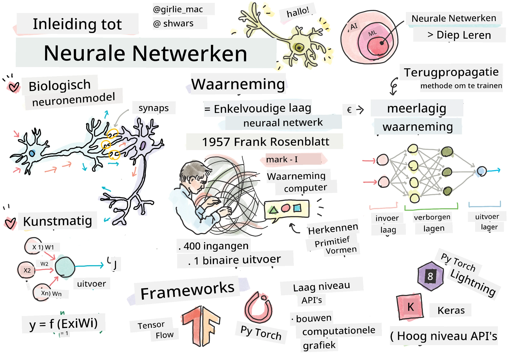
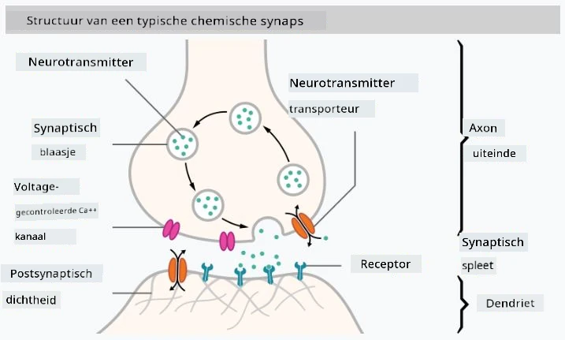

# Introductie tot Neurale Netwerken

Zoals we in de introductie hebben besproken, is een van de manieren om intelligentie te bereiken het trainen van een **computermodel** of een **kunstmatig brein**. Sinds het midden van de 20e eeuw hebben onderzoekers verschillende wiskundige modellen geprobeerd, totdat deze richting in de afgelopen jaren enorm succesvol bleek te zijn. Dergelijke wiskundige modellen van het brein worden **neurale netwerken** genoemd.

> Soms worden neurale netwerken *Kunstmatige Neurale Netwerken* (Artificial Neural Networks, ANNs) genoemd, om aan te geven dat we het hebben over modellen en niet over echte netwerken van neuronen.

## Machine Learning

Neurale netwerken maken deel uit van een bredere discipline genaamd **Machine Learning**, waarvan het doel is om gegevens te gebruiken om computermodellen te trainen die problemen kunnen oplossen. Machine Learning vormt een groot deel van Kunstmatige Intelligentie, maar we behandelen klassieke ML niet in dit curriculum.

> Bezoek ons aparte **[Machine Learning voor Beginners](http://github.com/microsoft/ml-for-beginners)** curriculum om meer te leren over klassieke Machine Learning.

In Machine Learning gaan we ervan uit dat we een dataset van voorbeelden **X** hebben, en bijbehorende uitvoerwaarden **Y**. Voorbeelden zijn vaak N-dimensionale vectoren die bestaan uit **kenmerken**, en uitvoerwaarden worden **labels** genoemd.

We zullen de twee meest voorkomende machine learning-problemen bekijken:

* **Classificatie**, waarbij we een invoerobject moeten classificeren in twee of meer klassen.
* **Regressie**, waarbij we een numerieke waarde moeten voorspellen voor elk van de invoermonsters.

> Bij het weergeven van invoer en uitvoer als tensors is de invoerdataset een matrix van grootte M&times;N, waarbij M het aantal monsters is en N het aantal kenmerken. Uitvoerlabels Y is de vector van grootte M.

In dit curriculum richten we ons uitsluitend op neurale netwerkmodellen.

## Een Model van een Neuron

Uit de biologie weten we dat ons brein bestaat uit neurale cellen (neuronen), die elk meerdere "inputs" (dendrieten) en een enkele "output" (axon) hebben. Zowel dendrieten als axonen kunnen elektrische signalen geleiden, en de verbindingen daartussen — bekend als synapsen — kunnen verschillende graden van geleiding vertonen, die worden gereguleerd door neurotransmitters.

 | 
----|----
Echt Neuron *([Afbeelding](https://en.wikipedia.org/wiki/Synapse#/media/File:SynapseSchematic_lines.svg) van Wikipedia)* | Kunstmatig Neuron *(Afbeelding door Auteur)*

Het eenvoudigste wiskundige model van een neuron bevat dus meerdere inputs X1, ..., XN en een output Y, en een reeks gewichten W1, ..., WN. Een output wordt berekend als:

waarbij f een niet-lineaire **activatiefunctie** is.

> Vroege modellen van neuronen werden beschreven in het klassieke artikel [A logical calculus of the ideas immanent in nervous activity](https://www.cs.cmu.edu/~./epxing/Class/10715/reading/McCulloch.and.Pitts.pdf) door Warren McCullock en Walter Pitts in 1943. Donald Hebb stelde in zijn boek "[The Organization of Behavior: A Neuropsychological Theory](https://books.google.com/books?id=VNetYrB8EBoC)" een manier voor waarop deze netwerken getraind kunnen worden.

## In deze Sectie

In deze sectie leren we over:
* [Perceptron](03-Perceptron/README.md), een van de vroegste neurale netwerkmodellen voor tweeklassenclassificatie
* [Meerlagige netwerken](04-OwnFramework/README.md) met een bijbehorend notitieboekje [hoe we ons eigen framework kunnen bouwen](04-OwnFramework/OwnFramework.ipynb)
* [Neurale Netwerk Frameworks](05-Frameworks/README.md), met deze notitieboekjes: [PyTorch](05-Frameworks/IntroPyTorch.ipynb) en [Keras/Tensorflow](05-Frameworks/IntroKerasTF.ipynb)
* [Overfitting](../../../../lessons/3-NeuralNetworks/05-Frameworks)

---

**Disclaimer**:  
Dit document is vertaald met behulp van de AI-vertalingsservice [Co-op Translator](https://github.com/Azure/co-op-translator). Hoewel we streven naar nauwkeurigheid, dient u zich ervan bewust te zijn dat geautomatiseerde vertalingen fouten of onnauwkeurigheden kunnen bevatten. Het originele document in de oorspronkelijke taal moet worden beschouwd als de gezaghebbende bron. Voor cruciale informatie wordt professionele menselijke vertaling aanbevolen. Wij zijn niet aansprakelijk voor misverstanden of verkeerde interpretaties die voortvloeien uit het gebruik van deze vertaling.