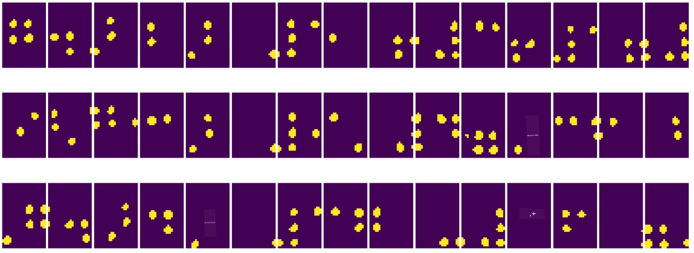
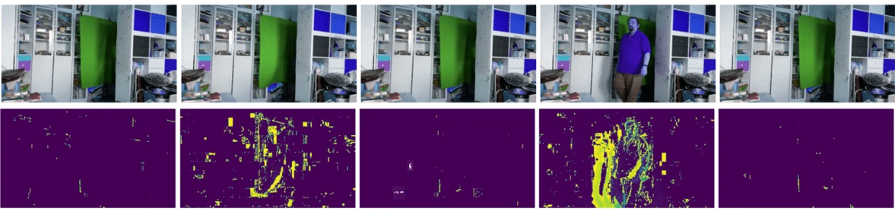

# Introductie tot Computer Vision

[Computer Vision](https://wikipedia.org/wiki/Computer_vision) is een vakgebied dat erop gericht is computers een hoog niveau van begrip van digitale afbeeldingen te geven. Dit is een vrij brede definitie, omdat *begrip* veel verschillende dingen kan betekenen, zoals het vinden van een object op een afbeelding (**objectdetectie**), begrijpen wat er gebeurt (**eventdetectie**), een afbeelding beschrijven in tekst, of een scène in 3D reconstrueren. Er zijn ook speciale taken die betrekking hebben op menselijke afbeeldingen: leeftijd- en emotie-inschatting, gezichtsdetectie en -identificatie, en 3D-houdingsinschatting, om er een paar te noemen.

## [Pre-lecture quiz](https://ff-quizzes.netlify.app/en/ai/quiz/11)

Een van de eenvoudigste taken binnen computer vision is **beeldclassificatie**.

Computer vision wordt vaak beschouwd als een tak van AI. Tegenwoordig worden de meeste taken binnen computer vision opgelost met behulp van neurale netwerken. We zullen meer leren over het speciale type neurale netwerken dat wordt gebruikt voor computer vision, [convolutionele neurale netwerken](../07-ConvNets/README.md), in dit gedeelte.

Voordat je echter een afbeelding aan een neuraal netwerk doorgeeft, is het in veel gevallen zinvol om enkele algoritmische technieken te gebruiken om de afbeelding te verbeteren.

Er zijn verschillende Python-bibliotheken beschikbaar voor beeldverwerking:

* **[imageio](https://imageio.readthedocs.io/en/stable/)** kan worden gebruikt voor het lezen/schrijven van verschillende afbeeldingsformaten. Het ondersteunt ook ffmpeg, een handig hulpmiddel om videoframes naar afbeeldingen te converteren.
* **[Pillow](https://pillow.readthedocs.io/en/stable/index.html)** (ook bekend als PIL) is iets krachtiger en ondersteunt ook enkele beeldmanipulaties zoals morphing, aanpassingen van het palet en meer.
* **[OpenCV](https://opencv.org/)** is een krachtige beeldverwerkingsbibliotheek geschreven in C++, die de *de facto* standaard is geworden voor beeldverwerking. Het heeft een handige Python-interface.
* **[dlib](http://dlib.net/)** is een C++-bibliotheek die veel machine learning-algoritmen implementeert, waaronder enkele algoritmen voor computer vision. Het heeft ook een Python-interface en kan worden gebruikt voor uitdagende taken zoals gezichts- en gezichtslandmarkdetectie.

## OpenCV

[OpenCV](https://opencv.org/) wordt beschouwd als de *de facto* standaard voor beeldverwerking. Het bevat veel nuttige algoritmen, geïmplementeerd in C++. Je kunt OpenCV ook vanuit Python aanroepen.

Een goede plek om OpenCV te leren is [deze Learn OpenCV-cursus](https://learnopencv.com/getting-started-with-opencv/). In ons curriculum is het doel niet om OpenCV te leren, maar om je enkele voorbeelden te laten zien van wanneer het kan worden gebruikt en hoe.

### Afbeeldingen laden

Afbeeldingen in Python kunnen handig worden weergegeven door NumPy-arrays. Bijvoorbeeld, grijswaardenafbeeldingen met een grootte van 320x200 pixels worden opgeslagen in een 200x320-array, en kleurenafbeeldingen van dezelfde afmetingen hebben een vorm van 200x320x3 (voor 3 kleurkanalen). Om een afbeelding te laden, kun je de volgende code gebruiken:

```python
import cv2
import matplotlib.pyplot as plt

im = cv2.imread('image.jpeg')
plt.imshow(im)
```

Traditioneel gebruikt OpenCV BGR (Blauw-Groen-Rood) codering voor kleurenafbeeldingen, terwijl de rest van de Python-tools de meer traditionele RGB (Rood-Groen-Blauw) gebruiken. Om ervoor te zorgen dat de afbeelding er correct uitziet, moet je deze converteren naar de RGB-kleurruimte, door ofwel de dimensies in de NumPy-array te verwisselen, of door een OpenCV-functie aan te roepen:

```python
im = cv2.cvtColor(im,cv2.COLOR_BGR2RGB)
```

Dezelfde `cvtColor`-functie kan worden gebruikt om andere kleurruimte-transformaties uit te voeren, zoals het converteren van een afbeelding naar grijswaarden of naar de HSV (Hue-Saturation-Value) kleurruimte.

Je kunt OpenCV ook gebruiken om video frame-voor-frame te laden - een voorbeeld hiervan wordt gegeven in de oefening [OpenCV Notebook](OpenCV.ipynb).

### Beeldverwerking

Voordat je een afbeelding aan een neuraal netwerk doorgeeft, wil je mogelijk enkele voorbewerkingsstappen toepassen. OpenCV kan veel dingen doen, waaronder:

* **Het formaat wijzigen** van de afbeelding met `im = cv2.resize(im, (320,200),interpolation=cv2.INTER_LANCZOS)`
* **Het vervagen** van de afbeelding met `im = cv2.medianBlur(im,3)` of `im = cv2.GaussianBlur(im, (3,3), 0)`
* Het aanpassen van de **helderheid en het contrast** van de afbeelding kan worden gedaan door NumPy-arraymanipulaties, zoals beschreven [in deze Stackoverflow-notitie](https://stackoverflow.com/questions/39308030/how-do-i-increase-the-contrast-of-an-image-in-python-opencv).
* Het gebruik van [thresholding](https://docs.opencv.org/4.x/d7/d4d/tutorial_py_thresholding.html) door de functies `cv2.threshold`/`cv2.adaptiveThreshold` aan te roepen, wat vaak de voorkeur heeft boven het aanpassen van helderheid of contrast.
* Het toepassen van verschillende [transformaties](https://docs.opencv.org/4.5.5/da/d6e/tutorial_py_geometric_transformations.html) op de afbeelding:
    - **[Affine transformaties](https://docs.opencv.org/4.5.5/d4/d61/tutorial_warp_affine.html)** kunnen nuttig zijn als je rotatie, formaatwijziging en scheefheid wilt combineren in de afbeelding en je de bron- en bestemmingslocatie van drie punten in de afbeelding kent. Affine transformaties houden parallelle lijnen parallel.
    - **[Perspectieftransformaties](https://medium.com/analytics-vidhya/opencv-perspective-transformation-9edffefb2143)** kunnen nuttig zijn wanneer je de bron- en bestemmingsposities van 4 punten in de afbeelding kent. Bijvoorbeeld, als je een foto van een rechthoekig document maakt met een smartphonecamera vanuit een bepaalde hoek, en je wilt een rechthoekige afbeelding van het document zelf maken.
* Beweging binnen de afbeelding begrijpen door gebruik te maken van **[optische stroom](https://docs.opencv.org/4.5.5/d4/dee/tutorial_optical_flow.html)**.

## Voorbeelden van het gebruik van Computer Vision

In ons [OpenCV Notebook](OpenCV.ipynb) geven we enkele voorbeelden van wanneer computer vision kan worden gebruikt om specifieke taken uit te voeren:

* **Voorbewerking van een foto van een Braille-boek**. We richten ons op hoe we thresholding, kenmerkdetectie, perspectieftransformatie en NumPy-manipulaties kunnen gebruiken om individuele Braille-symbolen te scheiden voor verdere classificatie door een neuraal netwerk.

 |  | 
----|-----|-----

> Afbeelding uit [OpenCV.ipynb](OpenCV.ipynb)

* **Beweging detecteren in video met behulp van frameverschillen**. Als de camera vast staat, zouden frames van de camerafeed vrij vergelijkbaar met elkaar moeten zijn. Omdat frames worden weergegeven als arrays, krijg je door die arrays van twee opeenvolgende frames van elkaar af te trekken het pixelverschil, dat laag zou moeten zijn voor statische frames, en hoger wordt zodra er aanzienlijke beweging in de afbeelding is.



> Afbeelding uit [OpenCV.ipynb](OpenCV.ipynb)

* **Beweging detecteren met behulp van Optische Stroom**. [Optische stroom](https://docs.opencv.org/3.4/d4/dee/tutorial_optical_flow.html) stelt ons in staat te begrijpen hoe individuele pixels op videoframes bewegen. Er zijn twee soorten optische stroom:

   - **Dense Optical Flow** berekent het vectorveld dat voor elke pixel laat zien waar deze naartoe beweegt.
   - **Sparse Optical Flow** is gebaseerd op het nemen van enkele onderscheidende kenmerken in de afbeelding (bijv. randen) en het opbouwen van hun traject van frame tot frame.


> Afbeelding uit [OpenCV.ipynb](OpenCV.ipynb)

## ✍️ Voorbeeld Notebooks: OpenCV [probeer OpenCV in actie](OpenCV.ipynb)

Laten we enkele experimenten doen met OpenCV door [OpenCV Notebook](OpenCV.ipynb) te verkennen.

## Conclusie

Soms kunnen relatief complexe taken zoals bewegingsdetectie of vingertopdetectie puur door middel van computer vision worden opgelost. Het is daarom erg nuttig om de basistechnieken van computer vision te kennen en te weten wat bibliotheken zoals OpenCV kunnen doen.

## 🚀 Uitdaging

Bekijk [deze video](https://docs.microsoft.com/shows/ai-show/ai-show--2021-opencv-ai-competition--grand-prize-winners--cortic-tigers--episode-32?WT.mc_id=academic-77998-cacaste) van de AI-show om meer te leren over het Cortic Tigers-project en hoe zij een blokgebaseerde oplossing hebben gebouwd om computervision-taken te democratiseren via een robot. Doe wat onderzoek naar andere projecten zoals deze die nieuwe leerlingen helpen om het vakgebied binnen te komen.

## [Post-lecture quiz](https://ff-quizzes.netlify.app/en/ai/quiz/12)

## Review & Zelfstudie

Lees meer over optische stroom [in deze geweldige tutorial](https://learnopencv.com/optical-flow-in-opencv/).

## [Opdracht](lab/README.md)

In deze lab ga je een video maken met eenvoudige gebaren, en jouw doel is om op/neer/links/rechts bewegingen te extraheren met behulp van optische stroom.


---

