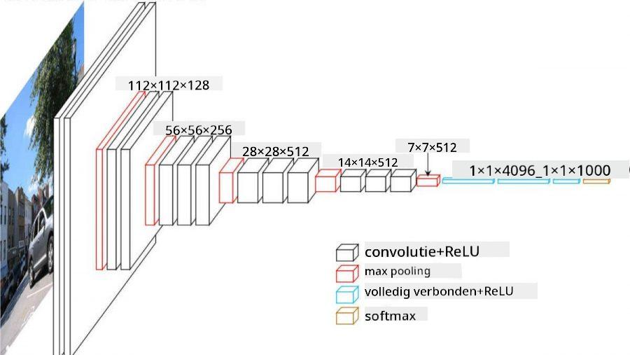

<!--
CO_OP_TRANSLATOR_METADATA:
{
  "original_hash": "088837b42b7d99198bf62db8a42411e0",
  "translation_date": "2025-08-28T19:24:16+00:00",
  "source_file": "lessons/4-ComputerVision/07-ConvNets/README.md",
  "language_code": "nl"
}
-->
# Convolutionele Neurale Netwerken

We hebben eerder gezien dat neurale netwerken behoorlijk goed zijn in het verwerken van afbeeldingen, en zelfs een perceptron met één laag kan handgeschreven cijfers uit de MNIST-dataset met redelijke nauwkeurigheid herkennen. De MNIST-dataset is echter heel bijzonder, omdat alle cijfers gecentreerd zijn in de afbeelding, wat de taak eenvoudiger maakt.

## [Pre-lecture quiz](https://red-field-0a6ddfd03.1.azurestaticapps.net/quiz/107)

In het echte leven willen we objecten in een afbeelding kunnen herkennen, ongeacht hun exacte locatie in de afbeelding. Computervisie verschilt van generieke classificatie, omdat we bij het zoeken naar een bepaald object in een afbeelding de afbeelding scannen op zoek naar specifieke **patronen** en hun combinaties. Bijvoorbeeld, bij het zoeken naar een kat kunnen we eerst zoeken naar horizontale lijnen die snorharen vormen, en vervolgens kan een bepaalde combinatie van snorharen ons vertellen dat het daadwerkelijk een afbeelding van een kat is. De relatieve positie en aanwezigheid van bepaalde patronen zijn belangrijk, en niet hun exacte positie in de afbeelding.

Om patronen te extraheren, gebruiken we het concept van **convolutionele filters**. Zoals je weet, wordt een afbeelding weergegeven door een 2D-matrix of een 3D-tensor met kleurendiepte. Het toepassen van een filter betekent dat we een relatief kleine **filterkernel** matrix nemen, en voor elke pixel in de originele afbeelding het gewogen gemiddelde berekenen met naburige punten. We kunnen dit zien als een klein venster dat over de hele afbeelding schuift en alle pixels gemiddeld volgens de gewichten in de filterkernelmatrix.

 | 
----|----

> Afbeelding door Dmitry Soshnikov

Als we bijvoorbeeld 3x3 verticale en horizontale randfilters toepassen op de MNIST-cijfers, kunnen we highlights (bijvoorbeeld hoge waarden) krijgen waar er verticale en horizontale randen zijn in onze originele afbeelding. Dus kunnen die twee filters worden gebruikt om "te zoeken naar" randen. Op dezelfde manier kunnen we verschillende filters ontwerpen om andere laag-niveau patronen te zoeken:

> Afbeelding van [Leung-Malik Filter Bank](https://www.robots.ox.ac.uk/~vgg/research/texclass/filters.html)

Hoewel we de filters handmatig kunnen ontwerpen om bepaalde patronen te extraheren, kunnen we ook het netwerk zo ontwerpen dat het de patronen automatisch leert. Dit is een van de belangrijkste ideeën achter de CNN.

## Belangrijkste ideeën achter CNN

De werking van CNN's is gebaseerd op de volgende belangrijke ideeën:

* Convolutionele filters kunnen patronen extraheren
* We kunnen het netwerk zo ontwerpen dat filters automatisch worden getraind
* We kunnen dezelfde aanpak gebruiken om patronen te vinden in hoog-niveau kenmerken, niet alleen in de originele afbeelding. Zo werkt de CNN-feature-extractie op een hiërarchie van kenmerken, beginnend bij laag-niveau pixelcombinaties tot hoog-niveau combinaties van afbeeldingsonderdelen.

> Afbeelding uit [een paper van Hislop-Lynch](https://www.semanticscholar.org/paper/Computer-vision-based-pedestrian-trajectory-Hislop-Lynch/26e6f74853fc9bbb7487b06dc2cf095d36c9021d), gebaseerd op [hun onderzoek](https://dl.acm.org/doi/abs/10.1145/1553374.1553453)

## ✍️ Oefeningen: Convolutionele Neurale Netwerken

Laten we verder onderzoeken hoe convolutionele neurale netwerken werken, en hoe we trainbare filters kunnen bereiken, door de bijbehorende notebooks door te nemen:

* [Convolutionele Neurale Netwerken - PyTorch](ConvNetsPyTorch.ipynb)
* [Convolutionele Neurale Netwerken - TensorFlow](ConvNetsTF.ipynb)

## Piramide-architectuur

De meeste CNN's die worden gebruikt voor beeldverwerking volgen een zogenaamde piramide-architectuur. De eerste convolutionele laag die wordt toegepast op de originele afbeeldingen heeft meestal een relatief klein aantal filters (8-16), die overeenkomen met verschillende pixelcombinaties, zoals horizontale/verticale lijnen of strepen. Op het volgende niveau verkleinen we de ruimtelijke dimensie van het netwerk en vergroten we het aantal filters, wat overeenkomt met meer mogelijke combinaties van eenvoudige kenmerken. Met elke laag, terwijl we naar de uiteindelijke classifier gaan, nemen de ruimtelijke dimensies van de afbeelding af en groeit het aantal filters.

Als voorbeeld kijken we naar de architectuur van VGG-16, een netwerk dat in 2014 een nauwkeurigheid van 92,7% behaalde in ImageNet's top-5 classificatie:

> Afbeelding van [Researchgate](https://www.researchgate.net/figure/Vgg16-model-structure-To-get-the-VGG-NIN-model-we-replace-the-2-nd-4-th-6-th-7-th_fig2_335194493)

## Best-bekende CNN-architecturen

[Ga verder met je studie over de best-bekende CNN-architecturen](CNN_Architectures.md)

---

**Disclaimer**:  
Dit document is vertaald met behulp van de AI-vertalingsservice [Co-op Translator](https://github.com/Azure/co-op-translator). Hoewel we streven naar nauwkeurigheid, dient u zich ervan bewust te zijn dat geautomatiseerde vertalingen fouten of onnauwkeurigheden kunnen bevatten. Het originele document in zijn oorspronkelijke taal moet worden beschouwd als de gezaghebbende bron. Voor cruciale informatie wordt professionele menselijke vertaling aanbevolen. Wij zijn niet aansprakelijk voor eventuele misverstanden of verkeerde interpretaties die voortvloeien uit het gebruik van deze vertaling.