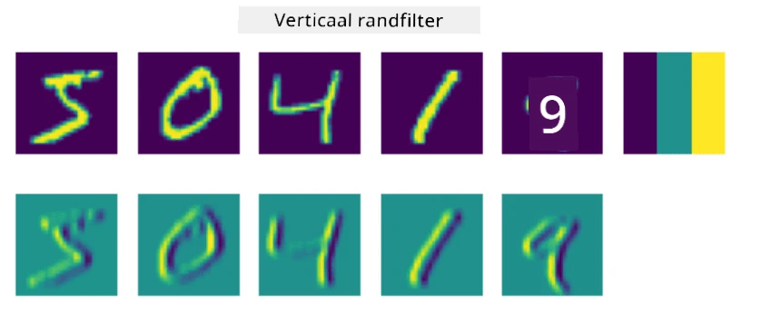
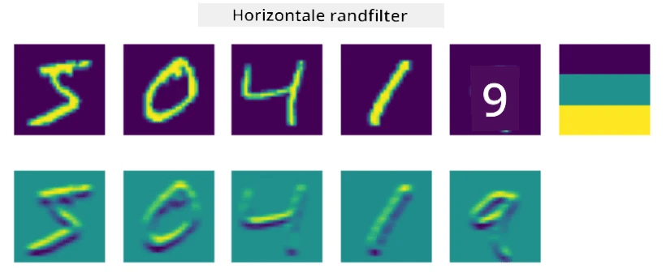
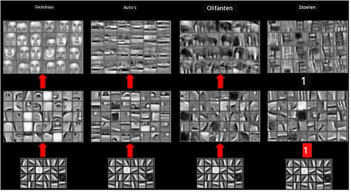
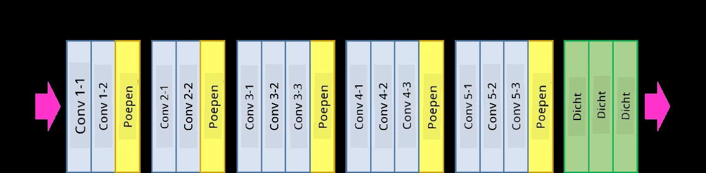

# Convolutionele Neurale Netwerken

We hebben eerder gezien dat neurale netwerken behoorlijk goed zijn in het verwerken van afbeeldingen, en zelfs een perceptron met één laag kan handgeschreven cijfers uit de MNIST-dataset met redelijke nauwkeurigheid herkennen. De MNIST-dataset is echter heel bijzonder, omdat alle cijfers gecentreerd zijn in de afbeelding, wat de taak eenvoudiger maakt.

## [Pre-lecture quiz](https://ff-quizzes.netlify.app/en/ai/quiz/13)

In het echte leven willen we objecten op een afbeelding kunnen herkennen, ongeacht hun exacte locatie in de afbeelding. Computer vision verschilt van generieke classificatie, omdat we bij het zoeken naar een bepaald object in een afbeelding de afbeelding scannen op zoek naar specifieke **patronen** en hun combinaties. Bijvoorbeeld, bij het zoeken naar een kat kijken we eerst naar horizontale lijnen, die snorharen kunnen vormen, en vervolgens kan een bepaalde combinatie van snorharen ons vertellen dat het daadwerkelijk een afbeelding van een kat is. De relatieve positie en aanwezigheid van bepaalde patronen is belangrijk, niet hun exacte positie in de afbeelding.

Om patronen te extraheren, maken we gebruik van het concept van **convolutionele filters**. Zoals je weet, wordt een afbeelding weergegeven door een 2D-matrix, of een 3D-tensor met kleurendiepte. Het toepassen van een filter betekent dat we een relatief kleine **filterkernel**-matrix nemen, en voor elke pixel in de originele afbeelding het gewogen gemiddelde berekenen met naburige punten. Dit kun je zien als een klein venster dat over de hele afbeelding schuift en alle pixels gemiddeld volgens de gewichten in de filterkernel-matrix.

 | 
----|----

> Afbeelding door Dmitry Soshnikov

Als we bijvoorbeeld 3x3 verticale en horizontale randfilters toepassen op de MNIST-cijfers, kunnen we highlights (bijvoorbeeld hoge waarden) krijgen waar verticale en horizontale randen in onze originele afbeelding zijn. Deze twee filters kunnen dus worden gebruikt om "te zoeken naar" randen. Op dezelfde manier kunnen we verschillende filters ontwerpen om andere laag-niveau patronen te zoeken:

> Afbeelding van [Leung-Malik Filter Bank](https://www.robots.ox.ac.uk/~vgg/research/texclass/filters.html)

Hoewel we de filters handmatig kunnen ontwerpen om bepaalde patronen te extraheren, kunnen we het netwerk ook zo ontwerpen dat het de patronen automatisch leert. Dit is een van de belangrijkste ideeën achter CNN.

## Belangrijkste ideeën achter CNN

De werking van CNN's is gebaseerd op de volgende belangrijke ideeën:

* Convolutionele filters kunnen patronen extraheren.
* We kunnen het netwerk zo ontwerpen dat de filters automatisch worden getraind.
* We kunnen dezelfde aanpak gebruiken om patronen te vinden in hoog-niveau kenmerken, niet alleen in de originele afbeelding. Hierdoor werkt de CNN-functie-extractie op een hiërarchie van kenmerken, beginnend bij laag-niveau pixelcombinaties tot hoog-niveau combinaties van afbeeldingsonderdelen.

> Afbeelding uit [een paper van Hislop-Lynch](https://www.semanticscholar.org/paper/Computer-vision-based-pedestrian-trajectory-Hislop-Lynch/26e6f74853fc9bbb7487b06dc2cf095d36c9021d), gebaseerd op [hun onderzoek](https://dl.acm.org/doi/abs/10.1145/1553374.1553453)

## ✍️ Oefeningen: Convolutionele Neurale Netwerken

Laten we verder onderzoeken hoe convolutionele neurale netwerken werken en hoe we trainbare filters kunnen bereiken door de bijbehorende notebooks door te werken:

* [Convolutionele Neurale Netwerken - PyTorch](ConvNetsPyTorch.ipynb)
* [Convolutionele Neurale Netwerken - TensorFlow](ConvNetsTF.ipynb)

## Piramide-architectuur

De meeste CNN's die worden gebruikt voor beeldverwerking volgen een zogenaamde piramide-architectuur. De eerste convolutionele laag die wordt toegepast op de originele afbeeldingen heeft meestal een relatief klein aantal filters (8-16), die overeenkomen met verschillende pixelcombinaties, zoals horizontale/verticale lijnen of strepen. Op het volgende niveau verkleinen we de ruimtelijke dimensie van het netwerk en vergroten we het aantal filters, wat overeenkomt met meer mogelijke combinaties van eenvoudige kenmerken. Met elke laag, naarmate we dichter bij de uiteindelijke classifier komen, nemen de ruimtelijke dimensies van de afbeelding af en groeit het aantal filters.

Als voorbeeld bekijken we de architectuur van VGG-16, een netwerk dat in 2014 een nauwkeurigheid van 92,7% behaalde in de top-5 classificatie van ImageNet:

> Afbeelding van [Researchgate](https://www.researchgate.net/figure/Vgg16-model-structure-To-get-the-VGG-NIN-model-we-replace-the-2-nd-4-th-6-th-7-th_fig2_335194493)

## Best Bekende CNN-Architecturen

[Ga verder met je studie over de best bekende CNN-architecturen](CNN_Architectures.md)

---

