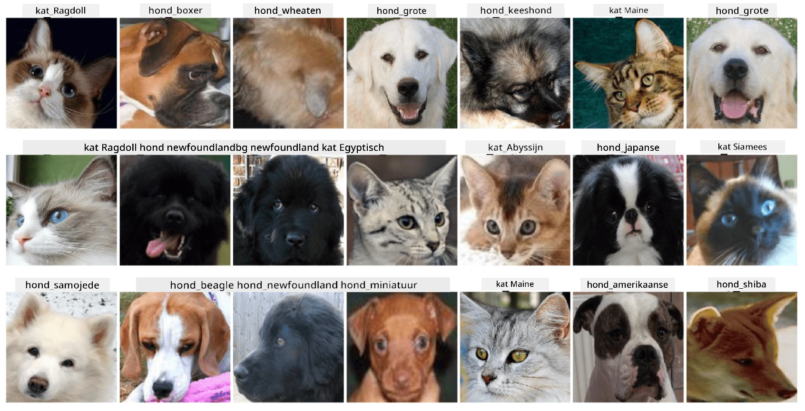

# Classificatie van Huisdiergezichten

Labopdracht uit [AI for Beginners Curriculum](https://github.com/microsoft/ai-for-beginners).

## Taak

Stel je voor dat je een applicatie moet ontwikkelen voor een dierenopvang om alle huisdieren te catalogiseren. Een geweldige functie van zo'n applicatie zou zijn om automatisch het ras te herkennen aan de hand van een foto. Dit kan succesvol worden gedaan met behulp van neurale netwerken.

Je moet een convolutioneel neuraal netwerk trainen om verschillende rassen van katten en honden te classificeren met behulp van de **Pet Faces** dataset.

## De Dataset

We gebruiken de [Oxford-IIIT Pet Dataset](https://www.robots.ox.ac.uk/~vgg/data/pets/), die afbeeldingen bevat van 37 verschillende rassen van honden en katten.



Om de dataset te downloaden, gebruik deze codefragment:

```python
!wget https://thor.robots.ox.ac.uk/~vgg/data/pets/images.tar.gz
!tar xfz images.tar.gz
!rm images.tar.gz
```

**Opmerking:** De afbeeldingen in de Oxford-IIIT Pet Dataset zijn georganiseerd op bestandsnaam (bijv. `Abyssinian_1.jpg`, `Bengal_2.jpg`). Het notebook bevat code om deze afbeeldingen te organiseren in ras-specifieke submappen voor eenvoudigere classificatie.

## Start Notebook

Begin de labopdracht door [PetFaces.ipynb](PetFaces.ipynb) te openen.

## Belangrijkste Leerpunten

Je hebt een relatief complex probleem van beeldclassificatie vanaf nul opgelost! Er waren behoorlijk veel klassen, en je hebt toch een redelijke nauwkeurigheid weten te behalen! Het is ook zinvol om de top-k nauwkeurigheid te meten, omdat het gemakkelijk is om sommige klassen te verwarren die zelfs voor mensen niet duidelijk verschillend zijn.

---

**Disclaimer**:  
Dit document is vertaald met behulp van de AI-vertalingsservice [Co-op Translator](https://github.com/Azure/co-op-translator). Hoewel we streven naar nauwkeurigheid, dient u zich ervan bewust te zijn dat geautomatiseerde vertalingen fouten of onnauwkeurigheden kunnen bevatten. Het originele document in de oorspronkelijke taal moet worden beschouwd als de gezaghebbende bron. Voor cruciale informatie wordt professionele menselijke vertaling aanbevolen. Wij zijn niet aansprakelijk voor misverstanden of verkeerde interpretaties die voortvloeien uit het gebruik van deze vertaling.