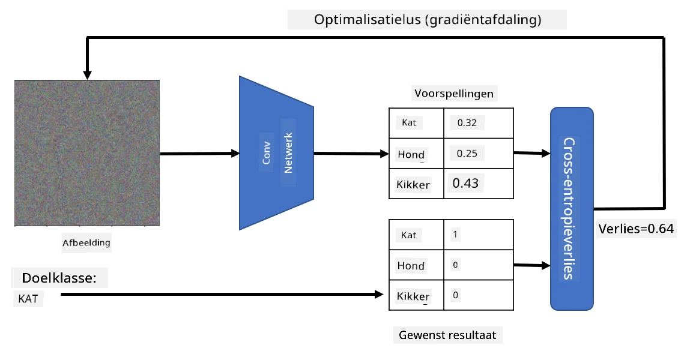

# Voorgetrainde Netwerken en Transfer Learning

Het trainen van CNN's kan veel tijd kosten en vereist een grote hoeveelheid data. Veel tijd wordt besteed aan het leren van de beste laag-niveau filters die een netwerk kan gebruiken om patronen uit afbeeldingen te halen. Een logische vraag is: kunnen we een neuraal netwerk dat op één dataset is getraind gebruiken en aanpassen om andere afbeeldingen te classificeren zonder een volledig trainingsproces?

## [Pre-lecture quiz](https://ff-quizzes.netlify.app/en/ai/quiz/15)

Deze aanpak wordt **transfer learning** genoemd, omdat we kennis overdragen van het ene neurale netwerkmodel naar het andere. Bij transfer learning beginnen we meestal met een voorgetraind model, dat is getraind op een grote afbeeldingsdataset, zoals **ImageNet**. Deze modellen kunnen al goed verschillende kenmerken uit generieke afbeeldingen halen, en in veel gevallen kan het bouwen van een classifier bovenop deze kenmerken goede resultaten opleveren.

> ✅ Transfer Learning is een term die je ook in andere academische velden tegenkomt, zoals Onderwijs. Het verwijst naar het proces waarbij kennis uit één domein wordt toegepast in een ander domein.

## Voorgetrainde Modellen als Kenmerkextractors

De convolutionele netwerken die we in de vorige sectie hebben besproken, bevatten een aantal lagen, waarvan elke laag bepaalde kenmerken uit de afbeelding moet halen. Dit begint bij laag-niveau pixelcombinaties (zoals horizontale/verticale lijnen of strepen) en gaat tot hogere niveau combinaties van kenmerken, zoals een oog van een vlam. Als we een CNN trainen op een voldoende grote dataset van generieke en diverse afbeeldingen, zou het netwerk deze gemeenschappelijke kenmerken moeten leren herkennen.

Zowel Keras als PyTorch bevatten functies om eenvoudig voorgetrainde neurale netwerkgewichten te laden voor enkele veelgebruikte architecturen, waarvan de meeste zijn getraind op ImageNet-afbeeldingen. De meest gebruikte modellen worden beschreven op de [CNN Architectures](../07-ConvNets/CNN_Architectures.md) pagina van de vorige les. In het bijzonder kun je overwegen een van de volgende te gebruiken:

* **VGG-16/VGG-19**, relatief eenvoudige modellen die toch goede nauwkeurigheid bieden. Vaak is het een goede keuze om VGG als eerste poging te gebruiken om te zien hoe transfer learning werkt.
* **ResNet**, een familie van modellen voorgesteld door Microsoft Research in 2015. Ze hebben meer lagen en vereisen daardoor meer middelen.
* **MobileNet**, een familie van modellen met een kleinere omvang, geschikt voor mobiele apparaten. Gebruik deze als je beperkte middelen hebt en bereid bent een beetje nauwkeurigheid op te offeren.

Hier zijn voorbeeldkenmerken die door een VGG-16 netwerk uit een afbeelding van een kat zijn gehaald:

## Cats vs. Dogs Dataset

In dit voorbeeld gebruiken we een dataset van [Cats and Dogs](https://www.microsoft.com/download/details.aspx?id=54765&WT.mc_id=academic-77998-cacaste), die erg dicht bij een real-life afbeeldingsclassificatiescenario ligt.

## ✍️ Oefening: Transfer Learning

Laten we transfer learning in actie zien in de bijbehorende notebooks:

* [Transfer Learning - PyTorch](TransferLearningPyTorch.ipynb)
* [Transfer Learning - TensorFlow](TransferLearningTF.ipynb)

## Visualiseren van Adversarial Cat

Een voorgetraind neuraal netwerk bevat verschillende patronen in zijn *brein*, waaronder ideeën van een **ideale kat** (evenals een ideale hond, ideale zebra, enz.). Het zou interessant zijn om deze afbeelding op de een of andere manier **te visualiseren**. Dit is echter niet eenvoudig, omdat patronen verspreid zijn over de netwerkgewichten en ook georganiseerd zijn in een hiërarchische structuur.

Een aanpak die we kunnen nemen is om te beginnen met een willekeurige afbeelding en vervolgens de techniek van **gradient descent optimalisatie** te gebruiken om die afbeelding zo aan te passen dat het netwerk begint te denken dat het een kat is.

Als we dit doen, krijgen we echter iets dat erg lijkt op willekeurige ruis. Dit komt omdat *er veel manieren zijn om een netwerk te laten denken dat de invoerafbeelding een kat is*, inclusief enkele die visueel geen zin hebben. Hoewel deze afbeeldingen veel patronen bevatten die typisch zijn voor een kat, is er niets dat hen dwingt visueel onderscheidend te zijn.

Om het resultaat te verbeteren, kunnen we een andere term toevoegen aan de verliesfunctie, genaamd **variation loss**. Dit is een maatstaf die aangeeft hoe vergelijkbaar naburige pixels van de afbeelding zijn. Het minimaliseren van variation loss maakt de afbeelding gladder en verwijdert ruis, waardoor meer visueel aantrekkelijke patronen zichtbaar worden. Hier is een voorbeeld van dergelijke "ideale" afbeeldingen, die met hoge waarschijnlijkheid als kat en als zebra worden geclassificeerd:

 | 
-----|-----
 *Ideale Kat* | *Ideale Zebra*

Een soortgelijke aanpak kan worden gebruikt om zogenaamde **adversarial attacks** op een neuraal netwerk uit te voeren. Stel dat we een neuraal netwerk willen misleiden en een hond eruit willen laten zien als een kat. Als we een afbeelding van een hond nemen, die door een netwerk wordt herkend als een hond, kunnen we deze vervolgens een beetje aanpassen met behulp van gradient descent optimalisatie, totdat het netwerk deze begint te classificeren als een kat:

 | 
-----|-----
*Originele afbeelding van een hond* | *Afbeelding van een hond geclassificeerd als een kat*

Zie de code om bovenstaande resultaten te reproduceren in het volgende notebook:

* [Ideale en Adversarial Cat - TensorFlow](AdversarialCat_TF.ipynb)

## Conclusie

Met transfer learning kun je snel een classifier samenstellen voor een aangepaste objectclassificatietaak en een hoge nauwkeurigheid bereiken. Je ziet dat complexere taken die we nu oplossen meer rekenkracht vereisen en niet eenvoudig op de CPU kunnen worden uitgevoerd. In de volgende eenheid proberen we een lichtere implementatie te gebruiken om hetzelfde model te trainen met lagere rekenmiddelen, wat resulteert in slechts iets lagere nauwkeurigheid.

## 🚀 Uitdaging

In de bijbehorende notebooks staan notities onderaan over hoe transfer learning het beste werkt met enigszins vergelijkbare trainingsdata (bijvoorbeeld een nieuw type dier). Experimenteer met volledig nieuwe soorten afbeeldingen om te zien hoe goed of slecht je transfer learning modellen presteren.

## [Post-lecture quiz](https://ff-quizzes.netlify.app/en/ai/quiz/16)

## Review & Zelfstudie

Lees [TrainingTricks.md](TrainingTricks.md) door om je kennis te verdiepen over andere manieren om je modellen te trainen.

## [Opdracht](lab/README.md)

In dit lab gebruiken we de real-life [Oxford-IIIT](https://www.robots.ox.ac.uk/~vgg/data/pets/) pets dataset met 35 rassen van katten en honden, en bouwen we een transfer learning classifier.

---

