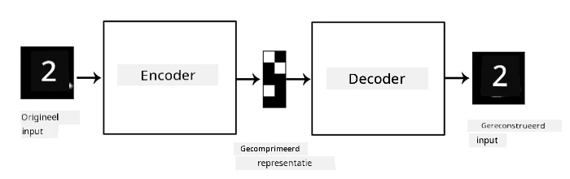

# Autoencoders

Bij het trainen van CNNs is een van de problemen dat we veel gelabelde data nodig hebben. In het geval van beeldclassificatie moeten we afbeeldingen in verschillende klassen indelen, wat een handmatig proces is.

## [Pre-lecture quiz](https://ff-quizzes.netlify.app/en/ai/quiz/17)

We willen echter mogelijk ruwe (ongelabelde) data gebruiken om CNN-feature extractors te trainen, wat **zelf-supervised learning** wordt genoemd. In plaats van labels gebruiken we trainingsafbeeldingen zowel als invoer als uitvoer van het netwerk. Het belangrijkste idee van een **autoencoder** is dat we een **encoder-netwerk** hebben dat de invoerafbeelding omzet in een **latente ruimte** (meestal een vector van kleinere omvang), en vervolgens een **decoder-netwerk**, waarvan het doel is om de originele afbeelding te reconstrueren.

> ✅ Een [autoencoder](https://wikipedia.org/wiki/Autoencoder) is "een type kunstmatig neuraal netwerk dat wordt gebruikt om efficiënte coderingen van ongelabelde data te leren."

Omdat we een autoencoder trainen om zoveel mogelijk informatie uit de originele afbeelding vast te leggen voor een nauwkeurige reconstructie, probeert het netwerk de beste **embedding** van invoerafbeeldingen te vinden om de betekenis vast te leggen.

> Afbeelding van [Keras blog](https://blog.keras.io/building-autoencoders-in-keras.html)

## Scenario's voor het gebruik van Autoencoders

Hoewel het reconstrueren van originele afbeeldingen op zichzelf niet erg nuttig lijkt, zijn er enkele scenario's waarin autoencoders bijzonder nuttig zijn:

* **Dimensieverlaging van afbeeldingen voor visualisatie** of **training van afbeeldings-embeddings**. Autoencoders geven meestal betere resultaten dan PCA, omdat ze rekening houden met de ruimtelijke aard van afbeeldingen en hiërarchische kenmerken.
* **Ontruisen**, oftewel het verwijderen van ruis uit een afbeelding. Omdat ruis veel nutteloze informatie bevat, kan een autoencoder dit niet allemaal in een relatief kleine latente ruimte passen en legt het alleen het belangrijke deel van de afbeelding vast. Bij het trainen van ontruisers beginnen we met originele afbeeldingen en gebruiken we afbeeldingen met kunstmatig toegevoegde ruis als invoer voor de autoencoder.
* **Superresolutie**, het verhogen van de resolutie van afbeeldingen. We beginnen met afbeeldingen met hoge resolutie en gebruiken de afbeelding met lagere resolutie als invoer voor de autoencoder.
* **Generatieve modellen**. Zodra we de autoencoder hebben getraind, kan het decoder-gedeelte worden gebruikt om nieuwe objecten te creëren, beginnend met willekeurige latente vectoren.

## Variational Autoencoders (VAE)

Traditionele autoencoders verminderen op een bepaalde manier de dimensie van de invoerdata en identificeren de belangrijke kenmerken van invoerafbeeldingen. Latente vectoren hebben echter vaak weinig betekenis. Met andere woorden, als we bijvoorbeeld de MNIST-dataset nemen, is het niet eenvoudig om te bepalen welke cijfers overeenkomen met verschillende latente vectoren, omdat nabije latente vectoren niet noodzakelijkerwijs overeenkomen met dezelfde cijfers.

Aan de andere kant is het bij het trainen van *generatieve* modellen beter om enige begrip van de latente ruimte te hebben. Dit idee leidt ons naar de **variational autoencoder** (VAE).

Een VAE is een autoencoder die leert om de *statistische verdeling* van de latente parameters te voorspellen, de zogenaamde **latente verdeling**. Bijvoorbeeld, we willen misschien dat latente vectoren normaal verdeeld zijn met een bepaalde gemiddelde zmean en standaarddeviatie zsigma (zowel de gemiddelde als de standaarddeviatie zijn vectoren van een bepaalde dimensie d). De encoder in de VAE leert deze parameters te voorspellen, en vervolgens neemt de decoder een willekeurige vector uit deze verdeling om het object te reconstrueren.

Samenvattend:

 * Van de invoervector voorspellen we `z_mean` en `z_log_sigma` (in plaats van de standaarddeviatie zelf voorspellen we de logaritme ervan)
 * We nemen een steekproefvector `sample` uit de verdeling N(zmean,exp(zlog\_sigma))
 * De decoder probeert de originele afbeelding te decoderen met `sample` als invoervector

 

> Afbeelding van [deze blogpost](https://ijdykeman.github.io/ml/2016/12/21/cvae.html) door Isaak Dykeman

Variational autoencoders gebruiken een complexe verliesfunctie die uit twee delen bestaat:

* **Reconstructieverlies** is de verliesfunctie die aangeeft hoe dicht een gereconstrueerde afbeelding bij het doel ligt (dit kan Mean Squared Error, of MSE, zijn). Dit is dezelfde verliesfunctie als bij normale autoencoders.
* **KL-verlies**, dat ervoor zorgt dat de verdeling van de latente variabelen dicht bij een normale verdeling blijft. Het is gebaseerd op het concept van [Kullback-Leibler-divergentie](https://www.countbayesie.com/blog/2017/5/9/kullback-leibler-divergence-explained) - een maatstaf om te schatten hoe vergelijkbaar twee statistische verdelingen zijn.

Een belangrijk voordeel van VAEs is dat ze ons in staat stellen relatief eenvoudig nieuwe afbeeldingen te genereren, omdat we weten uit welke verdeling we latente vectoren moeten nemen. Bijvoorbeeld, als we een VAE trainen met een 2D latente vector op MNIST, kunnen we vervolgens de componenten van de latente vector variëren om verschillende cijfers te krijgen:

> Afbeelding door [Dmitry Soshnikov](http://soshnikov.com)

Let op hoe afbeeldingen in elkaar overlopen, terwijl we latente vectoren uit verschillende delen van de latente parametersruimte halen. We kunnen deze ruimte ook in 2D visualiseren:

 

> Afbeelding door [Dmitry Soshnikov](http://soshnikov.com)

## ✍️ Oefeningen: Autoencoders

Leer meer over autoencoders in de bijbehorende notebooks:

* [Autoencoders in TensorFlow](AutoencodersTF.ipynb)
* [Autoencoders in PyTorch](AutoEncodersPyTorch.ipynb)

## Eigenschappen van Autoencoders

* **Dataspecifiek** - ze werken alleen goed met het type afbeeldingen waarop ze zijn getraind. Bijvoorbeeld, als we een superresolutienetwerk trainen op bloemen, zal het niet goed werken op portretten. Dit komt omdat het netwerk een afbeelding met hogere resolutie kan produceren door fijne details te halen uit kenmerken die zijn geleerd uit de trainingsdataset.
* **Verlieslatend** - de gereconstrueerde afbeelding is niet hetzelfde als de originele afbeelding. De aard van het verlies wordt bepaald door de *verliesfunctie* die tijdens het trainen wordt gebruikt.
* Werkt op **ongelabelde data**

## [Post-lecture quiz](https://ff-quizzes.netlify.app/en/ai/quiz/18)

## Conclusie

In deze les heb je geleerd over de verschillende soorten autoencoders die beschikbaar zijn voor de AI-wetenschapper. Je hebt geleerd hoe je ze kunt bouwen en hoe je ze kunt gebruiken om afbeeldingen te reconstrueren. Je hebt ook geleerd over de VAE en hoe je deze kunt gebruiken om nieuwe afbeeldingen te genereren.

## 🚀 Uitdaging

In deze les heb je geleerd over het gebruik van autoencoders voor afbeeldingen. Maar ze kunnen ook worden gebruikt voor muziek! Bekijk het Magenta-project [MusicVAE](https://magenta.tensorflow.org/music-vae), dat autoencoders gebruikt om muziek te leren reconstrueren. Doe enkele [experimenten](https://colab.research.google.com/github/magenta/magenta-demos/blob/master/colab-notebooks/Multitrack_MusicVAE.ipynb) met deze bibliotheek om te zien wat je kunt creëren.

## [Post-lecture quiz](https://ff-quizzes.netlify.app/en/ai/quiz/16)

## Review & Zelfstudie

Lees meer over autoencoders in deze bronnen:

* [Building Autoencoders in Keras](https://blog.keras.io/building-autoencoders-in-keras.html)
* [Blogpost op NeuroHive](https://neurohive.io/ru/osnovy-data-science/variacionnyj-avtojenkoder-vae/)
* [Variational Autoencoders Explained](https://kvfrans.com/variational-autoencoders-explained/)
* [Conditional Variational Autoencoders](https://ijdykeman.github.io/ml/2016/12/21/cvae.html)

## Opdracht

Aan het einde van [deze notebook met TensorFlow](AutoencodersTF.ipynb) vind je een 'taak' - gebruik deze als je opdracht.

---

