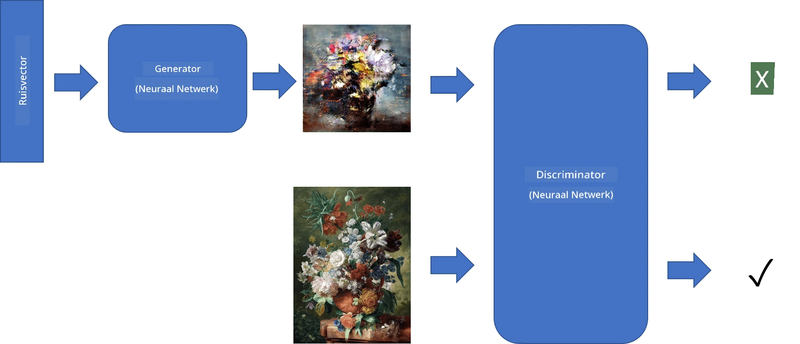
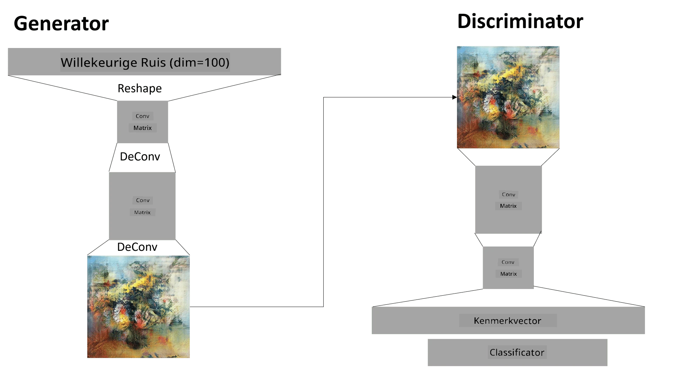

# Generative Adversarial Networks

In de vorige sectie hebben we geleerd over **generatieve modellen**: modellen die nieuwe afbeeldingen kunnen genereren die lijken op de afbeeldingen in de trainingsdataset. VAE was een goed voorbeeld van een generatief model.

## [Pre-lecture quiz](https://ff-quizzes.netlify.app/en/ai/quiz/19)

Als we echter iets echt betekenisvols willen genereren, zoals een schilderij met een redelijke resolutie, dan zien we dat de training met VAE niet goed convergeert. Voor dit gebruiksdoel moeten we een andere architectuur leren kennen die specifiek gericht is op generatieve modellen - **Generative Adversarial Networks**, of GANs.

Het belangrijkste idee van een GAN is om twee neurale netwerken te hebben die tegen elkaar worden getraind:

> Afbeelding door [Dmitry Soshnikov](http://soshnikov.com)

> ✅ Een beetje vocabulaire:
> * **Generator** is een netwerk dat een willekeurige vector neemt en als resultaat een afbeelding produceert.
> * **Discriminator** is een netwerk dat een afbeelding neemt en moet bepalen of het een echte afbeelding is (uit de trainingsdataset) of dat het is gegenereerd door een generator. Het is in wezen een beeldclassificator.

### Discriminator

De architectuur van de discriminator verschilt niet van een gewoon beeldclassificatienetwerk. In het eenvoudigste geval kan het een volledig verbonden classificator zijn, maar meestal zal het een [convolutioneel netwerk](../07-ConvNets/README.md) zijn.

> ✅ Een GAN gebaseerd op convolutionele netwerken wordt een [DCGAN](https://arxiv.org/pdf/1511.06434.pdf) genoemd.

Een CNN-discriminator bestaat uit de volgende lagen: meerdere convoluties+poolings (met afnemende ruimtelijke grootte) en een of meer volledig verbonden lagen om een "feature vector" te verkrijgen, gevolgd door een binaire classificator.

> ✅ 'Pooling' in deze context is een techniek die de grootte van de afbeelding verkleint. "Pooling-lagen verkleinen de dimensies van gegevens door de outputs van neuronclusters in één laag te combineren tot een enkele neuron in de volgende laag." - [bron](https://wikipedia.org/wiki/Convolutional_neural_network#Pooling_layers)

### Generator

Een Generator is iets ingewikkelder. Je kunt het beschouwen als een omgekeerde discriminator. Beginnend met een latente vector (in plaats van een feature vector), heeft het een volledig verbonden laag om het om te zetten naar de vereiste grootte/vorm, gevolgd door deconvoluties+opschaling. Dit lijkt op het *decoder*-gedeelte van een [autoencoder](../09-Autoencoders/README.md).

> ✅ Omdat de convolutielaag wordt geïmplementeerd als een lineair filter dat over de afbeelding beweegt, is deconvolutie in wezen vergelijkbaar met convolutie en kan het worden geïmplementeerd met dezelfde laaglogica.

> Afbeelding door [Dmitry Soshnikov](http://soshnikov.com)

### Het trainen van de GAN

GANs worden **adversarial** genoemd omdat er een constante competitie is tussen de generator en de discriminator. Tijdens deze competitie verbeteren zowel de generator als de discriminator, waardoor het netwerk leert steeds betere afbeeldingen te produceren.

De training gebeurt in twee fasen:

* **Het trainen van de discriminator**. Deze taak is vrij eenvoudig: we genereren een batch afbeeldingen met de generator, labelen deze als 0 (wat staat voor nepafbeelding), en nemen een batch afbeeldingen uit de inputdataset (met label 1, echte afbeelding). We verkrijgen een *discriminator loss* en voeren backprop uit.
* **Het trainen van de generator**. Dit is iets ingewikkelder, omdat we de verwachte output voor de generator niet direct kennen. We nemen het hele GAN-netwerk, bestaande uit een generator gevolgd door een discriminator, voeden het met willekeurige vectoren en verwachten dat het resultaat 1 is (overeenkomend met echte afbeeldingen). We bevriezen vervolgens de parameters van de discriminator (we willen niet dat deze in deze stap wordt getraind) en voeren backprop uit.

Tijdens dit proces dalen de verliezen van zowel de generator als de discriminator niet significant. In de ideale situatie zouden ze moeten oscilleren, wat overeenkomt met beide netwerken die hun prestaties verbeteren.

## ✍️ Oefeningen: GANs

* [GAN Notebook in TensorFlow/Keras](GANTF.ipynb)
* [GAN Notebook in PyTorch](GANPyTorch.ipynb)

### Problemen bij het trainen van GANs

GANs staan erom bekend bijzonder moeilijk te trainen te zijn. Hier zijn een paar problemen:

* **Mode Collapse**. Dit betekent dat de generator leert om één succesvolle afbeelding te produceren die de discriminator misleidt, in plaats van een verscheidenheid aan verschillende afbeeldingen.
* **Gevoeligheid voor hyperparameters**. Vaak zie je dat een GAN helemaal niet convergeert, en dan plotseling een verlaging van de leersnelheid leidt tot convergentie.
* Het behouden van een **balans** tussen de generator en de discriminator. In veel gevallen kan de discriminator loss relatief snel naar nul dalen, wat ertoe leidt dat de generator niet verder kan trainen. Om dit te overwinnen, kunnen we proberen verschillende leersnelheden in te stellen voor de generator en discriminator, of de training van de discriminator overslaan als de loss al te laag is.
* Training voor **hoge resolutie**. Dit probleem, vergelijkbaar met dat van autoencoders, wordt veroorzaakt doordat het reconstrueren van te veel lagen van een convolutioneel netwerk leidt tot artefacten. Dit probleem wordt meestal opgelost met zogenaamde **progressive growing**, waarbij eerst een paar lagen worden getraind op afbeeldingen met lage resolutie, en vervolgens lagen worden "ontgrendeld" of toegevoegd. Een andere oplossing is het toevoegen van extra verbindingen tussen lagen en het tegelijkertijd trainen van meerdere resoluties - zie dit [Multi-Scale Gradient GANs paper](https://arxiv.org/abs/1903.06048) voor details.

## Style Transfer

GANs zijn een geweldige manier om artistieke afbeeldingen te genereren. Een andere interessante techniek is de zogenaamde **style transfer**, waarbij een **content image** wordt genomen en opnieuw wordt getekend in een andere stijl, met behulp van filters van een **style image**.

De manier waarop het werkt is als volgt:
* We beginnen met een willekeurige ruisafbeelding (of met een content image, maar om het te begrijpen is het eenvoudiger om met willekeurige ruis te beginnen).
* Ons doel is om een afbeelding te creëren die dicht bij zowel de content image als de style image ligt. Dit wordt bepaald door twee verliesfuncties:
   - **Content loss** wordt berekend op basis van de kenmerken die door de CNN in sommige lagen worden geëxtraheerd uit de huidige afbeelding en de content image.
   - **Style loss** wordt op een slimme manier berekend tussen de huidige afbeelding en de style image met behulp van Gram-matrices (meer details in het [voorbeeldnotebook](StyleTransfer.ipynb)).
* Om de afbeelding gladder te maken en ruis te verwijderen, introduceren we ook **Variation loss**, die de gemiddelde afstand tussen naburige pixels berekent.
* De belangrijkste optimalisatielus past de huidige afbeelding aan met behulp van gradient descent (of een ander optimalisatie-algoritme) om het totale verlies te minimaliseren, wat een gewogen som is van alle drie de verliezen.

## ✍️ Voorbeeld: [Style Transfer](StyleTransfer.ipynb)

## [Post-lecture quiz](https://ff-quizzes.netlify.app/en/ai/quiz/20)

## Conclusie

In deze les heb je geleerd over GANs en hoe je ze kunt trainen. Je hebt ook geleerd over de specifieke uitdagingen waarmee dit type Neuraal Netwerk te maken kan krijgen, en enkele strategieën om deze te overwinnen.

## 🚀 Uitdaging

Doorloop het [Style Transfer-notebook](StyleTransfer.ipynb) met je eigen afbeeldingen.

## Review & Zelfstudie

Lees voor meer informatie over GANs de volgende bronnen:

* Marco Pasini, [10 Lessons I Learned Training GANs for one Year](https://towardsdatascience.com/10-lessons-i-learned-training-generative-adversarial-networks-gans-for-a-year-c9071159628)
* [StyleGAN](https://en.wikipedia.org/wiki/StyleGAN), een *de facto* GAN-architectuur om te overwegen
* [Creating Generative Art using GANs on Azure ML](https://soshnikov.com/scienceart/creating-generative-art-using-gan-on-azureml/)

## Opdracht

Herbekijk een van de twee notebooks die bij deze les horen en train de GAN opnieuw met je eigen afbeeldingen. Wat kun je creëren?

---

