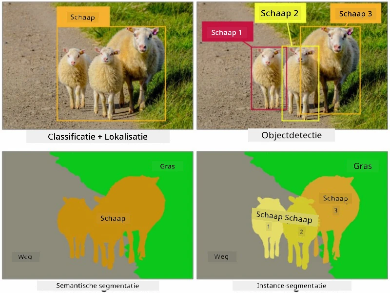
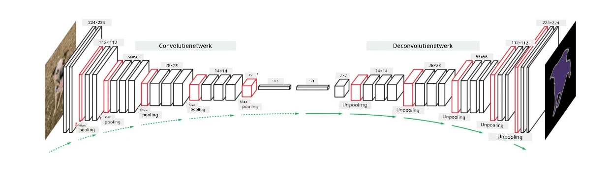

# Segmentatie

We hebben eerder geleerd over Objectdetectie, waarmee we objecten in een afbeelding kunnen lokaliseren door hun *omgrenzende kaders* te voorspellen. Voor sommige taken hebben we echter niet alleen omgrenzende kaders nodig, maar ook een nauwkeurigere objectlokalisatie. Deze taak wordt **segmentatie** genoemd.

## [Pre-lecture quiz](https://ff-quizzes.netlify.app/en/ai/quiz/23)

Segmentatie kan worden gezien als **pixelclassificatie**, waarbij we voor **elke** pixel van een afbeelding de klasse moeten voorspellen (*achtergrond* is een van de klassen). Er zijn twee hoofdsegmentatie-algoritmen:

* **Semantische segmentatie** geeft alleen de pixelklasse aan en maakt geen onderscheid tussen verschillende objecten van dezelfde klasse.
* **Instance segmentatie** verdeelt klassen in verschillende exemplaren.

Bij instance segmentatie zijn deze schapen verschillende objecten, maar bij semantische segmentatie worden alle schapen weergegeven als één klasse.

> Afbeelding afkomstig uit [deze blogpost](https://nirmalamurali.medium.com/image-classification-vs-semantic-segmentation-vs-instance-segmentation-625c33a08d50)

Er zijn verschillende neurale architecturen voor segmentatie, maar ze hebben allemaal dezelfde structuur. Op een bepaalde manier lijkt het op de autoencoder waar je eerder over hebt geleerd, maar in plaats van de originele afbeelding te reconstrueren, is ons doel om een **masker** te reconstrueren. Een segmentatienetwerk heeft dus de volgende onderdelen:

* **Encoder** haalt kenmerken uit de invoerafbeelding.
* **Decoder** zet die kenmerken om in de **maskerafbeelding**, met dezelfde grootte en een aantal kanalen dat overeenkomt met het aantal klassen.

> Afbeelding afkomstig uit [deze publicatie](https://arxiv.org/pdf/2001.05566.pdf)

We moeten vooral de verliesfunctie noemen die wordt gebruikt voor segmentatie. Bij klassieke autoencoders moeten we de gelijkenis tussen twee afbeeldingen meten, en daarvoor kunnen we de mean square error (MSE) gebruiken. Bij segmentatie vertegenwoordigt elke pixel in de doelmaskerafbeelding het klasnummer (one-hot-gecodeerd langs de derde dimensie), dus we moeten verliesfuncties gebruiken die specifiek zijn voor classificatie - cross-entropy loss, gemiddeld over alle pixels. Als het masker binair is, wordt **binary cross-entropy loss** (BCE) gebruikt.

> ✅ One-hot encoding is een manier om een klasselabel te coderen in een vector met een lengte die gelijk is aan het aantal klassen. Bekijk [dit artikel](https://datagy.io/sklearn-one-hot-encode/) over deze techniek.

## Segmentatie voor medische beeldvorming

In deze les zullen we segmentatie in actie zien door een netwerk te trainen om menselijke naevi (ook wel moedervlekken genoemd) op medische afbeeldingen te herkennen. We zullen gebruik maken van de <a href="https://www.fc.up.pt/addi/ph2%20database.html">PH2 Database</a> van dermoscopie-afbeeldingen als bron. Deze dataset bevat 200 afbeeldingen van drie klassen: typische naevus, atypische naevus en melanoom. Alle afbeeldingen bevatten ook een bijbehorend **masker** dat de naevus omlijnt.

> ✅ Deze techniek is bijzonder geschikt voor dit type medische beeldvorming, maar welke andere toepassingen in de echte wereld kun je je voorstellen?

> Afbeelding afkomstig uit de PH2 Database

We zullen een model trainen om elke naevus te segmenteren van de achtergrond.

## ✍️ Oefeningen: Semantische segmentatie

Open de onderstaande notebooks om meer te leren over verschillende semantische segmentatie-architecturen, ermee te oefenen en ze in actie te zien.

* [Semantische Segmentatie Pytorch](SemanticSegmentationPytorch.ipynb)
* [Semantische Segmentatie TensorFlow](SemanticSegmentationTF.ipynb)

## [Post-lecture quiz](https://ff-quizzes.netlify.app/en/ai/quiz/24)

## Conclusie

Segmentatie is een zeer krachtige techniek voor beeldclassificatie, die verder gaat dan omgrenzende kaders naar classificatie op pixelniveau. Het is een techniek die wordt gebruikt in medische beeldvorming, naast andere toepassingen.

## 🚀 Uitdaging

Lichaamssegmentatie is slechts een van de veelvoorkomende taken die we kunnen uitvoeren met afbeeldingen van mensen. Andere belangrijke taken zijn onder andere **skeletdetectie** en **houdingdetectie**. Probeer de [OpenPose](https://github.com/CMU-Perceptual-Computing-Lab/openpose) bibliotheek uit om te zien hoe houdingdetectie kan worden gebruikt.

## Review & Zelfstudie

Dit [Wikipedia-artikel](https://wikipedia.org/wiki/Image_segmentation) biedt een goed overzicht van de verschillende toepassingen van deze techniek. Leer meer over de subdomeinen van Instance segmentatie en Panoptische segmentatie in dit onderzoeksveld.

## [Opdracht](lab/README.md)

Probeer in dit lab **menselijke lichaamssegmentatie** met behulp van [Segmentation Full Body MADS Dataset](https://www.kaggle.com/datasets/tapakah68/segmentation-full-body-mads-dataset) van Kaggle.

---

