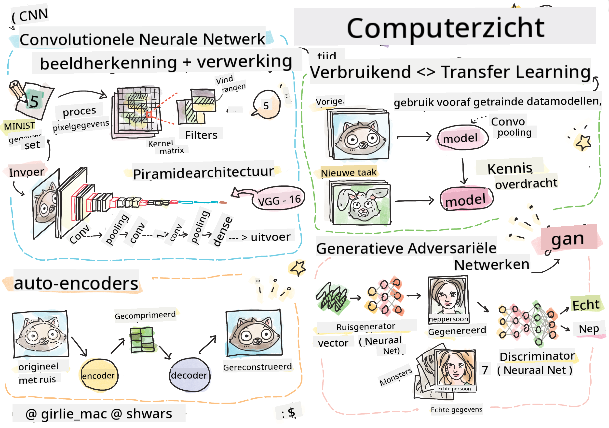

<!--
CO_OP_TRANSLATOR_METADATA:
{
  "original_hash": "58a52f000089c1d8906a4daa4ab1169b",
  "translation_date": "2025-08-28T19:23:25+00:00",
  "source_file": "lessons/4-ComputerVision/README.md",
  "language_code": "nl"
}
-->
# Computer Vision

In deze sectie leren we over:

* [Introductie tot Computer Vision en OpenCV](06-IntroCV/README.md)
* [Convolutionele Neurale Netwerken](07-ConvNets/README.md)
* [Voorgetrainde Netwerken en Transfer Learning](08-TransferLearning/README.md) 
* [Auto-encoders](09-Autoencoders/README.md)
* [Generative Adversarial Networks](10-GANs/README.md)
* [Objectdetectie](11-ObjectDetection/README.md)
* [Semantische Segmentatie](12-Segmentation/README.md)

---

**Disclaimer**:  
Dit document is vertaald met behulp van de AI-vertalingsservice [Co-op Translator](https://github.com/Azure/co-op-translator). Hoewel we streven naar nauwkeurigheid, dient u zich ervan bewust te zijn dat geautomatiseerde vertalingen fouten of onnauwkeurigheden kunnen bevatten. Het originele document in de oorspronkelijke taal moet worden beschouwd als de gezaghebbende bron. Voor cruciale informatie wordt professionele menselijke vertaling aanbevolen. Wij zijn niet aansprakelijk voor misverstanden of verkeerde interpretaties die voortvloeien uit het gebruik van deze vertaling.