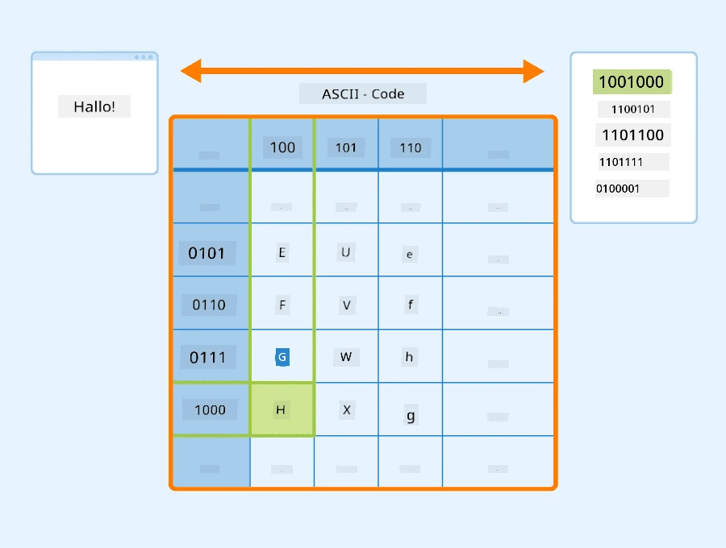
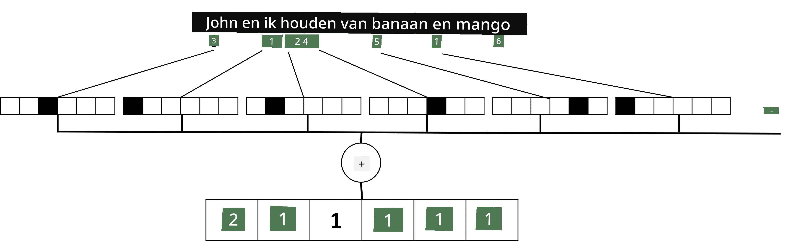

# Tekst Representeren als Tensors

## [Pre-lecture quiz](https://ff-quizzes.netlify.app/en/ai/quiz/25)

## Tekstclassificatie

In het eerste deel van deze sectie richten we ons op de taak van **tekstclassificatie**. We gebruiken de [AG News](https://www.kaggle.com/amananandrai/ag-news-classification-dataset) Dataset, die nieuwsartikelen bevat zoals het volgende:

* Categorie: Wetenschap/Technologie
* Titel: Ky. Bedrijf wint subsidie om peptiden te bestuderen (AP)
* Tekst: AP - Een bedrijf opgericht door een chemieonderzoeker aan de Universiteit van Louisville heeft een subsidie gewonnen om te ontwikkelen...

Ons doel is om het nieuwsitem te classificeren in een van de categorieën op basis van de tekst.

## Tekst Representeren

Als we Natural Language Processing (NLP)-taken willen oplossen met neurale netwerken, hebben we een manier nodig om tekst als tensors te representeren. Computers representeren tekstuele karakters al als nummers die corresponderen met lettertypen op je scherm, door middel van coderingen zoals ASCII of UTF-8.

> [Afbeeldingsbron](https://www.seobility.net/en/wiki/ASCII)

Als mensen begrijpen we wat elke letter **voorstelt**, en hoe alle karakters samenkomen om de woorden van een zin te vormen. Computers hebben echter zelf geen begrip hiervan, en een neuraal netwerk moet de betekenis leren tijdens de training.

Daarom kunnen we verschillende benaderingen gebruiken om tekst te representeren:

* **Karakter-niveau representatie**, waarbij we tekst representeren door elk karakter als een nummer te behandelen. Gegeven dat we *C* verschillende karakters hebben in onze tekstcorpus, zou het woord *Hello* worden gerepresenteerd door een 5x*C* tensor. Elk letter zou overeenkomen met een tensorkolom in one-hot encoding.
* **Woord-niveau representatie**, waarbij we een **vocabulaire** creëren van alle woorden in onze tekst, en vervolgens woorden representeren met one-hot encoding. Deze aanpak is enigszins beter, omdat elke letter op zichzelf niet veel betekenis heeft, en door gebruik te maken van hogere semantische concepten - woorden - we de taak voor het neurale netwerk vereenvoudigen. Echter, gezien de grote omvang van het woordenboek, moeten we omgaan met hoog-dimensionale, sparse tensors.

Ongeacht de representatie, moeten we eerst de tekst omzetten in een reeks **tokens**, waarbij een token een karakter, een woord, of soms zelfs een deel van een woord is. Vervolgens converteren we het token naar een nummer, meestal met behulp van een **vocabulaire**, en dit nummer kan worden ingevoerd in een neuraal netwerk met one-hot encoding.

## N-Grammen

In natuurlijke taal kan de precieze betekenis van woorden alleen worden bepaald in context. Bijvoorbeeld, de betekenissen van *neuraal netwerk* en *visnetwerk* zijn compleet verschillend. Een van de manieren om hiermee rekening te houden is om ons model te bouwen op paren van woorden, en woordparen te beschouwen als aparte vocabulaire tokens. Op deze manier wordt de zin *Ik hou van vissen* gerepresenteerd door de volgende reeks tokens: *Ik hou*, *hou van*, *van vissen*. Het probleem met deze aanpak is dat de omvang van het woordenboek aanzienlijk groeit, en combinaties zoals *van vissen* en *van winkelen* worden gepresenteerd door verschillende tokens, die geen semantische gelijkenis delen ondanks hetzelfde werkwoord.

In sommige gevallen kunnen we overwegen om tri-grammen te gebruiken -- combinaties van drie woorden -- ook. Deze aanpak wordt vaak **n-grammen** genoemd. Het kan ook zinvol zijn om n-grammen te gebruiken met karakter-niveau representatie, waarbij n-grammen ruwweg overeenkomen met verschillende lettergrepen.

## Bag-of-Words en TF/IDF

Bij het oplossen van taken zoals tekstclassificatie moeten we tekst kunnen representeren door één vector van vaste grootte, die we gebruiken als invoer voor de uiteindelijke dense classifier. Een van de eenvoudigste manieren om dit te doen is door alle individuele woordrepresentaties te combineren, bijvoorbeeld door ze op te tellen. Als we de one-hot encodings van elk woord optellen, krijgen we een vector van frequenties, die laat zien hoe vaak elk woord voorkomt in de tekst. Zo'n representatie van tekst wordt **bag of words** (BoW) genoemd.

> Afbeelding door de auteur

Een BoW representeert in essentie welke woorden in de tekst voorkomen en in welke hoeveelheden, wat inderdaad een goede indicatie kan zijn van waar de tekst over gaat. Bijvoorbeeld, een nieuwsartikel over politiek bevat waarschijnlijk woorden zoals *president* en *land*, terwijl een wetenschappelijke publicatie woorden zoals *collider*, *ontdekt*, etc. zou bevatten. Dus woordfrequenties kunnen in veel gevallen een goede indicator zijn van de inhoud van de tekst.

Het probleem met BoW is dat bepaalde veelvoorkomende woorden, zoals *en*, *is*, etc., in de meeste teksten voorkomen en de hoogste frequenties hebben, waardoor de woorden die echt belangrijk zijn worden overschaduwd. We kunnen het belang van die woorden verlagen door rekening te houden met de frequentie waarmee woorden voorkomen in de hele documentencollectie. Dit is het belangrijkste idee achter de TF/IDF-aanpak, die in meer detail wordt behandeld in de notebooks die bij deze les horen.

Geen van deze benaderingen kan echter volledig rekening houden met de **semantiek** van tekst. We hebben krachtigere neurale netwerkmodellen nodig om dit te doen, wat we later in deze sectie zullen bespreken.

## ✍️ Oefeningen: Tekst Representatie

Ga verder met leren in de volgende notebooks:

* [Tekst Representatie met PyTorch](TextRepresentationPyTorch.ipynb)
* [Tekst Representatie met TensorFlow](TextRepresentationTF.ipynb)

## Conclusie

Tot nu toe hebben we technieken bestudeerd die frequentiegewicht kunnen toevoegen aan verschillende woorden. Ze zijn echter niet in staat om betekenis of volgorde te representeren. Zoals de beroemde taalkundige J. R. Firth in 1935 zei: "De volledige betekenis van een woord is altijd contextueel, en geen studie van betekenis los van context kan serieus worden genomen." Later in de cursus zullen we leren hoe we contextuele informatie uit tekst kunnen halen met behulp van taalmodellen.

## 🚀 Uitdaging

Probeer enkele andere oefeningen met bag-of-words en verschillende datamodellen. Je kunt inspiratie opdoen uit deze [competitie op Kaggle](https://www.kaggle.com/competitions/word2vec-nlp-tutorial/overview/part-1-for-beginners-bag-of-words)

## [Post-lecture quiz](https://ff-quizzes.netlify.app/en/ai/quiz/26)

## Review & Zelfstudie

Oefen je vaardigheden met tekstembeddings en bag-of-words technieken op [Microsoft Learn](https://docs.microsoft.com/learn/modules/intro-natural-language-processing-pytorch/?WT.mc_id=academic-77998-cacaste)

## [Opdracht: Notebooks](assignment.md)

---

