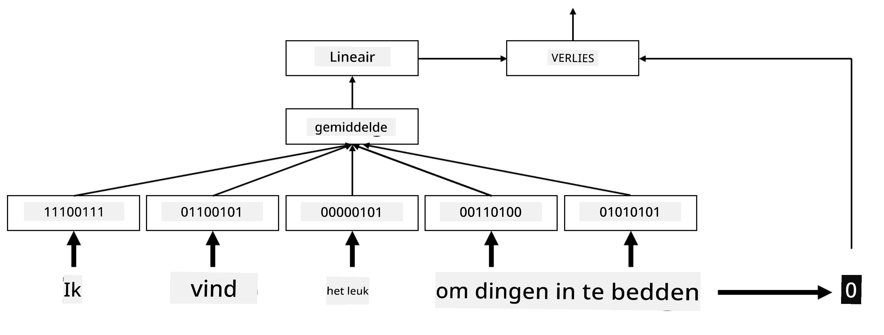

# Embeddings

## [Pre-lecture quiz](https://ff-quizzes.netlify.app/en/ai/quiz/27)

Bij het trainen van classifiers op basis van BoW of TF/IDF werkten we met hoog-dimensionale bag-of-words vectoren met een lengte van `vocab_size`, en zetten we expliciet laag-dimensionale positionele representatievectoren om in spaarzame one-hot representaties. Deze one-hot representatie is echter niet efficiënt qua geheugen. Bovendien wordt elk woord onafhankelijk van de andere behandeld, d.w.z. one-hot gecodeerde vectoren drukken geen semantieke gelijkenis tussen woorden uit.

Het idee van **embedding** is om woorden te representeren met laag-dimensionale dichte vectoren, die op een bepaalde manier de semantische betekenis van een woord weerspiegelen. We zullen later bespreken hoe we betekenisvolle woordembeddings kunnen bouwen, maar laten we nu gewoon denken aan embeddings als een manier om de dimensionaliteit van een woordvector te verlagen.

De embeddinglaag neemt een woord als invoer en produceert een uitvoervector met een gespecificeerde `embedding_size`. In zekere zin lijkt het erg op een `Linear` laag, maar in plaats van een one-hot gecodeerde vector te nemen, kan het een woordnummer als invoer nemen, waardoor we het maken van grote one-hot gecodeerde vectoren kunnen vermijden.

Door een embeddinglaag als eerste laag in ons classifier-netwerk te gebruiken, kunnen we overschakelen van een bag-of-words naar een **embedding bag** model, waarbij we eerst elk woord in onze tekst omzetten in de bijbehorende embedding, en vervolgens een aggregatiefunctie berekenen over al deze embeddings, zoals `sum`, `average` of `max`.

> Afbeelding door de auteur

## ✍️ Oefeningen: Embeddings

Ga verder met leren in de volgende notebooks:
* [Embeddings met PyTorch](EmbeddingsPyTorch.ipynb)
* [Embeddings TensorFlow](EmbeddingsTF.ipynb)

## Semantische Embeddings: Word2Vec

Hoewel de embeddinglaag leert om woorden naar vectorrepresentaties te mappen, heeft deze representatie niet per se veel semantische betekenis. Het zou mooi zijn om een vectorrepresentatie te leren waarbij vergelijkbare woorden of synoniemen overeenkomen met vectoren die dicht bij elkaar liggen in termen van een bepaalde vectordistantie (bijv. Euclidische afstand).

Om dit te bereiken, moeten we ons embeddingmodel op een grote tekstcollectie op een specifieke manier voortrainen. Een manier om semantische embeddings te trainen wordt [Word2Vec](https://en.wikipedia.org/wiki/Word2vec) genoemd. Het is gebaseerd op twee hoofdarchitecturen die worden gebruikt om een gedistribueerde representatie van woorden te produceren:

 - **Continuous bag-of-words** (CBoW) — in deze architectuur trainen we het model om een woord te voorspellen op basis van de omliggende context. Gegeven de ngram $(W_{-2},W_{-1},W_0,W_1,W_2)$, is het doel van het model om $W_0$ te voorspellen op basis van $(W_{-2},W_{-1},W_1,W_2)$.
 - **Continuous skip-gram** is het tegenovergestelde van CBoW. Het model gebruikt het omliggende venster van contextwoorden om het huidige woord te voorspellen.

CBoW is sneller, terwijl skip-gram langzamer is, maar beter presteert bij het representeren van zeldzame woorden.

> Afbeelding uit [dit artikel](https://arxiv.org/pdf/1301.3781.pdf)

Voorgetrainde Word2Vec-embeddings (evenals andere vergelijkbare modellen, zoals GloVe) kunnen ook worden gebruikt in plaats van een embeddinglaag in neurale netwerken. We moeten echter omgaan met vocabulaires, omdat het vocabulaire dat wordt gebruikt om Word2Vec/GloVe voor te trainen waarschijnlijk verschilt van het vocabulaire in onze tekstcorpus. Bekijk de bovenstaande notebooks om te zien hoe dit probleem kan worden opgelost.

## Contextuele Embeddings

Een belangrijke beperking van traditionele voorgetrainde embeddingrepresentaties zoals Word2Vec is het probleem van woordbetekenis-ambiguïteit. Hoewel voorgetrainde embeddings een deel van de betekenis van woorden in context kunnen vastleggen, wordt elke mogelijke betekenis van een woord gecodeerd in dezelfde embedding. Dit kan problemen veroorzaken in downstream-modellen, omdat veel woorden, zoals het woord 'play', verschillende betekenissen hebben afhankelijk van de context waarin ze worden gebruikt.

Bijvoorbeeld, het woord 'play' heeft in de volgende twee zinnen een heel andere betekenis:

- Ik ging naar een **toneelstuk** in het theater.
- John wil **spelen** met zijn vrienden.

De hierboven genoemde voorgetrainde embeddings representeren beide betekenissen van het woord 'play' in dezelfde embedding. Om deze beperking te overwinnen, moeten we embeddings bouwen op basis van het **taalmodel**, dat is getraind op een grote tekstcorpus en *weet* hoe woorden in verschillende contexten kunnen worden gebruikt. Het bespreken van contextuele embeddings valt buiten de scope van deze tutorial, maar we zullen hierop terugkomen wanneer we later in de cursus taalmodellen bespreken.

## Conclusie

In deze les heb je ontdekt hoe je embeddinglagen kunt bouwen en gebruiken in TensorFlow en PyTorch om beter de semantische betekenissen van woorden weer te geven.

## 🚀 Uitdaging

Word2Vec is gebruikt voor enkele interessante toepassingen, waaronder het genereren van songteksten en poëzie. Bekijk [dit artikel](https://www.politetype.com/blog/word2vec-color-poems) waarin de auteur uitlegt hoe Word2Vec werd gebruikt om poëzie te genereren. Bekijk ook [deze video van Dan Shiffmann](https://www.youtube.com/watch?v=LSS_bos_TPI&ab_channel=TheCodingTrain) voor een andere uitleg van deze techniek. Probeer vervolgens deze technieken toe te passen op je eigen tekstcorpus, bijvoorbeeld afkomstig van Kaggle.

## [Post-lecture quiz](https://ff-quizzes.netlify.app/en/ai/quiz/28)

## Review & Zelfstudie

Lees dit artikel over Word2Vec: [Efficient Estimation of Word Representations in Vector Space](https://arxiv.org/pdf/1301.3781.pdf)

## [Opdracht: Notebooks](assignment.md)

---

