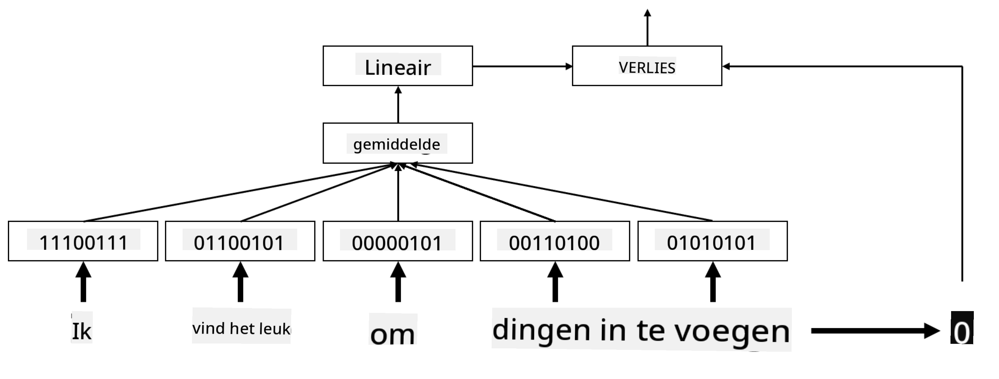
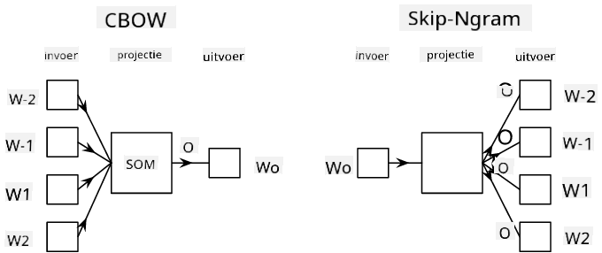

<!--
CO_OP_TRANSLATOR_METADATA:
{
  "original_hash": "e40b47ac3fd48f71304ede1474e66293",
  "translation_date": "2025-08-28T20:07:43+00:00",
  "source_file": "lessons/5-NLP/14-Embeddings/README.md",
  "language_code": "nl"
}
-->
# Embeddings

## [Pre-lecture quiz](https://red-field-0a6ddfd03.1.azurestaticapps.net/quiz/114)

Bij het trainen van classifiers gebaseerd op BoW of TF/IDF werkten we met hoog-dimensionale bag-of-words vectoren met een lengte van `vocab_size`, en converteerden we expliciet van laag-dimensionale positionele representatievectoren naar spaarzame one-hot representaties. Deze one-hot representatie is echter niet efficiënt qua geheugen. Bovendien worden woorden onafhankelijk van elkaar behandeld, d.w.z. one-hot gecodeerde vectoren drukken geen semantische gelijkenis tussen woorden uit.

Het idee van **embedding** is om woorden te representeren door laag-dimensionale dense vectoren, die op een bepaalde manier de semantische betekenis van een woord weerspiegelen. We zullen later bespreken hoe we betekenisvolle woordembeddings kunnen bouwen, maar laten we nu embeddings zien als een manier om de dimensionaliteit van een woordvector te verlagen.

De embeddinglaag neemt een woord als invoer en produceert een uitvoervector van een gespecificeerde `embedding_size`. In zekere zin lijkt het erg op een `Linear` laag, maar in plaats van een one-hot gecodeerde vector te nemen, kan het een woordnummer als invoer nemen, waardoor we grote one-hot gecodeerde vectoren kunnen vermijden.

Door een embeddinglaag te gebruiken als eerste laag in ons classifier-netwerk, kunnen we overschakelen van een bag-of-words naar een **embedding bag** model, waarbij we eerst elk woord in onze tekst converteren naar de bijbehorende embedding, en vervolgens een aggregatiefunctie berekenen over al deze embeddings, zoals `sum`, `average` of `max`.  

> Afbeelding door de auteur

## ✍️ Oefeningen: Embeddings

Ga verder met leren in de volgende notebooks:
* [Embeddings met PyTorch](EmbeddingsPyTorch.ipynb)
* [Embeddings TensorFlow](EmbeddingsTF.ipynb)

## Semantische Embeddings: Word2Vec

Hoewel de embeddinglaag heeft geleerd om woorden in vectorrepresentaties te mappen, heeft deze representatie niet noodzakelijk veel semantische betekenis. Het zou mooi zijn om een vectorrepresentatie te leren waarbij vergelijkbare woorden of synoniemen overeenkomen met vectoren die dicht bij elkaar liggen in termen van een bepaalde vectordistantie (bijv. Euclidische afstand).

Om dat te bereiken, moeten we ons embeddingmodel vooraf trainen op een grote verzameling tekst op een specifieke manier. Een manier om semantische embeddings te trainen wordt [Word2Vec](https://en.wikipedia.org/wiki/Word2vec) genoemd. Het is gebaseerd op twee hoofdarchitecturen die worden gebruikt om een gedistribueerde representatie van woorden te produceren:

 - **Continuous bag-of-words** (CBoW) — in deze architectuur trainen we het model om een woord te voorspellen op basis van de omliggende context. Gegeven de ngram $(W_{-2},W_{-1},W_0,W_1,W_2)$, is het doel van het model om $W_0$ te voorspellen op basis van $(W_{-2},W_{-1},W_1,W_2)$.
 - **Continuous skip-gram** is het tegenovergestelde van CBoW. Het model gebruikt een omliggend venster van contextwoorden om het huidige woord te voorspellen.

CBoW is sneller, terwijl skip-gram langzamer is, maar beter presteert bij het representeren van zeldzame woorden.

> Afbeelding uit [dit paper](https://arxiv.org/pdf/1301.3781.pdf)

Vooraf getrainde Word2Vec embeddings (evenals andere vergelijkbare modellen, zoals GloVe) kunnen ook worden gebruikt in plaats van een embeddinglaag in neurale netwerken. We moeten echter omgaan met vocabularia, omdat het vocabulaire dat wordt gebruikt om Word2Vec/GloVe vooraf te trainen waarschijnlijk verschilt van het vocabulaire in onze tekstcorpus. Bekijk de bovenstaande notebooks om te zien hoe dit probleem kan worden opgelost.

## Contextuele Embeddings

Een belangrijke beperking van traditionele vooraf getrainde embeddingrepresentaties zoals Word2Vec is het probleem van woordbetekenisonderscheiding. Hoewel vooraf getrainde embeddings een deel van de betekenis van woorden in context kunnen vastleggen, wordt elke mogelijke betekenis van een woord gecodeerd in dezelfde embedding. Dit kan problemen veroorzaken in downstream-modellen, omdat veel woorden, zoals het woord 'play', verschillende betekenissen hebben afhankelijk van de context waarin ze worden gebruikt.

Bijvoorbeeld, het woord 'play' heeft in deze twee verschillende zinnen een heel andere betekenis:

- Ik ging naar een **toneelstuk** in het theater.
- John wil **spelen** met zijn vrienden.

De vooraf getrainde embeddings hierboven representeren beide betekenissen van het woord 'play' in dezelfde embedding. Om deze beperking te overwinnen, moeten we embeddings bouwen op basis van het **taalmodel**, dat is getraind op een grote corpus van tekst en *weet* hoe woorden in verschillende contexten kunnen worden gebruikt. Het bespreken van contextuele embeddings valt buiten de scope van deze tutorial, maar we zullen hierop terugkomen wanneer we later in de cursus praten over taalmodellen.

## Conclusie

In deze les heb je ontdekt hoe je embeddinglagen kunt bouwen en gebruiken in TensorFlow en PyTorch om beter de semantische betekenissen van woorden te weerspiegelen.

## 🚀 Uitdaging

Word2Vec is gebruikt voor enkele interessante toepassingen, waaronder het genereren van songteksten en poëzie. Bekijk [dit artikel](https://www.politetype.com/blog/word2vec-color-poems) waarin wordt uitgelegd hoe de auteur Word2Vec gebruikte om poëzie te genereren. Bekijk ook [deze video van Dan Shiffmann](https://www.youtube.com/watch?v=LSS_bos_TPI&ab_channel=TheCodingTrain) om een andere uitleg van deze techniek te ontdekken. Probeer vervolgens deze technieken toe te passen op je eigen tekstcorpus, mogelijk afkomstig van Kaggle.

## [Post-lecture quiz](https://red-field-0a6ddfd03.1.azurestaticapps.net/quiz/214)

## Review & Zelfstudie

Lees dit paper over Word2Vec: [Efficient Estimation of Word Representations in Vector Space](https://arxiv.org/pdf/1301.3781.pdf)

## [Opdracht: Notebooks](assignment.md)

---

**Disclaimer**:  
Dit document is vertaald met behulp van de AI-vertalingsservice [Co-op Translator](https://github.com/Azure/co-op-translator). Hoewel we streven naar nauwkeurigheid, dient u zich ervan bewust te zijn dat geautomatiseerde vertalingen fouten of onnauwkeurigheden kunnen bevatten. Het originele document in zijn oorspronkelijke taal moet worden beschouwd als de gezaghebbende bron. Voor cruciale informatie wordt professionele menselijke vertaling aanbevolen. Wij zijn niet aansprakelijk voor misverstanden of verkeerde interpretaties die voortvloeien uit het gebruik van deze vertaling.