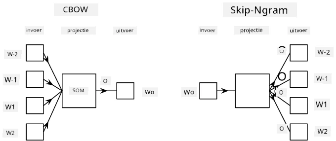

# Taalmodellering

Semantische embeddings, zoals Word2Vec en GloVe, zijn eigenlijk een eerste stap richting **taalmodellering** - het creëren van modellen die op een bepaalde manier de aard van de taal *begrijpen* (of *representeren*).

## [Pre-lecture quiz](https://ff-quizzes.netlify.app/en/ai/quiz/29)

Het belangrijkste idee achter taalmodellering is dat ze worden getraind op niet-gelabelde datasets op een ongesuperviseerde manier. Dit is belangrijk omdat we enorme hoeveelheden niet-gelabelde tekst beschikbaar hebben, terwijl de hoeveelheid gelabelde tekst altijd beperkt zal zijn door de inspanning die we kunnen besteden aan het labelen. Meestal kunnen we taalmodellen bouwen die **ontbrekende woorden** in de tekst voorspellen, omdat het eenvoudig is om een willekeurig woord in de tekst te maskeren en dit te gebruiken als trainingsvoorbeeld.

## Embeddings trainen

In onze eerdere voorbeelden hebben we gebruik gemaakt van vooraf getrainde semantische embeddings, maar het is interessant om te zien hoe die embeddings kunnen worden getraind. Er zijn verschillende ideeën die kunnen worden gebruikt:

* **N-Gram** taalmodellering, waarbij we een token voorspellen door naar N voorgaande tokens te kijken (N-gram).
* **Continuous Bag-of-Words** (CBoW), waarbij we het middelste token $W_0$ voorspellen in een reeks tokens $W_{-N}$, ..., $W_N$.
* **Skip-gram**, waarbij we een set van naburige tokens {$W_{-N},\dots, W_{-1}, W_1,\dots, W_N$} voorspellen vanuit het middelste token $W_0$.

> Afbeelding uit [deze paper](https://arxiv.org/pdf/1301.3781.pdf)

## ✍️ Voorbeeld Notebooks: CBoW-model trainen

Ga verder met leren in de volgende notebooks:

* [CBoW Word2Vec trainen met TensorFlow](CBoW-TF.ipynb)
* [CBoW Word2Vec trainen met PyTorch](CBoW-PyTorch.ipynb)

## Conclusie

In de vorige les hebben we gezien dat woordembeddings werken als magie! Nu weten we dat het trainen van woordembeddings geen erg complexe taak is, en we zouden in staat moeten zijn om onze eigen woordembeddings te trainen voor domeinspecifieke tekst indien nodig.

## [Post-lecture quiz](https://ff-quizzes.netlify.app/en/ai/quiz/30)

## Review & Zelfstudie

* [Officiële PyTorch tutorial over taalmodellering](https://pytorch.org/tutorials/beginner/nlp/word_embeddings_tutorial.html).
* [Officiële TensorFlow tutorial over het trainen van een Word2Vec-model](https://www.TensorFlow.org/tutorials/text/word2vec).
* Het gebruik van het **gensim** framework om de meest gebruikte embeddings te trainen in slechts een paar regels code wordt beschreven [in deze documentatie](https://pytorch.org/tutorials/beginner/nlp/word_embeddings_tutorial.html).

## 🚀 [Opdracht: Train Skip-Gram Model](lab/README.md)

In het lab dagen we je uit om de code uit deze les aan te passen om een skip-gram model te trainen in plaats van CBoW. [Lees de details](lab/README.md)

---

