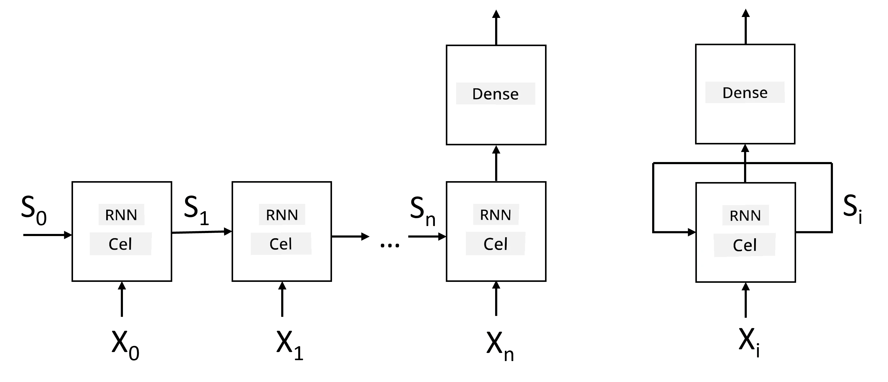
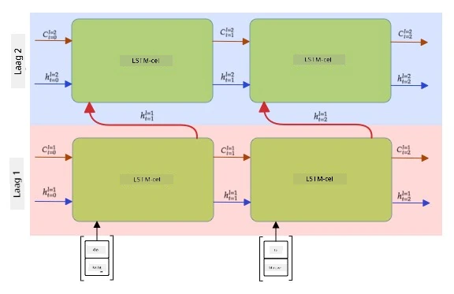

# Recurrent Neural Networks

## [Pre-lecture quiz](https://ff-quizzes.netlify.app/en/ai/quiz/31)

In de vorige secties hebben we gebruik gemaakt van rijke semantische representaties van tekst en een eenvoudige lineaire classifier bovenop de embeddings. Wat deze architectuur doet, is de geaggregeerde betekenis van woorden in een zin vastleggen, maar het houdt geen rekening met de **volgorde** van woorden, omdat de aggregatie-operatie bovenop de embeddings deze informatie uit de oorspronkelijke tekst verwijdert. Omdat deze modellen niet in staat zijn om de woordvolgorde te modelleren, kunnen ze geen complexere of dubbelzinnige taken oplossen, zoals tekstgeneratie of vraag-antwoord systemen.

Om de betekenis van een tekstsequentie vast te leggen, moeten we een andere neurale netwerkarchitectuur gebruiken, genaamd een **recurrent neural network**, of RNN. In een RNN sturen we onze zin één symbool tegelijk door het netwerk, en het netwerk produceert een **toestand**, die we vervolgens weer doorgeven aan het netwerk samen met het volgende symbool.

> Afbeelding door de auteur

Gegeven de invoersequentie van tokens X0,...,Xn, creëert een RNN een reeks neurale netwerkblokken en traint deze reeks end-to-end met behulp van backpropagation. Elk netwerkblok neemt een paar (Xi,Si) als invoer en produceert Si+1 als resultaat. De uiteindelijke toestand Sn of (output Yn) gaat naar een lineaire classifier om het resultaat te produceren. Alle netwerkblokken delen dezelfde gewichten en worden end-to-end getraind met één backpropagation-pass.

Omdat toestandsvectoren S0,...,Sn door het netwerk worden doorgegeven, kan het de sequentiële afhankelijkheden tussen woorden leren. Bijvoorbeeld, wanneer het woord *niet* ergens in de sequentie verschijnt, kan het leren bepaalde elementen binnen de toestandsvector te negeren, wat resulteert in ontkenning.

> ✅ Omdat de gewichten van alle RNN-blokken in de bovenstaande afbeelding gedeeld worden, kan dezelfde afbeelding worden weergegeven als één blok (rechts) met een recurrente feedbacklus, die de uitvoerstatus van het netwerk teruggeeft aan de invoer.

## Anatomie van een RNN Cel

Laten we eens kijken hoe een eenvoudige RNN-cel is georganiseerd. Het accepteert de vorige toestand Si-1 en het huidige symbool Xi als invoer, en moet de uitvoerstatus Si produceren (en soms zijn we ook geïnteresseerd in een andere uitvoer Yi, zoals bij generatieve netwerken).

Een eenvoudige RNN-cel heeft twee gewichts-matrices binnenin: één transformeert een invoersymbool (laten we het W noemen), en een andere transformeert een invoertoestand (H). In dit geval wordt de uitvoer van het netwerk berekend als &sigma;(W&times;Xi+H&times;Si-1+b), waarbij &sigma; de activatiefunctie is en b een extra bias is.

> Afbeelding door de auteur

In veel gevallen worden invoertokens door de embeddinglaag gestuurd voordat ze de RNN binnenkomen om de dimensionaliteit te verlagen. In dit geval, als de dimensie van de invoervectoren *emb_size* is, en de toestandsvector *hid_size* is - dan is de grootte van W *emb_size*&times;*hid_size*, en de grootte van H is *hid_size*&times;*hid_size*.

## Long Short Term Memory (LSTM)

Een van de belangrijkste problemen van klassieke RNN's is het zogenaamde **vanishing gradients** probleem. Omdat RNN's end-to-end worden getraind in één backpropagation-pass, is het moeilijk om fouten door te geven aan de eerste lagen van het netwerk, waardoor het netwerk geen relaties tussen verre tokens kan leren. Een van de manieren om dit probleem te vermijden is door **expliciet toestandsbeheer** te introduceren met behulp van zogenaamde **gates**. Er zijn twee bekende architecturen van dit type: **Long Short Term Memory** (LSTM) en **Gated Relay Unit** (GRU).

> Afbeeldingsbron TBD

Het LSTM-netwerk is georganiseerd op een manier die lijkt op RNN, maar er zijn twee toestanden die van laag naar laag worden doorgegeven: de werkelijke toestand C en de verborgen vector H. Bij elke eenheid wordt de verborgen vector Hi gecombineerd met invoer Xi, en zij bepalen wat er gebeurt met de toestand C via **gates**. Elke gate is een neuraal netwerk met sigmoid activatie (uitvoer in het bereik [0,1]), die kan worden gezien als een bitwise masker wanneer vermenigvuldigd met de toestandsvector. Er zijn de volgende gates (van links naar rechts op de afbeelding hierboven):

* De **forget gate** neemt een verborgen vector en bepaalt welke componenten van de vector C we moeten vergeten en welke we moeten doorgeven.
* De **input gate** neemt informatie van de invoer- en verborgen vectoren en voegt deze in de toestand in.
* De **output gate** transformeert de toestand via een lineaire laag met *tanh* activatie, en selecteert vervolgens enkele van zijn componenten met behulp van een verborgen vector Hi om een nieuwe toestand Ci+1 te produceren.

Componenten van de toestand C kunnen worden gezien als vlaggen die aan en uit kunnen worden gezet. Bijvoorbeeld, wanneer we een naam *Alice* tegenkomen in de sequentie, willen we misschien aannemen dat het verwijst naar een vrouwelijk personage, en de vlag in de toestand verhogen dat we een vrouwelijk zelfstandig naamwoord in de zin hebben. Wanneer we verder zinnen tegenkomen zoals *en Tom*, zullen we de vlag verhogen dat we een meervoudig zelfstandig naamwoord hebben. Door de toestand te manipuleren kunnen we dus veronderstellen dat we de grammaticale eigenschappen van zinsdelen bijhouden.

> ✅ Een uitstekende bron om de interne werking van LSTM te begrijpen is dit geweldige artikel [Understanding LSTM Networks](https://colah.github.io/posts/2015-08-Understanding-LSTMs/) door Christopher Olah.

## Bidirectionele en Meerdere Lagen RNNs

We hebben recurrente netwerken besproken die in één richting werken, van het begin van een sequentie tot het einde. Dit lijkt natuurlijk, omdat het lijkt op de manier waarop we lezen en luisteren naar spraak. Echter, aangezien we in veel praktische gevallen willekeurige toegang hebben tot de invoersequentie, kan het zinvol zijn om recurrente berekeningen in beide richtingen uit te voeren. Dergelijke netwerken worden **bidirectionele** RNN's genoemd. Bij het werken met een bidirectioneel netwerk hebben we twee verborgen toestandsvectoren nodig, één voor elke richting.

Een recurrent netwerk, of het nu éénrichtings of bidirectioneel is, legt bepaalde patronen binnen een sequentie vast en kan deze opslaan in een toestandsvector of doorgeven aan de uitvoer. Net zoals bij convolutionele netwerken, kunnen we een andere recurrente laag bovenop de eerste bouwen om hogere niveau patronen vast te leggen en te bouwen op laag-niveau patronen die door de eerste laag zijn geëxtraheerd. Dit leidt ons naar het concept van een **multi-layer RNN**, die bestaat uit twee of meer recurrente netwerken, waarbij de uitvoer van de vorige laag wordt doorgegeven aan de volgende laag als invoer.

*Afbeelding uit [dit geweldige artikel](https://towardsdatascience.com/from-a-lstm-cell-to-a-multilayer-lstm-network-with-pytorch-2899eb5696f3) door Fernando López*

## ✍️ Oefeningen: Embeddings

Ga verder met leren in de volgende notebooks:

* [RNNs met PyTorch](RNNPyTorch.ipynb)
* [RNNs met TensorFlow](RNNTF.ipynb)

## Conclusie

In deze eenheid hebben we gezien dat RNN's kunnen worden gebruikt voor sequentieclassificatie, maar in feite kunnen ze veel meer taken aan, zoals tekstgeneratie, machinale vertaling en meer. We zullen die taken in de volgende eenheid behandelen.

## 🚀 Uitdaging

Lees enkele literatuur over LSTMs en overweeg hun toepassingen:

- [Grid Long Short-Term Memory](https://arxiv.org/pdf/1507.01526v1.pdf)
- [Show, Attend and Tell: Neural Image Caption
Generation with Visual Attention](https://arxiv.org/pdf/1502.03044v2.pdf)

## [Post-lecture quiz](https://ff-quizzes.netlify.app/en/ai/quiz/32)

## Review & Zelfstudie

- [Understanding LSTM Networks](https://colah.github.io/posts/2015-08-Understanding-LSTMs/) door Christopher Olah.

## [Opdracht: Notebooks](assignment.md)

---

