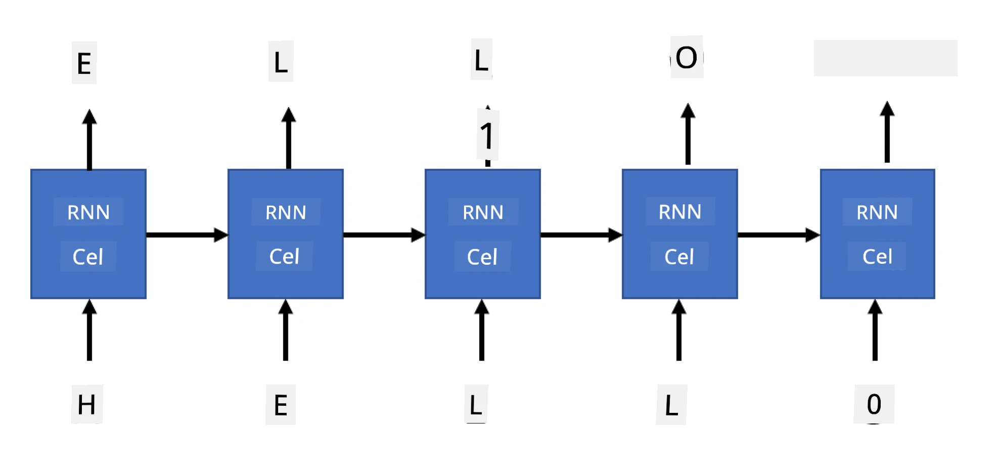

# Generatieve netwerken

## [Pre-lecture quiz](https://ff-quizzes.netlify.app/en/ai/quiz/33)

Recurrent Neural Networks (RNNs) en hun varianten met gated cellen, zoals Long Short Term Memory Cells (LSTMs) en Gated Recurrent Units (GRUs), bieden een mechanisme voor taalmodellering doordat ze woordvolgorde kunnen leren en voorspellingen kunnen doen voor het volgende woord in een reeks. Dit stelt ons in staat om RNNs te gebruiken voor **generatieve taken**, zoals gewone tekstgeneratie, machinevertaling en zelfs beeldbeschrijving.

> ✅ Denk eens na over alle keren dat je hebt geprofiteerd van generatieve taken, zoals tekstaanvulling tijdens het typen. Doe wat onderzoek naar je favoriete applicaties om te zien of ze gebruik hebben gemaakt van RNNs.

In de RNN-architectuur die we in de vorige eenheid hebben besproken, produceerde elke RNN-eenheid de volgende verborgen toestand als output. We kunnen echter ook een extra output toevoegen aan elke recurrente eenheid, waardoor we een **reeks** kunnen genereren (die even lang is als de oorspronkelijke reeks). Bovendien kunnen we RNN-eenheden gebruiken die bij elke stap geen invoer accepteren, maar alleen een initiële toestandsvector nemen en vervolgens een reeks outputs produceren.

Dit maakt verschillende neurale architecturen mogelijk, zoals weergegeven in de onderstaande afbeelding:


> Afbeelding uit de blogpost [Unreasonable Effectiveness of Recurrent Neural Networks](http://karpathy.github.io/2015/05/21/rnn-effectiveness/) door [Andrej Karpaty](http://karpathy.github.io/)

* **One-to-one** is een traditioneel neuraal netwerk met één invoer en één uitvoer.
* **One-to-many** is een generatieve architectuur die één invoerwaarde accepteert en een reeks uitvoerwaarden genereert. Bijvoorbeeld, als we een **beeldbeschrijvings**netwerk willen trainen dat een tekstuele beschrijving van een afbeelding genereert, kunnen we een afbeelding als invoer nemen, deze door een CNN halen om de verborgen toestand te verkrijgen, en vervolgens een recurrente keten woord voor woord een beschrijving laten genereren.
* **Many-to-one** komt overeen met de RNN-architecturen die we in de vorige eenheid hebben beschreven, zoals tekstclassificatie.
* **Many-to-many**, of **sequence-to-sequence**, komt overeen met taken zoals **machinevertaling**, waarbij we eerst een RNN alle informatie uit de invoerreeks laten verzamelen in de verborgen toestand, en een andere RNN-keten deze toestand uitrolt naar de uitvoerreeks.

In deze eenheid richten we ons op eenvoudige generatieve modellen die ons helpen tekst te genereren. Voor de eenvoud gebruiken we karakter-niveau tokenisatie.

We trainen deze RNN om tekst stap voor stap te genereren. Bij elke stap nemen we een reeks karakters van lengte `nchars` en vragen we het netwerk om het volgende uitvoerkarakter te genereren voor elk invoerkarakter:



Bij het genereren van tekst (tijdens inferentie) beginnen we met een **prompt**, die door de RNN-cellen wordt doorgegeven om de tussenliggende toestand te genereren. Vanuit deze toestand begint de generatie. We genereren één karakter tegelijk en geven de toestand en het gegenereerde karakter door aan een andere RNN-cel om het volgende te genereren, totdat we genoeg karakters hebben gegenereerd.


> Afbeelding door de auteur

## ✍️ Oefeningen: Generatieve netwerken

Ga verder met leren in de volgende notebooks:

* [Generatieve netwerken met PyTorch](GenerativePyTorch.ipynb)
* [Generatieve netwerken met TensorFlow](GenerativeTF.ipynb)

## Zachte tekstgeneratie en temperatuur

De output van elke RNN-cel is een waarschijnlijkheidsverdeling van karakters. Als we altijd het karakter met de hoogste waarschijnlijkheid nemen als het volgende karakter in de gegenereerde tekst, kan de tekst vaak "cyclisch" worden en steeds dezelfde karakterreeksen herhalen, zoals in dit voorbeeld:

```
today of the second the company and a second the company ...
```
  
Als we echter naar de waarschijnlijkheidsverdeling voor het volgende karakter kijken, kan het zijn dat het verschil tussen een paar hoogste waarschijnlijkheden niet groot is, bijvoorbeeld één karakter kan een waarschijnlijkheid van 0,2 hebben, en een ander 0,19, enz. Bijvoorbeeld, bij het zoeken naar het volgende karakter in de reeks '*play*', kan het volgende karakter even goed een spatie zijn, of **e** (zoals in het woord *player*).

Hieruit kunnen we concluderen dat het niet altijd "eerlijk" is om het karakter met de hoogste waarschijnlijkheid te kiezen, omdat het kiezen van het op één na hoogste nog steeds tot betekenisvolle tekst kan leiden. Het is verstandiger om **karakters te bemonsteren** uit de waarschijnlijkheidsverdeling die door de netwerkoutput wordt gegeven. We kunnen ook een parameter, **temperatuur**, gebruiken die de waarschijnlijkheidsverdeling afvlakt als we meer willekeurigheid willen toevoegen, of steiler maakt als we ons meer willen richten op de karakters met de hoogste waarschijnlijkheid.

Verken hoe deze zachte tekstgeneratie is geïmplementeerd in de hierboven gelinkte notebooks.

## Conclusie

Hoewel tekstgeneratie op zichzelf nuttig kan zijn, liggen de belangrijkste voordelen in de mogelijkheid om tekst te genereren met RNNs vanuit een initiële toestandsvector. Bijvoorbeeld, tekstgeneratie wordt gebruikt als onderdeel van machinevertaling (sequence-to-sequence, waarbij de toestandsvector van de *encoder* wordt gebruikt om een vertaalde boodschap te genereren of *decoderen*), of het genereren van een tekstuele beschrijving van een afbeelding (waarbij de toestandsvector afkomstig is van een CNN-extractor).

## 🚀 Uitdaging

Volg enkele lessen op Microsoft Learn over dit onderwerp:

* Tekstgeneratie met [PyTorch](https://docs.microsoft.com/learn/modules/intro-natural-language-processing-pytorch/6-generative-networks/?WT.mc_id=academic-77998-cacaste)/[TensorFlow](https://docs.microsoft.com/learn/modules/intro-natural-language-processing-tensorflow/5-generative-networks/?WT.mc_id=academic-77998-cacaste)

## [Post-lecture quiz](https://ff-quizzes.netlify.app/en/ai/quiz/34)

## Review & Zelfstudie

Hier zijn enkele artikelen om je kennis uit te breiden:

* Verschillende benaderingen van tekstgeneratie met Markov Chain, LSTM en GPT-2: [blogpost](https://towardsdatascience.com/text-generation-gpt-2-lstm-markov-chain-9ea371820e1e)
* Voorbeeld van tekstgeneratie in de [Keras-documentatie](https://keras.io/examples/generative/lstm_character_level_text_generation/)

## [Opdracht](lab/README.md)

We hebben gezien hoe we tekst karakter voor karakter kunnen genereren. In het lab ga je tekstgeneratie op woordniveau verkennen.

---

