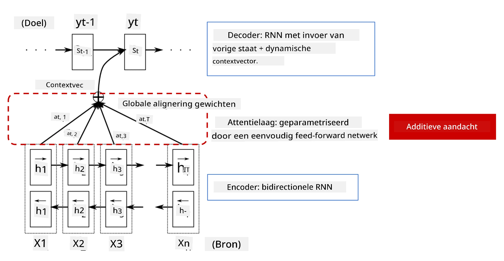
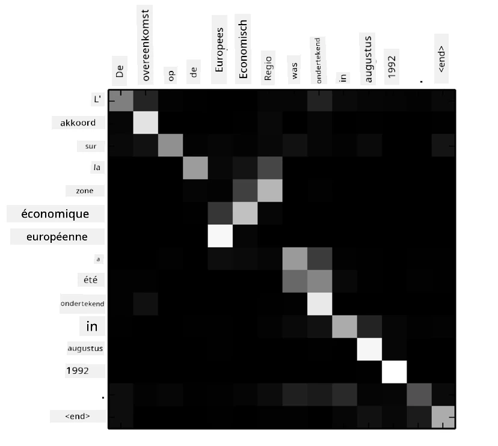
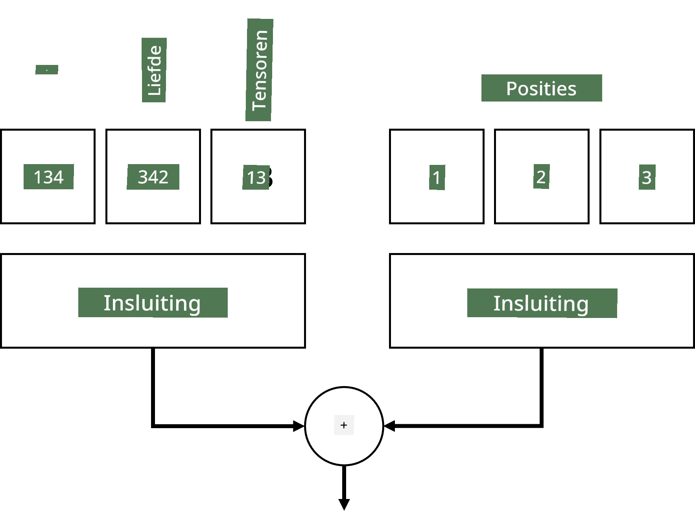
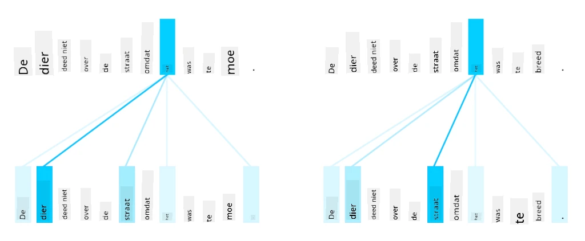
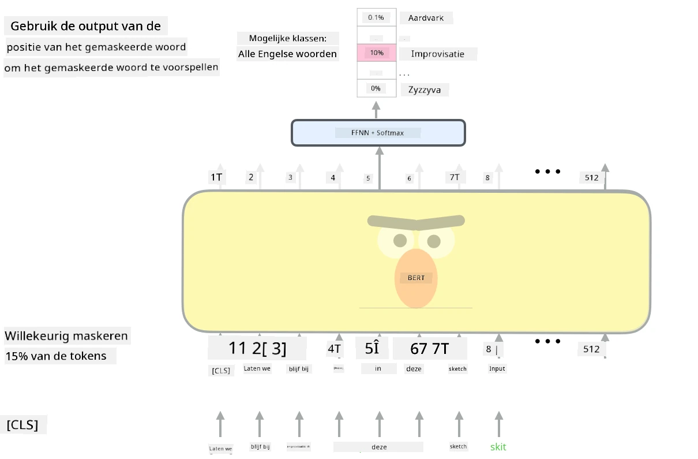

# Aandachtsmechanismen en Transformers

## [Pre-lecture quiz](https://ff-quizzes.netlify.app/en/ai/quiz/35)

Een van de belangrijkste problemen binnen het NLP-domein is **machinevertaling**, een essentiële taak die ten grondslag ligt aan tools zoals Google Translate. In deze sectie richten we ons op machinevertaling, of meer algemeen, op elke *sequence-to-sequence* taak (ook wel **zintransductie** genoemd).

Met RNNs wordt sequence-to-sequence geïmplementeerd door twee recurrente netwerken, waarbij één netwerk, de **encoder**, een invoersequentie samenvat in een verborgen toestand, terwijl een ander netwerk, de **decoder**, deze verborgen toestand uitrolt tot een vertaald resultaat. Er zijn echter een paar problemen met deze aanpak:

* De eindtoestand van het encoder-netwerk heeft moeite om het begin van een zin te onthouden, wat leidt tot een slechte kwaliteit van het model voor lange zinnen.
* Alle woorden in een sequentie hebben dezelfde invloed op het resultaat. In werkelijkheid hebben specifieke woorden in de invoersequentie vaak meer invloed op de opeenvolgende outputs dan andere.

**Aandachtsmechanismen** bieden een manier om het contextuele effect van elke invoervector op elke outputvoorspelling van de RNN te wegen. Dit wordt geïmplementeerd door shortcuts te creëren tussen de tussenliggende toestanden van de input-RNN en de output-RNN. Op deze manier nemen we bij het genereren van outputsymbool yt alle verborgen toestanden hi van de input in aanmerking, met verschillende gewichtcoëfficiënten &alpha;t,i.

> Het encoder-decoder model met additief aandachtsmechanisme in [Bahdanau et al., 2015](https://arxiv.org/pdf/1409.0473.pdf), geciteerd uit [deze blogpost](https://lilianweng.github.io/lil-log/2018/06/24/attention-attention.html)

De aandachtmatrix {&alpha;i,j} vertegenwoordigt de mate waarin bepaalde invoerwoorden een rol spelen bij het genereren van een bepaald woord in de outputsequentie. Hieronder staat een voorbeeld van zo'n matrix:

> Afbeelding uit [Bahdanau et al., 2015](https://arxiv.org/pdf/1409.0473.pdf) (Fig.3)

Aandachtsmechanismen zijn verantwoordelijk voor veel van de huidige of bijna huidige state-of-the-art in NLP. Het toevoegen van aandacht verhoogt echter aanzienlijk het aantal modelparameters, wat leidde tot schaalproblemen met RNNs. Een belangrijke beperking bij het schalen van RNNs is dat de recurrente aard van de modellen het uitdagend maakt om training te batchen en te paralleliseren. In een RNN moet elk element van een sequentie in volgorde worden verwerkt, wat betekent dat het niet gemakkelijk kan worden geparalleliseerd.

> Afbeelding van [Google's Blog](https://research.googleblog.com/2016/09/a-neural-network-for-machine.html)

De adoptie van aandachtsmechanismen in combinatie met deze beperking leidde tot de creatie van de huidige state-of-the-art Transformer-modellen die we vandaag kennen en gebruiken, zoals BERT en Open-GPT3.

## Transformer-modellen

Een van de belangrijkste ideeën achter transformers is om de sequentiële aard van RNNs te vermijden en een model te creëren dat tijdens training paralleliseerbaar is. Dit wordt bereikt door twee ideeën te implementeren:

* positionele codering
* het gebruik van zelf-aandachtsmechanismen om patronen vast te leggen in plaats van RNNs (of CNNs) (vandaar dat het artikel dat transformers introduceert *[Attention is all you need](https://arxiv.org/abs/1706.03762)* heet).

### Positionele Codering/Embedding

Het idee van positionele codering is als volgt:
1. Bij het gebruik van RNNs wordt de relatieve positie van de tokens weergegeven door het aantal stappen, en hoeft dus niet expliciet te worden weergegeven.
2. Zodra we echter overschakelen naar aandacht, moeten we de relatieve posities van tokens binnen een sequentie kennen.
3. Om positionele codering te verkrijgen, voegen we onze sequentie van tokens aan met een sequentie van tokenposities in de sequentie (d.w.z. een reeks getallen 0,1, ...).
4. Vervolgens mengen we de tokenpositie met een tokenembeddingvector. Om de positie (integer) om te zetten in een vector, kunnen we verschillende benaderingen gebruiken:

* Trainbare embedding, vergelijkbaar met tokenembedding. Dit is de aanpak die we hier beschouwen. We passen embeddinglagen toe op zowel tokens als hun posities, wat resulteert in embeddingvectoren van dezelfde dimensies, die we vervolgens bij elkaar optellen.
* Vaste positionele coderingsfunctie, zoals voorgesteld in het oorspronkelijke artikel.

> Afbeelding door de auteur

Het resultaat dat we krijgen met positionele embedding embedt zowel het oorspronkelijke token als zijn positie binnen een sequentie.

### Multi-Head Zelf-Aandacht

Vervolgens moeten we enkele patronen binnen onze sequentie vastleggen. Om dit te doen, gebruiken transformers een **zelf-aandachtsmechanisme**, wat in wezen aandacht is toegepast op dezelfde sequentie als input en output. Het toepassen van zelf-aandacht stelt ons in staat om **context** binnen de zin in aanmerking te nemen en te zien welke woorden met elkaar verbonden zijn. Bijvoorbeeld, het stelt ons in staat om te zien welke woorden worden verwezen door coreferenties, zoals *het*, en ook de context in aanmerking te nemen:

> Afbeelding van de [Google Blog](https://research.googleblog.com/2017/08/transformer-novel-neural-network.html)

In transformers gebruiken we **Multi-Head Attention** om het netwerk de kracht te geven om verschillende soorten afhankelijkheden vast te leggen, bijvoorbeeld lange-termijn versus korte-termijn woordrelaties, coreferentie versus iets anders, enz.

[TensorFlow Notebook](TransformersTF.ipynb) bevat meer details over de implementatie van transformerlagen.

### Encoder-Decoder Aandacht

In transformers wordt aandacht op twee plaatsen gebruikt:

* Om patronen binnen de invoertekst vast te leggen met behulp van zelf-aandacht.
* Om sequentievertaling uit te voeren - dit is de aandachtlaag tussen encoder en decoder.

Encoder-decoder aandacht lijkt sterk op het aandachtsmechanisme dat wordt gebruikt in RNNs, zoals beschreven aan het begin van deze sectie. Dit geanimeerde diagram legt de rol van encoder-decoder aandacht uit.

Omdat elke invoerpositie onafhankelijk wordt gekoppeld aan elke uitvoerpositie, kunnen transformers beter paralleliseren dan RNNs, wat veel grotere en expressievere taalmodellen mogelijk maakt. Elke aandachtshoofd kan worden gebruikt om verschillende relaties tussen woorden te leren die downstream Natural Language Processing-taken verbeteren.

## BERT

**BERT** (Bidirectional Encoder Representations from Transformers) is een zeer groot meerlagig transformernetwerk met 12 lagen voor *BERT-base*, en 24 voor *BERT-large*. Het model wordt eerst voorgetraind op een grote corpus van tekstdata (WikiPedia + boeken) met behulp van ongesuperviseerde training (voorspellen van gemaskeerde woorden in een zin). Tijdens het voortrainen absorbeert het model aanzienlijke niveaus van taalbegrip, die vervolgens kunnen worden benut met andere datasets door middel van fine-tuning. Dit proces wordt **transfer learning** genoemd.

> Afbeelding [bron](http://jalammar.github.io/illustrated-bert/)

## ✍️ Oefeningen: Transformers

Ga verder met leren in de volgende notebooks:

* [Transformers in PyTorch](TransformersPyTorch.ipynb)
* [Transformers in TensorFlow](TransformersTF.ipynb)

## Conclusie

In deze les heb je geleerd over Transformers en Aandachtsmechanismen, allemaal essentiële tools in de NLP-toolbox. Er zijn veel variaties van Transformer-architecturen, waaronder BERT, DistilBERT, BigBird, OpenGPT3 en meer, die kunnen worden fijn afgestemd. Het [HuggingFace-pakket](https://github.com/huggingface/) biedt een repository voor het trainen van veel van deze architecturen met zowel PyTorch als TensorFlow.

## 🚀 Uitdaging

## [Post-lecture quiz](https://ff-quizzes.netlify.app/en/ai/quiz/36)

## Review & Zelfstudie

* [Blogpost](https://mchromiak.github.io/articles/2017/Sep/12/Transformer-Attention-is-all-you-need/), die het klassieke [Attention is all you need](https://arxiv.org/abs/1706.03762) artikel over transformers uitlegt.
* [Een reeks blogposts](https://towardsdatascience.com/transformers-explained-visually-part-1-overview-of-functionality-95a6dd460452) over transformers, die de architectuur in detail uitleggen.

## [Opdracht](assignment.md)

---

