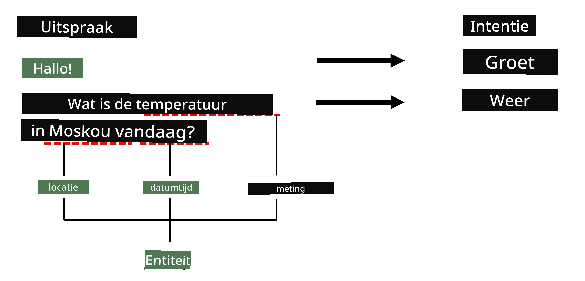

# Herkenning van Naam Entities

Tot nu toe hebben we ons voornamelijk gericht op één NLP-taak: classificatie. Er zijn echter ook andere NLP-taken die met neurale netwerken kunnen worden uitgevoerd. Een van die taken is **[Herkenning van Naam Entities](https://wikipedia.org/wiki/Named-entity_recognition)** (NER), waarbij specifieke entiteiten in tekst worden herkend, zoals plaatsen, persoonsnamen, datums, chemische formules, enzovoort.

## [Pre-lecture quiz](https://ff-quizzes.netlify.app/en/ai/quiz/37)

## Voorbeeld van NER-gebruik

Stel dat je een natuurlijke taal-chatbot wilt ontwikkelen, vergelijkbaar met Amazon Alexa of Google Assistant. Intelligente chatbots werken door te *begrijpen* wat de gebruiker wil via tekstclassificatie op de ingevoerde zin. Het resultaat van deze classificatie is de zogenaamde **intent**, die bepaalt wat de chatbot moet doen.

> Afbeelding door de auteur

Een gebruiker kan echter ook parameters als onderdeel van de zin opgeven. Bijvoorbeeld, bij het vragen naar het weer kan ze een locatie of datum specificeren. Een bot moet deze entiteiten kunnen begrijpen en de parameters dienovereenkomstig invullen voordat de actie wordt uitgevoerd. Dit is precies waar NER van pas komt.

> ✅ Een ander voorbeeld is [het analyseren van wetenschappelijke medische artikelen](https://soshnikov.com/science/analyzing-medical-papers-with-azure-and-text-analytics-for-health/). Een van de belangrijkste dingen waar we naar moeten zoeken, zijn specifieke medische termen, zoals ziektes en medische stoffen. Terwijl een klein aantal ziektes waarschijnlijk kan worden geëxtraheerd met substring-zoekopdrachten, vereisen complexere entiteiten, zoals chemische verbindingen en medicijnnamen, een meer geavanceerde aanpak.

## NER als Tokenclassificatie

NER-modellen zijn in wezen **tokenclassificatiemodellen**, omdat we voor elk van de invoertokens moeten bepalen of het tot een entiteit behoort of niet, en zo ja, tot welke entiteitsklasse.

Bekijk de volgende titel van een artikel:

**Tricuspid valve regurgitation** en **lithium carbonate** **toxicity** bij een pasgeboren baby.

De entiteiten hier zijn:

* Tricuspid valve regurgitation is een ziekte (`DIS`)
* Lithium carbonate is een chemische stof (`CHEM`)
* Toxicity is ook een ziekte (`DIS`)

Merk op dat één entiteit meerdere tokens kan omvatten. En, zoals in dit geval, moeten we onderscheid maken tussen twee opeenvolgende entiteiten. Daarom is het gebruikelijk om twee klassen te gebruiken voor elke entiteit: één die het eerste token van de entiteit specificeert (vaak wordt het voorvoegsel `B-` gebruikt, voor **begin**), en een andere voor de voortzetting van een entiteit (`I-`, voor **inner token**). We gebruiken ook `O` als klasse om alle **andere** tokens te vertegenwoordigen. Deze token-tagging wordt [BIO-tagging](https://en.wikipedia.org/wiki/Inside%E2%80%93outside%E2%80%93beginning_(tagging)) (of IOB) genoemd. Wanneer getagd, ziet onze titel er als volgt uit:

Token | Tag
------|-----
Tricuspid | B-DIS
valve | I-DIS
regurgitation | I-DIS
and | O
lithium | B-CHEM
carbonate | I-CHEM
toxicity | B-DIS
in | O
a | O
newborn | O
infant | O
. | O

Omdat we een één-op-één-correspondentie tussen tokens en klassen moeten opbouwen, kunnen we een rechtse **veel-op-veel** neurale netwerkmodel trainen zoals in deze afbeelding:

> *Afbeelding uit [deze blogpost](http://karpathy.github.io/2015/05/21/rnn-effectiveness/) door [Andrej Karpathy](http://karpathy.github.io/). NER-tokenclassificatiemodellen komen overeen met de rechtse netwerkarchitectuur op deze afbeelding.*

## NER-modellen trainen

Omdat een NER-model in wezen een tokenclassificatiemodel is, kunnen we RNN's gebruiken waarmee we al bekend zijn voor deze taak. In dit geval zal elk blok van het recurrente netwerk het token-ID retourneren. Het volgende voorbeeldnotebook laat zien hoe je een LSTM kunt trainen voor tokenclassificatie.

## ✍️ Voorbeeldnotebooks: NER

Ga verder met leren in het volgende notebook:

* [NER met TensorFlow](NER-TF.ipynb)

## Conclusie

Een NER-model is een **tokenclassificatiemodel**, wat betekent dat het kan worden gebruikt om tokenclassificatie uit te voeren. Dit is een zeer veelvoorkomende taak in NLP, die helpt specifieke entiteiten in tekst te herkennen, waaronder plaatsen, namen, datums en meer.

## 🚀 Uitdaging

Voltooi de opdracht via de onderstaande link om een model voor herkenning van medische entiteiten te trainen en probeer het vervolgens op een andere dataset.

## [Post-lecture quiz](https://ff-quizzes.netlify.app/en/ai/quiz/38)

## Review & Zelfstudie

Lees de blog [The Unreasonable Effectiveness of Recurrent Neural Networks](http://karpathy.github.io/2015/05/21/rnn-effectiveness/) en volg de sectie Verdere Lezing in dat artikel om je kennis te verdiepen.

## [Opdracht](lab/README.md)

In de opdracht voor deze les moet je een model voor herkenning van medische entiteiten trainen. Je kunt beginnen met het trainen van een LSTM-model zoals beschreven in deze les, en doorgaan met het gebruik van het BERT-transformermodel. Lees [de instructies](lab/README.md) om alle details te krijgen.

---

