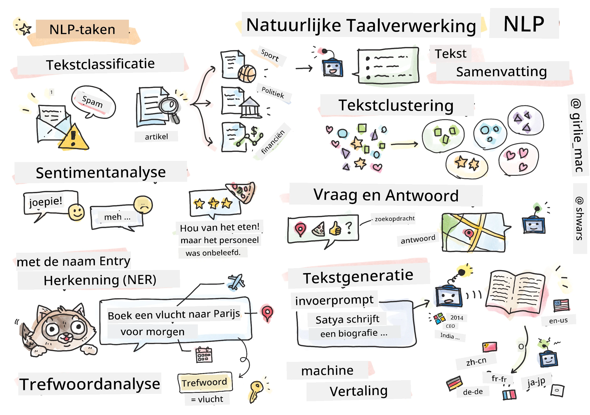

# Natuurlijke Taalverwerking



In deze sectie richten we ons op het gebruik van neurale netwerken om taken met betrekking tot **Natuurlijke Taalverwerking (NLP)** uit te voeren. Er zijn veel NLP-problemen die we willen dat computers kunnen oplossen:

* **Tekstclassificatie** is een typisch classificatieprobleem dat betrekking heeft op tekstreeksen. Voorbeelden zijn het classificeren van e-mails als spam versus geen spam, of het categoriseren van artikelen als sport, zakelijk, politiek, enzovoort. Ook bij het ontwikkelen van chatbots moeten we vaak begrijpen wat een gebruiker bedoelt -- in dit geval hebben we te maken met **intentieclassificatie**. Bij intentieclassificatie moeten we vaak omgaan met veel categorieën.
* **Sentimentanalyse** is een typisch regressieprobleem, waarbij we een getal (een sentiment) moeten toekennen dat aangeeft hoe positief/negatief de betekenis van een zin is. Een meer geavanceerde versie van sentimentanalyse is **aspect-gebaseerde sentimentanalyse** (ABSA), waarbij we sentiment niet toekennen aan de hele zin, maar aan verschillende delen ervan (aspecten), bijvoorbeeld: *In dit restaurant vond ik de keuken lekker, maar de sfeer was vreselijk*.
* **Named Entity Recognition** (NER) verwijst naar het probleem van het extraheren van bepaalde entiteiten uit tekst. Bijvoorbeeld, we moeten begrijpen dat in de zin *Ik moet morgen naar Parijs vliegen* het woord *morgen* verwijst naar DATUM, en *Parijs* een LOCATIE is.  
* **Sleutelwoordextractie** lijkt op NER, maar hierbij moeten we woorden die belangrijk zijn voor de betekenis van de zin automatisch extraheren, zonder vooraf te trainen op specifieke entiteitstypen.
* **Tekstclustering** kan nuttig zijn wanneer we vergelijkbare zinnen willen groeperen, bijvoorbeeld vergelijkbare verzoeken in technische ondersteuningsgesprekken.
* **Vraagbeantwoording** verwijst naar het vermogen van een model om een specifieke vraag te beantwoorden. Het model ontvangt een tekstpassage en een vraag als invoer, en moet een plaats in de tekst aangeven waar het antwoord op de vraag te vinden is (of soms het antwoord genereren).
* **Tekstgeneratie** is het vermogen van een model om nieuwe tekst te genereren. Het kan worden beschouwd als een classificatietaak die de volgende letter/woord voorspelt op basis van een *tekstprompt*. Geavanceerde tekstgeneratiemodellen, zoals GPT-3, kunnen andere NLP-taken oplossen, zoals classificatie, met behulp van een techniek genaamd [prompt programming](https://towardsdatascience.com/software-3-0-how-prompting-will-change-the-rules-of-the-game-a982fbfe1e0) of [prompt engineering](https://medium.com/swlh/openai-gpt-3-and-prompt-engineering-dcdc2c5fcd29).
* **Tekstsamenvatting** is een techniek waarbij we willen dat een computer lange tekst "leest" en samenvat in een paar zinnen.
* **Machinevertaling** kan worden gezien als een combinatie van tekstbegrip in één taal en tekstgeneratie in een andere taal.

Aanvankelijk werden de meeste NLP-taken opgelost met traditionele methoden zoals grammatica's. Bijvoorbeeld, bij machinevertaling werden parsers gebruikt om de oorspronkelijke zin om te zetten in een syntaxisboom, waarna hogere semantische structuren werden geëxtraheerd om de betekenis van de zin te vertegenwoordigen. Op basis van deze betekenis en de grammatica van de doeltaal werd het resultaat gegenereerd. Tegenwoordig worden veel NLP-taken effectiever opgelost met neurale netwerken.

> Veel klassieke NLP-methoden zijn geïmplementeerd in de [Natural Language Processing Toolkit (NLTK)](https://www.nltk.org) Python-bibliotheek. Er is een geweldig [NLTK Boek](https://www.nltk.org/book/) online beschikbaar dat behandelt hoe verschillende NLP-taken kunnen worden opgelost met NLTK.

In onze cursus zullen we ons voornamelijk richten op het gebruik van neurale netwerken voor NLP, en we zullen NLTK gebruiken waar nodig.

We hebben al geleerd hoe we neurale netwerken kunnen gebruiken voor het werken met tabelgegevens en afbeeldingen. Het belangrijkste verschil tussen die soorten gegevens en tekst is dat tekst een reeks van variabele lengte is, terwijl de invoergrootte bij afbeeldingen vooraf bekend is. Hoewel convolutionele netwerken patronen uit invoergegevens kunnen extraheren, zijn patronen in tekst complexer. Bijvoorbeeld, ontkenning kan gescheiden zijn van het onderwerp door willekeurig veel woorden (bijvoorbeeld *Ik hou niet van sinaasappels* versus *Ik hou niet van die grote kleurrijke smakelijke sinaasappels*), en dat moet nog steeds worden geïnterpreteerd als één patroon. Daarom moeten we om taal te verwerken nieuwe typen neurale netwerken introduceren, zoals *recurrente netwerken* en *transformers*.

## Bibliotheken installeren

Als je een lokale Python-installatie gebruikt om deze cursus uit te voeren, moet je mogelijk alle vereiste bibliotheken voor NLP installeren met de volgende commando's:

**Voor PyTorch**
```bash
pip install -r requirements-torch.txt
```
**Voor TensorFlow**
```bash
pip install -r requirements-tf.txt
```

> Je kunt NLP met TensorFlow proberen op [Microsoft Learn](https://docs.microsoft.com/learn/modules/intro-natural-language-processing-tensorflow/?WT.mc_id=academic-77998-cacaste)

## GPU Waarschuwing

In deze sectie zullen we in sommige voorbeelden vrij grote modellen trainen.
* **Gebruik een computer met GPU-ondersteuning**: Het is aan te raden om je notebooks op een computer met GPU-ondersteuning uit te voeren om wachttijden te verminderen bij het werken met grote modellen.
* **Beperkingen van GPU-geheugen**: Het gebruik van een GPU kan leiden tot situaties waarin je geen GPU-geheugen meer hebt, vooral bij het trainen van grote modellen.
* **GPU-geheugenverbruik**: De hoeveelheid GPU-geheugen die wordt verbruikt tijdens training hangt af van verschillende factoren, waaronder de grootte van de minibatch.
* **Minimaliseer minibatchgrootte**: Als je problemen ondervindt met GPU-geheugen, overweeg dan om de minibatchgrootte in je code te verkleinen als mogelijke oplossing.
* **TensorFlow GPU-geheugen vrijgeven**: Oudere versies van TensorFlow kunnen GPU-geheugen mogelijk niet correct vrijgeven bij het trainen van meerdere modellen binnen één Python-kernel. Om GPU-geheugen effectief te beheren, kun je TensorFlow configureren om GPU-geheugen alleen toe te wijzen wanneer dat nodig is.
* **Code toevoegen**: Om TensorFlow zo in te stellen dat GPU-geheugen alleen groeit wanneer nodig, voeg je de volgende code toe aan je notebooks:

```python
physical_devices = tf.config.list_physical_devices('GPU') 
if len(physical_devices)>0:
    tf.config.experimental.set_memory_growth(physical_devices[0], True) 
```

Als je geïnteresseerd bent in het leren over NLP vanuit een klassiek ML-perspectief, bezoek dan [deze reeks lessen](https://github.com/microsoft/ML-For-Beginners/tree/main/6-NLP).

## In deze sectie
In deze sectie leren we over:

* [Tekst representeren als tensors](13-TextRep/README.md)
* [Woordembeddings](14-Emdeddings/README.md)
* [Taalmodellering](15-LanguageModeling/README.md)
* [Recurrente neurale netwerken](16-RNN/README.md)
* [Generatieve netwerken](17-GenerativeNetworks/README.md)
* [Transformers](18-Transformers/README.md)

---

**Disclaimer**:  
Dit document is vertaald met behulp van de AI-vertalingsservice [Co-op Translator](https://github.com/Azure/co-op-translator). Hoewel we streven naar nauwkeurigheid, dient u zich ervan bewust te zijn dat geautomatiseerde vertalingen fouten of onnauwkeurigheden kunnen bevatten. Het originele document in de oorspronkelijke taal moet worden beschouwd als de gezaghebbende bron. Voor cruciale informatie wordt professionele menselijke vertaling aanbevolen. Wij zijn niet aansprakelijk voor eventuele misverstanden of verkeerde interpretaties die voortvloeien uit het gebruik van deze vertaling.