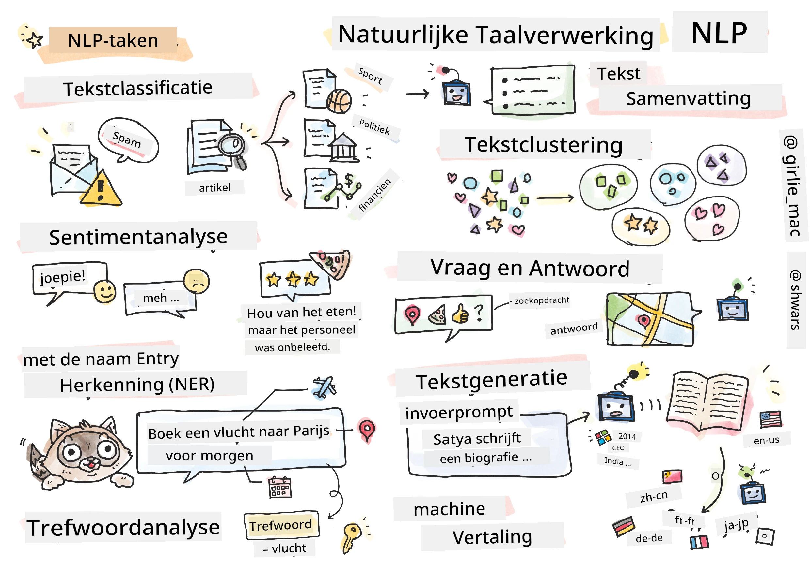

# Natuurlijke Taalverwerking



In deze sectie richten we ons op het gebruik van neurale netwerken voor het uitvoeren van taken gerelateerd aan **Natuurlijke Taalverwerking (NLP)**. Er zijn veel NLP-problemen die we willen dat computers kunnen oplossen:

* **Tekstclassificatie** is een typisch classificatieprobleem met betrekking tot tekstreeksen. Voorbeelden zijn het classificeren van e-mailberichten als spam versus geen spam, of het categoriseren van artikelen als sport, zakelijk, politiek, enz. Ook bij het ontwikkelen van chatbots moeten we vaak begrijpen wat een gebruiker wilde zeggen – in dit geval hebben we te maken met **intentieclassificatie**. Vaak moeten we in intentieclassificatie met veel categorieën omgaan.
* **Sentimentanalyse** is een typisch regressieprobleem, waarbij we een getal (een sentiment) moeten toekennen dat aangeeft hoe positief/negatief de betekenis van een zin is. Een geavanceerdere versie van sentimentanalyse is **aspect-gebaseerde sentimentanalyse** (ABSA), waarbij we het sentiment niet aan de hele zin toekennen, maar aan verschillende delen ervan (aspecten), bijvoorbeeld *In dit restaurant vond ik de keuken lekker, maar de sfeer was verschrikkelijk*.
* **Named Entity Recognition** (NER) verwijst naar het probleem van het extraheren van bepaalde entiteiten uit tekst. Bijvoorbeeld, we moeten begrijpen dat in de zin *Ik moet morgen naar Parijs vliegen* het woord *morgen* verwijst naar DATUM, en *Parijs* een LOCATIE is.  
* **Trefwoordanalyse** is vergelijkbaar met NER, maar we moeten automatisch woorden extraheren die belangrijk zijn voor de betekenis van de zin, zonder vooraf te trainen op specifieke entiteitstypen.
* **Tekstclustering** kan nuttig zijn wanneer we vergelijkbare zinnen willen groeperen, bijvoorbeeld vergelijkbare verzoeken in technische ondersteuningsgesprekken.
* **Vraag beantwoorden** verwijst naar het vermogen van een model om een specifieke vraag te beantwoorden. Het model ontvangt een tekstpassage en een vraag als invoer en moet een plek in de tekst aangeven waar het antwoord op de vraag te vinden is (of soms het antwoord genereren).
* **Tekstgeneratie** is het vermogen van een model om nieuwe tekst te genereren. Dit kan worden gezien als een classificatieprobleem waarbij het volgende teken/woord wordt voorspeld op basis van een *tekstprompt*. Geavanceerde tekstgeneratiemodellen, zoals GPT-3, kunnen ook andere NLP-taken oplossen zoals classificatie met een techniek genaamd [prompt programming](https://towardsdatascience.com/software-3-0-how-prompting-will-change-the-rules-of-the-game-a982fbfe1e0) of [prompt engineering](https://medium.com/swlh/openai-gpt-3-and-prompt-engineering-dcdc2c5fcd29)
* **Tekstsamenvatting** is een techniek waarbij we een computer willen laten "lezen" van lange tekst en deze samenvatten in een paar zinnen.
* **Machinevertaling** kan worden gezien als een combinatie van tekstbegrip in de ene taal en tekstgeneratie in een andere taal.

Aanvankelijk werden de meeste NLP-taken opgelost met traditionele methoden zoals grammatica’s. Bijvoorbeeld, bij machinevertaling werden parsers gebruikt om de oorspronkelijke zin om te zetten in een syntaxisboom, daarna werden hogere semantische structuren geëxtraheerd om de betekenis van de zin te vertegenwoordigen en op basis van deze betekenis en de grammatica van de doeltaal werd het resultaat gegenereerd. Tegenwoordig worden veel NLP-taken effectiever opgelost met neurale netwerken.

> Veel klassieke NLP-methoden zijn geïmplementeerd in de Python-bibliotheek [Natural Language Processing Toolkit (NLTK)](https://www.nltk.org). Er is een geweldige [NLTK-boek](https://www.nltk.org/book/) online beschikbaar dat behandelt hoe verschillende NLP-taken met NLTK kunnen worden opgelost.

In onze cursus zullen we ons vooral richten op het gebruik van neurale netwerken voor NLP en waar nodig NLTK gebruiken.

We hebben al geleerd hoe we neurale netwerken gebruiken om om te gaan met tabeldata en met afbeeldingen. Het belangrijkste verschil tussen die typen data en tekst is dat tekst een sequentie van variabele lengte is, terwijl de invoergrootte bij afbeeldingen van tevoren bekend is. Terwijl convolutionele netwerken patronen uit inputdata kunnen extraheren, zijn patronen in tekst complexer. Bijvoorbeeld, we kunnen hebben dat een ontkenning gescheiden is van het onderwerp door een willekeurig aantal woorden (bijv. *Ik hou niet van sinaasappels* versus *Ik hou niet van die grote kleurrijke smakelijke sinaasappels*), en dat moet toch als één patroon worden geïnterpreteerd. Daarom moeten we om taal te verwerken nieuwe typen neurale netwerken introduceren, zoals *recurrerende netwerken* en *transformers*.

## Bibliotheken installeren

Als je een lokale Python-installatie gebruikt om deze cursus te volgen, moet je mogelijk alle vereiste bibliotheken voor NLP installeren met de volgende opdrachten:

**Voor PyTorch**
```bash
pip install -r requirements-pytorch.txt
```
**Voor TensorFlow**
```bash
pip install -r requirements-tf.txt
```

> Je kunt NLP met TensorFlow proberen op [Microsoft Learn](https://docs.microsoft.com/learn/modules/intro-natural-language-processing-tensorflow/?WT.mc_id=academic-77998-cacaste)

## GPU Waarschuwing

In deze sectie zullen we in sommige voorbeelden behoorlijk grote modellen trainen.
* **Gebruik een computer met GPU-ondersteuning**: Het is aan te raden om je notitieboeken op een computer met GPU-ondersteuning uit te voeren om wachttijden te verkorten bij het werken met grote modellen.
* **Beperkingen van GPU-geheugen**: Bij gebruik van een GPU kan het voorkomen dat je zonder GPU-geheugen komt te zitten, vooral bij het trainen van grote modellen.
* **GPU-geheugenverbruik**: De hoeveelheid GPU-geheugen die tijdens het trainen wordt gebruikt, hangt af van verschillende factoren, waaronder de minibatch-grootte.
* **Minimaliseer de minibatch-grootte**: Als je problemen ervaart met GPU-geheugen, overweeg dan om de minibatch-grootte in je code te verminderen als mogelijke oplossing.
* **TensorFlow GPU geheugen vrijgave**: Oudere versies van TensorFlow maken mogelijk GPU-geheugen niet correct vrij bij het trainen van meerdere modellen binnen één Python-kernel. Om het GPU-geheugenbeheer effectief te maken, kun je TensorFlow configureren zodat het GPU-geheugen alleen wordt toegewezen wanneer dat nodig is.
* **Code opnemen**: Om TensorFlow zo in te stellen dat het GPU-geheugen alleen groeit als dat nodig is, neem je de volgende code op in je notitieboeken:

```python
physical_devices = tf.config.list_physical_devices('GPU') 
if len(physical_devices)>0:
    tf.config.experimental.set_memory_growth(physical_devices[0], True) 
```

Als je geïnteresseerd bent in NLP leren vanuit een klassiek ML-perspectief, bezoek dan [deze reeks lessen](https://github.com/microsoft/ML-For-Beginners/tree/main/6-NLP)

## In deze sectie
In deze sectie leren we over:

* [Tekst representeren als tensors](13-TextRep/README.md)
* [Woorden-embedding](14-Embeddings/README.md)
* [Taalmodellering](15-LanguageModeling/README.md)
* [Recurrente neurale netwerken](16-RNN/README.md)
* [Generatieve netwerken](17-GenerativeNetworks/README.md)
* [Transformers](18-Transformers/README.md)

---

<!-- CO-OP TRANSLATOR DISCLAIMER START -->
**Disclaimer**:
Dit document is vertaald met behulp van de AI vertaaldienst [Co-op Translator](https://github.com/Azure/co-op-translator). Hoewel we streven naar nauwkeurigheid, dient u er rekening mee te houden dat geautomatiseerde vertalingen fouten of onnauwkeurigheden kunnen bevatten. Het originele document in de oorspronkelijke taal moet worden beschouwd als de gezaghebbende bron. Voor kritieke informatie wordt professionele menselijke vertaling aanbevolen. Wij zijn niet aansprakelijk voor eventuele misverstanden of verkeerde interpretaties die voortvloeien uit het gebruik van deze vertaling.
<!-- CO-OP TRANSLATOR DISCLAIMER END -->