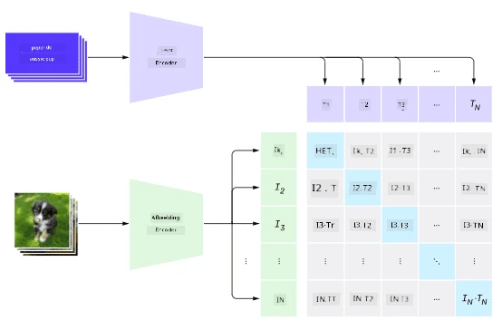
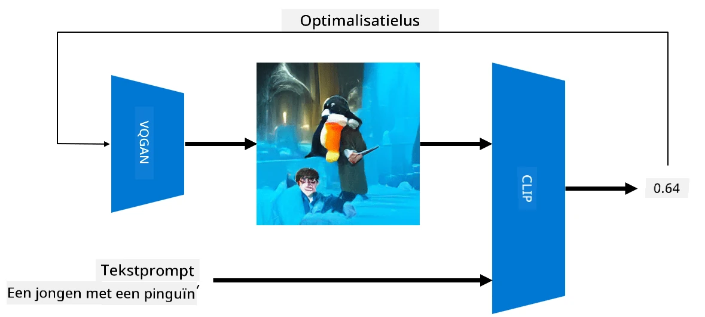

# Multi-Modale Netwerken

Na het succes van transformer-modellen voor het oplossen van NLP-taken, zijn dezelfde of vergelijkbare architecturen toegepast op computervisie-taken. Er is een groeiende interesse in het bouwen van modellen die zowel visuele als natuurlijke taalvaardigheden kunnen *combineren*. Een van deze pogingen is gedaan door OpenAI en heet CLIP en DALL.E.

## Contrastive Image Pre-Training (CLIP)

Het belangrijkste idee van CLIP is om tekstprompts te kunnen vergelijken met een afbeelding en te bepalen hoe goed de afbeelding overeenkomt met de prompt.

> *Afbeelding uit [deze blogpost](https://openai.com/blog/clip/)*

Het model is getraind op afbeeldingen die van het internet zijn verkregen en hun bijschriften. Voor elke batch nemen we N paren van (afbeelding, tekst) en zetten deze om in vectorrepresentaties I, ..., I / T, ..., T. Deze representaties worden vervolgens aan elkaar gekoppeld. De verliesfunctie is gedefinieerd om de cosinus-similariteit tussen vectoren die bij één paar horen (bijv. I en T) te maximaliseren, en de cosinus-similariteit tussen alle andere paren te minimaliseren. Daarom wordt deze aanpak **contrastive** genoemd.

Het CLIP-model/bibliotheek is beschikbaar via [OpenAI GitHub](https://github.com/openai/CLIP). De aanpak wordt beschreven in [deze blogpost](https://openai.com/blog/clip/) en meer gedetailleerd in [dit artikel](https://arxiv.org/pdf/2103.00020.pdf).

Zodra dit model is voorgetraind, kunnen we het een batch afbeeldingen en een batch tekstprompts geven, en het zal een tensor met waarschijnlijkheden retourneren. CLIP kan voor verschillende taken worden gebruikt:

**Afbeeldingsclassificatie**

Stel dat we afbeeldingen moeten classificeren tussen bijvoorbeeld katten, honden en mensen. In dit geval kunnen we het model een afbeelding geven en een reeks tekstprompts: "*een afbeelding van een kat*", "*een afbeelding van een hond*", "*een afbeelding van een mens*". In de resulterende vector van 3 waarschijnlijkheden hoeven we alleen de index met de hoogste waarde te selecteren.

> *Afbeelding uit [deze blogpost](https://openai.com/blog/clip/)*

**Tekstgebaseerd Afbeeldingszoeken**

We kunnen ook het tegenovergestelde doen. Als we een verzameling afbeeldingen hebben, kunnen we deze verzameling aan het model doorgeven, samen met een tekstprompt - dit zal ons de afbeelding geven die het meest lijkt op de gegeven prompt.

## ✍️ Voorbeeld: [CLIP gebruiken voor Afbeeldingsclassificatie en Afbeeldingszoeken](Clip.ipynb)

Open het [Clip.ipynb](Clip.ipynb) notebook om CLIP in actie te zien.

## Afbeeldingsgeneratie met VQGAN+CLIP

CLIP kan ook worden gebruikt voor **afbeeldingsgeneratie** vanuit een tekstprompt. Om dit te doen, hebben we een **generator-model** nodig dat afbeeldingen kan genereren op basis van een vectorinvoer. Een van deze modellen heet [VQGAN](https://compvis.github.io/taming-transformers/) (Vector-Quantized GAN).

De belangrijkste ideeën van VQGAN die het onderscheiden van gewone [GAN](../../4-ComputerVision/10-GANs/README.md) zijn de volgende:
* Gebruik van een autoregressieve transformer-architectuur om een reeks contextrijke visuele onderdelen te genereren die de afbeelding vormen. Deze visuele onderdelen worden op hun beurt geleerd door [CNN](../../4-ComputerVision/07-ConvNets/README.md).
* Gebruik van een sub-afbeeldingsdiscriminator die detecteert of delen van de afbeelding "echt" of "nep" zijn (in tegenstelling tot de "alles-of-niets"-benadering in traditionele GAN).

Meer informatie over VQGAN vind je op de [Taming Transformers](https://compvis.github.io/taming-transformers/) website.

Een belangrijk verschil tussen VQGAN en traditionele GAN is dat de laatste een behoorlijke afbeelding kan produceren vanuit elke invoervector, terwijl VQGAN waarschijnlijk een afbeelding produceert die niet coherent is. Daarom moeten we het proces van afbeeldingcreatie verder sturen, en dat kan worden gedaan met behulp van CLIP.

Om een afbeelding te genereren die overeenkomt met een tekstprompt, beginnen we met een willekeurige coderingsvector die door VQGAN wordt doorgegeven om een afbeelding te produceren. Vervolgens wordt CLIP gebruikt om een verliesfunctie te produceren die aangeeft hoe goed de afbeelding overeenkomt met de tekstprompt. Het doel is dan om dit verlies te minimaliseren, door middel van backpropagation om de parameters van de invoervector aan te passen.

Een geweldige bibliotheek die VQGAN+CLIP implementeert is [Pixray](http://github.com/pixray/pixray).

 |   | 
----|----|----
Afbeelding gegenereerd vanuit prompt *een close-up aquarelportret van een jonge mannelijke leraar literatuur met een boek* | Afbeelding gegenereerd vanuit prompt *een close-up olieverfportret van een jonge vrouwelijke leraar informatica met een computer* | Afbeelding gegenereerd vanuit prompt *een close-up olieverfportret van een oude mannelijke leraar wiskunde voor een schoolbord*

> Afbeeldingen uit de **Artificial Teachers** collectie van [Dmitry Soshnikov](http://soshnikov.com)

## DALL-E
### [DALL-E 1](https://openai.com/research/dall-e)
DALL-E is een versie van GPT-3 die is getraind om afbeeldingen te genereren vanuit prompts. Het is getraind met 12 miljard parameters.

In tegenstelling tot CLIP ontvangt DALL-E zowel tekst als afbeelding als een enkele stroom van tokens voor zowel afbeeldingen als tekst. Daarom kun je vanuit meerdere prompts afbeeldingen genereren op basis van de tekst.

### [DALL-E 2](https://openai.com/dall-e-2)
Het belangrijkste verschil tussen DALL.E 1 en 2 is dat het meer realistische afbeeldingen en kunst genereert.

Voorbeelden van afbeeldingsgeneraties met DALL-E:
 |   | 
----|----|----
Afbeelding gegenereerd vanuit prompt *een close-up aquarelportret van een jonge mannelijke leraar literatuur met een boek* | Afbeelding gegenereerd vanuit prompt *een close-up olieverfportret van een jonge vrouwelijke leraar informatica met een computer* | Afbeelding gegenereerd vanuit prompt *een close-up olieverfportret van een oude mannelijke leraar wiskunde voor een schoolbord*

## Referenties

* VQGAN Artikel: [Taming Transformers for High-Resolution Image Synthesis](https://compvis.github.io/taming-transformers/paper/paper.pdf)
* CLIP Artikel: [Learning Transferable Visual Models From Natural Language Supervision](https://arxiv.org/pdf/2103.00020.pdf)

---

**Disclaimer**:  
Dit document is vertaald met behulp van de AI-vertalingsservice [Co-op Translator](https://github.com/Azure/co-op-translator). Hoewel we ons best doen voor nauwkeurigheid, dient u zich ervan bewust te zijn dat geautomatiseerde vertalingen fouten of onnauwkeurigheden kunnen bevatten. Het originele document in zijn oorspronkelijke taal moet worden beschouwd als de gezaghebbende bron. Voor cruciale informatie wordt professionele menselijke vertaling aanbevolen. Wij zijn niet aansprakelijk voor eventuele misverstanden of verkeerde interpretaties die voortvloeien uit het gebruik van deze vertaling.