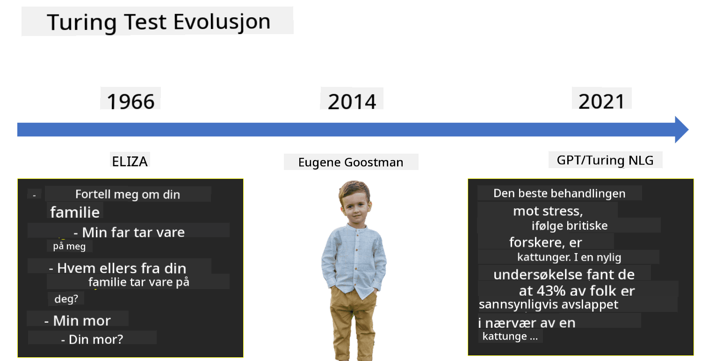

<!--
CO_OP_TRANSLATOR_METADATA:
{
  "original_hash": "06ca1b0138e65b964481ae83275b270e",
  "translation_date": "2025-10-03T08:24:35+00:00",
  "source_file": "lessons/1-Intro/README.md",
  "language_code": "no"
}
-->
# Introduksjon til AI

> Skissenotat av [Tomomi Imura](https://twitter.com/girlie_mac)

## [Quiz før forelesning](https://ff-quizzes.netlify.app/en/ai/quiz/1)

**Kunstig intelligens** er en spennende vitenskapelig disiplin som studerer hvordan vi kan få datamaskiner til å vise intelligent oppførsel, f.eks. gjøre ting som mennesker er flinke til.

Opprinnelig ble datamaskiner oppfunnet av [Charles Babbage](https://en.wikipedia.org/wiki/Charles_Babbage) for å operere med tall ved å følge en veldefinert prosedyre – en algoritme. Moderne datamaskiner, selv om de er betydelig mer avanserte enn den opprinnelige modellen fra 1800-tallet, følger fortsatt samme idé om kontrollerte beregninger. Dermed er det mulig å programmere en datamaskin til å utføre en oppgave hvis vi kjenner den nøyaktige sekvensen av trinn som må til for å oppnå målet.

> Foto av [Vickie Soshnikova](http://twitter.com/vickievalerie)

> ✅ Å definere alderen til en person ut fra et fotografi er en oppgave som ikke kan programmeres eksplisitt, fordi vi ikke vet hvordan vi kommer frem til et tall i hodet vårt når vi gjør det.

---

Det finnes imidlertid noen oppgaver som vi ikke eksplisitt vet hvordan vi skal løse. Tenk på det å bestemme alderen til en person ut fra et fotografi. Vi lærer oss å gjøre det fordi vi har sett mange eksempler på mennesker i ulike aldre, men vi kan ikke forklare nøyaktig hvordan vi gjør det, og vi kan heller ikke programmere en datamaskin til å gjøre det. Dette er akkurat den typen oppgaver som er interessante for **kunstig intelligens** (forkortet AI).

✅ Tenk på noen oppgaver du kunne overlate til en datamaskin som ville dra nytte av AI. Vurder områder som finans, medisin og kunst – hvordan drar disse områdene nytte av AI i dag?

## Svak AI vs. Sterk AI

Svak AI | Sterk AI
---------------------------------------|-------------------------------------
Svak AI refererer til AI-systemer som er designet og trent for en spesifikk oppgave eller et begrenset sett av oppgaver.|Sterk AI, eller Kunstig Generell Intelligens (AGI), refererer til AI-systemer med menneskelig nivå av intelligens og forståelse.
Disse AI-systemene er ikke generelt intelligente; de er dyktige til å utføre en forhåndsdefinert oppgave, men mangler ekte forståelse eller bevissthet.|Disse AI-systemene har evnen til å utføre enhver intellektuell oppgave som et menneske kan gjøre, tilpasse seg ulike domener og besitte en form for bevissthet eller selvinnsikt.
Eksempler på svak AI inkluderer virtuelle assistenter som Siri eller Alexa, anbefalingsalgoritmer brukt av strømmetjenester, og chatboter designet for spesifikke kundeserviceoppgaver.|Å oppnå sterk AI er et langsiktig mål for AI-forskning og vil kreve utvikling av AI-systemer som kan resonnere, lære, forstå og tilpasse seg på tvers av et bredt spekter av oppgaver og kontekster.
Svak AI er svært spesialisert og har ikke menneskelignende kognitive evner eller generell problemløsningsevne utenfor sitt begrensede område.|Sterk AI er for øyeblikket et teoretisk konsept, og ingen AI-systemer har nådd dette nivået av generell intelligens.

For mer informasjon, se **[Artificial General Intelligence](https://en.wikipedia.org/wiki/Artificial_general_intelligence)** (AGI).

## Definisjonen av intelligens og Turing-testen

Et av problemene med begrepet **[intelligens](https://en.wikipedia.org/wiki/Intelligence)** er at det ikke finnes en klar definisjon av dette begrepet. Man kan argumentere for at intelligens er knyttet til **abstrakt tenkning** eller **selvbevissthet**, men vi kan ikke definere det ordentlig.

> [Foto](https://unsplash.com/photos/75715CVEJhI) av [Amber Kipp](https://unsplash.com/@sadmax) fra Unsplash

For å se hvor tvetydig begrepet *intelligens* er, prøv å svare på spørsmålet: "Er en katt intelligent?". Ulike mennesker har en tendens til å gi ulike svar på dette spørsmålet, siden det ikke finnes noen universelt akseptert test for å bevise at påstanden er sann eller ikke. Og hvis du tror det finnes – prøv å la katten din ta en IQ-test...

✅ Tenk et øyeblikk på hvordan du definerer intelligens. Er en kråke som kan løse en labyrint for å få tak i mat intelligent? Er et barn intelligent?

---

Når vi snakker om AGI, må vi ha en måte å avgjøre om vi har skapt et virkelig intelligent system. [Alan Turing](https://en.wikipedia.org/wiki/Alan_Turing) foreslo en metode kalt **[Turing-testen](https://en.wikipedia.org/wiki/Turing_test)**, som også fungerer som en definisjon av intelligens. Testen sammenligner et gitt system med noe som er iboende intelligent – et ekte menneske, og fordi enhver automatisk sammenligning kan omgås av et dataprogram, bruker vi en menneskelig utspørrer. Så, hvis et menneske ikke klarer å skille mellom en ekte person og et datasystem i en tekstbasert dialog – anses systemet som intelligent.

> En chatbot kalt [Eugene Goostman](https://en.wikipedia.org/wiki/Eugene_Goostman), utviklet i St. Petersburg, kom nær å bestå Turing-testen i 2014 ved å bruke et smart personlighetstriks. Den kunngjorde på forhånd at den var en 13 år gammel ukrainsk gutt, noe som forklarte mangelen på kunnskap og noen uoverensstemmelser i teksten. Botten overbeviste 30 % av dommerne om at den var menneskelig etter en 5-minutters dialog, en metrikk som Turing trodde en maskin ville kunne oppnå innen 2000. Men man bør forstå at dette ikke indikerer at vi har skapt et intelligent system, eller at et datasystem har lurt den menneskelige utspørreren – systemet lurte ikke menneskene, men snarere bot-skaperne gjorde det!

✅ Har du noen gang blitt lurt av en chatbot til å tro at du snakker med et menneske? Hvordan overbeviste den deg?

## Ulike tilnærminger til AI

Hvis vi vil at en datamaskin skal oppføre seg som et menneske, må vi på en eller annen måte modellere vår måte å tenke på inne i datamaskinen. Følgelig må vi prøve å forstå hva som gjør et menneske intelligent.

> For å kunne programmere intelligens inn i en maskin, må vi forstå hvordan våre egne beslutningsprosesser fungerer. Hvis du gjør litt selvransakelse, vil du innse at det finnes noen prosesser som skjer ubevisst – f.eks. vi kan skille en katt fra en hund uten å tenke over det – mens andre involverer resonnering.

Det finnes to mulige tilnærminger til dette problemet:

Top-down-tilnærming (symbolsk resonnering) | Bottom-up-tilnærming (nevrale nettverk)
---------------------------------------|-------------------------------------
En top-down-tilnærming modellerer måten en person resonerer for å løse et problem. Det innebærer å trekke ut **kunnskap** fra et menneske og representere det i en datamaskinlesbar form. Vi må også utvikle en måte å modellere **resonnering** inne i en datamaskin.|En bottom-up-tilnærming modellerer strukturen til en menneskelig hjerne, bestående av et stort antall enkle enheter kalt **nevroner**. Hvert nevron fungerer som et vektet gjennomsnitt av sine innganger, og vi kan trene et nettverk av nevroner til å løse nyttige problemer ved å gi **treningsdata**.

Det finnes også noen andre mulige tilnærminger til intelligens:

* En **Emergent**, **Synergetisk** eller **multi-agent tilnærming** er basert på det faktum at kompleks intelligent oppførsel kan oppnås gjennom interaksjon mellom et stort antall enkle agenter. Ifølge [evolusjonær kybernetikk](https://en.wikipedia.org/wiki/Global_brain#Evolutionary_cybernetics), kan intelligens *oppstå* fra enklere, reaktiv oppførsel i prosessen med *metasystemovergang*.

* En **Evolusjonær tilnærming**, eller **genetisk algoritme**, er en optimaliseringsprosess basert på prinsippene for evolusjon.

Vi vil vurdere disse tilnærmingene senere i kurset, men akkurat nå vil vi fokusere på to hovedretninger: top-down og bottom-up.

### Top-Down-tilnærming

I en **top-down-tilnærming** prøver vi å modellere vår resonnering. Fordi vi kan følge tankene våre når vi resonerer, kan vi prøve å formalisere denne prosessen og programmere den inn i datamaskinen. Dette kalles **symbolsk resonnering**.

Mennesker har en tendens til å ha noen regler i hodet som styrer deres beslutningsprosesser. For eksempel, når en lege diagnostiserer en pasient, kan han eller hun innse at en person har feber, og dermed kan det være en betennelse i kroppen. Ved å bruke et stort sett med regler på et spesifikt problem kan en lege komme frem til en endelig diagnose.

Denne tilnærmingen er sterkt avhengig av **kunnskapsrepresentasjon** og **resonnering**. Å trekke ut kunnskap fra en menneskelig ekspert kan være den vanskeligste delen, fordi en lege i mange tilfeller ikke vet nøyaktig hvorfor han eller hun kommer frem til en bestemt diagnose. Noen ganger dukker løsningen bare opp i hodet uten eksplisitt tenkning. Noen oppgaver, som å bestemme alderen til en person ut fra et fotografi, kan overhodet ikke reduseres til å manipulere kunnskap.

### Bottom-Up-tilnærming

Alternativt kan vi prøve å modellere de enkleste elementene i hjernen vår – et nevron. Vi kan konstruere et såkalt **kunstig nevralt nettverk** inne i en datamaskin, og deretter prøve å lære det å løse problemer ved å gi det eksempler. Denne prosessen ligner på hvordan et nyfødt barn lærer om omgivelsene sine ved å observere.

✅ Gjør litt research på hvordan babyer lærer. Hva er de grunnleggende elementene i en babys hjerne?

> | Hva med ML?         |      |
> |--------------|-----------|
> | En del av kunstig intelligens som er basert på at datamaskiner lærer å løse et problem basert på data, kalles **Maskinlæring**. Vi vil ikke gå inn på klassisk maskinlæring i dette kurset – vi henviser deg til en egen [Maskinlæring for nybegynnere](http://aka.ms/ml-beginners)-pensum. |       |

## En kort historie om AI

Kunstig intelligens startet som et felt midt på 1900-tallet. Opprinnelig var symbolsk resonnering en utbredt tilnærming, og det førte til en rekke viktige suksesser, som ekspertssystemer – dataprogrammer som kunne fungere som eksperter innenfor begrensede problemområder. Det ble imidlertid snart klart at en slik tilnærming ikke skalerer godt. Å trekke ut kunnskap fra en ekspert, representere det i en datamaskin og holde kunnskapsbasen nøyaktig viser seg å være en svært kompleks oppgave, og for kostbar til å være praktisk i mange tilfeller. Dette førte til den såkalte [AI-vinteren](https://en.wikipedia.org/wiki/AI_winter) på 1970-tallet.

> Bilde av [Dmitry Soshnikov](http://soshnikov.com)

Etter hvert som tiden gikk, ble databehandlingsressurser billigere, og mer data ble tilgjengelig, så nevrale nettverkstilnærminger begynte å vise stor ytelse i konkurranse med mennesker på mange områder, som datavisjon eller talegjenkjenning. I det siste tiåret har begrepet kunstig intelligens stort sett blitt brukt som et synonym for nevrale nettverk, fordi de fleste AI-suksessene vi hører om er basert på dem.

Vi kan observere hvordan tilnærmingene har endret seg, for eksempel i utviklingen av et sjakkspillende dataprogram:

* Tidlige sjakkprogrammer var basert på søk – et program prøvde eksplisitt å estimere mulige trekk fra en motstander for et gitt antall fremtidige trekk, og valgte et optimalt trekk basert på den optimale posisjonen som kunne oppnås i noen få trekk. Dette førte til utviklingen av den såkalte [alpha-beta pruning](https://en.wikipedia.org/wiki/Alpha%E2%80%93beta_pruning)-søkealgoritmen.
* Søkestrategier fungerer godt mot slutten av spillet, der søkeområdet er begrenset av et lite antall mulige trekk. Imidlertid, i begynnelsen av spillet, er søkeområdet enormt, og algoritmen kan forbedres ved å lære fra eksisterende kamper mellom menneskelige spillere. Påfølgende eksperimenter benyttet såkalt [case-based reasoning](https://en.wikipedia.org/wiki/Case-based_reasoning), der programmet lette etter tilfeller i kunnskapsbasen som lignet veldig på den nåværende posisjonen i spillet.
* Moderne programmer som vinner over menneskelige spillere er basert på nevrale nettverk og [forsterkende læring](https://en.wikipedia.org/wiki/Reinforcement_learning), der programmene lærer å spille utelukkende ved å spille lenge mot seg selv og lære av sine egne feil – omtrent som mennesker gjør når de lærer å spille sjakk. Imidlertid kan et dataprogram spille mange flere spill på mye kortere tid, og dermed lære mye raskere.

✅ Gjør litt research på andre spill som har blitt spilt av AI.

På samme måte kan vi se hvordan tilnærmingen til å lage "snakkende programmer" (som kan bestå Turing-testen) har endret seg:

* Tidlige programmer av denne typen, som [Eliza](https://en.wikipedia.org/wiki/ELIZA), var basert på svært enkle grammatiske regler og omformulering av inngangsetningen til et spørsmål.
* Moderne assistenter, som Cortana, Siri eller Google Assistant, er alle hybridsystemer som bruker nevrale nettverk for å konvertere tale til tekst og gjenkjenne vår intensjon, og deretter benytte seg av noe resonnering eller eksplisitte algoritmer for å utføre nødvendige handlinger.
* I fremtiden kan vi forvente en komplett nevralt basert modell som håndterer dialog av seg selv. Den nylige GPT- og [Turing-NLG](https://www.microsoft.com/research/blog/turing-nlg-a-17-billion-parameter-language-model-by-microsoft)-familien av nevrale nettverk viser stor suksess i dette.

> Bilde av Dmitry Soshnikov, [foto](https://unsplash.com/photos/r8LmVbUKgns) av [Marina Abrosimova](https://unsplash.com/@abrosimova_marina_foto), Unsplash

## Nyere AI-forskning

Den enorme veksten i forskning på nevrale nettverk startet rundt 2010, da store offentlige datasett begynte å bli tilgjengelige. En stor samling bilder kalt [ImageNet](https://en.wikipedia.org/wiki/ImageNet), som inneholder rundt 14 millioner annoterte bilder, ga opphav til [ImageNet Large Scale Visual Recognition Challenge](https://image-net.org/challenges/LSVRC/).

> Bilde av [Dmitry Soshnikov](http://soshnikov.com)

I 2012 ble [Convolutional Neural Networks](../4-ComputerVision/07-ConvNets/README.md) først brukt i bildegjenkjenning, noe som førte til en betydelig reduksjon i klassifiseringsfeil (fra nesten 30 % til 16,4 %). I 2015 oppnådde ResNet-arkitekturen fra Microsoft Research [menneskelig nivå av nøyaktighet](https://doi.org/10.1109/ICCV.2015.123).

Siden den gang har nevrale nettverk vist seg å være svært vellykkede i mange oppgaver:

---

År | Menneskelig paritet oppnådd
-----|--------
2015 | [Bildeklassifisering](https://doi.org/10.1109/ICCV.2015.123)
2016 | [Samtalebasert talegjenkjenning](https://arxiv.org/abs/1610.05256)
2018 | [Automatisk maskinoversettelse](https://arxiv.org/abs/1803.05567) (Kinesisk-til-engelsk)
2020 | [Bildebeskrivelse](https://arxiv.org/abs/2009.13682)

De siste årene har vi vært vitne til store suksesser med store språkmodeller, som BERT og GPT-3. Dette skjedde hovedsakelig fordi det finnes mye generell tekstdata tilgjengelig som gjør det mulig å trene modeller til å fange opp strukturen og meningen i tekster, forhåndstrene dem på generelle tekstsamlinger, og deretter spesialisere disse modellene for mer spesifikke oppgaver. Vi vil lære mer om [Natural Language Processing](../5-NLP/README.md) senere i dette kurset.

## 🚀 Utfordring

Utforsk internett for å finne ut hvor, etter din mening, AI brukes mest effektivt. Er det i en kartleggingsapp, en tale-til-tekst-tjeneste eller et videospill? Undersøk hvordan systemet ble bygget.

## [Quiz etter forelesning](https://ff-quizzes.netlify.app/en/ai/quiz/2)

## Gjennomgang & Selvstudium

Gå gjennom historien til AI og ML ved å lese [denne leksjonen](https://github.com/microsoft/ML-For-Beginners/tree/main/1-Introduction/2-history-of-ML). Ta et element fra sketchnoten øverst i den leksjonen eller denne, og undersøk det mer i dybden for å forstå den kulturelle konteksten som har påvirket utviklingen.

**Oppgave**: [Game Jam](assignment.md)

---

**Ansvarsfraskrivelse**:  
Dette dokumentet er oversatt ved hjelp av AI-oversettelsestjenesten [Co-op Translator](https://github.com/Azure/co-op-translator). Selv om vi tilstreber nøyaktighet, vær oppmerksom på at automatiserte oversettelser kan inneholde feil eller unøyaktigheter. Det originale dokumentet på sitt opprinnelige språk bør anses som den autoritative kilden. For kritisk informasjon anbefales profesjonell menneskelig oversettelse. Vi er ikke ansvarlige for eventuelle misforståelser eller feiltolkninger som oppstår ved bruk av denne oversettelsen.