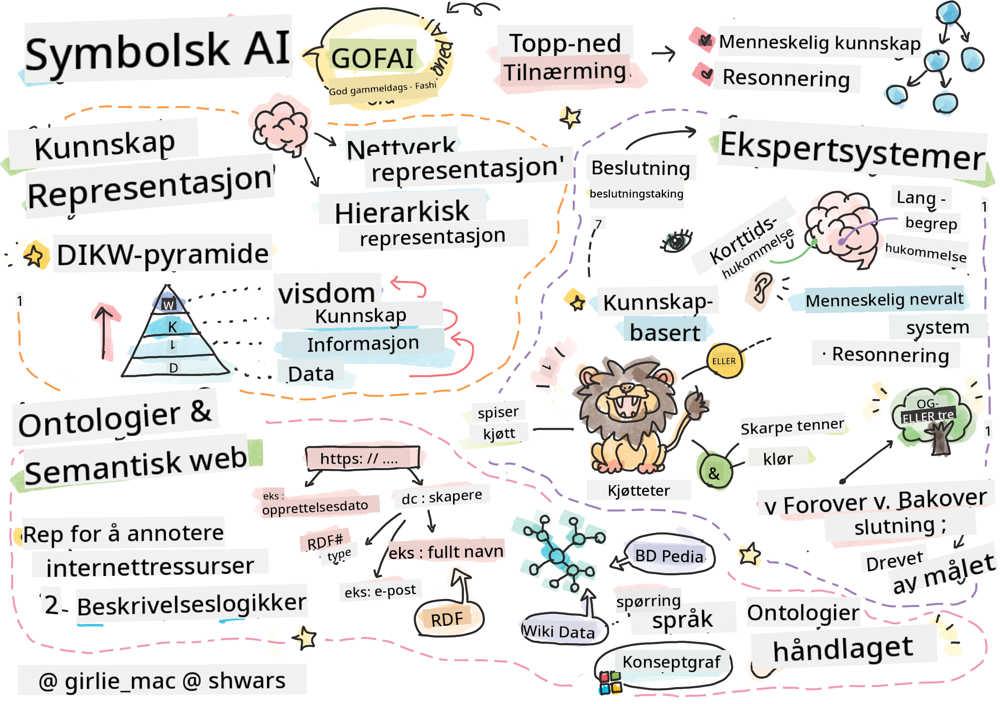
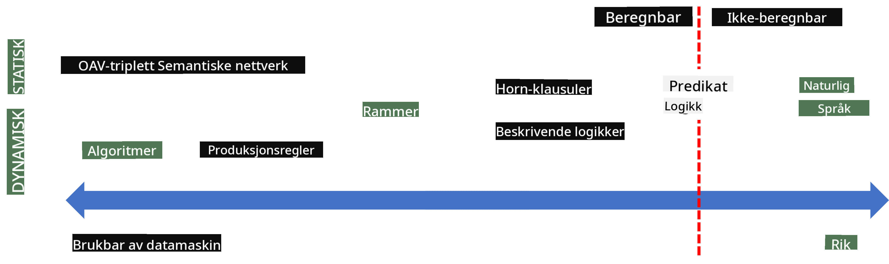
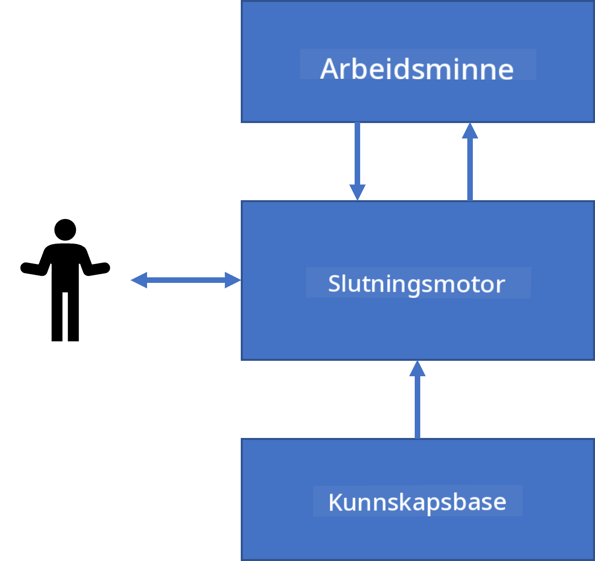

<!--
CO_OP_TRANSLATOR_METADATA:
{
  "original_hash": "7d097f7fda9166ead615e4c34552381b",
  "translation_date": "2025-09-23T09:42:21+00:00",
  "source_file": "lessons/2-Symbolic/README.md",
  "language_code": "no"
}
-->
# Kunnskapsrepresentasjon og ekspertsystemer



> Sketchnote av [Tomomi Imura](https://twitter.com/girlie_mac)

Jakten på kunstig intelligens handler om å søke kunnskap for å forstå verden på en måte som ligner på hvordan mennesker gjør det. Men hvordan kan man oppnå dette?

## [Quiz før forelesning](https://ff-quizzes.netlify.app/en/ai/quiz/3)

I AI-forskningens tidlige dager var den top-down tilnærmingen til å skape intelligente systemer (diskutert i forrige leksjon) populær. Ideen var å trekke ut kunnskap fra mennesker i en maskinlesbar form og deretter bruke den til å løse problemer automatisk. Denne tilnærmingen var basert på to store ideer:

* Kunnskapsrepresentasjon
* Resonnering

## Kunnskapsrepresentasjon

Et av de viktige konseptene i Symbolic AI er **kunnskap**. Det er viktig å skille kunnskap fra *informasjon* eller *data*. For eksempel kan man si at bøker inneholder kunnskap, fordi man kan studere bøker og bli ekspert. Men det bøker faktisk inneholder, kalles *data*, og ved å lese bøker og integrere denne dataen i vår verdensmodell, konverterer vi data til kunnskap.

> ✅ **Kunnskap** er noe som finnes i hodet vårt og representerer vår forståelse av verden. Den oppnås gjennom en aktiv **læringsprosess**, som integrerer informasjonsbiter vi mottar inn i vår aktive modell av verden.

Ofte definerer vi ikke kunnskap strengt, men vi knytter det til andre relaterte konsepter ved hjelp av [DIKW-pyramiden](https://en.wikipedia.org/wiki/DIKW_pyramid). Den inneholder følgende konsepter:

* **Data** er noe som er representert på fysisk media, som skrevet tekst eller talte ord. Data eksisterer uavhengig av mennesker og kan overføres mellom personer.
* **Informasjon** er hvordan vi tolker data i hodet vårt. For eksempel, når vi hører ordet *datamaskin*, har vi en viss forståelse av hva det er.
* **Kunnskap** er informasjon som er integrert i vår verdensmodell. For eksempel, når vi lærer hva en datamaskin er, begynner vi å få ideer om hvordan den fungerer, hva den koster, og hva den kan brukes til. Dette nettverket av sammenhengende konsepter utgjør vår kunnskap.
* **Visdom** er enda et nivå av vår forståelse av verden, og det representerer *meta-kunnskap*, f.eks. en forståelse av hvordan og når kunnskapen bør brukes.


*Bilde [fra Wikipedia](https://commons.wikimedia.org/w/index.php?curid=37705247), av Longlivetheux - Eget arbeid, CC BY-SA 4.0*

Dermed er problemet med **kunnskapsrepresentasjon** å finne en effektiv måte å representere kunnskap inne i en datamaskin i form av data, slik at den kan brukes automatisk. Dette kan sees som et spektrum:



> Bilde av [Dmitry Soshnikov](http://soshnikov.com)

* Til venstre finner vi svært enkle typer kunnskapsrepresentasjoner som kan brukes effektivt av datamaskiner. Den enkleste er algoritmisk, der kunnskap er representert av et dataprogram. Dette er imidlertid ikke den beste måten å representere kunnskap på, fordi det ikke er fleksibelt. Kunnskap i hodet vårt er ofte ikke-algoritmisk.
* Til høyre finner vi representasjoner som naturlig tekst. Dette er den mest kraftfulle formen, men den kan ikke brukes til automatisk resonnering.

> ✅ Tenk et øyeblikk på hvordan du representerer kunnskap i hodet ditt og konverterer det til notater. Finnes det et spesielt format som fungerer godt for deg for å hjelpe med å huske?

## Klassifisering av datamaskinens kunnskapsrepresentasjoner

Vi kan klassifisere ulike metoder for kunnskapsrepresentasjon i datamaskiner i følgende kategorier:

* **Nettverksrepresentasjoner** er basert på det faktum at vi har et nettverk av sammenhengende konsepter i hodet vårt. Vi kan prøve å gjenskape de samme nettverkene som en graf i en datamaskin - et såkalt **semantisk nettverk**.

1. **Objekt-Attributt-Verdi tripletter** eller **attributt-verdi par**. Siden en graf kan representeres i en datamaskin som en liste over noder og kanter, kan vi representere et semantisk nettverk som en liste over tripletter som inneholder objekter, attributter og verdier. For eksempel kan vi bygge følgende tripletter om programmeringsspråk:

Objekt | Attributt | Verdi
-------|-----------|------
Python | er | Utypet-språk
Python | oppfunnet-av | Guido van Rossum
Python | blokk-syntaks | innrykk
Utypet-språk | har ikke | typedefinisjoner

> ✅ Tenk på hvordan tripletter kan brukes til å representere andre typer kunnskap.

2. **Hierarkiske representasjoner** understreker det faktum at vi ofte lager en hierarki av objekter i hodet vårt. For eksempel vet vi at kanarifugl er en fugl, og alle fugler har vinger. Vi har også en idé om hvilken farge en kanarifugl vanligvis har, og hva flyhastigheten deres er.

   - **Rammerepresentasjon** er basert på å representere hvert objekt eller klasse av objekter som en **ramme** som inneholder **slisser**. Slisser har mulige standardverdier, verdibegrensninger eller lagrede prosedyrer som kan kalles for å hente verdien av en slisse. Alle rammer danner et hierarki som ligner på et objekthierarki i objektorienterte programmeringsspråk.
   - **Scenarier** er spesielle typer rammer som representerer komplekse situasjoner som kan utfolde seg over tid.

**Python**

Slisse | Verdi | Standardverdi | Intervall |
-------|-------|---------------|----------|
Navn | Python | | |
Er-A | Utypet-språk | | |
Variabel Case | | CamelCase | |
Programlengde | | | 5-5000 linjer |
Blokk-syntaks | Innrykk | | |

3. **Prosedyrerepresentasjoner** er basert på å representere kunnskap som en liste over handlinger som kan utføres når en viss betingelse oppstår.
   - Produksjonsregler er hvis-da-utsagn som lar oss trekke konklusjoner. For eksempel kan en lege ha en regel som sier at **HVIS** en pasient har høy feber **ELLER** høyt nivå av C-reaktivt protein i blodprøven **DA** har han en betennelse. Når vi møter en av betingelsene, kan vi trekke en konklusjon om betennelse og deretter bruke den i videre resonnering.
   - Algoritmer kan betraktes som en annen form for prosedyrerepresentasjon, selv om de nesten aldri brukes direkte i kunnskapsbaserte systemer.

4. **Logikk** ble opprinnelig foreslått av Aristoteles som en måte å representere universell menneskelig kunnskap på.
   - Predikatlogikk som en matematisk teori er for rik til å være beregningsbar, derfor brukes vanligvis en delmengde av den, som Horn-klausuler brukt i Prolog.
   - Beskrivende logikk er en familie av logiske systemer som brukes til å representere og resonnere om hierarkier av objekter i distribuerte kunnskapsrepresentasjoner som *semantisk web*.

## Ekspertsystemer

En av de tidlige suksessene til symbolsk AI var de såkalte **ekspertsystemene** - datasystemer som var designet for å fungere som en ekspert innenfor et begrenset problemområde. De var basert på en **kunnskapsbase** hentet fra en eller flere menneskelige eksperter, og de inneholdt en **slutningsmotor** som utførte resonnering basert på denne kunnskapen.

 | 
---------------------------------------------|------------------------------------------------
Forenklet struktur av et menneskelig nervesystem | Arkitektur av et kunnskapsbasert system

Ekspertsystemer er bygget som det menneskelige resonnanssystemet, som inneholder **korttidsminne** og **langtidsminne**. Tilsvarende skiller vi i kunnskapsbaserte systemer mellom følgende komponenter:

* **Probleminnhold**: inneholder kunnskapen om problemet som for øyeblikket løses, f.eks. temperaturen eller blodtrykket til en pasient, om han har betennelse eller ikke, osv. Denne kunnskapen kalles også **statisk kunnskap**, fordi den inneholder et øyeblikksbilde av hva vi for øyeblikket vet om problemet - den såkalte *problemtilstanden*.
* **Kunnskapsbase**: representerer langtidskunnskap om et problemområde. Den hentes manuelt fra menneskelige eksperter og endres ikke fra konsultasjon til konsultasjon. Fordi den lar oss navigere fra én problemtilstand til en annen, kalles den også **dynamisk kunnskap**.
* **Slutningsmotor**: organiserer hele prosessen med å søke i problemtilstandsrommet, stille spørsmål til brukeren når det er nødvendig. Den er også ansvarlig for å finne de riktige reglene som skal brukes i hver tilstand.

Som et eksempel, la oss se på følgende ekspertsystem for å bestemme et dyr basert på dets fysiske egenskaper:


> Bilde av [Dmitry Soshnikov](http://soshnikov.com)

Dette diagrammet kalles et **AND-OR-tre**, og det er en grafisk representasjon av et sett med produksjonsregler. Å tegne et tre er nyttig i begynnelsen av å hente kunnskap fra eksperten. For å representere kunnskapen i datamaskinen er det mer praktisk å bruke regler:

```
IF the animal eats meat
OR (animal has sharp teeth
    AND animal has claws
    AND animal has forward-looking eyes
) 
THEN the animal is a carnivore
```

Du kan legge merke til at hver betingelse på venstre side av regelen og handlingen i hovedsak er objekt-attributt-verdi (OAV) tripletter. **Arbeidsminne** inneholder settet med OAV-tripletter som tilsvarer problemet som for øyeblikket løses. En **regelmotor** ser etter regler der en betingelse er oppfylt og anvender dem, og legger til en ny triplet i arbeidsminnet.

> ✅ Lag ditt eget AND-OR-tre om et emne du liker!

### Fremover- vs. bakoverresonnering

Prosessen beskrevet ovenfor kalles **fremoverresonnering**. Den starter med noen innledende data om problemet tilgjengelig i arbeidsminnet, og deretter utfører den følgende resonnanssløyfe:

1. Hvis mål-attributtet er til stede i arbeidsminnet - stopp og gi resultatet
2. Se etter alle regler der betingelsen for øyeblikket er oppfylt - oppnå **konfliktsett** av regler.
3. Utfør **konfliktløsning** - velg én regel som skal utføres i dette trinnet. Det kan være ulike strategier for konfliktløsning:
   - Velg den første anvendelige regelen i kunnskapsbasen
   - Velg en tilfeldig regel
   - Velg en *mer spesifikk* regel, dvs. den som oppfyller flest betingelser på venstre side (LHS)
4. Anvend valgt regel og sett inn ny kunnskap i problemtilstanden
5. Gjenta fra trinn 1.

I noen tilfeller ønsker vi imidlertid å starte med tom kunnskap om problemet og stille spørsmål som hjelper oss å komme frem til en konklusjon. For eksempel, når vi stiller en medisinsk diagnose, utfører vi vanligvis ikke alle medisinske analyser på forhånd før vi begynner å diagnostisere pasienten. Vi ønsker heller å utføre analyser når en beslutning må tas.

Denne prosessen kan modelleres ved hjelp av **bakoverresonnering**. Den drives av **målet** - attributtverdien vi prøver å finne:

1. Velg alle regler som kan gi oss verdien av et mål (dvs. med målet på høyre side (RHS)) - et konfliktsett
1. Hvis det ikke finnes regler for dette attributtet, eller det finnes en regel som sier at vi bør spørre brukeren om verdien - spør om det, ellers:
1. Bruk konfliktløsningsstrategi for å velge én regel som vi vil bruke som *hypotese* - vi vil prøve å bevise den
1. Gjenta prosessen rekursivt for alle attributter på venstre side av regelen, og prøv å bevise dem som mål
1. Hvis prosessen mislykkes på noe tidspunkt - bruk en annen regel i trinn 3.

> ✅ I hvilke situasjoner er fremoverresonnering mer passende? Hva med bakoverresonnering?

### Implementering av ekspertsystemer

Ekspertsystemer kan implementeres ved hjelp av ulike verktøy:

* Programmere dem direkte i et høynivå programmeringsspråk. Dette er ikke den beste ideen, fordi hovedfordelen med et kunnskapsbasert system er at kunnskap er adskilt fra resonnering, og potensielt bør en ekspert på problemområdet kunne skrive regler uten å forstå detaljene i resonneringsprosessen.
* Bruke en **ekspertsystemskall**, dvs. et system spesielt designet for å fylles med kunnskap ved hjelp av et kunnskapsrepresentasjonsspråk.

## ✍️ Øvelse: Dyreslutning

Se [Animals.ipynb](https://github.com/microsoft/AI-For-Beginners/blob/main/lessons/2-Symbolic/Animals.ipynb) for et eksempel på implementering av fremover- og bakoverresonnering i et ekspertsystem.

> **Merk**: Dette eksemplet er ganske enkelt og gir bare en idé om hvordan et ekspertsystem ser ut. Når du begynner å lage et slikt system, vil du bare merke noe *intelligent* oppførsel fra det når du når et visst antall regler, rundt 200+. På et tidspunkt blir reglene for komplekse til å holde alle i hodet, og da kan du begynne å lure på hvorfor systemet tar visse beslutninger. Men en viktig egenskap ved kunnskapsbaserte systemer er at du alltid kan *forklare* nøyaktig hvordan noen av beslutningene ble tatt.

## Ontologier og det semantiske nettet

På slutten av 1900-tallet var det en initiativ for å bruke kunnskapsrepresentasjon til å annotere internettressurser, slik at det ville være mulig å finne ressurser som samsvarer med svært spesifikke forespørsler. Denne bevegelsen ble kalt **Semantisk Web**, og den var basert på flere konsepter:

- En spesiell kunnskapsrepresentasjon basert på **[beskrivende logikk](https://en.wikipedia.org/wiki/Description_logic)** (DL). Den ligner på rammebasert kunnskapsrepresentasjon, fordi den bygger et hierarki av objekter med egenskaper, men den har formell logisk semantikk og resonnering. Det finnes en hel familie av DL-er som balanserer mellom uttrykksevne og algoritmisk kompleksitet i resonnering.
- Distribuert kunnskapsrepresentasjon, der alle konsepter er representert av en global URI-identifikator, noe som gjør det mulig å lage kunnskapshierarkier som spenner over internett.
- En familie av XML-baserte språk for kunnskapsbeskrivelse: RDF (Resource Description Framework), RDFS (RDF Schema), OWL (Ontology Web Language).

Et kjernebegrep i den semantiske webben er begrepet **Ontologi**. Det refererer til en eksplisitt spesifikasjon av et problemområde ved bruk av en formell kunnskapsrepresentasjon. Den enkleste ontologien kan være en hierarki av objekter i et problemområde, men mer komplekse ontologier vil inkludere regler som kan brukes til å trekke slutninger.

I den semantiske webben er alle representasjoner basert på tripletter. Hvert objekt og hver relasjon er unikt identifisert av en URI. For eksempel, hvis vi ønsker å uttrykke at dette AI-lærematerialet ble utviklet av Dmitry Soshnikov den 1. januar 2022, kan vi bruke følgende tripletter:


```
http://github.com/microsoft/ai-for-beginners http://www.example.com/terms/creation-date “Jan 13, 2007”
http://github.com/microsoft/ai-for-beginners http://purl.org/dc/elements/1.1/creator http://soshnikov.com
```

> ✅ Her er `http://www.example.com/terms/creation-date` og `http://purl.org/dc/elements/1.1/creator` noen velkjente og universelt aksepterte URI-er for å uttrykke begrepene *skaper* og *opprettelsesdato*.

I et mer komplekst tilfelle, hvis vi ønsker å definere en liste over skapere, kan vi bruke noen datastrukturer definert i RDF.


> Diagrammene ovenfor av [Dmitry Soshnikov](http://soshnikov.com)

Fremgangen med å bygge den semantiske webben ble på en måte bremset av suksessen til søkemotorer og teknikker for naturlig språkbehandling, som gjør det mulig å trekke ut strukturert data fra tekst. Imidlertid er det fortsatt betydelige innsatsområder for å opprettholde ontologier og kunnskapsbaser. Noen prosjekter verdt å merke seg:

* [WikiData](https://wikidata.org/) er en samling av maskinlesbare kunnskapsbaser knyttet til Wikipedia. Mesteparten av dataene er hentet fra Wikipedia *InfoBoxes*, deler av strukturert innhold inne i Wikipedia-sider. Du kan [spørre](https://query.wikidata.org/) WikiData i SPARQL, et spesielt spørrespråk for den semantiske webben. Her er et eksempel på en forespørsel som viser de mest populære øyefargene blant mennesker:

```sparql
#defaultView:BubbleChart
SELECT ?eyeColorLabel (COUNT(?human) AS ?count)
WHERE
{
  ?human wdt:P31 wd:Q5.       # human instance-of homo sapiens
  ?human wdt:P1340 ?eyeColor. # human eye-color ?eyeColor
  SERVICE wikibase:label { bd:serviceParam wikibase:language "en". }
}
GROUP BY ?eyeColorLabel
```

* [DBpedia](https://www.dbpedia.org/) er et annet initiativ som ligner på WikiData.

> ✅ Hvis du vil eksperimentere med å bygge dine egne ontologier, eller åpne eksisterende, finnes det en flott visuell ontologiredigerer kalt [Protégé](https://protege.stanford.edu/). Last den ned, eller bruk den online.


*Web Protégé-redigerer åpnet med Romanov-familieontologien. Skjermbilde av Dmitry Soshnikov*

## ✍️ Øvelse: En familieontologi

Se [FamilyOntology.ipynb](https://github.com/Ezana135/AI-For-Beginners/blob/main/lessons/2-Symbolic/FamilyOntology.ipynb) for et eksempel på bruk av semantiske webteknikker for å resonnere om familierelasjoner. Vi vil ta et slektstre representert i det vanlige GEDCOM-formatet og en ontologi for familierelasjoner og bygge en graf over alle familierelasjoner for et gitt sett med individer.

## Microsoft Concept Graph

I de fleste tilfeller blir ontologier nøye laget for hånd. Det er imidlertid også mulig å **utvinne** ontologier fra ustrukturert data, for eksempel fra tekster i naturlig språk.

En slik innsats ble gjort av Microsoft Research, og resulterte i [Microsoft Concept Graph](https://blogs.microsoft.com/ai/microsoft-researchers-release-graph-that-helps-machines-conceptualize/?WT.mc_id=academic-77998-cacaste).

Det er en stor samling av enheter gruppert sammen ved bruk av `is-a` arv-relasjoner. Den gjør det mulig å svare på spørsmål som "Hva er Microsoft?" - svaret kan være noe som "et selskap med sannsynlighet 0.87, og et merke med sannsynlighet 0.75".

Grafen er tilgjengelig enten som REST API, eller som en stor nedlastbar tekstfil som lister opp alle enhetspar.

## ✍️ Øvelse: En konseptgraf

Prøv [MSConceptGraph.ipynb](https://github.com/microsoft/AI-For-Beginners/blob/main/lessons/2-Symbolic/MSConceptGraph.ipynb)-notatboken for å se hvordan vi kan bruke Microsoft Concept Graph til å gruppere nyhetsartikler i flere kategorier.

## Konklusjon

I dag blir AI ofte betraktet som et synonym for *Maskinlæring* eller *Nevrale nettverk*. Imidlertid viser et menneske også eksplisitt resonnement, noe som for øyeblikket ikke håndteres av nevrale nettverk. I virkelige prosjekter brukes eksplisitt resonnement fortsatt til å utføre oppgaver som krever forklaringer, eller evnen til å endre systemets oppførsel på en kontrollert måte.

## 🚀 Utfordring

I Family Ontology-notatboken knyttet til denne leksjonen, er det en mulighet til å eksperimentere med andre familierelasjoner. Prøv å oppdage nye forbindelser mellom personer i slektstreet.

## [Quiz etter forelesning](https://ff-quizzes.netlify.app/en/ai/quiz/4)

## Gjennomgang & Selvstudium

Gjør litt research på internett for å oppdage områder der mennesker har forsøkt å kvantifisere og kodifisere kunnskap. Ta en titt på Blooms taksonomi, og gå tilbake i historien for å lære hvordan mennesker har forsøkt å forstå verden. Utforsk arbeidet til Linnaeus for å lage en taksonomi av organismer, og observer hvordan Dmitri Mendeleev skapte en måte for kjemiske elementer å bli beskrevet og gruppert. Hvilke andre interessante eksempler kan du finne?

**Oppgave**: [Bygg en ontologi](assignment.md)

---

