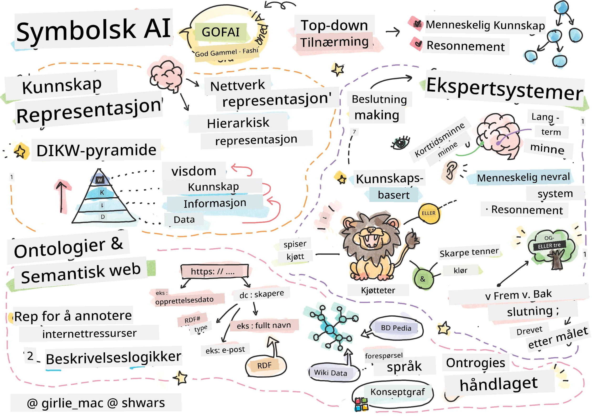
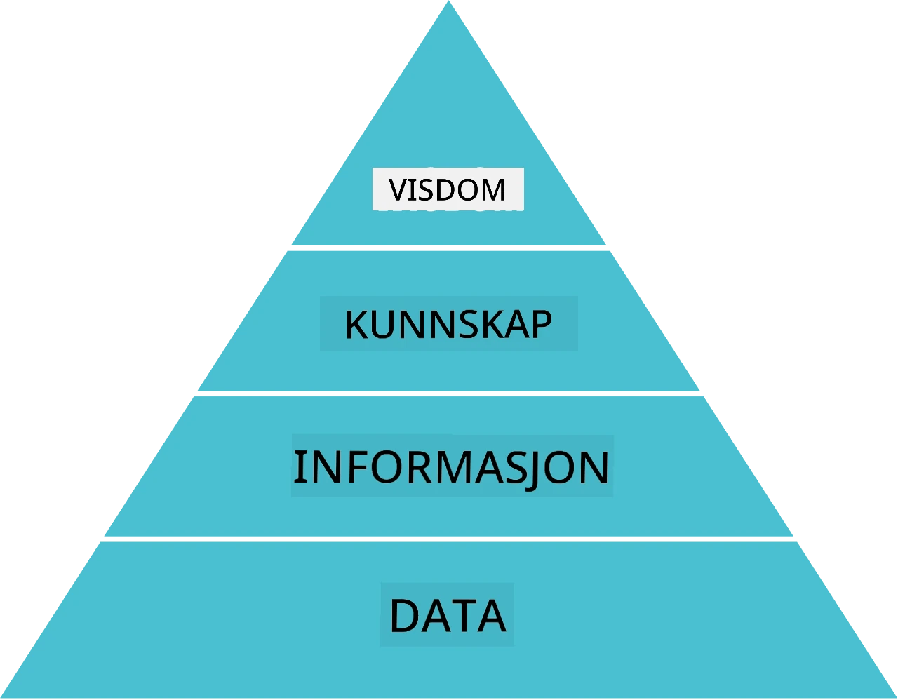
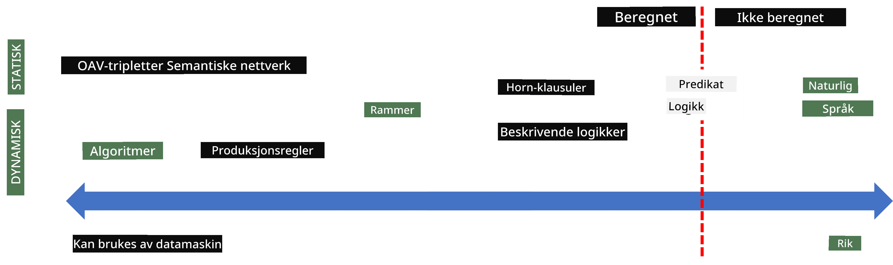
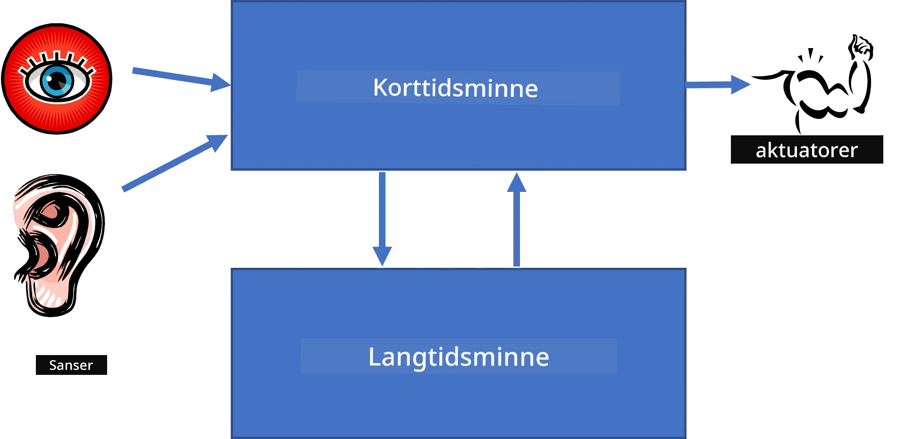
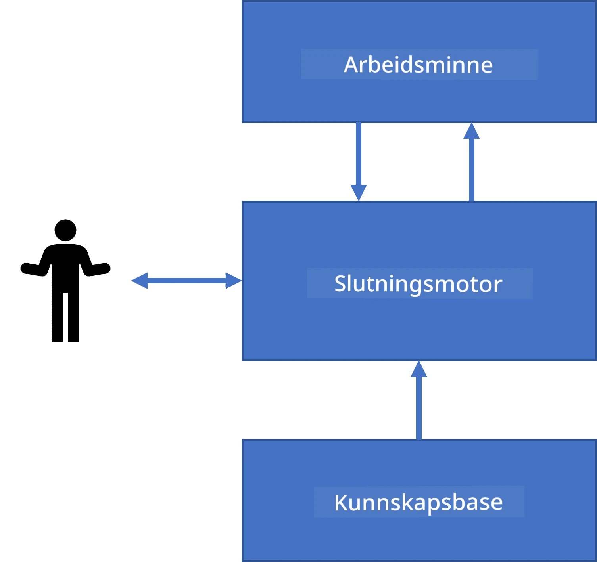
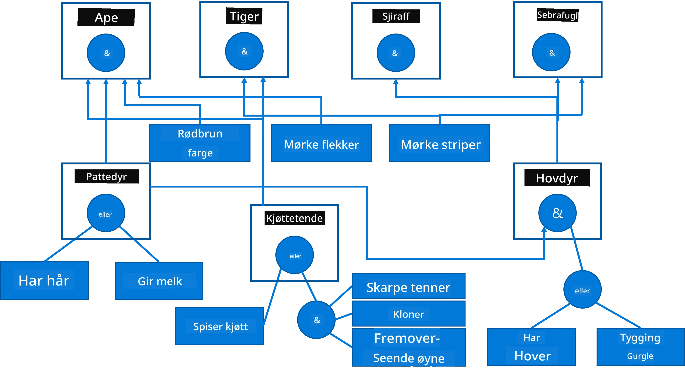
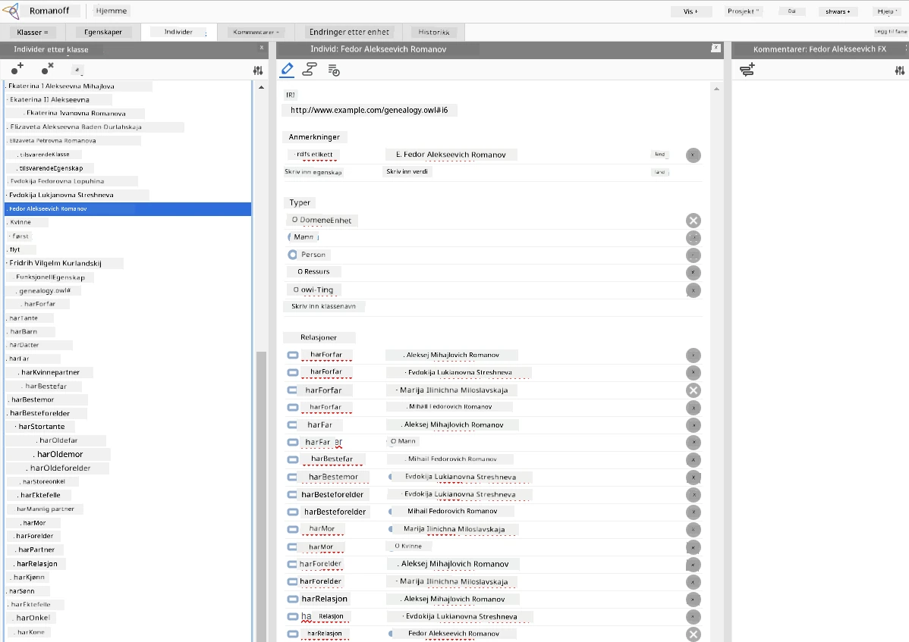

# Kunnskapsrepresentasjon og Ekspertsystemer



> Sketchnote av [Tomomi Imura](https://twitter.com/girlie_mac)

Jakten på kunstig intelligens bygger på et søk etter kunnskap, for å forstå verden på en måte som ligner hvordan mennesker gjør det. Men hvordan kan man gå fram for å gjøre dette?

## [Pre-forelesningsquiz](https://ff-quizzes.netlify.app/en/ai/quiz/3)

I de tidlige dagene av KI var top-down-tilnærmingen til å lage intelligente systemer (diskutert i forrige leksjon) populær. Ideen var å trekke ut kunnskap fra mennesker til en form som maskiner kan lese, og så bruke denne til å automatisk løse problemer. Denne tilnærmingen baserte seg på to store ideer:

* Kunnskapsrepresentasjon
* Resonnering

## Kunnskapsrepresentasjon

Et av de viktige konseptene i symbolsk KI er **kunnskap**. Det er viktig å skille kunnskap fra *informasjon* eller *data*. For eksempel kan man si at bøker inneholder kunnskap, fordi man kan studere bøker og bli ekspert. Men det bøkene faktisk inneholder kalles *data*, og ved å lese bøker og integrere disse dataene i vår verdensmodell konverterer vi data til kunnskap.

> ✅ **Kunnskap** er noe som finnes i hodet vårt og representerer vår forståelse av verden. Det oppnås gjennom en aktiv **lærings**prosess, som integrerer informasjon vi mottar i vår aktive modell av verden.

Ofte definerer vi ikke kunnskap strengt, men vi plasserer den i forhold til andre beslektede konsepter ved hjelp av [DIKW-pyramiden](https://en.wikipedia.org/wiki/DIKW_pyramid). Den inneholder følgende konsepter:

* **Data** er noe som er representert i fysisk medium, som skrevet tekst eller talte ord. Data eksisterer uavhengig av mennesker og kan overføres mellom folk.
* **Informasjon** er hvordan vi tolker data i hodet vårt. For eksempel, når vi hører ordet *datamaskin*, har vi en viss forståelse av hva det er.
* **Kunnskap** er informasjon som integreres i vår verdensmodell. For eksempel, når vi lærer hva en datamaskin er, begynner vi å få ideer om hvordan den fungerer, hvor mye den koster, og hva den kan brukes til. Dette nettverket av sammenhengende konsepter utgjør vår kunnskap.
* **Visdom** er enda et nivå av vår forståelse av verden, og representerer *meta-kunnskap*, f.eks. en oppfatning av hvordan og når kunnskap bør brukes.



*Bilde [fra Wikipedia](https://commons.wikimedia.org/w/index.php?curid=37705247), av Longlivetheux - Eget arbeid, CC BY-SA 4.0*

Dermed er problemet med **kunnskapsrepresentasjon** å finne en effektiv måte å representere kunnskap inne i en datamaskin i form av data, slik at den kan brukes automatisk. Dette kan sees som et spektrum:



> Bilde av [Dmitry Soshnikov](http://soshnikov.com)

* Til venstre finnes svært enkle typer kunnskapsrepresentasjoner som effektivt kan brukes av datamaskiner. Den enkleste er algoritmisk, hvor kunnskapen representeres av et dataprogram. Dette er imidlertid ikke den beste måten å representere kunnskap på, fordi det ikke er fleksibelt. Kunnskap i hodet vårt er ofte ikke-algoritmisk.
* Til høyre finnes representasjoner som naturlig tekst. Det er den mest kraftfulle, men kan ikke brukes til automatisk resonnement.

> ✅ Tenk et øyeblikk over hvordan du representerer kunnskap i hodet ditt og konverterer det til notater. Er det et spesielt format som fungerer godt for deg i forhold til å huske?

## Klassifisering av datamaskinens kunnskapsrepresentasjoner

Vi kan klassifisere forskjellige metoder for kunnskapsrepresentasjon i datamaskiner i følgende kategorier:

* **Nettverksrepresentasjoner** baseres på at vi har et nettverk av relaterte konsepter i hodet. Vi kan forsøke å gjenskape de samme nettverkene som en graf inne i datamaskinen – et såkalt **semantisk nettverk**.

1. **Objekt-Attributt-Verdi-tripletter** eller **attributt-verdi-par**. Siden en graf kan representeres i en datamaskin som en liste over noder og kanter, kan vi representere et semantisk nettverk som en liste over tripletter som inneholder objekter, attributter og verdier. For eksempel kan vi lage følgende tripletter om programmeringsspråk:

Objekt | Attributt | Verdi
-------|-----------|------
Python | er | Utypet-språk
Python | oppfunnet-av | Guido van Rossum
Python | blokk-syntaks | innrykk
Utypet-språk | har-ikke | typedefinisjoner

> ✅ Tenk på hvordan tripletter kan brukes til å representere andre typer kunnskap.

2. **Hierarkiske representasjoner** understreker at vi ofte skaper et hierarki av objekter i hodet vårt. For eksempel vet vi at kanarifugl er en fugl, og alle fugler har vinger. Vi har også en idé om hvilken farge en kanarifugl vanligvis har, og hva flygehastigheten deres er.

   - **Ramme-representasjon** baserer seg på å representere hvert objekt eller klasse av objekter som en **ramme** som inneholder **felt**. Feltene kan ha mulige standardverdier, verdi-restriksjoner, eller lagrede prosedyrer som kan kalles for å hente verdien av et felt. Alle rammene danner et hierarki lik et objekthierarki i objektorienterte programmeringsspråk.
   - **Scenarier** er en spesiell type rammer som representerer komplekse situasjoner som kan utfolde seg over tid.

**Python**

Felt | Verdi | Standardverdi | Intervall |
-----|-------|---------------|----------|
Navn | Python | | |
Er-En | Utypet-språk | | |
Variabelskriving | | CamelCase | |
Programlengde | | | 5-5000 linjer |
Blokk-syntaks | Innrykk | | |

3. **Prosedyremessige representasjoner** bygger på å representere kunnskap som en liste over handlinger som kan utføres når en viss betingelse inntreffer.
   - Produksjonsregler er hvis-da-setninger som lar oss trekke konklusjoner. For eksempel kan en lege ha en regel som sier at **HVIS** en pasient har høy feber **ELLER** høyt nivå av C-reaktivt protein i blodprøve **SÅ** har han en inflamasjon. Når vi møter en av betingelsene, kan vi trekke en konklusjon om betennelse og bruke dette i videre resonnement.
   - Algoritmer kan betraktes som en annen form for prosedyremessig representasjon, selv om de nesten aldri brukes direkte i kunnskapsbaserte systemer.

4. **Logikk** ble opprinnelig foreslått av Aristoteles som en måte å representere allmenn menneskelig kunnskap på.
   - Predikatlogikk som en matematisk teori er for rik til å være beregnbar, derfor brukes vanligvis et delsett, som Horn-klausuler brukt i Prolog.
   - Beskrivende logikk er en familie av logiske systemer brukt til å representere og resonnere om hierarkier av objekter i distribuerte kunnskapsrepresentasjoner som *semantisk web*.

## Ekspertsystemer

En av de tidlige suksessene innen symbolsk KI var såkalte **ekspertsystemer** – datasystemer som var designet for å opptre som eksperter i et begrenset problemområde. De baserte seg på en **kunnskapsbase** hentet fra en eller flere menneskelige eksperter, og de inneholdt en **begrunnelsesmotor** som utførte resonnering på toppen av dette.

 | 
---------------------------------------------|------------------------------------------------
Forenklet struktur av menneskelig nervesystem | Arkitektur for et kunnskapsbasert system

Ekspertsystemer er bygd som det menneskelige resonnementssystemet, som inneholder **korttidshukommelse** og **langtidshukommelse**. På samme måte skiller vi i kunnskapsbaserte systemer mellom følgende komponenter:

* **Problemhukommelse**: inneholder kunnskapen om problemet som løses for øyeblikket, f.eks. temperaturen eller blodtrykket til en pasient, om han har betennelse eller ikke, osv. Denne kunnskapen kalles også **statisk kunnskap**, fordi den inneholder et øyeblikksbilde av hva vi for øyeblikket vet om problemet – den såkalte *problemtilstanden*.
* **Kunnskapsbase**: representerer langtidshukommelsen om et problemområde. Den trekkes ut manuelt fra menneskelige eksperter, og endres ikke fra konsultasjon til konsultasjon. Fordi den lar oss navigere fra ett problemtilstand til et annet, kalles den også **dynamisk kunnskap**.
* **Begrunnelsesmotor**: orkestrerer hele prosessen med å søke i problemtilstandsrommet, stiller spørsmål til brukeren når det trengs. Den er også ansvarlig for å finne rette regler som skal anvendes i hver tilstand.

Som eksempel kan vi se på følgende ekspertsystem for å bestemme et dyr basert på dets fysiske egenskaper:



> Bilde av [Dmitry Soshnikov](http://soshnikov.com)

Dette diagrammet kalles et **AND-OR-tre**, og det er en grafisk representasjon av et sett produksjonsregler. Å tegne et tre er nyttig i begynnelsen av kunnskapsekstraksjon fra eksperten. For å representere kunnskapen i datamaskinen er det mer praktisk å bruke regler:

```
IF the animal eats meat
OR (animal has sharp teeth
    AND animal has claws
    AND animal has forward-looking eyes
) 
THEN the animal is a carnivore
```

Du kan legge merke til at hver betingelse på venstre side og handlingen i regelen egentlig er objekt-attribute-verdi (OAV) tripletter. **Arbeidshukommelsen** inneholder settet av OAV-tripletter som tilsvarer det problemet som løses for øyeblikket. En **regelmotor** søker etter regler hvor en betingelse er oppfylt og anvender dem, legger til en ny triplet i arbeidshukommelsen.

> ✅ Skriv ditt eget AND-OR-tre om et emne du liker!

### Fremover- vs. Bakoverresonnering

Prosessen beskrevet ovenfor kalles **fremoverresonnering**. Den starter med noen innledende data om problemet som finnes i arbeidshukommelsen, og utfører deretter følgende resonnementsløkke:

1. Hvis målattributtet finnes i arbeidshukommelsen – stopp og gi resultat
2. Se etter alle regler hvor betingelsen er oppfylt nå – opprett **konfliktsett** av regler.
3. Utfør **konfliktløsning** – velg én regel som skal kjøres i dette steget. Det kan være forskjellige strategier for konfliktløsning:
   - Velg den første anvendelige regelen i kunnskapsbasen
   - Velg en tilfeldig regel
   - Velg en *mer spesifikk* regel, dvs. den som møter flest betingelser på venstresiden (LHS)
4. Utfør valgt regel og sett inn ny kunnskap i problemtilstanden
5. Gjenta fra steg 1.

I noen tilfeller ønsker vi imidlertid å starte med tom kunnskap om problemet, og stille spørsmål som hjelper oss å komme fram til konklusjonen. For eksempel ved medisinsk diagnostikk utfører man vanligvis ikke alle medisinske analyser på forhånd før man begynner å diagnostisere pasienten. Vi ønsker heller å utføre analyser når en beslutning må tas.

Denne prosessen kan modelleres med **bakoverresonnering**. Den styres av **målet** – attributtverdien vi prøver å finne:

1. Velg alle regler som kan gi oss verdien til et mål (dvs. med målet på høyresiden (RHS)) – konfliktsett
1. Hvis det ikke finnes regler for dette attributtet, eller det finnes en regel som sier at vi skal spørre brukeren om verdien – spør om den, ellers:
1. Bruk konfliktløsningsstrategi for å velge en regel som vi bruker som *hypotese* – vi prøver å bevise den
1. Gjenta prosessen rekursivt for alle attributter på LHS av regelen, prøv å bevise dem som mål
1. Hvis prosessen feiler når som helst – bruk en annen regel på steg 3.

> ✅ I hvilke situasjoner er fremoverresonnering mer hensiktsmessig? Hva med bakoverresonnering?

### Implementering av Ekspertsystemer

Ekspertsystemer kan implementeres med ulike verktøy:

* Programmering direkte i et høynivå programmeringsspråk. Dette er ikke den beste ideen, fordi hovedfordelen med et kunnskapsbasert system er at kunnskapen er separert fra resonnementet, og potensielt bør en ekspert innen problemdomenet kunne skrive regler uten å forstå detaljene i resonnementprosessen.
* Bruke en **ekspertsystem-skall**, dvs. et system spesielt designet for å fylles med kunnskap ved bruk av et kunnskapsrepresentasjonsspråk.

## ✍️ Øvelse: Dyreresonnering

Se [Animals.ipynb](https://github.com/microsoft/AI-For-Beginners/blob/main/lessons/2-Symbolic/Animals.ipynb) for et eksempel på implementering av fremover- og bakoverresonnerende ekspertsystem.

> **Merk**: Dette eksempelet er ganske enkelt, og gir bare en idé om hvordan et ekspertsystem ser ut. Når du starter å lage slike systemer, merker du først *intelligent* oppførsel når antall regler når et visst nivå, rundt 200+. På et tidspunkt blir regler for komplekse til å holde oversikt over alle i hodet, og da kan du begynne å lure på hvorfor systemet tar visse beslutninger. Den viktige egenskapen ved kunnskapsbaserte systemer er at du alltid kan *forklare* akkurat hvordan enhver beslutning ble tatt.

## Ontologier og Semantisk Web

På slutten av 1900-tallet var det et initiativ for å bruke kunnskapsrepresentasjon for å annotere internettressurser, slik at det ble mulig å finne ressurser som svarer til svært spesifikke spørsmål. Dette initiativet ble kalt **Semantisk Web**, og det bygde på flere konsepter:

- En spesiell kunnskapsrepresentasjon basert på **[beskrivende logikker](https://en.wikipedia.org/wiki/Description_logic)** (DL). Den ligner på rammebasert kunnskapsrepresentasjon, fordi den bygger et hierarki av objekter med egenskaper, men har formell logisk semantikk og resonnement. Det finnes en hel familie av DL-er som balanserer mellom uttrykksevne og algoritmisk kompleksitet ved resonnement.
- Distribuert kunnskapsrepresentasjon, der alle konsepter representeres av en global URI-identifikator, som gjør det mulig å skape kunnskapshierarkier som spenner over internett.
- En familie av XML-baserte språk for kunnskapsbeskrivelse: RDF (Resource Description Framework), RDFS (RDF Schema), OWL (Ontology Web Language).

Et kjernebegrep i det semantiske nett er et begrep om **ontologi**. Det refererer til en eksplisitt spesifikasjon av et problemområde ved bruk av en formell kunnskapsrepresentasjon. Den enkleste ontologien kan bare være en hierarki av objekter i et problemområde, men mer komplekse ontologier inkluderer regler som kan brukes til slutning.

I det semantiske nettet er alle representasjoner basert på tripletter. Hvert objekt og hver relasjon identifiseres entydig med URI. For eksempel, hvis vi ønsker å angi fakta at dette AI-læreplanen har blitt utviklet av Dmitry Soshnikov 1. januar 2022 – her er triplettene vi kan bruke:


```
http://github.com/microsoft/ai-for-beginners http://www.example.com/terms/creation-date “Jan 1, 2022”
http://github.com/microsoft/ai-for-beginners http://purl.org/dc/elements/1.1/creator http://soshnikov.com
```

> ✅ Her `http://www.example.com/terms/creation-date` og `http://purl.org/dc/elements/1.1/creator` er noen kjente og universelt aksepterte URI-er for å uttrykke begrepene *skaper* og *opprettelsesdato*.

I et mer komplekst tilfelle, hvis vi ønsker å definere en liste over skapere, kan vi bruke noen datastrukturer definert i RDF.


> Diagrammene over av [Dmitry Soshnikov](http://soshnikov.com)

Fremgangen med å bygge det semantiske nettet ble på en måte bremset av suksessen til søkemotorer og naturlige språkprosesseringsteknikker, som tillater utvinning av strukturert data fra tekst. Imidlertid er det fortsatt betydelige innsatsområder for å opprettholde ontologier og kunnskapsbaser. Noen få prosjekter verdt å nevne:

* [WikiData](https://wikidata.org/) er en samling av maskinlesbare kunnskapsbaser tilknyttet Wikipedia. Mesteparten av dataene blir hentet fra Wikipedia *InfoBoxes*, biter av strukturert innhold inne i Wikipedia-sider. Du kan [spørrer](https://query.wikidata.org/) wikidata i SPARQL, et spesielt spørringsspråk for det semantiske nettet. Her er et eksempel på en spørring som viser de mest populære øyenfargene blant mennesker:

```sparql
#defaultView:BubbleChart
SELECT ?eyeColorLabel (COUNT(?human) AS ?count)
WHERE
{
  ?human wdt:P31 wd:Q5.       # human instance-of homo sapiens
  ?human wdt:P1340 ?eyeColor. # human eye-color ?eyeColor
  SERVICE wikibase:label { bd:serviceParam wikibase:language "en". }
}
GROUP BY ?eyeColorLabel
```

* [DBpedia](https://www.dbpedia.org/) er en annen innsats lik WikiData.

> ✅ Hvis du ønsker å eksperimentere med å bygge dine egne ontologier, eller åpne eksisterende, finnes det en flott visuell ontologiredigerer kalt [Protégé](https://protege.stanford.edu/). Last det ned, eller bruk det på nett.



*Web Protégé-redigering åpnet med Romanov-familiens ontologi. Skjermbilde av Dmitry Soshnikov*

## ✍️ Øvelse: En familieontologi

Se [FamilyOntology.ipynb](https://github.com/Ezana135/AI-For-Beginners/blob/main/lessons/2-Symbolic/FamilyOntology.ipynb) for et eksempel på bruk av teknikker fra det semantiske nettet for å slutte om familierelasjoner. Vi tar et familietre representert i vanlig GEDCOM-format og en ontologi av familierelasjoner, og bygger en graf av alle familierelasjoner for en gitt gruppe individer.

## Microsoft Concept Graph

I de fleste tilfeller blir ontologier nøye laget for hånd. Det er imidlertid også mulig å **utvinne** ontologier fra ustrukturerte data, for eksempel fra naturlige språktekster.

Et slikt forsøk ble gjort av Microsoft Research, og resulterte i [Microsoft Concept Graph](https://blogs.microsoft.com/ai/microsoft-researchers-release-graph-that-helps-machines-conceptualize/?WT.mc_id=academic-77998-cacaste).

Det er en stor samling entiteter gruppert sammen ved hjelp av `is-a` arverelasjon. Det muliggjør svar på spørsmål som "Hva er Microsoft?" - svaret kan være noe slikt som "et selskap med sannsynlighet 0,87, og et merke med sannsynlighet 0,75".

Grafen er tilgjengelig enten som REST API, eller som en stor nedlastbar tekstfil som lister alle entitetsparet.

## ✍️ Øvelse: Et konseptkart

Prøv [MSConceptGraph.ipynb](https://github.com/microsoft/AI-For-Beginners/blob/main/lessons/2-Symbolic/MSConceptGraph.ipynb) notatboken for å se hvordan vi kan bruke Microsoft Concept Graph til å gruppere nyhetsartikler i flere kategorier.

## Konklusjon

I dag blir AI ofte ansett som synonymt med *maskinlæring* eller *nevrale nettverk*. Imidlertid utviser også et menneske eksplisitt resonnement, noe som for øyeblikket ikke håndteres av nevrale nettverk. I virkelige prosjekter brukes eksplisitt resonnement fortsatt for å utføre oppgaver som krever forklaringer, eller å kunne modifisere oppførselen til systemet på en kontrollert måte.

## 🚀 Utfordring

I Familieontologi-notatboken tilknyttet denne leksjonen, finnes det mulighet til å eksperimentere med andre familierelasjoner. Prøv å oppdage nye forbindelser mellom mennesker i familietreet.

## [Quiz etter forelesningen](https://ff-quizzes.netlify.app/en/ai/quiz/4)

## Gjennomgang & Selvstudium

Gjør noen undersøkelser på internett for å oppdage områder hvor mennesker har forsøkt å kvantifisere og kodifisere kunnskap. Ta en titt på Blooms taksonomi, og gå tilbake i historien for å lære hvordan mennesker prøvde å forstå verden de levde i. Utforsk arbeidet til Linnaeus for å lage en taksonomi av organismer, og observer måten Dmitri Mendeleev skapte en metode for at kjemiske elementer skulle kunne beskrives og grupperes. Hvilke andre interessante eksempler kan du finne?

**Oppgave**: [Bygg en ontologi](assignment.md)

---

<!-- CO-OP TRANSLATOR DISCLAIMER START -->
**Ansvarsfraskrivelse**:
Dette dokumentet er oversatt ved hjelp av AI-oversettelsestjenesten [Co-op Translator](https://github.com/Azure/co-op-translator). Selv om vi streber etter nøyaktighet, vennligst vær oppmerksom på at automatiske oversettelser kan inneholde feil eller unøyaktigheter. Det originale dokumentet på det opprinnelige språket skal betraktes som den autoritative kilden. For kritisk informasjon anbefales profesjonell menneskelig oversettelse. Vi er ikke ansvarlige for eventuelle misforståelser eller feiltolkninger som følge av bruk av denne oversettelsen.
<!-- CO-OP TRANSLATOR DISCLAIMER END -->