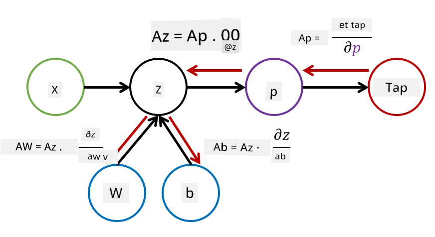

# Introduksjon til nevrale nettverk. Multi-lags perceptron

I forrige seksjon lærte du om den enkleste modellen for nevrale nettverk – en én-lags perceptron, en lineær to-klasse klassifiseringsmodell.

I denne seksjonen vil vi utvide denne modellen til et mer fleksibelt rammeverk som lar oss:

* utføre **multi-klasse klassifisering** i tillegg til to-klasse
* løse **regresjonsproblemer** i tillegg til klassifisering
* skille klasser som ikke er lineært separerbare

Vi vil også utvikle vårt eget modulære rammeverk i Python som lar oss konstruere ulike arkitekturer for nevrale nettverk.

## [Pre-forelesningsquiz](https://ff-quizzes.netlify.app/en/ai/quiz/7)

## Formalisering av maskinlæring

La oss starte med å formalisere problemet med maskinlæring. Anta at vi har et treningsdatasett **X** med etiketter **Y**, og vi må bygge en modell *f* som gir de mest nøyaktige prediksjonene. Kvaliteten på prediksjonene måles med **tapfunksjonen** &lagran;. Følgende tapfunksjoner brukes ofte:

* For regresjonsproblemer, når vi trenger å forutsi et tall, kan vi bruke **absolutt feil** &sum;i|f(x(i))-y(i)|, eller **kvadratisk feil** &sum;i(f(x(i))-y(i))2
* For klassifisering bruker vi **0-1 tap** (som i hovedsak er det samme som **modellens nøyaktighet**), eller **logistisk tap**.

For én-lags perceptron ble funksjonen *f* definert som en lineær funksjon *f(x)=wx+b* (her er *w* vektmatrisen, *x* er vektoren av input-funksjoner, og *b* er bias-vektoren). For ulike arkitekturer for nevrale nettverk kan denne funksjonen ha en mer kompleks form.

> Når det gjelder klassifisering, er det ofte ønskelig å få sannsynligheter for de tilsvarende klassene som nettverksutgang. For å konvertere vilkårlige tall til sannsynligheter (f.eks. for å normalisere utgangen), bruker vi ofte **softmax**-funksjonen &sigma;, og funksjonen *f* blir *f(x)=&sigma;(wx+b)*

I definisjonen av *f* ovenfor kalles *w* og *b* **parametere** &theta;=⟨*w,b*⟩. Gitt datasettet ⟨**X**,**Y**⟩, kan vi beregne en samlet feil for hele datasettet som en funksjon av parametere &theta;.

> ✅ **Målet med trening av nevrale nettverk er å minimere feilen ved å variere parametere &theta;**

## Gradientnedstigningsoptimalisering

Det finnes en velkjent metode for funksjonsoptimalisering kalt **gradientnedstigning**. Ideen er at vi kan beregne en derivert (i flerdimensjonale tilfeller kalt **gradient**) av tapfunksjonen med hensyn til parametere, og variere parametere slik at feilen reduseres. Dette kan formaliseres som følger:

* Initialiser parametere med noen tilfeldige verdier w(0), b(0)
* Gjenta følgende steg mange ganger:
    - w(i+1) = w(i)-&eta;&part;&lagran;/&part;w
    - b(i+1) = b(i)-&eta;&part;&lagran;/&part;b

Under trening skal optimaliseringsstegene beregnes med hensyn til hele datasettet (husk at tap beregnes som en sum gjennom alle treningsprøver). Men i praksis tar vi små deler av datasettet kalt **minibatcher**, og beregner gradienter basert på en delmengde av data. Fordi delmengden tas tilfeldig hver gang, kalles en slik metode **stokastisk gradientnedstigning** (SGD).

## Multi-lags perceptron og backpropagation

Én-lags nettverk, som vi har sett ovenfor, er i stand til å klassifisere lineært separerbare klasser. For å bygge en rikere modell kan vi kombinere flere lag i nettverket. Matematisk vil det bety at funksjonen *f* vil ha en mer kompleks form og beregnes i flere steg:
* z1=w1x+b1
* z2=w2&alpha;(z1)+b2
* f = &sigma;(z2)

Her er &alpha; en **ikke-lineær aktiveringsfunksjon**, &sigma; er en softmax-funksjon, og parametere &theta;=<*w1,b1,w2,b2*>.

Gradientnedstigningsalgoritmen vil forbli den samme, men det vil være mer utfordrende å beregne gradienter. Gitt kjederegelen for derivasjon, kan vi beregne derivertene som:

* &part;&lagran;/&part;w2 = (&part;&lagran;/&part;&sigma;)(&part;&sigma;/&part;z2)(&part;z2/&part;w2)
* &part;&lagran;/&part;w1 = (&part;&lagran;/&part;&sigma;)(&part;&sigma;/&part;z2)(&part;z2/&part;&alpha;)(&part;&alpha;/&part;z1)(&part;z1/&part;w1)

> ✅ Kjederegelen for derivasjon brukes til å beregne derivertene av tapfunksjonen med hensyn til parametere.

Merk at den venstre delen av alle disse uttrykkene er den samme, og dermed kan vi effektivt beregne derivertene ved å starte fra tapfunksjonen og gå "bakover" gjennom beregningsgrafen. Dermed kalles metoden for trening av en multi-lags perceptron **backpropagation**, eller 'backprop'.

> TODO: bildehenvisning

> ✅ Vi vil dekke backpropagation i mye mer detalj i vårt notatbokeksempel.  

## Konklusjon

I denne leksjonen har vi bygget vårt eget bibliotek for nevrale nettverk, og vi har brukt det til en enkel todimensjonal klassifiseringsoppgave.

## 🚀 Utfordring

I den medfølgende notatboken vil du implementere ditt eget rammeverk for å bygge og trene multi-lags perceptron. Du vil kunne se i detalj hvordan moderne nevrale nettverk fungerer.

Gå videre til [OwnFramework](OwnFramework.ipynb)-notatboken og arbeid deg gjennom den.

## [Post-forelesningsquiz](https://ff-quizzes.netlify.app/en/ai/quiz/8)

## Gjennomgang og selvstudium

Backpropagation er en vanlig algoritme brukt i AI og ML, verdt å studere [i mer detalj](https://wikipedia.org/wiki/Backpropagation)

## [Oppgave](lab/README.md)

I denne labben blir du bedt om å bruke rammeverket du konstruerte i denne leksjonen til å løse MNIST-håndskrevne sifferklassifisering.

* [Instruksjoner](lab/README.md)
* [Notatbok](lab/MyFW_MNIST.ipynb)

---

