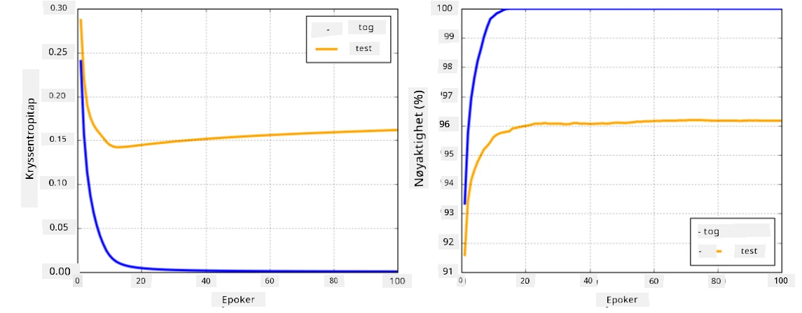

# Rammeverk for nevrale nettverk

Som vi allerede har lært, for å kunne trene nevrale nettverk effektivt må vi gjøre to ting:

* Operere på tensorer, f.eks. multiplisere, legge til og beregne funksjoner som sigmoid eller softmax
* Beregne gradienter av alle uttrykk for å utføre gradientnedstigningsoptimalisering

## [Quiz før forelesning](https://ff-quizzes.netlify.app/en/ai/quiz/9)

Mens `numpy`-biblioteket kan utføre den første delen, trenger vi en mekanisme for å beregne gradienter. I [vårt rammeverk](../04-OwnFramework/OwnFramework.ipynb) som vi utviklet i forrige seksjon, måtte vi manuelt programmere alle deriverte funksjoner i `backward`-metoden, som utfører tilbakepropagering. Ideelt sett bør et rammeverk gi oss muligheten til å beregne gradienter av *ethvert uttrykk* vi kan definere.

En annen viktig ting er å kunne utføre beregninger på GPU, eller andre spesialiserte beregningsenheter, som [TPU](https://en.wikipedia.org/wiki/Tensor_Processing_Unit). Trening av dype nevrale nettverk krever *mange* beregninger, og det er svært viktig å kunne parallellisere disse beregningene på GPU-er.

> ✅ Begrepet 'parallellisere' betyr å fordele beregningene over flere enheter.

For øyeblikket er de to mest populære rammeverkene for nevrale nettverk: [TensorFlow](http://TensorFlow.org) og [PyTorch](https://pytorch.org/). Begge tilbyr et lavnivå-API for å operere med tensorer på både CPU og GPU. I tillegg til lavnivå-API finnes det også høynivå-API, kalt [Keras](https://keras.io/) og [PyTorch Lightning](https://pytorchlightning.ai/) henholdsvis.

Low-Level API | [TensorFlow](http://TensorFlow.org) | [PyTorch](https://pytorch.org/)
--------------|-------------------------------------|--------------------------------
High-level API| [Keras](https://keras.io/) | [PyTorch Lightning](https://pytorchlightning.ai/)

**Lavnivå-API** i begge rammeverk lar deg bygge såkalte **beregningsgrafer**. Denne grafen definerer hvordan man beregner utdata (vanligvis tapsfunksjonen) med gitte inngangsparametere, og kan sendes til beregning på GPU hvis tilgjengelig. Det finnes funksjoner for å differensiere denne beregningsgrafen og beregne gradienter, som deretter kan brukes til å optimalisere modellparametere.

**Høynivå-API** betrakter nevrale nettverk som en **sekvens av lag**, og gjør det mye enklere å konstruere de fleste nevrale nettverk. Å trene modellen krever vanligvis at man forbereder dataene og deretter kaller en `fit`-funksjon for å utføre jobben.

Høynivå-API lar deg konstruere typiske nevrale nettverk veldig raskt uten å bekymre deg for mange detaljer. Samtidig gir lavnivå-API mye mer kontroll over treningsprosessen, og brukes derfor ofte i forskning når man arbeider med nye arkitekturer for nevrale nettverk.

Det er også viktig å forstå at du kan bruke begge API-ene sammen, f.eks. kan du utvikle din egen arkitektur for nettverkslag ved hjelp av lavnivå-API og deretter bruke den i et større nettverk konstruert og trent med høynivå-API. Eller du kan definere et nettverk ved hjelp av høynivå-API som en sekvens av lag, og deretter bruke din egen lavnivå treningssløyfe for å utføre optimalisering. Begge API-ene bruker de samme grunnleggende konseptene og er designet for å fungere godt sammen.

## Læring

I dette kurset tilbyr vi det meste av innholdet både for PyTorch og TensorFlow. Du kan velge ditt foretrukne rammeverk og kun gå gjennom de tilsvarende notatbøkene. Hvis du ikke er sikker på hvilket rammeverk du skal velge, les noen diskusjoner på nettet om **PyTorch vs. TensorFlow**. Du kan også ta en titt på begge rammeverkene for å få bedre forståelse.

Der det er mulig, vil vi bruke høynivå-API for enkelhetens skyld. Imidlertid mener vi det er viktig å forstå hvordan nevrale nettverk fungerer fra grunnen av, derfor starter vi med å arbeide med lavnivå-API og tensorer. Men hvis du ønsker å komme i gang raskt og ikke vil bruke mye tid på å lære disse detaljene, kan du hoppe over dem og gå direkte til notatbøkene for høynivå-API.

## ✍️ Øvelser: Rammeverk

Fortsett læringen i følgende notatbøker:

Low-Level API | [TensorFlow+Keras Notebook](IntroKerasTF.ipynb) | [PyTorch](IntroPyTorch.ipynb)
--------------|-------------------------------------|--------------------------------
High-level API| [Keras](IntroKeras.ipynb) | *PyTorch Lightning*

Etter å ha mestret rammeverkene, la oss oppsummere begrepet overtilpasning.

# Overtilpasning

Overtilpasning er et ekstremt viktig konsept innen maskinlæring, og det er veldig viktig å forstå det riktig!

Tenk på følgende problem med å tilnærme 5 punkter (representert med `x` på grafene nedenfor):

 | 
-------------------------|--------------------------
**Lineær modell, 2 parametere** | **Ikke-lineær modell, 7 parametere**
Treningsfeil = 5.3 | Treningsfeil = 0
Valideringsfeil = 5.1 | Valideringsfeil = 20

* Til venstre ser vi en god rett linje-tilnærming. Fordi antall parametere er passende, får modellen riktig forståelse av punktfordelingen.
* Til høyre er modellen for kraftig. Fordi vi bare har 5 punkter og modellen har 7 parametere, kan den justere seg slik at den passer gjennom alle punktene, noe som gjør treningsfeilen til 0. Dette hindrer imidlertid modellen i å forstå det korrekte mønsteret bak dataene, og dermed er valideringsfeilen veldig høy.

Det er veldig viktig å finne en riktig balanse mellom modellens kompleksitet (antall parametere) og antall treningsprøver.

## Hvorfor oppstår overtilpasning

  * Ikke nok treningsdata
  * For kraftig modell
  * For mye støy i inngangsdataene

## Hvordan oppdage overtilpasning

Som du kan se fra grafen ovenfor, kan overtilpasning oppdages ved en veldig lav treningsfeil og en høy valideringsfeil. Normalt under trening vil vi se både trenings- og valideringsfeil begynne å avta, og deretter på et tidspunkt kan valideringsfeilen slutte å avta og begynne å stige. Dette vil være et tegn på overtilpasning og en indikator på at vi sannsynligvis bør stoppe treningen på dette punktet (eller i det minste ta et øyeblikksbilde av modellen).

## Hvordan forhindre overtilpasning

Hvis du ser at overtilpasning oppstår, kan du gjøre følgende:

 * Øke mengden treningsdata
 * Redusere modellens kompleksitet
 * Bruke noen [regulariseringsteknikker](../../4-ComputerVision/08-TransferLearning/TrainingTricks.md), som [Dropout](../../4-ComputerVision/08-TransferLearning/TrainingTricks.md#Dropout), som vi vil se nærmere på senere.

## Overtilpasning og Bias-Variance Tradeoff

Overtilpasning er faktisk et tilfelle av et mer generelt problem innen statistikk kalt [Bias-Variance Tradeoff](https://en.wikipedia.org/wiki/Bias%E2%80%93variance_tradeoff). Hvis vi vurderer de mulige kildene til feil i modellen vår, kan vi se to typer feil:

* **Bias-feil** skyldes at algoritmen vår ikke klarer å fange forholdet mellom treningsdataene korrekt. Dette kan skyldes at modellen vår ikke er kraftig nok (**undertilpasning**).
* **Variansfeil**, som skyldes at modellen tilnærmer seg støy i inngangsdataene i stedet for meningsfulle relasjoner (**overtilpasning**).

Under trening avtar bias-feilen (ettersom modellen vår lærer å tilnærme dataene), og variansfeilen øker. Det er viktig å stoppe treningen - enten manuelt (når vi oppdager overtilpasning) eller automatisk (ved å introdusere regularisering) - for å forhindre overtilpasning.

## Konklusjon

I denne leksjonen lærte du om forskjellene mellom de ulike API-ene for de to mest populære AI-rammeverkene, TensorFlow og PyTorch. I tillegg lærte du om et veldig viktig tema, overtilpasning.

## 🚀 Utfordring

I de medfølgende notatbøkene finner du 'oppgaver' nederst; arbeid gjennom notatbøkene og fullfør oppgavene.

## [Quiz etter forelesning](https://ff-quizzes.netlify.app/en/ai/quiz/10)

## Gjennomgang og selvstudium

Gjør litt research på følgende temaer:

- TensorFlow
- PyTorch
- Overtilpasning

Still deg selv følgende spørsmål:

- Hva er forskjellen mellom TensorFlow og PyTorch?
- Hva er forskjellen mellom overtilpasning og undertilpasning?

## [Oppgave](lab/README.md)

I denne labben blir du bedt om å løse to klassifiseringsproblemer ved hjelp av enkelt- og flerlags fullt tilkoblede nettverk ved bruk av PyTorch eller TensorFlow.

* [Instruksjoner](lab/README.md)
* [Notatbok](lab/LabFrameworks.ipynb)

---

