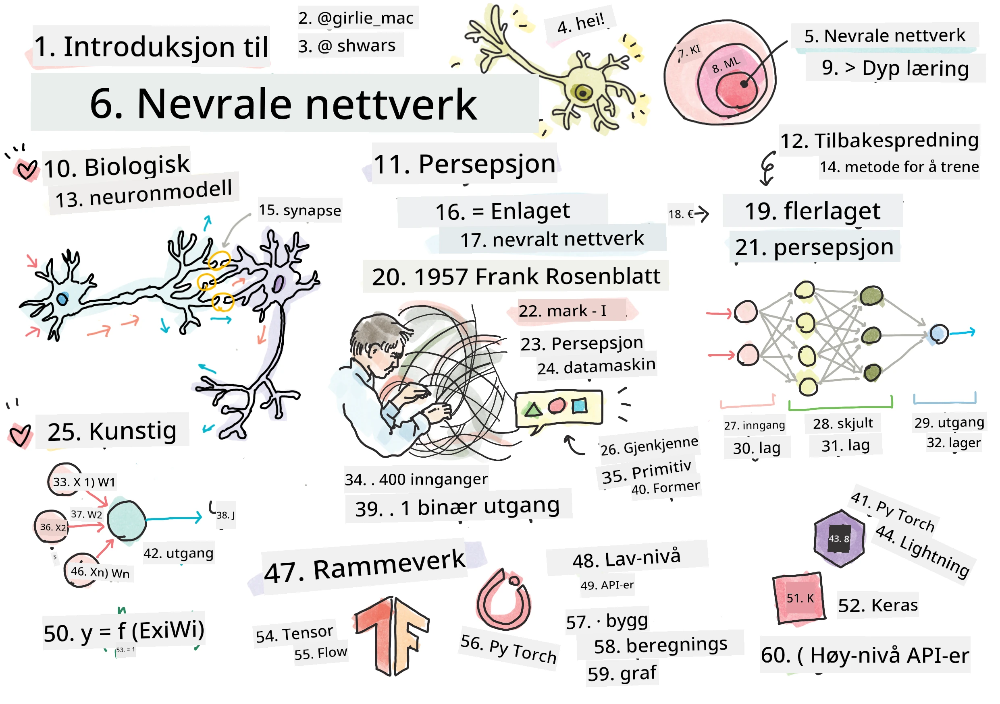
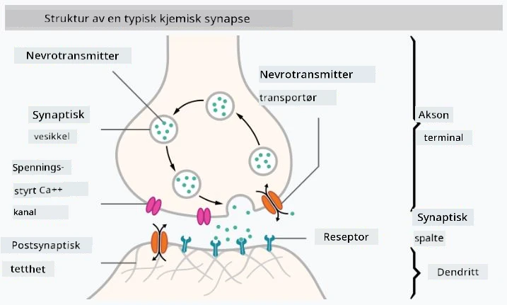
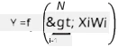

# Introduksjon til nevrale nettverk

Som vi diskuterte i introduksjonen, er en av måtene å oppnå intelligens på å trene en **datamodell** eller en **kunstig hjerne**. Siden midten av 1900-tallet har forskere prøvd ulike matematiske modeller, og i de senere år har denne retningen vist seg å være svært vellykket. Slike matematiske modeller av hjernen kalles **nevrale nettverk**.

> Noen ganger kalles nevrale nettverk for *Artificial Neural Networks*, ANNs, for å indikere at vi snakker om modeller, ikke ekte nettverk av nevroner.

## Maskinlæring

Nevrale nettverk er en del av en større disiplin kalt **maskinlæring**, som har som mål å bruke data til å trene datamodeller som kan løse problemer. Maskinlæring utgjør en stor del av kunstig intelligens, men vi dekker ikke klassisk maskinlæring i dette pensumet.

> Besøk vårt separate **[Maskinlæring for nybegynnere](http://github.com/microsoft/ml-for-beginners)** pensum for å lære mer om klassisk maskinlæring.

I maskinlæring antar vi at vi har et datasett med eksempler **X**, og tilsvarende utgangsverdier **Y**. Eksempler er ofte N-dimensjonale vektorer som består av **funksjoner**, og utganger kalles **etiketter**.

Vi vil se på de to vanligste problemene innen maskinlæring:

* **Klassifisering**, der vi må klassifisere et inngangsobjekt i to eller flere klasser.
* **Regresjon**, der vi må forutsi en numerisk verdi for hver av inngangsprøvene.

> Når vi representerer innganger og utganger som tensorer, er inngangsdataene en matrise av størrelse M&times;N, der M er antall prøver og N er antall funksjoner. Utgangsetiketter Y er en vektor av størrelse M.

I dette pensumet vil vi kun fokusere på modeller for nevrale nettverk.

## En modell av et nevron

Fra biologien vet vi at hjernen vår består av nerveceller (nevroner), som hver har flere "innganger" (dendritter) og en enkelt "utgang" (akson). Både dendritter og aksoner kan lede elektriske signaler, og forbindelsene mellom dem — kjent som synapser — kan ha varierende grad av ledningsevne, som reguleres av nevrotransmittere.

 | 
----|----
Ekte nevron *([Bilde](https://en.wikipedia.org/wiki/Synapse#/media/File:SynapseSchematic_lines.svg) fra Wikipedia)* | Kunstig nevron *(Bilde av forfatteren)*

Dermed inneholder den enkleste matematiske modellen av et nevron flere innganger X1, ..., XN og en utgang Y, samt en serie vekter W1, ..., WN. En utgang beregnes som:

der f er en ikke-lineær **aktiveringsfunksjon**.

> Tidlige modeller av nevroner ble beskrevet i den klassiske artikkelen [A logical calculus of the ideas immanent in nervous activity](https://www.cs.cmu.edu/~./epxing/Class/10715/reading/McCulloch.and.Pitts.pdf) av Warren McCullock og Walter Pitts i 1943. Donald Hebb foreslo i sin bok "[The Organization of Behavior: A Neuropsychological Theory](https://books.google.com/books?id=VNetYrB8EBoC)" hvordan slike nettverk kan trenes.

## I denne seksjonen

I denne seksjonen skal vi lære om:
* [Perceptron](03-Perceptron/README.md), en av de tidligste modellene for nevrale nettverk for to-klasse klassifisering
* [Flerlagsnettverk](04-OwnFramework/README.md) med en tilhørende notatbok [hvordan bygge vårt eget rammeverk](04-OwnFramework/OwnFramework.ipynb)
* [Rammeverk for nevrale nettverk](05-Frameworks/README.md), med disse notatbøkene: [PyTorch](05-Frameworks/IntroPyTorch.ipynb) og [Keras/Tensorflow](05-Frameworks/IntroKerasTF.ipynb)
* [Overtilpasning](../../../../lessons/3-NeuralNetworks/05-Frameworks)

---

**Ansvarsfraskrivelse**:  
Dette dokumentet er oversatt ved hjelp av AI-oversettelsestjenesten [Co-op Translator](https://github.com/Azure/co-op-translator). Selv om vi tilstreber nøyaktighet, vennligst vær oppmerksom på at automatiserte oversettelser kan inneholde feil eller unøyaktigheter. Det originale dokumentet på dets opprinnelige språk bør betraktes som den autoritative kilden. For kritisk informasjon anbefales profesjonell menneskelig oversettelse. Vi er ikke ansvarlige for eventuelle misforståelser eller feiltolkninger som oppstår ved bruk av denne oversettelsen.