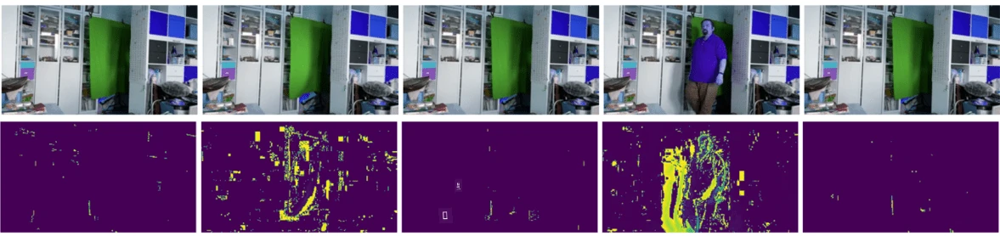

# Introduksjon til datamaskinsyn

[Datamaskinsyn](https://wikipedia.org/wiki/Computer_vision) er et fagområde som har som mål å gi datamaskiner en høyere forståelse av digitale bilder. Dette er en ganske bred definisjon, fordi *forståelse* kan bety mange forskjellige ting, inkludert å finne et objekt på et bilde (**objektdeteksjon**), forstå hva som skjer (**hendelsesdeteksjon**), beskrive et bilde med tekst, eller rekonstruere en scene i 3D. Det finnes også spesielle oppgaver knyttet til bilder av mennesker: alders- og følelsesestimering, ansiktsdeteksjon og identifikasjon, samt 3D-posisjonsestimering, for å nevne noen.

## [Quiz før forelesning](https://ff-quizzes.netlify.app/en/ai/quiz/11)

En av de enkleste oppgavene innen datamaskinsyn er **bildeklassifisering**.

Datamaskinsyn regnes ofte som en gren av AI. I dag løses de fleste oppgaver innen datamaskinsyn ved hjelp av nevrale nettverk. Vi skal lære mer om den spesielle typen nevrale nettverk som brukes for datamaskinsyn, [konvolusjonsnevrale nettverk](../07-ConvNets/README.md), gjennom denne seksjonen.

Men før du sender et bilde til et nevralt nettverk, kan det i mange tilfeller være fornuftig å bruke noen algoritmiske teknikker for å forbedre bildet.

Det finnes flere Python-biblioteker tilgjengelige for bildebehandling:

* **[imageio](https://imageio.readthedocs.io/en/stable/)** kan brukes til å lese/skrive ulike bildeformater. Det støtter også ffmpeg, et nyttig verktøy for å konvertere videorammer til bilder.
* **[Pillow](https://pillow.readthedocs.io/en/stable/index.html)** (også kjent som PIL) er litt mer kraftig og støtter også bildebehandling som morfing, palettjusteringer og mer.
* **[OpenCV](https://opencv.org/)** er et kraftig bildebehandlingsbibliotek skrevet i C++, som har blitt den *de facto* standarden for bildebehandling. Det har et praktisk Python-grensesnitt.
* **[dlib](http://dlib.net/)** er et C++-bibliotek som implementerer mange maskinlæringsalgoritmer, inkludert noen av algoritmene for datamaskinsyn. Det har også et Python-grensesnitt og kan brukes til utfordrende oppgaver som ansikts- og ansiktslandmarksdeteksjon.

## OpenCV

[OpenCV](https://opencv.org/) regnes som den *de facto* standarden for bildebehandling. Det inneholder mange nyttige algoritmer, implementert i C++. Du kan også bruke OpenCV fra Python.

Et godt sted å lære OpenCV er [dette Learn OpenCV-kurset](https://learnopencv.com/getting-started-with-opencv/). I vårt pensum er målet ikke å lære OpenCV, men å vise deg noen eksempler på når det kan brukes, og hvordan.

### Laste inn bilder

Bilder i Python kan enkelt representeres som NumPy-arrays. For eksempel vil gråtoner-bilder med størrelsen 320x200 piksler lagres i et 200x320-array, og fargebilder med samme dimensjon vil ha formen 200x320x3 (for 3 fargekanaler). For å laste inn et bilde kan du bruke følgende kode:

```python
import cv2
import matplotlib.pyplot as plt

im = cv2.imread('image.jpeg')
plt.imshow(im)
```

Tradisjonelt bruker OpenCV BGR (Blå-Grønn-Rød) koding for fargebilder, mens resten av Python-verktøyene bruker den mer tradisjonelle RGB (Rød-Grønn-Blå). For at bildet skal se riktig ut, må du konvertere det til RGB-fargerommet, enten ved å bytte dimensjoner i NumPy-arrayet eller ved å bruke en OpenCV-funksjon:

```python
im = cv2.cvtColor(im,cv2.COLOR_BGR2RGB)
```

Den samme `cvtColor`-funksjonen kan brukes til å utføre andre fargeromtransformasjoner, som å konvertere et bilde til gråtoner eller til HSV (Hue-Saturation-Value) fargerommet.

Du kan også bruke OpenCV til å laste inn video ramme-for-ramme - et eksempel er gitt i øvelsen [OpenCV Notebook](OpenCV.ipynb).

### Bildebehandling

Før du sender et bilde til et nevralt nettverk, kan det være lurt å utføre flere forhåndsbehandlingssteg. OpenCV kan gjøre mange ting, inkludert:

* **Endre størrelse** på bildet ved hjelp av `im = cv2.resize(im, (320,200),interpolation=cv2.INTER_LANCZOS)`
* **Uskarphet** på bildet ved hjelp av `im = cv2.medianBlur(im,3)` eller `im = cv2.GaussianBlur(im, (3,3), 0)`
* Endring av **lysstyrke og kontrast** på bildet kan gjøres ved hjelp av NumPy-arraymanipulasjoner, som beskrevet [i denne Stackoverflow-noten](https://stackoverflow.com/questions/39308030/how-do-i-increase-the-contrast-of-an-image-in-python-opencv).
* Bruk av [terskling](https://docs.opencv.org/4.x/d7/d4d/tutorial_py_thresholding.html) ved å kalle `cv2.threshold`/`cv2.adaptiveThreshold`-funksjoner, som ofte er å foretrekke fremfor å justere lysstyrke eller kontrast.
* Anvendelse av ulike [transformasjoner](https://docs.opencv.org/4.5.5/da/d6e/tutorial_py_geometric_transformations.html) på bildet:
    - **[Affine transformasjoner](https://docs.opencv.org/4.5.5/d4/d61/tutorial_warp_affine.html)** kan være nyttige hvis du trenger å kombinere rotasjon, endring av størrelse og skråstilling på bildet, og du kjenner kilde- og destinasjonsplasseringen til tre punkter i bildet. Affine transformasjoner holder parallelle linjer parallelle.
    - **[Perspektivtransformasjoner](https://medium.com/analytics-vidhya/opencv-perspective-transformation-9edffefb2143)** kan være nyttige når du kjenner kilde- og destinasjonsposisjonene til fire punkter i bildet. For eksempel, hvis du tar et bilde av et rektangulært dokument med et smarttelefonkamera fra en vinkel, og du vil lage et rektangulært bilde av selve dokumentet.
* Forstå bevegelse i bildet ved hjelp av **[optisk flyt](https://docs.opencv.org/4.5.5/d4/dee/tutorial_optical_flow.html)**.

## Eksempler på bruk av datamaskinsyn

I vår [OpenCV Notebook](OpenCV.ipynb) gir vi noen eksempler på når datamaskinsyn kan brukes til å utføre spesifikke oppgaver:

* **Forhåndsbehandling av et fotografi av en Braille-bok**. Vi fokuserer på hvordan vi kan bruke terskling, funksjonsdeteksjon, perspektivtransformasjon og NumPy-manipulasjoner for å separere individuelle Braille-symboler for videre klassifisering av et nevralt nettverk.

 |  | 
----|-----|-----

> Bilde fra [OpenCV.ipynb](OpenCV.ipynb)

* **Deteksjon av bevegelse i video ved hjelp av rammeforskjell**. Hvis kameraet er fast, bør rammer fra kamerafeeden være ganske like hverandre. Siden rammer er representert som arrays, vil vi ved å trekke fra disse arrayene for to påfølgende rammer få pikselforskjellen, som bør være lav for statiske rammer, og bli høyere når det er betydelig bevegelse i bildet.



> Bilde fra [OpenCV.ipynb](OpenCV.ipynb)

* **Deteksjon av bevegelse ved hjelp av optisk flyt**. [Optisk flyt](https://docs.opencv.org/3.4/d4/dee/tutorial_optical_flow.html) lar oss forstå hvordan individuelle piksler på videorammer beveger seg. Det finnes to typer optisk flyt:

   - **Tett optisk flyt** beregner vektorfeltet som viser hvor hver piksel beveger seg.
   - **Sparsom optisk flyt** er basert på å ta noen distinkte funksjoner i bildet (f.eks. kanter) og bygge deres bane fra ramme til ramme.


> Bilde fra [OpenCV.ipynb](OpenCV.ipynb)

## ✍️ Eksempelnotatbøker: OpenCV [prøv OpenCV i aksjon](OpenCV.ipynb)

La oss gjøre noen eksperimenter med OpenCV ved å utforske [OpenCV Notebook](OpenCV.ipynb)

## Konklusjon

Noen ganger kan relativt komplekse oppgaver som bevegelsesdeteksjon eller fingertuppdeteksjon løses utelukkende ved hjelp av datamaskinsyn. Derfor er det svært nyttig å kjenne til de grunnleggende teknikkene innen datamaskinsyn, og hva biblioteker som OpenCV kan gjøre.

## 🚀 Utfordring

Se [denne videoen](https://docs.microsoft.com/shows/ai-show/ai-show--2021-opencv-ai-competition--grand-prize-winners--cortic-tigers--episode-32?WT.mc_id=academic-77998-cacaste) fra AI-showet for å lære om Cortic Tigers-prosjektet og hvordan de bygde en blokkbasert løsning for å demokratisere oppgaver innen datamaskinsyn via en robot. Gjør litt research på andre prosjekter som dette som hjelper nye lærere inn i feltet.

## [Quiz etter forelesning](https://ff-quizzes.netlify.app/en/ai/quiz/12)

## Gjennomgang og selvstudium

Les mer om optisk flyt [i denne flotte veiledningen](https://learnopencv.com/optical-flow-in-opencv/).

## [Oppgave](lab/README.md)

I denne laben skal du ta en video med enkle bevegelser, og målet ditt er å trekke ut opp/ned/venstre/høyre bevegelser ved hjelp av optisk flyt.


---

