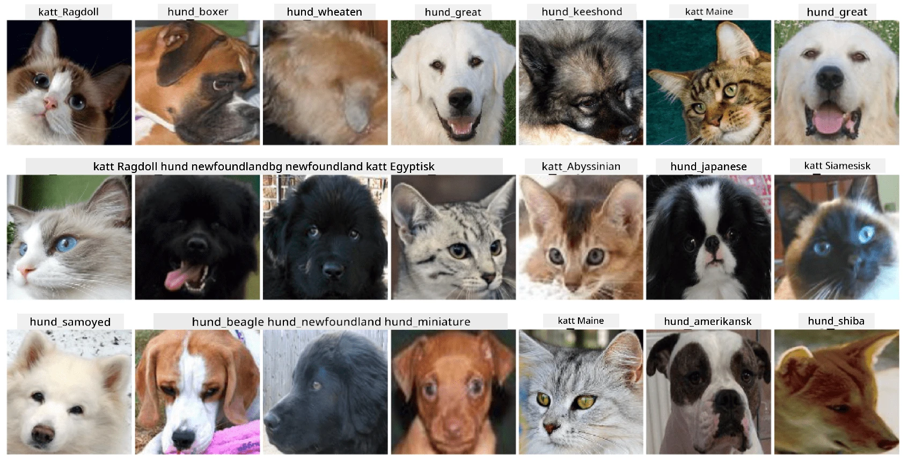

# Klassifisering av kjæledyrs ansikter

Laboppgave fra [AI for Beginners Curriculum](https://github.com/microsoft/ai-for-beginners).

## Oppgave

Tenk deg at du må utvikle en applikasjon for en dyrebarnehage for å katalogisere alle kjæledyrene. En av de flotte funksjonene i en slik applikasjon ville være å automatisk identifisere rasen fra et fotografi. Dette kan gjøres med suksess ved hjelp av nevrale nettverk.

Du må trene et konvolusjonsnevralt nettverk for å klassifisere forskjellige raser av katter og hunder ved hjelp av **Pet Faces**-datasettet.

## Datasettet

Vi skal bruke [Oxford-IIIT Pet Dataset](https://www.robots.ox.ac.uk/~vgg/data/pets/), som inneholder bilder av 37 forskjellige raser av hunder og katter.



For å laste ned datasettet, bruk denne kodebiten:

```python
!wget https://thor.robots.ox.ac.uk/~vgg/data/pets/images.tar.gz
!tar xfz images.tar.gz
!rm images.tar.gz
```

**Merk:** Bildene i Oxford-IIIT Pet Dataset er organisert etter filnavn (f.eks. `Abyssinian_1.jpg`, `Bengal_2.jpg`). Notatboken inneholder kode for å organisere disse bildene i rasespesifikke underkataloger for enklere klassifisering.

## Startnotatbok

Start laben ved å åpne [PetFaces.ipynb](PetFaces.ipynb)

## Oppsummering

Du har løst et relativt komplekst problem med bildegjenkjenning fra bunnen av! Det var ganske mange klasser, og du klarte likevel å oppnå rimelig nøyaktighet! Det gir også mening å måle top-k nøyaktighet, fordi det er lett å forveksle noen av klassene som ikke er tydelig forskjellige, selv for mennesker.

---

**Ansvarsfraskrivelse**:  
Dette dokumentet er oversatt ved hjelp av AI-oversettelsestjenesten [Co-op Translator](https://github.com/Azure/co-op-translator). Selv om vi tilstreber nøyaktighet, vær oppmerksom på at automatiserte oversettelser kan inneholde feil eller unøyaktigheter. Det originale dokumentet på sitt opprinnelige språk bør anses som den autoritative kilden. For kritisk informasjon anbefales profesjonell menneskelig oversettelse. Vi er ikke ansvarlige for eventuelle misforståelser eller feiltolkninger som oppstår ved bruk av denne oversettelsen.