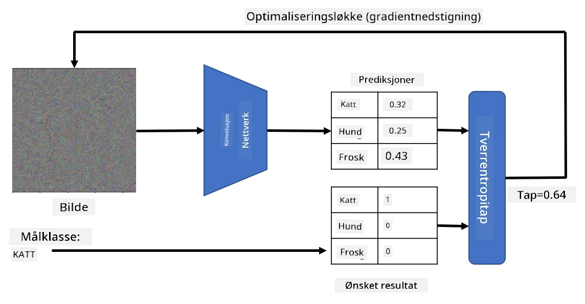

# Forhåndstrente nettverk og overføringslæring

Å trene CNN-er kan ta mye tid, og det kreves store mengder data for denne oppgaven. Mye av tiden brukes imidlertid på å lære de beste lavnivåfiltrene som et nettverk kan bruke for å trekke ut mønstre fra bilder. Et naturlig spørsmål oppstår: Kan vi bruke et nevralt nettverk som er trent på ett datasett og tilpasse det til å klassifisere andre bilder uten å måtte gjennomføre en full treningsprosess?

## [Forhåndsquiz](https://ff-quizzes.netlify.app/en/ai/quiz/15)

Denne tilnærmingen kalles **overføringslæring**, fordi vi overfører noe kunnskap fra én nevralt nettverksmodell til en annen. I overføringslæring starter vi vanligvis med en forhåndstrent modell, som er trent på et stort bildedatasett, som for eksempel **ImageNet**. Disse modellene kan allerede gjøre en god jobb med å trekke ut ulike funksjoner fra generiske bilder, og i mange tilfeller kan det å bygge en klassifiserer på toppen av disse funksjonene gi gode resultater.

> ✅ Overføringslæring er et begrep som også finnes i andre akademiske felt, som utdanning. Det refererer til prosessen med å ta kunnskap fra ett område og anvende det på et annet.

## Forhåndstrente modeller som funksjonsekstraktorer

De konvolusjonsnettverkene vi har snakket om i forrige seksjon, inneholder flere lag, hvor hvert lag skal trekke ut noen funksjoner fra bildet, fra lavnivå pikselkombinasjoner (som horisontale/vertikale linjer eller strøk) til høyere nivå kombinasjoner av funksjoner, som tilsvarer ting som et øye på en flamme. Hvis vi trener et CNN på et tilstrekkelig stort datasett med generiske og varierte bilder, bør nettverket lære å trekke ut disse vanlige funksjonene.

Både Keras og PyTorch inneholder funksjoner for enkelt å laste inn forhåndstrente nevrale nettverksvekter for noen vanlige arkitekturer, hvorav de fleste er trent på ImageNet-bilder. De mest brukte er beskrevet på siden [CNN-arkitekturer](../07-ConvNets/CNN_Architectures.md) fra forrige leksjon. Spesielt kan du vurdere å bruke en av følgende:

* **VGG-16/VGG-19**, som er relativt enkle modeller som fortsatt gir god nøyaktighet. Ofte er det et godt valg å bruke VGG som et første forsøk for å se hvordan overføringslæring fungerer.
* **ResNet** er en familie av modeller foreslått av Microsoft Research i 2015. De har flere lag og krever derfor mer ressurser.
* **MobileNet** er en familie av modeller med redusert størrelse, egnet for mobile enheter. Bruk dem hvis du har begrensede ressurser og kan ofre litt nøyaktighet.

Her er eksempler på funksjoner som er trukket ut fra et bilde av en katt av VGG-16-nettverket:

## Datasett: Katter vs. Hunder

I dette eksempelet vil vi bruke et datasett med [Katter og Hunder](https://www.microsoft.com/download/details.aspx?id=54765&WT.mc_id=academic-77998-cacaste), som er svært nært en reell bildeklassifiseringsscenario.

## ✍️ Øvelse: Overføringslæring

La oss se overføringslæring i praksis i de tilhørende notatbøkene:

* [Overføringslæring - PyTorch](TransferLearningPyTorch.ipynb)
* [Overføringslæring - TensorFlow](TransferLearningTF.ipynb)

## Visualisering av en "ideell katt"

Et forhåndstrent nevralt nettverk inneholder ulike mønstre i sin *hjerne*, inkludert forestillinger om en **ideell katt** (samt ideell hund, ideell sebra, osv.). Det ville vært interessant å på en eller annen måte **visualisere dette bildet**. Men det er ikke enkelt, fordi mønstrene er spredt over nettverksvektene og også organisert i en hierarkisk struktur.

En tilnærming vi kan bruke, er å starte med et tilfeldig bilde og deretter bruke **gradient descent-optimalisering** for å justere bildet slik at nettverket begynner å tro at det er en katt.

Men hvis vi gjør dette, vil vi få noe som ligner veldig på tilfeldig støy. Dette er fordi *det finnes mange måter å få nettverket til å tro at inngangsbilde er en katt*, inkludert noen som ikke gir mening visuelt. Selv om disse bildene inneholder mange mønstre som er typiske for en katt, er det ingenting som begrenser dem til å være visuelt distinkte.

For å forbedre resultatet kan vi legge til et annet ledd i tapsfunksjonen, som kalles **variasjonstap**. Dette er en metrikk som viser hvor like nabopikslene i bildet er. Ved å minimere variasjonstap blir bildet jevnere og støy fjernes, noe som avslører mer visuelt tiltalende mønstre. Her er et eksempel på slike "ideelle" bilder, som klassifiseres som katt og som sebra med høy sannsynlighet:

 | 
-----|-----
*Ideell Katt* | *Ideell Sebra*

En lignende tilnærming kan brukes til å utføre såkalte **adversarielle angrep** på et nevralt nettverk. Anta at vi ønsker å lure et nevralt nettverk og få en hund til å se ut som en katt. Hvis vi tar et bilde av en hund, som nettverket gjenkjenner som en hund, kan vi justere det litt ved hjelp av gradient descent-optimalisering, til nettverket begynner å klassifisere det som en katt:

 | 
-----|-----
*Originalbilde av en hund* | *Bilde av en hund klassifisert som en katt*

Se koden for å reprodusere resultatene ovenfor i følgende notatbok:

* [Ideell og Adversariell Katt - TensorFlow](AdversarialCat_TF.ipynb)

## Konklusjon

Ved å bruke overføringslæring kan du raskt sette sammen en klassifiserer for en tilpasset objektklassifiseringsoppgave og oppnå høy nøyaktighet. Du kan se at mer komplekse oppgaver som vi løser nå, krever høyere beregningskraft og ikke enkelt kan løses på en CPU. I neste enhet vil vi prøve å bruke en mer lettvektsimplementasjon for å trene den samme modellen med lavere beregningsressurser, noe som resulterer i bare litt lavere nøyaktighet.

## 🚀 Utfordring

I de medfølgende notatbøkene er det notater nederst om hvordan overføringskunnskap fungerer best med noe lignende treningsdata (for eksempel en ny type dyr). Gjør noen eksperimenter med helt nye typer bilder for å se hvor godt eller dårlig dine overføringskunnskapsmodeller presterer.

## [Etterforelesningsquiz](https://ff-quizzes.netlify.app/en/ai/quiz/16)

## Gjennomgang og Selvstudium

Les gjennom [TrainingTricks.md](TrainingTricks.md) for å utdype kunnskapen din om andre måter å trene modellene dine på.

## [Oppgave](lab/README.md)

I dette laboratoriet vil vi bruke det virkelige [Oxford-IIIT](https://www.robots.ox.ac.uk/~vgg/data/pets/) kjæledyrdatasettet med 35 raser av katter og hunder, og vi vil bygge en overføringslæringsklassifiserer.

---

