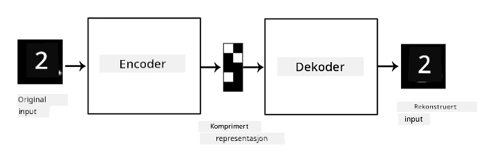
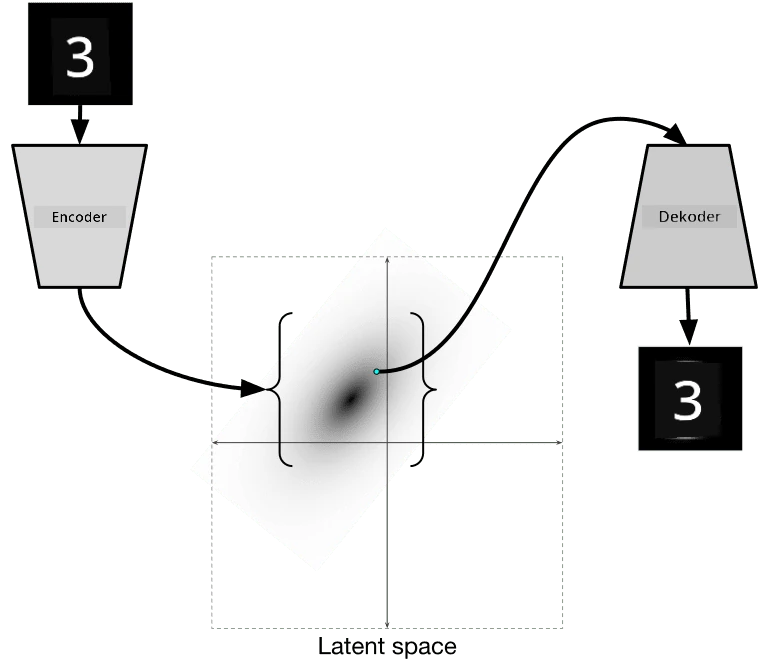

# Autoencodere

Når vi trener CNN-er, er en av utfordringene at vi trenger mye merket data. Når det gjelder bildeklassifisering, må vi dele bilder inn i ulike klasser, noe som krever manuell innsats.

## [Quiz før forelesning](https://ff-quizzes.netlify.app/en/ai/quiz/17)

Vi kan imidlertid ønske å bruke rå (umerkede) data for å trene CNN-funksjonsekstraktorer, noe som kalles **selv-supervisert læring**. I stedet for etiketter bruker vi treningsbilder både som nettverksinput og output. Hovedideen med **autoencoder** er at vi har et **encoder-nettverk** som konverterer input-bildet til et **latent rom** (vanligvis bare en vektor av mindre størrelse), og deretter et **decoder-nettverk**, som har som mål å rekonstruere det originale bildet.

> ✅ En [autoencoder](https://wikipedia.org/wiki/Autoencoder) er "en type kunstig nevralt nettverk som brukes til å lære effektive kodinger av umarkert data."

Siden vi trener en autoencoder til å fange så mye informasjon som mulig fra det originale bildet for nøyaktig rekonstruksjon, prøver nettverket å finne den beste **embedding** av input-bilder for å fange meningen.

> Bilde fra [Keras-blogg](https://blog.keras.io/building-autoencoders-in-keras.html)

## Scenarier for bruk av autoencodere

Selv om det å rekonstruere originale bilder ikke virker nyttig i seg selv, finnes det noen scenarier der autoencodere er spesielt nyttige:

* **Redusere dimensjonen på bilder for visualisering** eller **trene bildeembeddings**. Vanligvis gir autoencodere bedre resultater enn PCA, fordi de tar hensyn til bildenes romlige natur og hierarkiske funksjoner.
* **Fjerning av støy**, dvs. fjerne støy fra bildet. Fordi støy inneholder mye unyttig informasjon, kan autoencoder ikke passe alt inn i det relativt lille latente rommet, og dermed fanger den bare den viktige delen av bildet. Når vi trener støyfjernere, starter vi med originale bilder og bruker bilder med kunstig lagt til støy som input for autoencoder.
* **Superoppløsning**, øke bildekvaliteten. Vi starter med bilder med høy oppløsning og bruker bildet med lavere oppløsning som input for autoencoder.
* **Generative modeller**. Når vi har trent autoencoder, kan decoder-delen brukes til å lage nye objekter basert på tilfeldige latente vektorer.

## Variasjonelle autoencodere (VAE)

Tradisjonelle autoencodere reduserer dimensjonen på input-data på en eller annen måte, og finner de viktige funksjonene i input-bildene. Imidlertid gir latente vektorer ofte ikke mye mening. Med andre ord, hvis vi tar MNIST-datasettet som et eksempel, er det ikke lett å finne ut hvilke sifre som tilsvarer ulike latente vektorer, fordi nærliggende latente vektorer ikke nødvendigvis tilsvarer de samme sifrene.

På den annen side, for å trene *generative* modeller er det bedre å ha en viss forståelse av det latente rommet. Denne ideen leder oss til **variational autoencoder** (VAE).

VAE er en autoencoder som lærer å forutsi *statistisk distribusjon* av de latente parameterne, det såkalte **latente distribusjonen**. For eksempel kan vi ønske at latente vektorer skal være normalt fordelt med en viss gjennomsnitt zmean og standardavvik zsigma (både gjennomsnitt og standardavvik er vektorer med en viss dimensjonalitet d). Encoder i VAE lærer å forutsi disse parameterne, og deretter tar decoder en tilfeldig vektor fra denne distribusjonen for å rekonstruere objektet.

Oppsummert:

 * Fra input-vektoren forutsier vi `z_mean` og `z_log_sigma` (i stedet for å forutsi standardavviket direkte, forutsier vi logaritmen av det)
 * Vi tar en prøvevektor `sample` fra distribusjonen N(zmean,exp(zlog\_sigma))
 * Decoder prøver å dekode det originale bildet ved å bruke `sample` som input-vektor

 

> Bilde fra [denne bloggposten](https://ijdykeman.github.io/ml/2016/12/21/cvae.html) av Isaak Dykeman

Variasjonelle autoencodere bruker en kompleks tapsfunksjon som består av to deler:

* **Rekonstruksjonstap** er tapsfunksjonen som viser hvor nært et rekonstruert bilde er til målet (det kan være Mean Squared Error, eller MSE). Det er den samme tapsfunksjonen som i vanlige autoencodere.
* **KL-tap**, som sikrer at latente variabeldistribusjoner holder seg nær normalfordelingen. Det er basert på begrepet [Kullback-Leibler-divergens](https://www.countbayesie.com/blog/2017/5/9/kullback-leibler-divergence-explained) - en metrikk for å estimere hvor like to statistiske distribusjoner er.

En viktig fordel med VAE-er er at de lar oss generere nye bilder relativt enkelt, fordi vi vet hvilken distribusjon vi skal ta latente vektorer fra. For eksempel, hvis vi trener VAE med 2D latente vektorer på MNIST, kan vi deretter variere komponentene i den latente vektoren for å få ulike sifre:

> Bilde av [Dmitry Soshnikov](http://soshnikov.com)

Legg merke til hvordan bildene glir over i hverandre, ettersom vi begynner å ta latente vektorer fra ulike deler av det latente parameterrommet. Vi kan også visualisere dette rommet i 2D:

 

> Bilde av [Dmitry Soshnikov](http://soshnikov.com)

## ✍️ Øvelser: Autoencodere

Lær mer om autoencodere i disse tilhørende notatbøkene:

* [Autoencodere i TensorFlow](AutoencodersTF.ipynb)
* [Autoencodere i PyTorch](AutoEncodersPyTorch.ipynb)

## Egenskaper ved autoencodere

* **Dataspesifikke** - de fungerer bare godt med den typen bilder de er trent på. For eksempel, hvis vi trener et superoppløsningsnettverk på blomster, vil det ikke fungere godt på portretter. Dette er fordi nettverket kan produsere bilder med høyere oppløsning ved å ta fine detaljer fra funksjoner lært fra treningsdatasettet.
* **Tapsbaserte** - det rekonstruerte bildet er ikke det samme som det originale bildet. Naturen til tapet er definert av *tapsfunksjonen* som brukes under trening.
* Fungerer på **umarkert data**

## [Quiz etter forelesning](https://ff-quizzes.netlify.app/en/ai/quiz/18)

## Konklusjon

I denne leksjonen lærte du om de ulike typene autoencodere som er tilgjengelige for AI-forskeren. Du lærte hvordan du bygger dem, og hvordan du bruker dem til å rekonstruere bilder. Du lærte også om VAE og hvordan du bruker det til å generere nye bilder.

## 🚀 Utfordring

I denne leksjonen lærte du om bruk av autoencodere for bilder. Men de kan også brukes for musikk! Sjekk ut Magenta-prosjektets [MusicVAE](https://magenta.tensorflow.org/music-vae)-prosjekt, som bruker autoencodere til å lære å rekonstruere musikk. Gjør noen [eksperimenter](https://colab.research.google.com/github/magenta/magenta-demos/blob/master/colab-notebooks/Multitrack_MusicVAE.ipynb) med dette biblioteket for å se hva du kan skape.

## [Quiz etter forelesning](https://ff-quizzes.netlify.app/en/ai/quiz/16)

## Gjennomgang & Selvstudium

For referanse, les mer om autoencodere i disse ressursene:

* [Bygge autoencodere i Keras](https://blog.keras.io/building-autoencoders-in-keras.html)
* [Bloggpost på NeuroHive](https://neurohive.io/ru/osnovy-data-science/variacionnyj-avtojenkoder-vae/)
* [Variasjonelle autoencodere forklart](https://kvfrans.com/variational-autoencoders-explained/)
* [Betingede variasjonelle autoencodere](https://ijdykeman.github.io/ml/2016/12/21/cvae.html)

## Oppgave

På slutten av [denne notatboken med TensorFlow](AutoencodersTF.ipynb), finner du en 'oppgave' - bruk denne som din oppgave.

---

