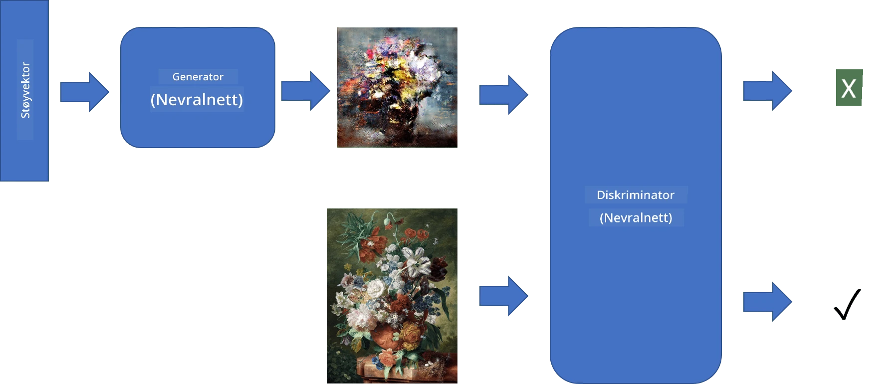
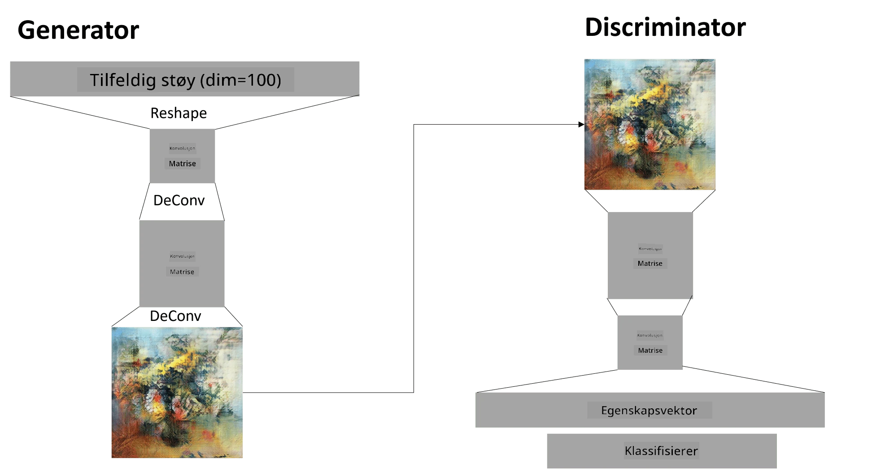

# Generative Adversarial Networks

I forrige seksjon lærte vi om **generative modeller**: modeller som kan generere nye bilder som ligner på de i treningsdatasettet. VAE var et godt eksempel på en generativ modell.

## [Pre-lecture quiz](https://ff-quizzes.netlify.app/en/ai/quiz/19)

Men hvis vi prøver å generere noe virkelig meningsfullt, som et maleri med rimelig oppløsning, med VAE, vil vi se at treningen ikke konvergerer godt. For dette brukstilfellet bør vi lære om en annen arkitektur som er spesifikt rettet mot generative modeller - **Generative Adversarial Networks**, eller GANs.

Hovedideen med en GAN er å ha to nevrale nettverk som trenes mot hverandre:

> Bilde av [Dmitry Soshnikov](http://soshnikov.com)

> ✅ Litt vokabular:
> * **Generator** er et nettverk som tar en tilfeldig vektor og produserer et bilde som resultat.
> * **Discriminator** er et nettverk som tar et bilde og skal avgjøre om det er et ekte bilde (fra treningsdatasettet) eller om det ble generert av en generator. Det er i hovedsak en bildekategoriserer.

### Discriminator

Arkitekturen til en discriminator skiller seg ikke fra et vanlig bildekategoriseringsnettverk. I det enkleste tilfellet kan det være en fullt tilkoblet kategoriserer, men mest sannsynlig vil det være et [konvolusjonsnettverk](../07-ConvNets/README.md).

> ✅ En GAN basert på konvolusjonsnettverk kalles en [DCGAN](https://arxiv.org/pdf/1511.06434.pdf)

En CNN-discriminator består av følgende lag: flere konvolusjoner+pooling (med minkende romlig størrelse) og ett eller flere fullt tilkoblede lag for å få en "funksjonsvektor", og til slutt en binær kategoriserer.

> ✅ 'Pooling' i denne sammenhengen er en teknikk som reduserer størrelsen på bildet. "Pooling-lag reduserer dimensjonene til dataene ved å kombinere utgangene fra nevronklynger i ett lag til et enkelt nevron i neste lag." - [kilde](https://wikipedia.org/wiki/Convolutional_neural_network#Pooling_layers)

### Generator

En generator er litt mer komplisert. Du kan se på den som en omvendt discriminator. Fra en latent vektor (i stedet for en funksjonsvektor) har den et fullt tilkoblet lag for å konvertere det til ønsket størrelse/form, etterfulgt av dekonvolusjoner+oppskalering. Dette ligner på *dekoder*-delen av [autoencoder](../09-Autoencoders/README.md).

> ✅ Fordi konvolusjonslaget implementeres som et lineært filter som beveger seg over bildet, er dekonvolusjon i hovedsak lik konvolusjon og kan implementeres med samme laglogikk.

> Bilde av [Dmitry Soshnikov](http://soshnikov.com)

### Trening av GAN

GANs kalles **adversarial** fordi det er en konstant konkurranse mellom generatoren og discriminator. Under denne konkurransen forbedres både generatoren og discriminator, og nettverket lærer dermed å produsere bedre og bedre bilder.

Treningen skjer i to trinn:

* **Trening av discriminator**. Denne oppgaven er ganske rett frem: vi genererer en batch med bilder fra generatoren, merker dem som 0, som står for falske bilder, og tar en batch med bilder fra inngangsdatasettet (med merkelapp 1, ekte bilder). Vi får en *discriminator loss* og utfører backprop.
* **Trening av generator**. Dette er litt mer komplisert, fordi vi ikke vet det forventede resultatet for generatoren direkte. Vi tar hele GAN-nettverket som består av en generator etterfulgt av en discriminator, mater det med noen tilfeldige vektorer, og forventer at resultatet skal være 1 (tilsvarende ekte bilder). Vi fryser deretter parameterne til discriminator (vi vil ikke trene den i dette trinnet) og utfører backprop.

Under denne prosessen går verken generator- eller discriminator-tapene betydelig ned. I en ideell situasjon bør de svinge, noe som tilsvarer at begge nettverk forbedrer ytelsen.

## ✍️ Øvelser: GANs

* [GAN Notebook i TensorFlow/Keras](GANTF.ipynb)
* [GAN Notebook i PyTorch](GANPyTorch.ipynb)

### Problemer med GAN-trening

GANs er kjent for å være spesielt vanskelige å trene. Her er noen problemer:

* **Mode Collapse**. Dette betyr at generatoren lærer å produsere ett vellykket bilde som lurer discriminator, og ikke en variasjon av forskjellige bilder.
* **Følsomhet for hyperparametere**. Ofte kan du se at en GAN ikke konvergerer i det hele tatt, og så plutselig fører en reduksjon i læringsraten til konvergens.
* Å opprettholde en **balanse** mellom generatoren og discriminator. I mange tilfeller kan discriminator-tapet falle til null relativt raskt, noe som resulterer i at generatoren ikke kan trenes videre. For å overvinne dette kan vi prøve å sette forskjellige læringsrater for generatoren og discriminator, eller hoppe over trening av discriminator hvis tapet allerede er for lavt.
* Trening for **høy oppløsning**. Dette problemet, som også oppstår med autoencodere, utløses fordi rekonstruksjon av for mange lag i et konvolusjonsnettverk fører til artefakter. Dette problemet løses vanligvis med såkalt **progressiv vekst**, der først noen få lag trenes på lavoppløselige bilder, og deretter "låses opp" eller legges til flere lag. En annen løsning er å legge til ekstra forbindelser mellom lagene og trene flere oppløsninger samtidig - se denne [Multi-Scale Gradient GANs-artikkelen](https://arxiv.org/abs/1903.06048) for detaljer.

## Stiloverføring

GANs er en flott måte å generere kunstneriske bilder på. En annen interessant teknikk er såkalt **stiloverføring**, som tar ett **innholdsbilde** og tegner det på nytt i en annen stil ved å bruke filtre fra et **stilbilde**.

Slik fungerer det:
* Vi starter med et tilfeldig støybilde (eller med et innholdsbilde, men for forståelsens skyld er det enklere å starte med tilfeldig støy).
* Målet vårt er å lage et bilde som er nært både innholdsbilde og stilbilde. Dette bestemmes av to tapfunksjoner:
   - **Innholdstap** beregnes basert på funksjonene som CNN trekker ut fra noen lag fra det nåværende bildet og innholdsbilde.
   - **Stiltap** beregnes mellom det nåværende bildet og stilbildet på en smart måte ved hjelp av Gram-matriser (mer detaljer i [eksempelfilen](StyleTransfer.ipynb)).
* For å gjøre bildet jevnere og fjerne støy, introduserer vi også **Variasjonstap**, som beregner gjennomsnittlig avstand mellom nabopiksler.
* Hovedoptimaliseringsløkken justerer det nåværende bildet ved hjelp av gradient descent (eller en annen optimaliseringsalgoritme) for å minimere det totale tapet, som er en vektet sum av alle tre tapene.

## ✍️ Eksempel: [Stiloverføring](StyleTransfer.ipynb)

## [Post-lecture quiz](https://ff-quizzes.netlify.app/en/ai/quiz/20)

## Konklusjon

I denne leksjonen lærte du om GANs og hvordan du trener dem. Du lærte også om de spesielle utfordringene denne typen nevrale nettverk kan møte, og noen strategier for å overvinne dem.

## 🚀 Utfordring

Kjør gjennom [stiloverføringsnotatboken](StyleTransfer.ipynb) med dine egne bilder.

## Gjennomgang og selvstudium

For referanse, les mer om GANs i disse ressursene:

* Marco Pasini, [10 Lessons I Learned Training GANs for one Year](https://towardsdatascience.com/10-lessons-i-learned-training-generative-adversarial-networks-gans-for-a-year-c9071159628)
* [StyleGAN](https://en.wikipedia.org/wiki/StyleGAN), en *de facto* GAN-arkitektur å vurdere
* [Creating Generative Art using GANs on Azure ML](https://soshnikov.com/scienceart/creating-generative-art-using-gan-on-azureml/)

## Oppgave

Gå tilbake til en av de to notatbøkene knyttet til denne leksjonen og tren GAN på dine egne bilder. Hva kan du skape?

---

