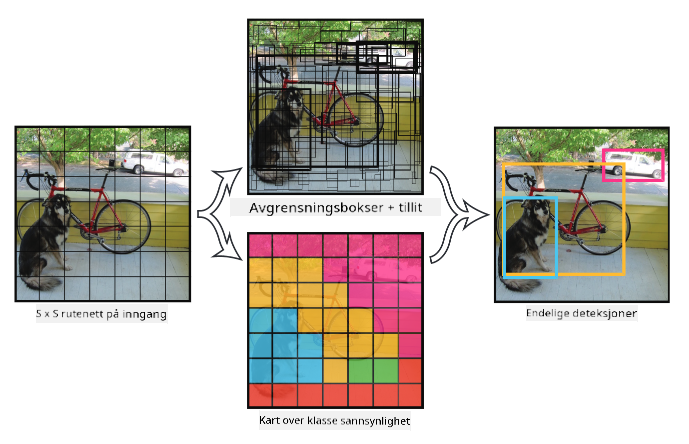

<!--
CO_OP_TRANSLATOR_METADATA:
{
  "original_hash": "d85c8b08f6d1b48fd7f35b99f93c1138",
  "translation_date": "2025-08-28T15:22:17+00:00",
  "source_file": "lessons/4-ComputerVision/11-ObjectDetection/README.md",
  "language_code": "no"
}
-->
# Objektgjenkjenning

Bildesorteringsmodellene vi har jobbet med så langt, tok et bilde og produserte et kategorisk resultat, som klassen 'nummer' i et MNIST-problem. Men i mange tilfeller ønsker vi ikke bare å vite at et bilde viser objekter – vi vil kunne bestemme deres nøyaktige plassering. Dette er nettopp poenget med **objektgjenkjenning**.

## [Pre-lecture quiz](https://red-field-0a6ddfd03.1.azurestaticapps.net/quiz/111)

> Bilde fra [YOLO v2 nettside](https://pjreddie.com/darknet/yolov2/)

## En Naiv Tilnærming til Objektgjenkjenning

Anta at vi ønsket å finne en katt på et bilde. En veldig naiv tilnærming til objektgjenkjenning ville være følgende:

1. Del bildet opp i et antall ruter.
2. Kjør bildesortering på hver rute.
3. De rutene som gir tilstrekkelig høy aktivering, kan anses å inneholde objektet vi leter etter.

> *Bilde fra [Øvingsnotatbok](ObjectDetection-TF.ipynb)*

Denne tilnærmingen er imidlertid langt fra ideell, fordi den bare lar algoritmen lokalisere objektets avgrensningsboks veldig unøyaktig. For mer presis lokalisering må vi kjøre en form for **regresjon** for å forutsi koordinatene til avgrensningsboksene – og for det trenger vi spesifikke datasett.

## Regresjon for Objektgjenkjenning

[Dette blogginnlegget](https://towardsdatascience.com/object-detection-with-neural-networks-a4e2c46b4491) gir en flott og enkel introduksjon til å oppdage former.

## Datasett for Objektgjenkjenning

Du kan komme over følgende datasett for denne oppgaven:

* [PASCAL VOC](http://host.robots.ox.ac.uk/pascal/VOC/) – 20 klasser
* [COCO](http://cocodataset.org/#home) – Common Objects in Context. 80 klasser, avgrensningsbokser og segmenteringsmasker

## Objektgjenkjenningsmetrikker

### Intersection over Union

Mens det er enkelt å måle hvor godt algoritmen presterer for bildesortering, må vi for objektgjenkjenning måle både korrektheten av klassen og presisjonen til den utledede plasseringen av avgrensningsboksen. For det siste bruker vi den såkalte **Intersection over Union** (IoU), som måler hvor godt to bokser (eller to vilkårlige områder) overlapper.

> *Figur 2 fra [dette utmerkede blogginnlegget om IoU](https://pyimagesearch.com/2016/11/07/intersection-over-union-iou-for-object-detection/)*

Ideen er enkel – vi deler arealet av overlappet mellom to figurer på arealet av deres union. For to identiske områder vil IoU være 1, mens for helt adskilte områder vil det være 0. Ellers vil det variere fra 0 til 1. Vi vurderer vanligvis bare de avgrensningsboksene der IoU er over en viss verdi.

### Gjennomsnittlig Presisjon

Anta at vi ønsker å måle hvor godt en gitt klasse av objekter $C$ blir gjenkjent. For å måle dette bruker vi **Gjennomsnittlig Presisjon**-metrikken, som beregnes slik:

1. Vurder en Precision-Recall-kurve som viser nøyaktigheten avhengig av en deteksjonsterskelverdi (fra 0 til 1).
2. Avhengig av terskelen vil vi få flere eller færre objekter oppdaget i bildet, og ulike verdier for presisjon og recall.
3. Kurven vil se slik ut:

> *Bilde fra [NeuroWorkshop](http://github.com/shwars/NeuroWorkshop)*

Gjennomsnittlig presisjon for en gitt klasse $C$ er arealet under denne kurven. Mer presist deles Recall-aksen vanligvis inn i 10 deler, og presisjonen gjennomsnittberegnes over alle disse punktene:

$$
AP = {1\over11}\sum_{i=0}^{10}\mbox{Precision}(\mbox{Recall}={i\over10})
$$

### AP og IoU

Vi vurderer kun de deteksjonene der IoU er over en viss verdi. For eksempel antas det vanligvis at $\mbox{IoU Threshold} = 0.5$ i PASCAL VOC-datasettet, mens i COCO måles AP for ulike verdier av $\mbox{IoU Threshold}$.

> *Bilde fra [NeuroWorkshop](http://github.com/shwars/NeuroWorkshop)*

### Gjennomsnittlig Gjennomsnittlig Presisjon – mAP

Hovedmetrikken for objektgjenkjenning kalles **Gjennomsnittlig Gjennomsnittlig Presisjon**, eller **mAP**. Det er verdien av Gjennomsnittlig Presisjon, gjennomsnittlig over alle objektklasser, og noen ganger også over $\mbox{IoU Threshold}$. Prosessen for å beregne **mAP** er beskrevet i detalj
[i dette blogginnlegget](https://medium.com/@timothycarlen/understanding-the-map-evaluation-metric-for-object-detection-a07fe6962cf3)), og også [her med kodeeksempler](https://gist.github.com/tarlen5/008809c3decf19313de216b9208f3734).

## Ulike Tilnærminger til Objektgjenkjenning

Det finnes to brede klasser av algoritmer for objektgjenkjenning:

* **Region Proposal Networks** (R-CNN, Fast R-CNN, Faster R-CNN). Hovedideen er å generere **Regions of Interest** (ROI) og kjøre CNN over dem, på jakt etter maksimal aktivering. Det ligner litt på den naive tilnærmingen, med unntak av at ROI-er genereres på en mer intelligent måte. En av de største ulempene med slike metoder er at de er trege, fordi vi trenger mange passeringer av CNN-klassifikatoren over bildet.
* **One-pass** (YOLO, SSD, RetinaNet) metoder. I disse arkitekturene designer vi nettverket til å forutsi både klasser og ROI-er i én passering.

### R-CNN: Region-Based CNN

[R-CNN](http://islab.ulsan.ac.kr/files/announcement/513/rcnn_pami.pdf) bruker [Selective Search](http://www.huppelen.nl/publications/selectiveSearchDraft.pdf) for å generere en hierarkisk struktur av ROI-regioner, som deretter sendes gjennom CNN-funksjonsekstraktorer og SVM-klassifikatorer for å bestemme objektklassen, og lineær regresjon for å bestemme *avgrensningsboks*-koordinater. [Offisiell Artikkel](https://arxiv.org/pdf/1506.01497v1.pdf)

> *Bilde fra van de Sande et al. ICCV’11*

> *Bilder fra [denne bloggen](https://towardsdatascience.com/r-cnn-fast-r-cnn-faster-r-cnn-yolo-object-detection-algorithms-36d53571365e)

### F-RCNN – Fast R-CNN

Denne tilnærmingen ligner på R-CNN, men regioner defineres etter at konvolusjonslagene er brukt.

> Bilde fra [den offisielle artikkelen](https://www.cv-foundation.org/openaccess/content_iccv_2015/papers/Girshick_Fast_R-CNN_ICCV_2015_paper.pdf), [arXiv](https://arxiv.org/pdf/1504.08083.pdf), 2015

### Faster R-CNN

Hovedideen med denne tilnærmingen er å bruke et nevralt nettverk for å forutsi ROI-er – den såkalte *Region Proposal Network*. [Artikkel](https://arxiv.org/pdf/1506.01497.pdf), 2016

> Bilde fra [den offisielle artikkelen](https://arxiv.org/pdf/1506.01497.pdf)

### R-FCN: Region-Based Fully Convolutional Network

Denne algoritmen er enda raskere enn Faster R-CNN. Hovedideen er følgende:

1. Vi trekker ut funksjoner ved hjelp av ResNet-101.
2. Funksjonene behandles av **Position-Sensitive Score Map**. Hvert objekt fra $C$ klasser deles inn i $k\times k$ regioner, og vi trener på å forutsi deler av objekter.
3. For hver del fra $k\times k$ regioner stemmer alle nettverkene på objektklasser, og objektklassen med flest stemmer velges.

> Bilde fra [offisiell artikkel](https://arxiv.org/abs/1605.06409)

### YOLO – You Only Look Once

YOLO er en sanntids én-pass-algoritme. Hovedideen er følgende:

 * Bildet deles inn i $S\times S$ regioner.
 * For hver region forutsier **CNN** $n$ mulige objekter, *avgrensningsboks*-koordinater og *tillit*=*sannsynlighet* * IoU.

 

> Bilde fra [offisiell artikkel](https://arxiv.org/abs/1506.02640)

### Andre Algoritmer

* RetinaNet: [offisiell artikkel](https://arxiv.org/abs/1708.02002)
   - [PyTorch-implementasjon i Torchvision](https://pytorch.org/vision/stable/_modules/torchvision/models/detection/retinanet.html)
   - [Keras-implementasjon](https://github.com/fizyr/keras-retinanet)
   - [Objektgjenkjenning med RetinaNet](https://keras.io/examples/vision/retinanet/) i Keras-eksempler
* SSD (Single Shot Detector): [offisiell artikkel](https://arxiv.org/abs/1512.02325)

## ✍️ Øvelser: Objektgjenkjenning

Fortsett læringen i følgende notatbok:

[ObjectDetection.ipynb](ObjectDetection.ipynb)

## Konklusjon

I denne leksjonen fikk du en rask gjennomgang av de ulike måtene objektgjenkjenning kan oppnås på!

## 🚀 Utfordring

Les gjennom disse artiklene og notatbøkene om YOLO og prøv dem selv:

* [Godt blogginnlegg](https://www.analyticsvidhya.com/blog/2018/12/practical-guide-object-detection-yolo-framewor-python/) som beskriver YOLO
 * [Offisiell nettside](https://pjreddie.com/darknet/yolo/)
 * Yolo: [Keras-implementasjon](https://github.com/experiencor/keras-yolo2), [steg-for-steg notatbok](https://github.com/experiencor/basic-yolo-keras/blob/master/Yolo%20Step-by-Step.ipynb)
 * Yolo v2: [Keras-implementasjon](https://github.com/experiencor/keras-yolo2), [steg-for-steg notatbok](https://github.com/experiencor/keras-yolo2/blob/master/Yolo%20Step-by-Step.ipynb)

## [Post-lecture quiz](https://red-field-0a6ddfd03.1.azurestaticapps.net/quiz/211)

## Gjennomgang & Selvstudium

* [Objektgjenkjenning](https://tjmachinelearning.com/lectures/1718/obj/) av Nikhil Sardana
* [En god sammenligning av algoritmer for objektgjenkjenning](https://lilianweng.github.io/lil-log/2018/12/27/object-detection-part-4.html)
* [Gjennomgang av dyp læringsalgoritmer for objektgjenkjenning](https://medium.com/comet-app/review-of-deep-learning-algorithms-for-object-detection-c1f3d437b852)
* [En steg-for-steg introduksjon til grunnleggende algoritmer for objektgjenkjenning](https://www.analyticsvidhya.com/blog/2018/10/a-step-by-step-introduction-to-the-basic-object-detection-algorithms-part-1/)
* [Implementering av Faster R-CNN i Python for objektgjenkjenning](https://www.analyticsvidhya.com/blog/2018/11/implementation-faster-r-cnn-python-object-detection/)

## [Oppgave: Objektgjenkjenning](lab/README.md)

---

**Ansvarsfraskrivelse**:  
Dette dokumentet er oversatt ved hjelp av AI-oversettelsestjenesten [Co-op Translator](https://github.com/Azure/co-op-translator). Selv om vi tilstreber nøyaktighet, vær oppmerksom på at automatiske oversettelser kan inneholde feil eller unøyaktigheter. Det originale dokumentet på sitt opprinnelige språk bør anses som den autoritative kilden. For kritisk informasjon anbefales profesjonell menneskelig oversettelse. Vi er ikke ansvarlige for eventuelle misforståelser eller feiltolkninger som oppstår ved bruk av denne oversettelsen.