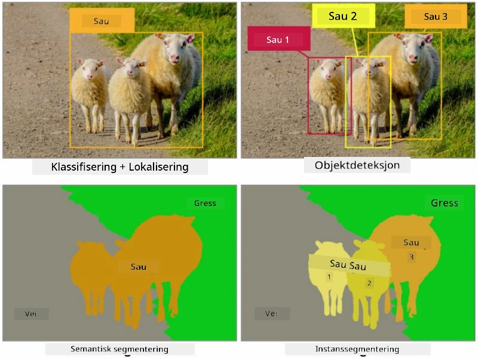
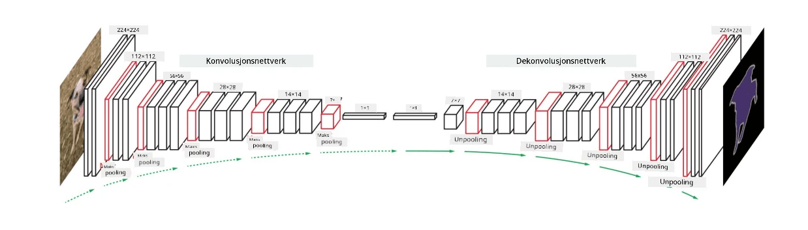

# Segmentering

Vi har tidligere lært om objektdeteksjon, som lar oss lokalisere objekter i et bilde ved å forutsi deres *bounding boxes*. Men for noen oppgaver trenger vi ikke bare bounding boxes, men også mer presis objektlokalisering. Denne oppgaven kalles **segmentering**.

## [Pre-forelesningsquiz](https://ff-quizzes.netlify.app/en/ai/quiz/23)

Segmentering kan sees på som **pikselklassifisering**, der vi for **hver** piksel i bildet må forutsi dens klasse (*bakgrunn* er en av klassene). Det finnes to hovedtyper segmenteringsalgoritmer:

* **Semantisk segmentering** forteller kun pikselklassen og skiller ikke mellom ulike objekter av samme klasse.
* **Instanssegmentering** deler klassene inn i forskjellige instanser.

For instanssegmentering er disse sauene forskjellige objekter, men for semantisk segmentering representeres alle sauene av én klasse.

> Bilde fra [denne bloggposten](https://nirmalamurali.medium.com/image-classification-vs-semantic-segmentation-vs-instance-segmentation-625c33a08d50)

Det finnes ulike nevrale arkitekturer for segmentering, men de har alle samme struktur. På en måte ligner det på autoencoderen du har lært om tidligere, men i stedet for å dekonstruere det originale bildet, er målet vårt å dekonstruere en **maske**. Dermed har et segmenteringsnettverk følgende deler:

* **Encoder** trekker ut funksjoner fra inngangsbilde.
* **Decoder** transformerer disse funksjonene til **maske-bildet**, med samme størrelse og antall kanaler som tilsvarer antall klasser.

> Bilde fra [denne publikasjonen](https://arxiv.org/pdf/2001.05566.pdf)

Vi bør spesielt nevne tapfunksjonen som brukes for segmentering. Når vi bruker klassiske autoencodere, må vi måle likheten mellom to bilder, og vi kan bruke mean square error (MSE) til dette. I segmentering representerer hver piksel i målmaske-bildet klassenumre (one-hot-encoded langs den tredje dimensjonen), så vi må bruke tapfunksjoner spesifikke for klassifisering - kryssentropitap, gjennomsnittlig over alle piksler. Hvis masken er binær, brukes **binært kryssentropitap** (BCE).

> ✅ One-hot encoding er en måte å kode en klasseetikett inn i en vektor med lengde lik antall klasser. Ta en titt på [denne artikkelen](https://datagy.io/sklearn-one-hot-encode/) om denne teknikken.

## Segmentering for medisinsk bildediagnostikk

I denne leksjonen skal vi se segmentering i praksis ved å trene et nettverk til å gjenkjenne menneskelige nevi (også kjent som føflekker) på medisinske bilder. Vi vil bruke <a href="https://www.fc.up.pt/addi/ph2%20database.html">PH2-databasen</a> med dermoskopibilder som bildekilde. Dette datasettet inneholder 200 bilder av tre klasser: typisk nevus, atypisk nevus og melanom. Alle bildene inneholder også en tilsvarende **maske** som avgrenser nevusen.

> ✅ Denne teknikken er spesielt egnet for denne typen medisinsk bildediagnostikk, men hvilke andre virkelige applikasjoner kan du se for deg?

> Bilde fra PH2-databasen

Vi skal trene en modell til å segmentere enhver nevus fra bakgrunnen.

## ✍️ Øvelser: Semantisk segmentering

Åpne notatbøkene nedenfor for å lære mer om ulike semantiske segmenteringsarkitekturer, øve på å jobbe med dem og se dem i aksjon.

* [Semantisk segmentering Pytorch](SemanticSegmentationPytorch.ipynb)
* [Semantisk segmentering TensorFlow](SemanticSegmentationTF.ipynb)

## [Post-forelesningsquiz](https://ff-quizzes.netlify.app/en/ai/quiz/24)

## Konklusjon

Segmentering er en svært kraftig teknikk for bildekategorisering, som går utover bounding boxes til klassifisering på pikselnivå. Det er en teknikk som brukes i medisinsk bildediagnostikk, blant andre applikasjoner.

## 🚀 Utfordring

Kroppssegmentering er bare én av de vanlige oppgavene vi kan utføre med bilder av mennesker. Andre viktige oppgaver inkluderer **skjelettdeteksjon** og **posisjonsdeteksjon**. Prøv ut [OpenPose](https://github.com/CMU-Perceptual-Computing-Lab/openpose)-biblioteket for å se hvordan posisjonsdeteksjon kan brukes.

## Gjennomgang & Selvstudium

Denne [Wikipedia-artikkelen](https://wikipedia.org/wiki/Image_segmentation) gir en god oversikt over de ulike applikasjonene av denne teknikken. Lær mer på egen hånd om underområdene instanssegmentering og panoptisk segmentering innen dette feltet.

## [Oppgave](lab/README.md)

I denne labben kan du prøve **kroppssegmentering** ved å bruke [Segmentation Full Body MADS Dataset](https://www.kaggle.com/datasets/tapakah68/segmentation-full-body-mads-dataset) fra Kaggle.

---

