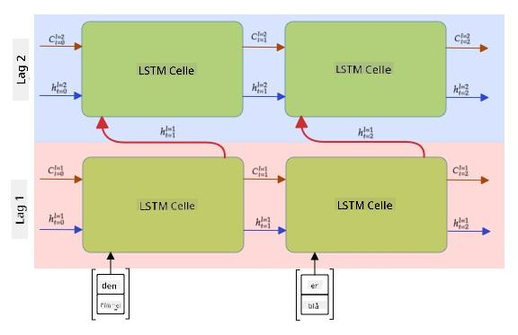

<!--
CO_OP_TRANSLATOR_METADATA:
{
  "original_hash": "58bf4adb210aab53e8f78c8082040e7c",
  "translation_date": "2025-08-28T15:59:55+00:00",
  "source_file": "lessons/5-NLP/16-RNN/README.md",
  "language_code": "no"
}
-->
# Rekurrente Nevrale Nettverk

## [Quiz før forelesning](https://ff-quizzes.netlify.app/en/ai/quiz/31)

I tidligere seksjoner har vi brukt rike semantiske representasjoner av tekst og en enkel lineær klassifikator på toppen av embeddingene. Det denne arkitekturen gjør, er å fange opp den samlede meningen av ordene i en setning, men den tar ikke hensyn til **rekkefølgen** av ordene, fordi aggregeringsoperasjonen på embeddingene fjerner denne informasjonen fra den opprinnelige teksten. Siden disse modellene ikke kan modellere ordrekkefølge, kan de ikke løse mer komplekse eller tvetydige oppgaver som tekstgenerering eller spørsmål-svar.

For å fange opp meningen i en tekstsekvens, må vi bruke en annen nevralt nettverksarkitektur, som kalles et **rekurrent nevralt nettverk**, eller RNN. I et RNN sender vi setningen vår gjennom nettverket ett symbol om gangen, og nettverket produserer en **tilstand**, som vi deretter sender tilbake til nettverket sammen med neste symbol.

> Bilde av forfatteren

Gitt en inngangssekvens av tokens X0,...,Xn, lager RNN en sekvens av nevrale nettverksblokker og trener denne sekvensen ende-til-ende ved hjelp av backpropagation. Hver nettverksblokk tar et par (Xi,Si) som input og produserer Si+1 som resultat. Den endelige tilstanden Sn (eller output Yn) går inn i en lineær klassifikator for å produsere resultatet. Alle nettverksblokkene deler de samme vektene og trenes ende-til-ende med én backpropagation-passering.

Siden tilstandsvektorene S0,...,Sn sendes gjennom nettverket, er det i stand til å lære de sekvensielle avhengighetene mellom ordene. For eksempel, når ordet *ikke* dukker opp et sted i sekvensen, kan det lære å negere visse elementer i tilstandsvektoren, noe som resulterer i negasjon.

> ✅ Siden vektene til alle RNN-blokkene i bildet ovenfor er delte, kan det samme bildet representeres som én blokk (til høyre) med en rekurrent tilbakemeldingssløyfe, som sender nettverkets output-tilstand tilbake til input.

## Anatomien til en RNN-celle

La oss se hvordan en enkel RNN-celle er organisert. Den aksepterer den forrige tilstanden Si-1 og det nåværende symbolet Xi som input, og må produsere output-tilstanden Si (og noen ganger er vi også interessert i en annen output Yi, som i tilfellet med generative nettverk).

En enkel RNN-celle har to vektmatriser inni seg: én som transformerer et input-symbol (vi kaller den W), og en annen som transformerer en input-tilstand (H). I dette tilfellet beregnes output fra nettverket som σ(W×Xi+H×Si-1+b), der σ er aktiveringsfunksjonen og b er en ekstra bias.

> Bilde av forfatteren

I mange tilfeller sendes input-tokens gjennom embedding-laget før de går inn i RNN for å redusere dimensjonaliteten. I dette tilfellet, hvis dimensjonen til input-vektorene er *emb_size*, og tilstandsvektoren er *hid_size* - er størrelsen på W *emb_size*×*hid_size*, og størrelsen på H er *hid_size*×*hid_size*.

## Long Short Term Memory (LSTM)

Et av hovedproblemene med klassiske RNN-er er det såkalte **forsvinnende gradienter**-problemet. Fordi RNN-er trenes ende-til-ende i én backpropagation-passering, har de vanskeligheter med å propagere feil til de første lagene i nettverket, og dermed kan ikke nettverket lære relasjoner mellom fjerne tokens. En av måtene å unngå dette problemet på er å introdusere **eksplisitt tilstandshåndtering** ved å bruke såkalte **porter**. Det finnes to velkjente arkitekturer av denne typen: **Long Short Term Memory** (LSTM) og **Gated Relay Unit** (GRU).

> Bildekilde TBD

LSTM-nettverket er organisert på en måte som ligner på RNN, men det er to tilstander som sendes fra lag til lag: den faktiske tilstanden C og den skjulte vektoren H. Ved hver enhet blir den skjulte vektoren Hi slått sammen med input Xi, og de kontrollerer hva som skjer med tilstanden C via **porter**. Hver port er et nevralt nettverk med sigmoid-aktivering (output i området [0,1]), som kan betraktes som en bitmaske når den multipliseres med tilstandsvektoren. Det finnes følgende porter (fra venstre til høyre på bildet ovenfor):

* **Glemselsporten** tar en skjult vektor og bestemmer hvilke komponenter av vektoren C vi trenger å glemme, og hvilke vi skal beholde.
* **Inputporten** tar noe informasjon fra input- og skjulte vektorer og setter det inn i tilstanden.
* **Outputporten** transformerer tilstanden via et lineært lag med *tanh*-aktivering, og velger deretter noen av komponentene ved hjelp av en skjult vektor Hi for å produsere en ny tilstand Ci+1.

Komponentene i tilstanden C kan betraktes som noen flagg som kan slås av og på. For eksempel, når vi møter et navn som *Alice* i sekvensen, kan vi anta at det refererer til en kvinnelig karakter, og heve flagget i tilstanden som indikerer at vi har et kvinnelig substantiv i setningen. Når vi senere møter frasen *og Tom*, vil vi heve flagget som indikerer at vi har et flertallssubstantiv. Dermed kan vi ved å manipulere tilstanden holde oversikt over de grammatiske egenskapene til setningsdelene.

> ✅ En utmerket ressurs for å forstå det indre av LSTM er denne flotte artikkelen [Understanding LSTM Networks](https://colah.github.io/posts/2015-08-Understanding-LSTMs/) av Christopher Olah.

## Toveis og flerlags RNN-er

Vi har diskutert rekurrente nettverk som opererer i én retning, fra begynnelsen av en sekvens til slutten. Det virker naturlig, fordi det ligner måten vi leser og lytter til tale. Men siden vi i mange praktiske tilfeller har tilfeldig tilgang til inngangssekvensen, kan det være fornuftig å kjøre rekurrent beregning i begge retninger. Slike nettverk kalles **toveis** RNN-er. Når vi arbeider med et toveis nettverk, trenger vi to skjulte tilstandsvektorer, én for hver retning.

Et rekurrent nettverk, enten det er énveis eller toveis, fanger opp visse mønstre i en sekvens og kan lagre dem i en tilstandsvektor eller sende dem til output. Som med konvolusjonsnettverk, kan vi bygge et annet rekurrent lag på toppen av det første for å fange opp høyere nivå mønstre og bygge videre på lavnivåmønstre som det første laget har hentet ut. Dette fører oss til begrepet **flerlags RNN**, som består av to eller flere rekurrente nettverk, der output fra det forrige laget sendes til neste lag som input.

*Bilde fra [denne fantastiske artikkelen](https://towardsdatascience.com/from-a-lstm-cell-to-a-multilayer-lstm-network-with-pytorch-2899eb5696f3) av Fernando López*

## ✍️ Øvelser: Embeddings

Fortsett læringen i følgende notatbøker:

* [RNN-er med PyTorch](RNNPyTorch.ipynb)
* [RNN-er med TensorFlow](RNNTF.ipynb)

## Konklusjon

I denne enheten har vi sett at RNN-er kan brukes til sekvensklassifisering, men de kan faktisk håndtere mange flere oppgaver, som tekstgenerering, maskinoversettelse og mer. Vi vil se nærmere på disse oppgavene i neste enhet.

## 🚀 Utfordring

Les gjennom noe litteratur om LSTM-er og vurder deres anvendelser:

- [Grid Long Short-Term Memory](https://arxiv.org/pdf/1507.01526v1.pdf)
- [Show, Attend and Tell: Neural Image Caption
Generation with Visual Attention](https://arxiv.org/pdf/1502.03044v2.pdf)

## [Quiz etter forelesning](https://ff-quizzes.netlify.app/en/ai/quiz/32)

## Gjennomgang og selvstudium

- [Understanding LSTM Networks](https://colah.github.io/posts/2015-08-Understanding-LSTMs/) av Christopher Olah.

## [Oppgave: Notatbøker](assignment.md)

---

**Ansvarsfraskrivelse**:  
Dette dokumentet er oversatt ved hjelp av AI-oversettelsestjenesten [Co-op Translator](https://github.com/Azure/co-op-translator). Selv om vi streber etter nøyaktighet, vær oppmerksom på at automatiske oversettelser kan inneholde feil eller unøyaktigheter. Det originale dokumentet på sitt opprinnelige språk bør anses som den autoritative kilden. For kritisk informasjon anbefales profesjonell menneskelig oversettelse. Vi er ikke ansvarlige for eventuelle misforståelser eller feiltolkninger som oppstår ved bruk av denne oversettelsen.