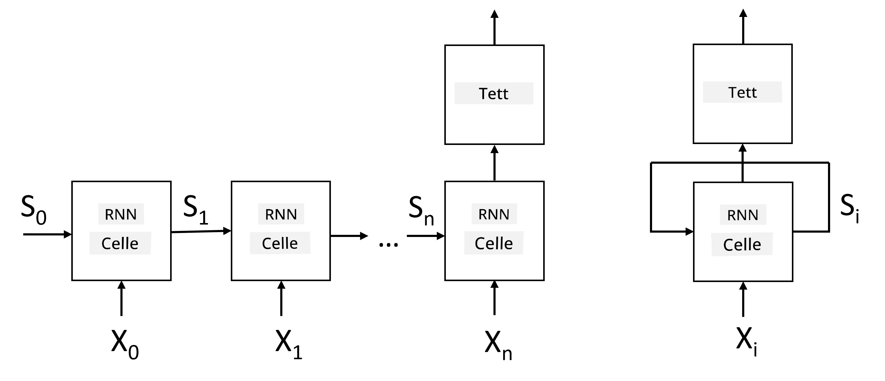
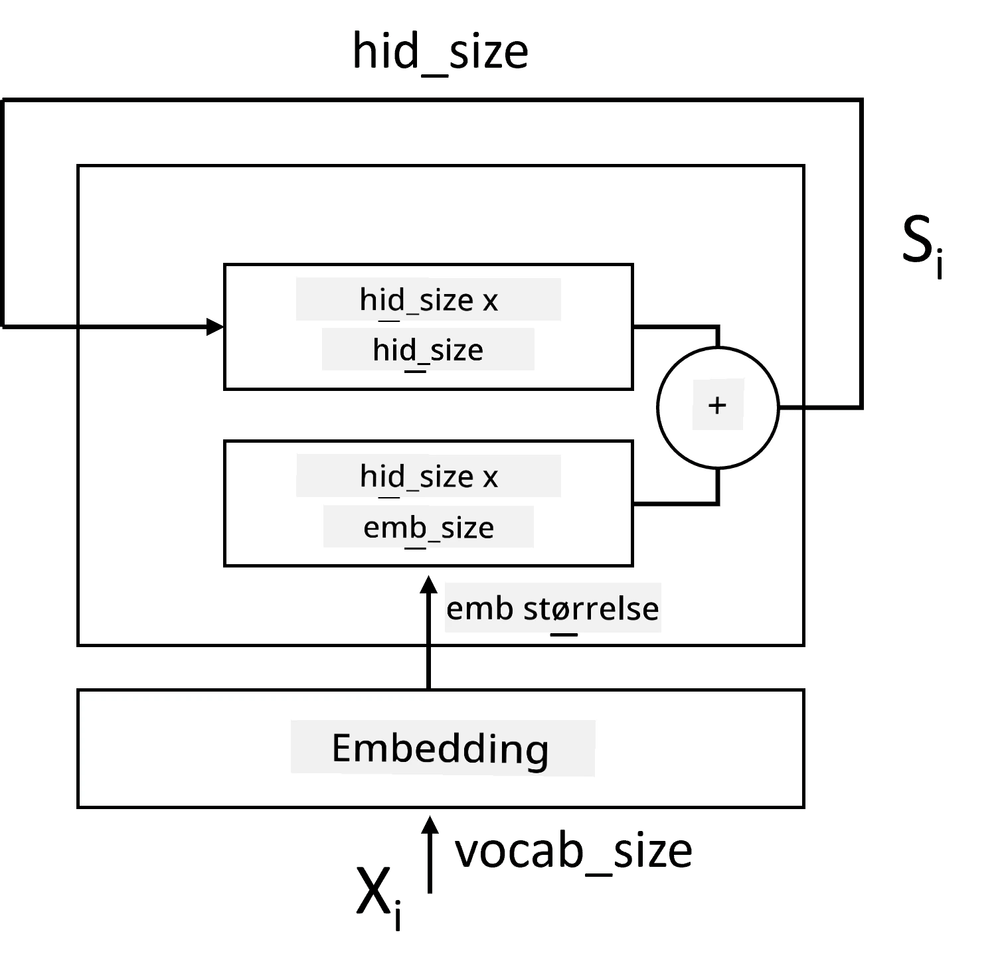
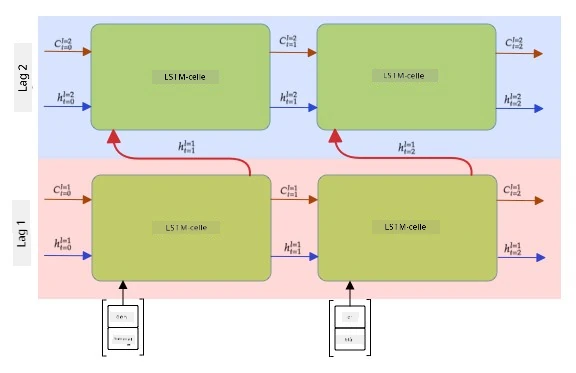

# Rekurrente Nevrale Nettverk

## [Quiz før forelesning](https://ff-quizzes.netlify.app/en/ai/quiz/31)

I tidligere seksjoner har vi brukt rike semantiske representasjoner av tekst og en enkel lineær klassifikator oppå embeddingene. Det denne arkitekturen gjør, er å fange den samlede betydningen av ord i en setning, men den tar ikke hensyn til **rekkefølgen** av ordene, fordi aggregeringsoperasjonen oppå embeddingene fjernet denne informasjonen fra den opprinnelige teksten. Siden disse modellene ikke kan modellere ordrekkefølge, kan de ikke løse mer komplekse eller tvetydige oppgaver som tekstgenerering eller spørsmål-svar.

For å fange betydningen av tekstsekvenser, må vi bruke en annen nevralt nettverksarkitektur, som kalles et **rekurrent nevralt nettverk**, eller RNN. I RNN sender vi setningen vår gjennom nettverket én symbol om gangen, og nettverket produserer en **tilstand**, som vi deretter sender tilbake til nettverket sammen med neste symbol.

> Bilde av forfatteren

Gitt en input-sekvens av tokens X0,...,Xn, skaper RNN en sekvens av nevrale nettverksblokker og trener denne sekvensen ende-til-ende ved hjelp av backpropagation. Hver nettverksblokk tar et par (Xi,Si) som input og produserer Si+1 som resultat. Den endelige tilstanden Sn eller (output Yn) går inn i en lineær klassifikator for å produsere resultatet. Alle nettverksblokkene deler de samme vektene og trenes ende-til-ende med én backpropagation-passering.

Siden tilstandsvektorene S0,...,Sn sendes gjennom nettverket, er det i stand til å lære de sekvensielle avhengighetene mellom ord. For eksempel, når ordet *ikke* dukker opp et sted i sekvensen, kan det lære å negere visse elementer i tilstandsvektoren, noe som resulterer i negasjon.

> ✅ Siden vektene til alle RNN-blokkene på bildet ovenfor er delt, kan det samme bildet representeres som én blokk (til høyre) med en rekurrent tilbakemeldingssløyfe, som sender nettverkets output-tilstand tilbake til input.

## Anatomien til en RNN-celle

La oss se hvordan en enkel RNN-celle er organisert. Den aksepterer den forrige tilstanden Si-1 og nåværende symbol Xi som input, og må produsere output-tilstanden Si (og noen ganger er vi også interessert i en annen output Yi, som i tilfelle med generative nettverk).

En enkel RNN-celle har to vektmatriser inni: én transformerer et input-symbol (la oss kalle den W), og en annen transformerer en input-tilstand (H). I dette tilfellet beregnes output fra nettverket som &sigma;(W&times;Xi+H&times;Si-1+b), der &sigma; er aktiveringsfunksjonen og b er en ekstra bias.

> Bilde av forfatteren

I mange tilfeller sendes input-tokens gjennom embedding-laget før de går inn i RNN for å redusere dimensjonaliteten. I dette tilfellet, hvis dimensjonen til input-vektorene er *emb_size*, og tilstandsvektoren er *hid_size* - er størrelsen på W *emb_size*&times;*hid_size*, og størrelsen på H er *hid_size*&times;*hid_size*.

## Long Short Term Memory (LSTM)

Et av hovedproblemene med klassiske RNN-er er det såkalte **vanishing gradients**-problemet. Fordi RNN-er trenes ende-til-ende i én backpropagation-passering, har de vanskeligheter med å propagere feil til de første lagene i nettverket, og dermed kan ikke nettverket lære relasjoner mellom fjerne tokens. En av måtene å unngå dette problemet på er å introdusere **eksplisitt tilstandshåndtering** ved å bruke såkalte **porter**. Det finnes to velkjente arkitekturer av denne typen: **Long Short Term Memory** (LSTM) og **Gated Relay Unit** (GRU).

> Bildekilde TBD

LSTM-nettverket er organisert på en måte som ligner på RNN, men det er to tilstander som sendes fra lag til lag: den faktiske tilstanden C og den skjulte vektoren H. Ved hver enhet blir den skjulte vektoren Hi kombinert med input Xi, og de kontrollerer hva som skjer med tilstanden C via **porter**. Hver port er et nevralt nettverk med sigmoid-aktivering (output i området [0,1]), som kan betraktes som en bitvis maske når den multipliseres med tilstandsvektoren. Det finnes følgende porter (fra venstre til høyre på bildet ovenfor):

* **Forget gate** tar en skjult vektor og bestemmer hvilke komponenter av vektoren C vi må glemme, og hvilke vi skal sende videre.
* **Input gate** tar noe informasjon fra input- og skjulte vektorer og setter det inn i tilstanden.
* **Output gate** transformerer tilstanden via et lineært lag med *tanh*-aktivering, og velger deretter noen av komponentene ved hjelp av en skjult vektor Hi for å produsere en ny tilstand Ci+1.

Komponenter av tilstanden C kan betraktes som noen flagg som kan slås av og på. For eksempel, når vi møter navnet *Alice* i sekvensen, kan vi anta at det refererer til en kvinnelig karakter, og sette opp flagget i tilstanden som indikerer at vi har et kvinnelig substantiv i setningen. Når vi senere møter frasen *og Tom*, vil vi sette opp flagget som indikerer at vi har et flertall substantiv. Dermed kan vi ved å manipulere tilstanden holde oversikt over de grammatiske egenskapene til setningsdeler.

> ✅ En utmerket ressurs for å forstå LSTM er denne flotte artikkelen [Understanding LSTM Networks](https://colah.github.io/posts/2015-08-Understanding-LSTMs/) av Christopher Olah.

## Bidireksjonale og flerlags RNN-er

Vi har diskutert rekurrente nettverk som opererer i én retning, fra begynnelsen av en sekvens til slutten. Det virker naturlig, fordi det ligner på måten vi leser og lytter til tale. Men siden vi i mange praktiske tilfeller har tilfeldig tilgang til input-sekvensen, kan det være fornuftig å kjøre rekurrent beregning i begge retninger. Slike nettverk kalles **bidireksjonale** RNN-er. Når vi arbeider med et bidireksjonalt nettverk, trenger vi to skjulte tilstandsvektorer, én for hver retning.

Et rekurrent nettverk, enten én-retning eller bidireksjonalt, fanger visse mønstre innen en sekvens og kan lagre dem i en tilstandsvektor eller sende dem til output. Som med konvolusjonsnettverk, kan vi bygge et annet rekurrent lag oppå det første for å fange høyere nivå mønstre og bygge fra lavnivå mønstre som er hentet ut av det første laget. Dette leder oss til begrepet **flerlags RNN**, som består av to eller flere rekurrente nettverk, der output fra det forrige laget sendes til neste lag som input.

*Bilde fra [denne fantastiske posten](https://towardsdatascience.com/from-a-lstm-cell-to-a-multilayer-lstm-network-with-pytorch-2899eb5696f3) av Fernando López*

## ✍️ Øvelser: Embeddings

Fortsett læringen i følgende notatbøker:

* [RNN-er med PyTorch](RNNPyTorch.ipynb)
* [RNN-er med TensorFlow](RNNTF.ipynb)

## Konklusjon

I denne enheten har vi sett at RNN-er kan brukes til sekvensklassifisering, men faktisk kan de håndtere mange flere oppgaver, som tekstgenerering, maskinoversettelse og mer. Vi vil se nærmere på disse oppgavene i neste enhet.

## 🚀 Utfordring

Les gjennom noe litteratur om LSTM-er og vurder deres anvendelser:

- [Grid Long Short-Term Memory](https://arxiv.org/pdf/1507.01526v1.pdf)
- [Show, Attend and Tell: Neural Image Caption
Generation with Visual Attention](https://arxiv.org/pdf/1502.03044v2.pdf)

## [Quiz etter forelesning](https://ff-quizzes.netlify.app/en/ai/quiz/32)

## Gjennomgang & Selvstudium

- [Understanding LSTM Networks](https://colah.github.io/posts/2015-08-Understanding-LSTMs/) av Christopher Olah.

## [Oppgave: Notatbøker](assignment.md)

---

