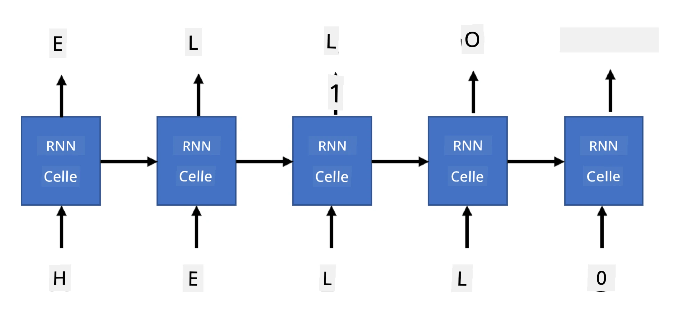

# Generative nettverk

## [Quiz før forelesning](https://ff-quizzes.netlify.app/en/ai/quiz/33)

Rekurrente nevrale nettverk (RNNs) og deres gatede cellevarianter som Long Short Term Memory Cells (LSTMs) og Gated Recurrent Units (GRUs) gir en mekanisme for språkmodellering ved at de kan lære ordrekkefølge og gi prediksjoner for neste ord i en sekvens. Dette gjør det mulig å bruke RNNs til **generative oppgaver**, som vanlig tekstgenerering, maskinoversettelse og til og med bildetekstgenerering.

> ✅ Tenk på alle gangene du har dratt nytte av generative oppgaver, som tekstfullføring mens du skriver. Undersøk dine favorittapplikasjoner for å se om de har brukt RNNs.

I RNN-arkitekturen vi diskuterte i forrige enhet, produserte hver RNN-enhet den neste skjulte tilstanden som et output. Men vi kan også legge til en annen output til hver rekurrente enhet, som gjør det mulig å generere en **sekvens** (som er like lang som den opprinnelige sekvensen). Videre kan vi bruke RNN-enheter som ikke tar imot input ved hvert steg, men bare tar en initial tilstandsvektor og deretter produserer en sekvens av outputs.

Dette åpner for ulike nevrale arkitekturer som vist i bildet nedenfor:


> Bilde fra blogginnlegget [Unreasonable Effectiveness of Recurrent Neural Networks](http://karpathy.github.io/2015/05/21/rnn-effectiveness/) av [Andrej Karpaty](http://karpathy.github.io/)

* **En-til-en** er et tradisjonelt nevralt nettverk med én input og én output
* **En-til-mange** er en generativ arkitektur som tar én input-verdi og genererer en sekvens av output-verdier. For eksempel, hvis vi ønsker å trene et **bildetekstnettverk** som genererer en tekstbeskrivelse av et bilde, kan vi ta et bilde som input, sende det gjennom en CNN for å få en skjult tilstand, og deretter la en rekurrent kjede generere tekst ord for ord.
* **Mange-til-en** tilsvarer RNN-arkitekturer vi beskrev i forrige enhet, som tekstklassifisering.
* **Mange-til-mange**, eller **sekvens-til-sekvens**, tilsvarer oppgaver som **maskinoversettelse**, der vi først har en RNN som samler all informasjon fra input-sekvensen inn i den skjulte tilstanden, og en annen RNN-kjede som ruller ut denne tilstanden til output-sekvensen.

I denne enheten vil vi fokusere på enkle generative modeller som hjelper oss med å generere tekst. For enkelhets skyld vil vi bruke tegnbasert tokenisering.

Vi vil trene denne RNN-en til å generere tekst steg for steg. På hvert steg tar vi en sekvens av tegn med lengde `nchars` og ber nettverket generere neste output-tegn for hvert input-tegn:



Når vi genererer tekst (under inferens), starter vi med en **prompt**, som sendes gjennom RNN-celler for å generere dens mellomliggende tilstand, og deretter starter genereringen fra denne tilstanden. Vi genererer ett tegn om gangen og sender tilstanden og det genererte tegnet til en annen RNN-celle for å generere det neste, helt til vi har generert nok tegn.


> Bilde av forfatteren

## ✍️ Øvelser: Generative nettverk

Fortsett læringen i følgende notatbøker:

* [Generative nettverk med PyTorch](GenerativePyTorch.ipynb)
* [Generative nettverk med TensorFlow](GenerativeTF.ipynb)

## Myk tekstgenerering og temperatur

Outputen fra hver RNN-celle er en sannsynlighetsfordeling av tegn. Hvis vi alltid velger tegnet med høyest sannsynlighet som neste tegn i generert tekst, kan teksten ofte bli "syklisk" mellom de samme tegnsekvensene igjen og igjen, som i dette eksempelet:

```
today of the second the company and a second the company ...
```

Men hvis vi ser på sannsynlighetsfordelingen for neste tegn, kan det være at forskjellen mellom noen av de høyeste sannsynlighetene ikke er stor, f.eks. ett tegn kan ha sannsynlighet 0.2, et annet - 0.19, osv. For eksempel, når vi ser etter neste tegn i sekvensen '*play*', kan neste tegn like gjerne være et mellomrom eller **e** (som i ordet *player*).

Dette leder oss til konklusjonen at det ikke alltid er "rettferdig" å velge tegnet med høyest sannsynlighet, fordi det å velge det nest høyeste fortsatt kan føre til meningsfull tekst. Det er mer fornuftig å **samle** tegn fra sannsynlighetsfordelingen gitt av nettverksoutputen. Vi kan også bruke en parameter, **temperatur**, som vil jevne ut sannsynlighetsfordelingen hvis vi ønsker å legge til mer tilfeldighet, eller gjøre den brattere hvis vi vil holde oss mer til tegnene med høyest sannsynlighet.

Utforsk hvordan denne myke tekstgenereringen er implementert i notatbøkene som er lenket ovenfor.

## Konklusjon

Selv om tekstgenerering kan være nyttig i seg selv, kommer de største fordelene fra evnen til å generere tekst ved hjelp av RNNs fra en initial funksjonsvektor. For eksempel brukes tekstgenerering som en del av maskinoversettelse (sekvens-til-sekvens, i dette tilfellet brukes tilstandsvektoren fra *encoder* til å generere eller *dekode* den oversatte meldingen), eller til å generere tekstbeskrivelser av et bilde (i dette tilfellet vil funksjonsvektoren komme fra CNN-ekstraktoren).

## 🚀 Utfordring

Ta noen leksjoner på Microsoft Learn om dette emnet

* Tekstgenerering med [PyTorch](https://docs.microsoft.com/learn/modules/intro-natural-language-processing-pytorch/6-generative-networks/?WT.mc_id=academic-77998-cacaste)/[TensorFlow](https://docs.microsoft.com/learn/modules/intro-natural-language-processing-tensorflow/5-generative-networks/?WT.mc_id=academic-77998-cacaste)

## [Quiz etter forelesning](https://ff-quizzes.netlify.app/en/ai/quiz/34)

## Gjennomgang & Selvstudium

Her er noen artikler for å utvide kunnskapen din

* Ulike tilnærminger til tekstgenerering med Markov Chain, LSTM og GPT-2: [blogginnlegg](https://towardsdatascience.com/text-generation-gpt-2-lstm-markov-chain-9ea371820e1e)
* Eksempel på tekstgenerering i [Keras-dokumentasjon](https://keras.io/examples/generative/lstm_character_level_text_generation/)

## [Oppgave](lab/README.md)

Vi har sett hvordan man genererer tekst tegn-for-tegn. I laboratoriet vil du utforske tekstgenerering på ordnivå.

---

