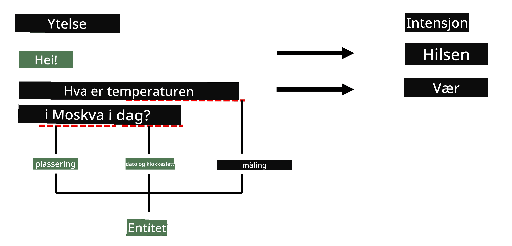

# Navngitt Enhetsgjenkjenning

Hittil har vi stort sett fokusert på én NLP-oppgave - klassifisering. Det finnes imidlertid også andre NLP-oppgaver som kan løses med nevrale nettverk. En av disse oppgavene er **[Navngitt Enhetsgjenkjenning](https://wikipedia.org/wiki/Named-entity_recognition)** (NER), som handler om å gjenkjenne spesifikke enheter i tekst, som steder, personnavn, tidsintervaller, kjemiske formler og lignende.

## [Quiz før forelesning](https://ff-quizzes.netlify.app/en/ai/quiz/37)

## Eksempel på bruk av NER

La oss si at du ønsker å utvikle en naturlig språk-chatbot, lik Amazon Alexa eller Google Assistant. Intelligente chatboter fungerer ved å *forstå* hva brukeren ønsker, gjennom tekstklassifisering av den innsendte setningen. Resultatet av denne klassifiseringen er den såkalte **intensjonen**, som avgjør hva chatboten skal gjøre.

> Bilde av forfatteren

En bruker kan imidlertid oppgi noen parametere som en del av setningen. For eksempel, når hun spør om været, kan hun spesifisere et sted eller en dato. En bot bør kunne forstå disse enhetene og fylle ut parameterfeltene tilsvarende før den utfører handlingen. Det er nettopp her NER kommer inn.

> ✅ Et annet eksempel kan være [analyse av vitenskapelige medisinske artikler](https://soshnikov.com/science/analyzing-medical-papers-with-azure-and-text-analytics-for-health/). En av hovedoppgavene er å finne spesifikke medisinske termer, som sykdommer og medisinske stoffer. Mens et lite antall sykdommer kanskje kan trekkes ut ved hjelp av substring-søk, krever mer komplekse enheter, som kjemiske forbindelser og medikamentnavn, en mer avansert tilnærming.

## NER som Tokenklassifisering

NER-modeller er i hovedsak **tokenklassifiseringsmodeller**, fordi vi for hver av input-tokenene må avgjøre om den tilhører en enhet eller ikke, og hvis den gjør det - hvilken enhetsklasse den tilhører.

Se for deg følgende artikkeltittel:

**Trikuspidalklaff-regurgitasjon** og **litiumkarbonat** **toksisitet** hos et nyfødt barn.

Enhetene her er:

* Trikuspidalklaff-regurgitasjon er en sykdom (`DIS`)
* Litiumkarbonat er et kjemisk stoff (`CHEM`)
* Toksisitet er også en sykdom (`DIS`)

Merk at én enhet kan strekke seg over flere tokens. Og, som i dette tilfellet, må vi skille mellom to påfølgende enheter. Derfor er det vanlig å bruke to klasser for hver enhet - én som spesifiserer den første tokenen i enheten (ofte brukes prefikset `B-` for **b**egynnelse), og en annen for fortsettelsen av en enhet (`I-`, for **i**nner token). Vi bruker også `O` som en klasse for å representere alle **a**ndre tokens. Slik tokenmerking kalles [BIO-merking](https://en.wikipedia.org/wiki/Inside%E2%80%93outside%E2%80%93beginning_(tagging)) (eller IOB). Når merket, vil tittelen vår se slik ut:

Token | Tag
------|-----
Trikuspidalklaff | B-DIS
regurgitasjon | I-DIS
og | O
litium | B-CHEM
karbonat | I-CHEM
toksisitet | B-DIS
hos | O
et | O
nyfødt | O
barn | O
. | O

Siden vi må bygge en én-til-én korrespondanse mellom tokens og klasser, kan vi trene en høyreorientert **mange-til-mange** nevralt nettverksmodell fra dette bildet:

> *Bilde fra [denne bloggposten](http://karpathy.github.io/2015/05/21/rnn-effectiveness/) av [Andrej Karpathy](http://karpathy.github.io/). NER-tokenklassifiseringsmodeller tilsvarer nettverksarkitekturen lengst til høyre på dette bildet.*

## Trening av NER-modeller

Siden en NER-modell i hovedsak er en tokenklassifiseringsmodell, kan vi bruke RNN-er som vi allerede er kjent med for denne oppgaven. I dette tilfellet vil hver blokk i det rekurrente nettverket returnere token-ID-en. Følgende eksempelnotatbok viser hvordan man trener en LSTM for tokenklassifisering.

## ✍️ Eksempelnotatbøker: NER

Fortsett læringen i følgende notatbok:

* [NER med TensorFlow](NER-TF.ipynb)

## Konklusjon

En NER-modell er en **tokenklassifiseringsmodell**, noe som betyr at den kan brukes til å utføre tokenklassifisering. Dette er en svært vanlig oppgave innen NLP, som hjelper til med å gjenkjenne spesifikke enheter i tekst, inkludert steder, navn, datoer og mer.

## 🚀 Utfordring

Fullfør oppgaven som er lenket nedenfor for å trene en modell for navngitt enhetsgjenkjenning av medisinske termer, og prøv den deretter på et annet datasett.

## [Quiz etter forelesning](https://ff-quizzes.netlify.app/en/ai/quiz/38)

## Gjennomgang og Selvstudium

Les gjennom bloggen [The Unreasonable Effectiveness of Recurrent Neural Networks](http://karpathy.github.io/2015/05/21/rnn-effectiveness/) og følg med på delen for videre lesing i den artikkelen for å fordype kunnskapen din.

## [Oppgave](lab/README.md)

I oppgaven for denne leksjonen skal du trene en modell for medisinsk enhetsgjenkjenning. Du kan starte med å trene en LSTM-modell som beskrevet i denne leksjonen, og deretter gå videre til å bruke BERT-transformermodellen. Les [instruksjonene](lab/README.md) for å få alle detaljene.

---

