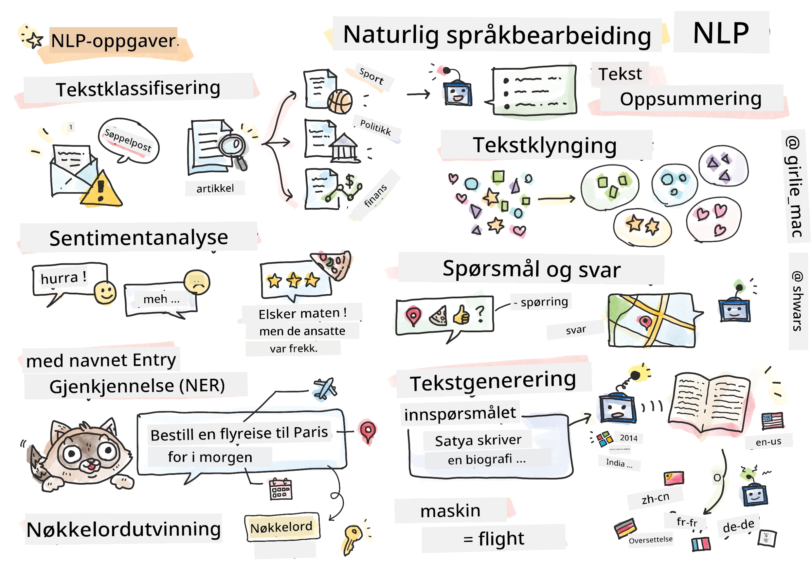

# Naturlig Språkbehandling



I denne delen vil vi fokusere på å bruke nevrale nettverk for å håndtere oppgaver relatert til **Naturlig Språkbehandling (NLP)**. Det finnes mange NLP-problemer vi ønsker at datamaskiner skal kunne løse:

* **Tekstklassifisering** er et typisk klassifiseringsproblem som gjelder tekstsekvenser. Eksempler inkluderer å klassifisere e-postmeldinger som spam eller ikke-spam, eller å kategorisere artikler som sport, økonomi, politikk osv. Når vi utvikler chatboter, må vi ofte forstå hva en bruker ønsker å si – i dette tilfellet håndterer vi **intensjonsklassifisering**. Ofte må vi i intensjonsklassifisering håndtere mange kategorier.
* **Sentimentanalyse** er et typisk regresjonsproblem, der vi må tilordne et tall (et sentiment) som tilsvarer hvor positivt/negativt meningen med en setning er. En mer avansert versjon av sentimentanalyse er **aspektbasert sentimentanalyse** (ABSA), der vi tilordner sentiment ikke til hele setningen, men til ulike deler av den (aspekter), f.eks. *På denne restauranten likte jeg maten, men atmosfæren var forferdelig*.
* **Navngitt enhetsgjenkjenning** (NER) refererer til problemet med å trekke ut visse enheter fra tekst. For eksempel kan vi trenge å forstå at i setningen *Jeg må fly til Paris i morgen* refererer ordet *i morgen* til DATO, og *Paris* er en LOKASJON.  
* **Nøkkelorduttrekking** ligner på NER, men vi må automatisk trekke ut ord som er viktige for meningen med setningen, uten forhåndstrening for spesifikke enhetstyper.
* **Tekstklustering** kan være nyttig når vi ønsker å gruppere sammen lignende setninger, for eksempel lignende forespørsler i tekniske support-samtaler.
* **Spørsmål og svar** refererer til en modells evne til å svare på et spesifikt spørsmål. Modellen mottar en tekstpassasje og et spørsmål som input, og den må angi et sted i teksten der svaret på spørsmålet finnes (eller, noen ganger, generere selve svaret).
* **Tekstgenerering** er en modells evne til å generere ny tekst. Det kan betraktes som en klassifiseringsoppgave som forutsier neste bokstav/ord basert på en *tekstprompt*. Avanserte tekstgenereringsmodeller, som GPT-3, kan løse andre NLP-oppgaver som klassifisering ved hjelp av en teknikk kalt [prompt-programmering](https://towardsdatascience.com/software-3-0-how-prompting-will-change-the-rules-of-the-game-a982fbfe1e0) eller [prompt-engineering](https://medium.com/swlh/openai-gpt-3-and-prompt-engineering-dcdc2c5fcd29).
* **Tekstoppsummering** er en teknikk der vi ønsker at en datamaskin skal "lese" lang tekst og oppsummere den i noen få setninger.
* **Maskinoversettelse** kan sees på som en kombinasjon av tekstforståelse på ett språk og tekstgenerering på et annet.

Opprinnelig ble de fleste NLP-oppgaver løst ved hjelp av tradisjonelle metoder som grammatikk. For eksempel ble det i maskinoversettelse brukt parsere for å transformere en opprinnelig setning til et syntakstre, deretter ble høyere nivå semantiske strukturer hentet ut for å representere meningen med setningen, og basert på denne meningen og grammatikken til målspråket ble resultatet generert. I dag løses mange NLP-oppgaver mer effektivt ved hjelp av nevrale nettverk.

> Mange klassiske NLP-metoder er implementert i Python-biblioteket [Natural Language Processing Toolkit (NLTK)](https://www.nltk.org). Det finnes en flott [NLTK-bok](https://www.nltk.org/book/) tilgjengelig online som dekker hvordan ulike NLP-oppgaver kan løses ved hjelp av NLTK.

I dette kurset vil vi hovedsakelig fokusere på å bruke nevrale nettverk for NLP, og vi vil bruke NLTK der det er nødvendig.

Vi har allerede lært om å bruke nevrale nettverk for å håndtere tabulardata og bilder. Den største forskjellen mellom disse datatypene og tekst er at tekst er en sekvens med variabel lengde, mens inputstørrelsen i tilfelle bilder er kjent på forhånd. Selv om konvolusjonsnettverk kan trekke ut mønstre fra inputdata, er mønstre i tekst mer komplekse. For eksempel kan negasjon være adskilt fra subjektet med et vilkårlig antall ord (f.eks. *Jeg liker ikke appelsiner* vs. *Jeg liker ikke de store fargerike smakfulle appelsinene*), og det bør fortsatt tolkes som ett mønster. Derfor trenger vi nye typer nevrale nettverk for å håndtere språk, som *rekurrente nettverk* og *transformatorer*.

## Installere Biblioteker

Hvis du bruker en lokal Python-installasjon for å kjøre dette kurset, kan det hende du må installere alle nødvendige biblioteker for NLP ved hjelp av følgende kommandoer:

**For PyTorch**  
```bash
pip install -r requirements-torch.txt
```  
**For TensorFlow**  
```bash
pip install -r requirements-tf.txt
```  

> Du kan prøve NLP med TensorFlow på [Microsoft Learn](https://docs.microsoft.com/learn/modules/intro-natural-language-processing-tensorflow/?WT.mc_id=academic-77998-cacaste)

## GPU-Advarsel

I denne delen vil vi i noen av eksemplene trene ganske store modeller.
* **Bruk en datamaskin med GPU**: Det anbefales å kjøre notatbøkene dine på en datamaskin med GPU for å redusere ventetiden når du arbeider med store modeller.
* **Begrensninger i GPU-minne**: Å kjøre på en GPU kan føre til situasjoner der du går tom for GPU-minne, spesielt når du trener store modeller.
* **GPU-minneforbruk**: Mengden GPU-minne som forbrukes under trening avhenger av ulike faktorer, inkludert minibatch-størrelsen.
* **Minimer minibatch-størrelse**: Hvis du opplever problemer med GPU-minne, vurder å redusere minibatch-størrelsen i koden din som en mulig løsning.
* **TensorFlow GPU-minnefrigjøring**: Eldre versjoner av TensorFlow kan ha problemer med å frigjøre GPU-minne riktig når du trener flere modeller i én Python-kjerne. For å håndtere GPU-minnebruk effektivt kan du konfigurere TensorFlow til å allokere GPU-minne kun etter behov.
* **Kodeinkludering**: For å sette opp TensorFlow til å vokse GPU-minneallokering kun når det er nødvendig, inkluder følgende kode i notatbøkene dine:

```python
physical_devices = tf.config.list_physical_devices('GPU') 
if len(physical_devices)>0:
    tf.config.experimental.set_memory_growth(physical_devices[0], True) 
```

Hvis du er interessert i å lære om NLP fra et klassisk maskinlæringsperspektiv, besøk [denne samlingen av leksjoner](https://github.com/microsoft/ML-For-Beginners/tree/main/6-NLP).

## I denne delen
I denne delen skal vi lære om:

* [Representere tekst som tensorer](13-TextRep/README.md)
* [Ord-embedding](14-Emdeddings/README.md)
* [Språkmodellering](15-LanguageModeling/README.md)
* [Rekurrente nevrale nettverk](16-RNN/README.md)
* [Generative nettverk](17-GenerativeNetworks/README.md)
* [Transformatorer](18-Transformers/README.md)

---

**Ansvarsfraskrivelse**:  
Dette dokumentet er oversatt ved hjelp av AI-oversettelsestjenesten [Co-op Translator](https://github.com/Azure/co-op-translator). Selv om vi tilstreber nøyaktighet, vennligst vær oppmerksom på at automatiske oversettelser kan inneholde feil eller unøyaktigheter. Det originale dokumentet på sitt opprinnelige språk bør anses som den autoritative kilden. For kritisk informasjon anbefales profesjonell menneskelig oversettelse. Vi er ikke ansvarlige for eventuelle misforståelser eller feiltolkninger som oppstår ved bruk av denne oversettelsen.