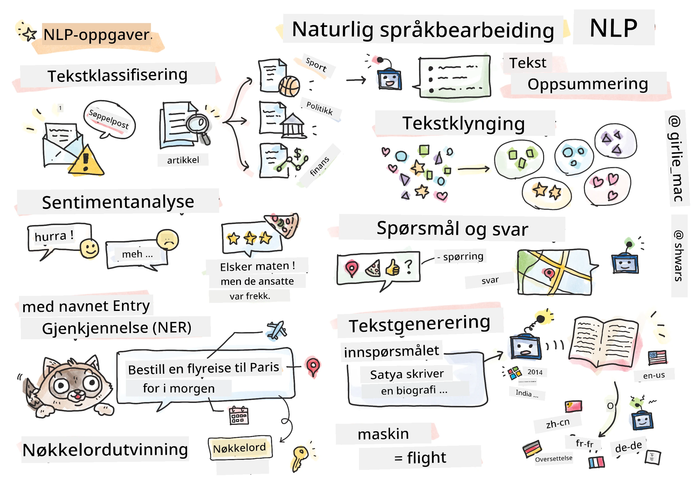

# Naturlig Språkbehandling



I denne seksjonen vil vi fokusere på å bruke nevrale nettverk for å håndtere oppgaver relatert til **Naturlig Språkbehandling (NLP)**. Det finnes mange NLP-problemer vi ønsker at datamaskiner skal kunne løse:

* **Tekstklassifisering** er et typisk klassifiseringsproblem knyttet til tekstsekvenser. Eksempler inkluderer å klassifisere e-postmeldinger som spam vs. ikke-spam, eller kategorisere artikler som sport, næringsliv, politikk, osv. Også når man utvikler chatteboter, trenger man ofte å forstå hva en bruker ønsket å si – i dette tilfellet håndterer vi **intensjonsklassifisering**. Ofte i intensjonsklassifisering må man håndtere mange kategorier.
* **Sentimentanalyse** er et typisk regresjonsproblem, hvor vi må tilordne et tall (et sentiment) som tilsvarer hvor positivt/negativt meningen i en setning er. En mer avansert versjon av sentimentanalyse er **aspektbasert sentimentanalyse** (ABSA), hvor vi tilordner sentiment ikke til hele setningen, men til forskjellige deler av den (aspekter), f.eks. *I denne restauranten likte jeg maten, men atmosfæren var forferdelig*.
* **Navngitt enhetsgjenkjenning** (NER) refererer til problemet med å trekke ut bestemte enheter fra tekst. For eksempel kan vi trenge å forstå at i uttrykket *Jeg må fly til Paris i morgen* refererer ordet *i morgen* til DATO, og *Paris* er et STED.  
* **Nøkkelorduttrekk** er likt NER, men vi må automatisk trekke ut ord som er viktige for meningen i setningen, uten forhåndstrening for spesifikke enhetstyper.
* **Tekstgruppering** kan være nyttig når vi ønsker å gruppere sammen lignende setninger, for eksempel lignende forespørsler i teknisk support-konversasjoner.
* **Spørsmål og svar** refererer til en modells evne til å svare på et spesifikt spørsmål. Modellen mottar en tekstpassasje og et spørsmål som input, og må finne et sted i teksten hvor svaret på spørsmålet finnes (eller noen ganger generere svaret som tekst).
* **Tekstgenerering** er evnen til at en modell kan generere ny tekst. Det kan betraktes som en klassifiseringsoppgave som predikerer neste bokstav/ord basert på et *tekstprompt*. Avanserte modeller for tekstgenerering, som GPT-3, kan løse andre NLP-oppgaver som klassifisering ved hjelp av en teknikk kalt [promptprogrammering](https://towardsdatascience.com/software-3-0-how-prompting-will-change-the-rules-of-the-game-a982fbfe1e0) eller [prompt engineering](https://medium.com/swlh/openai-gpt-3-and-prompt-engineering-dcdc2c5fcd29)
* **Tekstoppsummering** er en teknikk hvor vi ønsker at en datamaskin skal "lese" lang tekst og oppsummere den i noen få setninger.
* **Maskinoversettelse** kan sees på som en kombinasjon av tekstforståelse på ett språk og tekstgenerering på et annet språk.

I begynnelsen ble de fleste NLP-oppgaver løst ved hjelp av tradisjonelle metoder som grammatikk. For eksempel, i maskinoversettelse ble parser brukt for å omdanne setninger til et syntakstre, deretter ble høyere semantiske strukturer uttrukket for å representere setningens mening, og basert på denne betydningen og målrettsspråkets grammatikk ble resultatet generert. I dag løses mange NLP-oppgaver mer effektivt ved hjelp av nevrale nettverk.

> Mange klassiske NLP-metoder er implementert i [Natural Language Processing Toolkit (NLTK)](https://www.nltk.org) Python-biblioteket. Det finnes en flott [NLTK-bok](https://www.nltk.org/book/) tilgjengelig online som dekker hvordan forskjellige NLP-oppgaver kan løses ved hjelp av NLTK.

I vårt kurs vil vi hovedsakelig fokusere på å bruke nevrale nettverk for NLP, og vi vil bruke NLTK der det er nødvendig.

Vi har allerede lært om bruk av nevrale nettverk for behandling av tabulære data og bilder. Hovedforskjellen mellom disse datatypene og tekst er at tekst er en sekvens med variabel lengde, mens inngangsstørrelsen i tilfelle bilder er kjent på forhånd. Mens konvolusjonsnettverk kan trekke ut mønstre fra inngangsdata, er mønstrene i tekst mer komplekse. For eksempel kan negasjon være atskilt fra subjektet av et vilkårlig antall ord (f.eks. *Jeg liker ikke appelsiner* vs. *Jeg liker ikke de store fargerike smakfulle appelsinene*), og det skal fortsatt tolkes som ett mønster. Derfor trenger vi nye typer nevrale nettverk for å håndtere språk, slik som *rekurrente nettverk* og *transformere*.

## Installer biblioteker

Hvis du bruker lokal Python-installasjon for å kjøre dette kurset, kan det hende du må installere alle nødvendige biblioteker for NLP ved å bruke følgende kommandoer:

**For PyTorch**
```bash
pip install -r requirements-pytorch.txt
```
**For TensorFlow**
```bash
pip install -r requirements-tf.txt
```

> Du kan prøve NLP med TensorFlow på [Microsoft Learn](https://docs.microsoft.com/learn/modules/intro-natural-language-processing-tensorflow/?WT.mc_id=academic-77998-cacaste)

## GPU-advarsel

I denne seksjonen vil vi i noen av eksemplene trene ganske store modeller.
* **Bruk en datamaskin med GPU**: Det anbefales å kjøre notatbøkene dine på en datamaskin med GPU for å redusere ventetider når du jobber med store modeller.
* **GPU-minnebegrensninger**: Kjøring på GPU kan føre til situasjoner hvor du går tom for GPU-minne, spesielt når du trener store modeller.
* **Forbruk av GPU-minne**: Mengden GPU-minne som brukes under trening avhenger av forskjellige faktorer, inkludert minibatch-størrelse.
* **Minimer minibatch-størrelse**: Hvis du opplever problemer med GPU-minne, vurder å redusere minibatch-størrelsen i koden din som en potensiell løsning.
* **Frigjøring av GPU-minne i TensorFlow**: Eldre versjoner av TensorFlow frigjør kanskje ikke GPU-minne korrekt når flere modeller trenes i én Python-kjerne. For å håndtere GPU-minnebruk effektivt kan du konfigurere TensorFlow til å tildele GPU-minne bare etter behov.
* **Inkludering av kode**: For å sette TensorFlow til å gradvis øke GPU-minnetildeling kun etter behov, inkluder følgende kode i notatbøkene dine:

```python
physical_devices = tf.config.list_physical_devices('GPU') 
if len(physical_devices)>0:
    tf.config.experimental.set_memory_growth(physical_devices[0], True) 
```

Hvis du er interessert i å lære om NLP fra et klassisk ML-perspektiv, besøk [dette settet med leksjoner](https://github.com/microsoft/ML-For-Beginners/tree/main/6-NLP)

## I denne seksjonen
I denne seksjonen skal vi lære om:

* [Representasjon av tekst som tensorer](13-TextRep/README.md)
* [Ordinnstikk](14-Embeddings/README.md)
* [Språkmodellering](15-LanguageModeling/README.md)
* [Rekurrente nevrale nettverk](16-RNN/README.md)
* [Generative nettverk](17-GenerativeNetworks/README.md)
* [Transformere](18-Transformers/README.md)

---

<!-- CO-OP TRANSLATOR DISCLAIMER START -->
**Ansvarsfraskrivelse**:
Dette dokumentet er oversatt ved hjelp av AI-oversettelsestjenesten [Co-op Translator](https://github.com/Azure/co-op-translator). Selv om vi streber etter nøyaktighet, vær oppmerksom på at automatiske oversettelser kan inneholde feil eller unøyaktigheter. Det opprinnelige dokumentet på originalspråket skal betraktes som den autoritative kilden. For kritisk informasjon anbefales profesjonell menneskelig oversettelse. Vi er ikke ansvarlige for eventuelle misforståelser eller feiltolkninger som oppstår ved bruk av denne oversettelsen.
<!-- CO-OP TRANSLATOR DISCLAIMER END -->