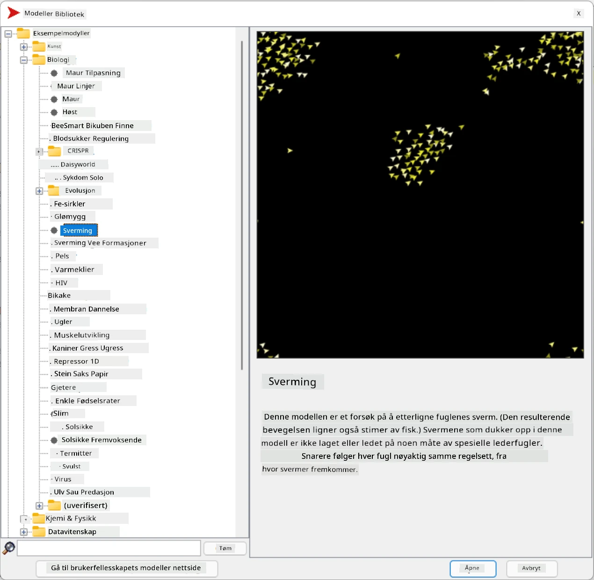
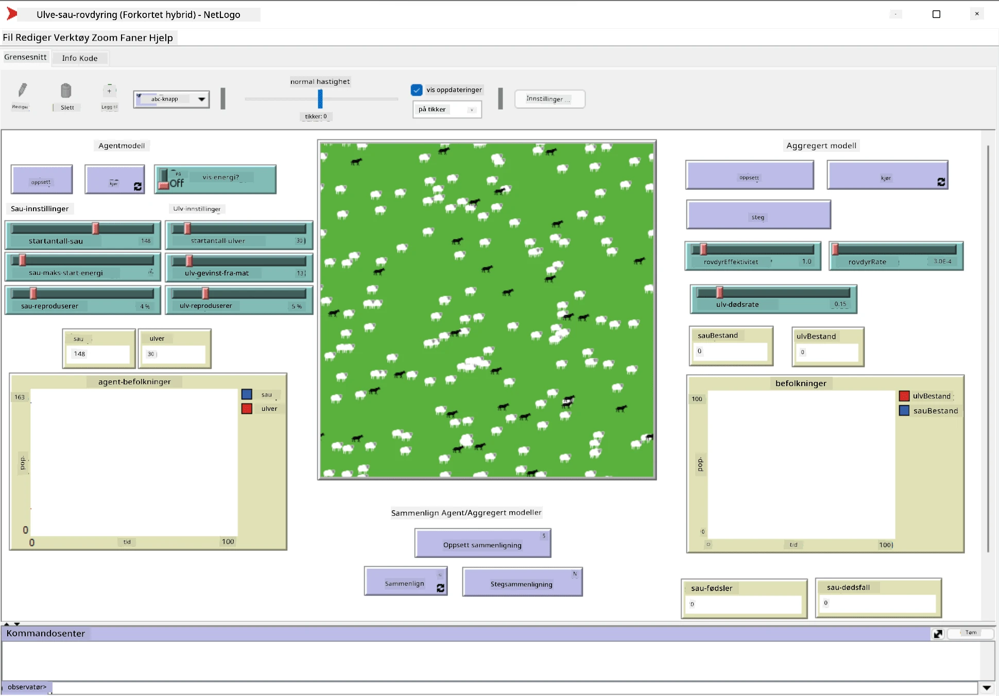

# Multi-Agent Systemer

En av de mulige måtene å oppnå intelligens på er den såkalte **emergente** (eller **synergetiske**) tilnærmingen, som er basert på det faktum at den kombinerte oppførselen til mange relativt enkle agenter kan resultere i en mer kompleks (eller intelligent) oppførsel av systemet som helhet. Teoretisk sett er dette basert på prinsippene for [Kollektiv intelligens](https://en.wikipedia.org/wiki/Collective_intelligence), [Emergentisme](https://en.wikipedia.org/wiki/Global_brain) og [Evolusjonær kybernetikk](https://en.wikipedia.org/wiki/Global_brain), som sier at systemer på høyere nivå får en form for merverdi når de kombineres riktig fra systemer på lavere nivå (det såkalte *prinsippet om metasystemovergang*).

## [Quiz før forelesning](https://ff-quizzes.netlify.app/en/ai/quiz/45)

Retningen **Multi-Agent Systemer** oppstod innen AI på 1990-tallet som en respons på veksten av Internett og distribuerte systemer. En av de klassiske AI-lærebøkene, [Artificial Intelligence: A Modern Approach](https://en.wikipedia.org/wiki/Artificial_Intelligence:_A_Modern_Approach), fokuserer på klassisk AI fra perspektivet til multi-agent systemer.

Kjernen i multi-agent tilnærmingen er begrepet **Agent** - en enhet som lever i et **miljø**, som den kan oppfatte og handle på. Dette er en veldig bred definisjon, og det kan være mange forskjellige typer og klassifiseringer av agenter:

* Etter deres evne til å resonnere:
   - **Reaktive** agenter har vanligvis en enkel forespørsel-svar type oppførsel
   - **Deliberative** agenter bruker en form for logisk resonnement og/eller planleggingsevner
* Etter stedet hvor agenten utfører sin kode:
   - **Statiske** agenter arbeider på en dedikert nettverksnode
   - **Mobile** agenter kan flytte sin kode mellom nettverksnoder
* Etter deres oppførsel:
   - **Passive agenter** har ingen spesifikke mål. Slike agenter kan reagere på eksterne stimuli, men vil ikke initiere handlinger selv.
   - **Aktive agenter** har noen mål som de forsøker å oppnå
   - **Kognitive agenter** involverer kompleks planlegging og resonnement

Multi-agent systemer brukes i dag i en rekke applikasjoner:

* I spill bruker mange ikke-spillerkarakterer en form for AI og kan betraktes som intelligente agenter
* I videoproduksjon blir komplekse 3D-scener som involverer folkemengder typisk rendret ved hjelp av multi-agent simulering
* I systemmodellering brukes multi-agent tilnærmingen til å simulere oppførselen til en kompleks modell. For eksempel har multi-agent tilnærmingen blitt brukt med suksess for å forutsi spredningen av COVID-19 globalt. En lignende tilnærming kan brukes til å modellere trafikk i en by og se hvordan den reagerer på endringer i trafikkregler.
* I komplekse automatiseringssystemer kan hver enhet fungere som en uavhengig agent, noe som gjør hele systemet mindre monolittisk og mer robust.

Vi vil ikke bruke mye tid på å gå dypt inn i multi-agent systemer, men vi skal se på ett eksempel på **Multi-Agent Modellering**.

## NetLogo

[NetLogo](https://ccl.northwestern.edu/netlogo/) er et multi-agent modelleringsmiljø basert på en modifisert versjon av programmeringsspråket [Logo](https://en.wikipedia.org/wiki/Logo_(programming_language)). Dette språket ble utviklet for å lære barn programmeringskonsepter, og det lar deg kontrollere en agent kalt **skilpadde**, som kan bevege seg og etterlate seg spor. Dette gjør det mulig å lage komplekse geometriske figurer, som er en veldig visuell måte å forstå oppførselen til en agent.

I NetLogo kan vi lage mange skilpadder ved å bruke kommandoen `create-turtles`. Vi kan deretter be alle skilpadder om å utføre noen handlinger (i eksempelet nedenfor - bevege seg 10 punkter fremover):

```
create-turtles 10
ask turtles [
  forward 10
]
```

Selvfølgelig er det ikke interessant når alle skilpadder gjør det samme, så vi kan `ask` grupper av skilpadder, for eksempel de som befinner seg i nærheten av et bestemt punkt. Vi kan også lage skilpadder av forskjellige *raser* ved å bruke kommandoen `breed [cats cat]`. Her er `cat` navnet på en rase, og vi må spesifisere både entalls- og flertallsformen, fordi forskjellige kommandoer bruker forskjellige former for klarhet.

> ✅ Vi vil ikke gå inn på å lære NetLogo-språket i seg selv - du kan besøke den fantastiske [Beginner's Interactive NetLogo Dictionary](https://ccl.northwestern.edu/netlogo/bind/) ressursen hvis du er interessert i å lære mer.

Du kan [laste ned](https://ccl.northwestern.edu/netlogo/download.shtml) og installere NetLogo for å prøve det.

### Modellbibliotek

En flott ting med NetLogo er at det inneholder et bibliotek med fungerende modeller som du kan prøve. Gå til **File &rightarrow; Models Library**, og du har mange kategorier med modeller å velge mellom.



> Et skjermbilde av modellbiblioteket av Dmitry Soshnikov

Du kan åpne en av modellene, for eksempel **Biology &rightarrow; Flocking**.

### Hovedprinsipper

Etter å ha åpnet modellen, kommer du til hovedskjermen i NetLogo. Her er et eksempel på en modell som beskriver populasjonen av ulver og sauer, gitt begrensede ressurser (gress).



> Skjermbilde av Dmitry Soshnikov

På denne skjermen kan du se:

* **Grensesnitt**-seksjonen som inneholder:
  - Hovedfeltet, hvor alle agenter lever
  - Ulike kontroller: knapper, glidere, osv.
  - Grafer som du kan bruke til å vise parametere for simuleringen
* **Kode**-fanen som inneholder editoren, hvor du kan skrive NetLogo-programmet

I de fleste tilfeller vil grensesnittet ha en **Setup**-knapp, som initialiserer simuleringsstatusen, og en **Go**-knapp som starter utførelsen. Disse håndteres av tilsvarende håndterere i koden som ser slik ut:

```
to go [
...
]
```

NetLogos verden består av følgende objekter:

* **Agenter** (skilpadder) som kan bevege seg over feltet og gjøre noe. Du gir kommandoer til agenter ved å bruke syntaksen `ask turtles [...]`, og koden i klammer utføres av alle agenter i *skilpaddemodus*.
* **Patches** er firkantede områder på feltet, hvor agenter lever. Du kan referere til alle agenter på samme patch, eller du kan endre patch-farger og noen andre egenskaper. Du kan også `ask patches` om å gjøre noe.
* **Observer** er en unik agent som kontrollerer verden. Alle knapphåndterere utføres i *observatørmodus*.

> ✅ Det vakre med et multi-agent miljø er at koden som kjører i skilpaddemodus eller patch-modus utføres samtidig av alle agenter parallelt. Dermed kan du ved å skrive litt kode og programmere oppførselen til en individuell agent, skape kompleks oppførsel av simuleringssystemet som helhet.

### Flocking

Som et eksempel på multi-agent oppførsel, la oss se på **[Flocking](https://en.wikipedia.org/wiki/Flocking_(behavior))**. Flocking er et komplekst mønster som ligner veldig på hvordan fugleflokker flyr. Når du ser dem fly, kan du tro at de følger en slags kollektiv algoritme, eller at de har en form for *kollektiv intelligens*. Men denne komplekse oppførselen oppstår når hver individuell agent (i dette tilfellet en *fugl*) kun observerer noen andre agenter innen kort avstand fra seg, og følger tre enkle regler:

* **Justering** - den styrer mot den gjennomsnittlige retningen til nærliggende agenter
* **Samhold** - den prøver å styre mot den gjennomsnittlige posisjonen til naboer (*langdistanse tiltrekning*)
* **Separasjon** - når den kommer for nær andre fugler, prøver den å bevege seg bort (*kortdistanse frastøtning*)

Du kan kjøre flocking-eksempelet og observere oppførselen. Du kan også justere parametere, som *grad av separasjon* eller *synsrekkevidde*, som definerer hvor langt hver fugl kan se. Merk at hvis du reduserer synsrekkevidden til 0, blir alle fugler blinde, og flocking stopper. Hvis du reduserer separasjonen til 0, samler alle fugler seg i en rett linje.

> ✅ Bytt til **Kode**-fanen og se hvor de tre reglene for flocking (justering, samhold og separasjon) er implementert i koden. Legg merke til hvordan vi kun refererer til de agentene som er innen synsrekkevidde.

### Andre modeller å utforske

Det finnes noen flere interessante modeller du kan eksperimentere med:

* **Art &rightarrow; Fireworks** viser hvordan et fyrverkeri kan betraktes som en kollektiv oppførsel av individuelle ildstrømmer
* **Social Science &rightarrow; Traffic Basic** og **Social Science &rightarrow; Traffic Grid** viser modellen av bytrafikk i 1D og 2D Grid med eller uten trafikklys. Hver bil i simuleringen følger følgende regler:
   - Hvis plassen foran er tom - akselerer (opp til en viss maks hastighet)
   - Hvis den ser et hinder foran - brems (og du kan justere hvor langt en sjåfør kan se)
* **Social Science &rightarrow; Party** viser hvordan folk grupperer seg under en cocktailfest. Du kan finne kombinasjonen av parametere som fører til den raskeste økningen i gruppens lykke.

Som du kan se fra disse eksemplene, kan multi-agent simuleringer være en nyttig måte å forstå oppførselen til et komplekst system bestående av individer som følger samme eller lignende logikk. Det kan også brukes til å kontrollere virtuelle agenter, som [NPCs](https://en.wikipedia.org/wiki/NPC) i dataspill, eller agenter i 3D-animerte verdener.

## Deliberative Agenter

Agentene beskrevet ovenfor er veldig enkle og reagerer på endringer i miljøet ved hjelp av en form for algoritme. Som sådan er de **reaktive agenter**. Imidlertid kan agenter noen ganger resonnere og planlegge sine handlinger, i hvilket tilfelle de kalles **deliberative**.

Et typisk eksempel kan være en personlig agent som mottar en instruksjon fra et menneske om å bestille en ferietur. Anta at det finnes mange agenter på internett som kan hjelpe den. Den bør da kontakte andre agenter for å se hvilke flyreiser som er tilgjengelige, hva hotellprisene er for forskjellige datoer, og prøve å forhandle frem den beste prisen. Når ferieplanen er fullført og bekreftet av eieren, kan den gå videre med bestillingen.

For å gjøre dette må agenter **kommunisere**. For vellykket kommunikasjon trenger de:

* Noen **standard språk for å utveksle kunnskap**, som [Knowledge Interchange Format](https://en.wikipedia.org/wiki/Knowledge_Interchange_Format) (KIF) og [Knowledge Query and Manipulation Language](https://en.wikipedia.org/wiki/Knowledge_Query_and_Manipulation_Language) (KQML). Disse språkene er designet basert på [Speech Act theory](https://en.wikipedia.org/wiki/Speech_act).
* Disse språkene bør også inkludere noen **protokoller for forhandlinger**, basert på forskjellige **auksjonstyper**.
* En **felles ontologi** å bruke, slik at de refererer til de samme begrepene og kjenner deres semantikk
* En måte å **oppdage** hva forskjellige agenter kan gjøre, også basert på en form for ontologi

Deliberative agenter er mye mer komplekse enn reaktive, fordi de ikke bare reagerer på endringer i miljøet, de bør også kunne *initiere* handlinger. En av de foreslåtte arkitekturene for deliberative agenter er den såkalte Belief-Desire-Intention (BDI) agenten:

* **Beliefs** utgjør et sett med kunnskap om agentens miljø. Det kan struktureres som en kunnskapsbase eller et sett med regler som en agent kan bruke på en spesifikk situasjon i miljøet.
* **Desires** definerer hva en agent ønsker å gjøre, dvs. dens mål. For eksempel er målet til den personlige assistentagenten ovenfor å bestille en tur, og målet til en hotellagent er å maksimere profitt.
* **Intentions** er spesifikke handlinger som en agent planlegger for å oppnå sine mål. Handlinger endrer typisk miljøet og forårsaker kommunikasjon med andre agenter.

Det finnes noen plattformer tilgjengelig for å bygge multi-agent systemer, som [JADE](https://jade.tilab.com/). [Denne artikkelen](https://arxiv.org/ftp/arxiv/papers/2007/2007.08961.pdf) inneholder en gjennomgang av multi-agent plattformer, sammen med en kort historie om multi-agent systemer og deres forskjellige bruksområder.

## Konklusjon

Multi-agent systemer kan ta svært forskjellige former og brukes i mange ulike applikasjoner. 
De fokuserer alle på den enklere oppførselen til en individuell agent, og oppnår mer kompleks oppførsel av det overordnede systemet på grunn av **synergetisk effekt**.

## 🚀 Utfordring

Ta denne leksjonen til den virkelige verden og prøv å konseptualisere et multi-agent system som kan løse et problem. Hva, for eksempel, ville et multi-agent system måtte gjøre for å optimalisere en skolebussrute? Hvordan kunne det fungere i et bakeri?

## [Quiz etter forelesning](https://ff-quizzes.netlify.app/en/ai/quiz/46)

## Gjennomgang & Selvstudium

Undersøk bruken av denne typen systemer i industrien. Velg et domene som produksjon eller videospillindustrien og oppdag hvordan multi-agent systemer kan brukes til å løse unike problemer.

## [NetLogo Oppgave](assignment.md)

---

