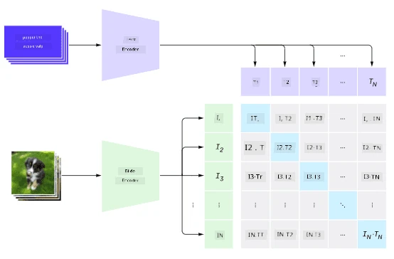
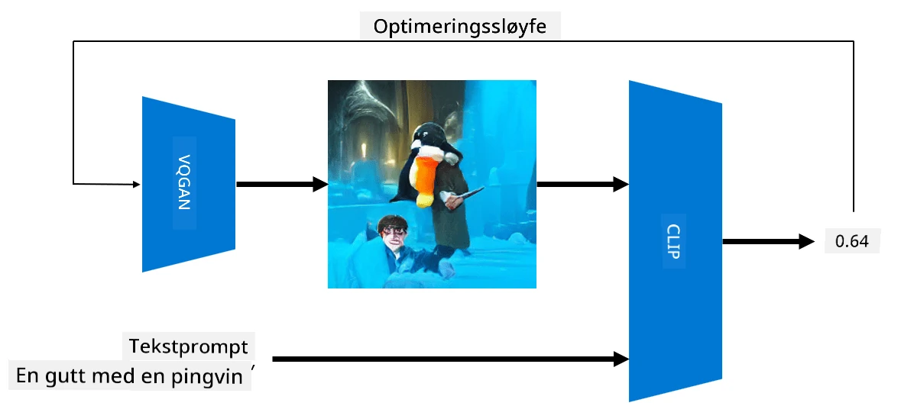

# Multi-Modale Nettverk

Etter suksessen med transformer-modeller for å løse NLP-oppgaver, har de samme eller lignende arkitekturer blitt brukt på oppgaver innen datamaskinsyn. Det er økende interesse for å bygge modeller som kan *kombinere* visuelle og språklige evner. En av disse forsøkene ble gjort av OpenAI, og kalles CLIP og DALL.E.

## Contrastive Image Pre-Training (CLIP)

Hovedideen med CLIP er å kunne sammenligne tekstbeskrivelser med et bilde og avgjøre hvor godt bildet samsvarer med beskrivelsen.

> *Bilde fra [denne bloggposten](https://openai.com/blog/clip/)*

Modellen er trent på bilder hentet fra Internett og deres bildetekster. For hver batch tar vi N par av (bilde, tekst) og konverterer dem til vektorrepresentasjoner I, ..., I / T, ..., T. Disse representasjonene matches deretter sammen. Tapfunksjonen er definert for å maksimere cosinus-similariteten mellom vektorer som tilsvarer ett par (f.eks. I og T), og minimere cosinus-similariteten mellom alle andre par. Det er grunnen til at denne tilnærmingen kalles **kontrastiv**.

CLIP-modellen/biblioteket er tilgjengelig fra [OpenAI GitHub](https://github.com/openai/CLIP). Tilnærmingen er beskrevet i [denne bloggposten](https://openai.com/blog/clip/) og mer detaljert i [denne artikkelen](https://arxiv.org/pdf/2103.00020.pdf).

Når denne modellen er forhåndstrent, kan vi gi den en batch med bilder og en batch med tekstbeskrivelser, og den vil returnere en tensor med sannsynligheter. CLIP kan brukes til flere oppgaver:

**Bildeklassifisering**

Anta at vi må klassifisere bilder mellom for eksempel katter, hunder og mennesker. I dette tilfellet kan vi gi modellen et bilde og en serie tekstbeskrivelser: "*et bilde av en katt*", "*et bilde av en hund*", "*et bilde av et menneske*". I den resulterende vektoren med 3 sannsynligheter trenger vi bare å velge indeksen med høyest verdi.

> *Bilde fra [denne bloggposten](https://openai.com/blog/clip/)*

**Tekstbasert Bildesøk**

Vi kan også gjøre det motsatte. Hvis vi har en samling bilder, kan vi sende denne samlingen til modellen og en tekstbeskrivelse - dette vil gi oss bildet som er mest likt den gitte beskrivelsen.

## ✍️ Eksempel: [Bruke CLIP for Bildeklassifisering og Bildesøk](Clip.ipynb)

Åpne [Clip.ipynb](Clip.ipynb)-notatet for å se CLIP i aksjon.

## Bildegenerering med VQGAN+CLIP

CLIP kan også brukes til **bildegenerering** fra en tekstbeskrivelse. For å gjøre dette trenger vi en **generator-modell** som kan generere bilder basert på en vektorinput. En av disse modellene kalles [VQGAN](https://compvis.github.io/taming-transformers/) (Vector-Quantized GAN).

Hovedideene til VQGAN som skiller den fra vanlige [GAN](../../4-ComputerVision/10-GANs/README.md) er følgende:
* Bruk av autoregressiv transformer-arkitektur for å generere en sekvens av kontekstrike visuelle deler som utgjør bildet. Disse visuelle delene læres igjen av [CNN](../../4-ComputerVision/07-ConvNets/README.md).
* Bruk av sub-bilde diskriminator som oppdager om deler av bildet er "ekte" eller "falske" (i motsetning til "alt-eller-ingenting"-tilnærmingen i tradisjonelle GAN).

Lær mer om VQGAN på [Taming Transformers](https://compvis.github.io/taming-transformers/) nettsiden.

En av de viktige forskjellene mellom VQGAN og tradisjonelle GAN er at sistnevnte kan produsere et anstendig bilde fra hvilken som helst inputvektor, mens VQGAN sannsynligvis vil produsere et bilde som ikke er sammenhengende. Derfor må vi videre veilede bildeopprettingsprosessen, og det kan gjøres ved hjelp av CLIP.

For å generere et bilde som samsvarer med en tekstbeskrivelse, starter vi med en tilfeldig kodingsvektor som sendes gjennom VQGAN for å produsere et bilde. Deretter brukes CLIP til å produsere en tapfunksjon som viser hvor godt bildet samsvarer med tekstbeskrivelsen. Målet er da å minimere dette tapet, ved hjelp av backpropagation for å justere inputvektorens parametere.

Et flott bibliotek som implementerer VQGAN+CLIP er [Pixray](http://github.com/pixray/pixray).

 |   | 
----|----|----
Bilde generert fra beskrivelsen *et nærbilde akvarellportrett av ung mannlig lærer i litteratur med en bok* | Bilde generert fra beskrivelsen *et nærbilde oljemaleriportrett av ung kvinnelig lærer i informatikk med en datamaskin* | Bilde generert fra beskrivelsen *et nærbilde oljemaleriportrett av eldre mannlig lærer i matematikk foran en tavle*

> Bilder fra **Artificial Teachers**-samlingen av [Dmitry Soshnikov](http://soshnikov.com)

## DALL-E
### [DALL-E 1](https://openai.com/research/dall-e)
DALL-E er en versjon av GPT-3 trent til å generere bilder fra beskrivelser. Den er trent med 12 milliarder parametere.

I motsetning til CLIP mottar DALL-E både tekst og bilde som en enkelt strøm av tokens for både bilder og tekst. Derfor kan du generere bilder basert på flere beskrivelser.

### [DALL-E 2](https://openai.com/dall-e-2)
Hovedforskjellen mellom DALL.E 1 og 2 er at den genererer mer realistiske bilder og kunst.

Eksempler på bildegenerering med DALL-E:
 |   | 
----|----|----
Bilde generert fra beskrivelsen *et nærbilde akvarellportrett av ung mannlig lærer i litteratur med en bok* | Bilde generert fra beskrivelsen *et nærbilde oljemaleriportrett av ung kvinnelig lærer i informatikk med en datamaskin* | Bilde generert fra beskrivelsen *et nærbilde oljemaleriportrett av eldre mannlig lærer i matematikk foran en tavle*

## Referanser

* VQGAN Artikkel: [Taming Transformers for High-Resolution Image Synthesis](https://compvis.github.io/taming-transformers/paper/paper.pdf)
* CLIP Artikkel: [Learning Transferable Visual Models From Natural Language Supervision](https://arxiv.org/pdf/2103.00020.pdf)

---

**Ansvarsfraskrivelse**:  
Dette dokumentet er oversatt ved hjelp av AI-oversettelsestjenesten [Co-op Translator](https://github.com/Azure/co-op-translator). Selv om vi streber etter nøyaktighet, vær oppmerksom på at automatiske oversettelser kan inneholde feil eller unøyaktigheter. Det originale dokumentet på sitt opprinnelige språk bør anses som den autoritative kilden. For kritisk informasjon anbefales profesjonell menneskelig oversettelse. Vi er ikke ansvarlige for eventuelle misforståelser eller feiltolkninger som oppstår ved bruk av denne oversettelsen.