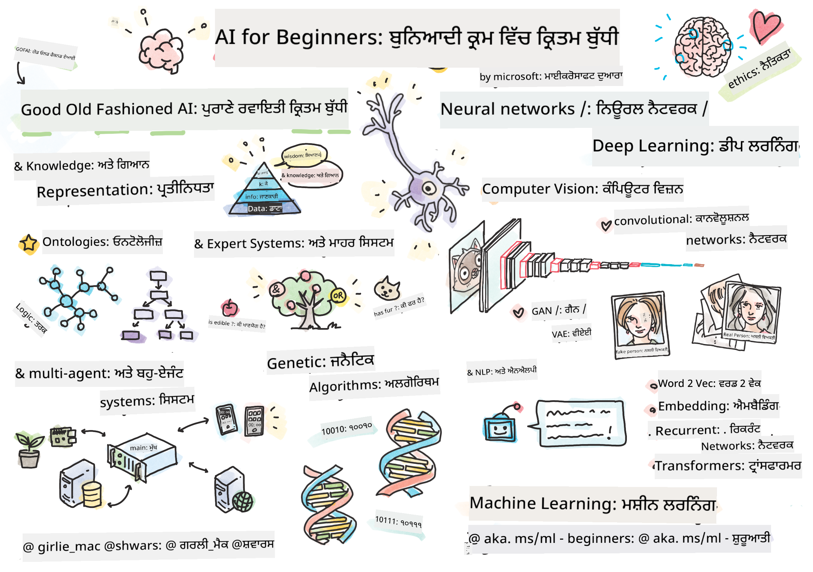

<!--
CO_OP_TRANSLATOR_METADATA:
{
  "original_hash": "14816e97d79b296c87811724f7785923",
  "translation_date": "2026-01-01T11:12:40+00:00",
  "source_file": "README.md",
  "language_code": "pa"
}
-->

# ਸ਼ੁਰੂਆਤੀਆਂ ਲਈ ਆਰਟੀਫੀਸ਼ਲ ਇੰਟੈਲੀਜੈਂਸ - ਇੱਕ ਪਾਠਕ੍ਰਮ

||
|:---:|
| ਸ਼ੁਰੂਆਤੀਆਂ ਲਈ ਆਰਟੀਫੀਸ਼ਲ ਇੰਟੈਲੀਜੈਂਸ - _ਸਕੇਚਨੋਟ ਦੁਆਰਾ [@girlie_mac](https://twitter.com/girlie_mac)_ |

ਸਾਡੇ 12-ਹਫਤਿਆਂ, 24-ਪਾਠਾਂ ਵਾਲੇ ਪਾਠਕ੍ਰਮ ਨਾਲ **ਆਰਟੀਫੀਸ਼ਲ ਇੰਟੈਲੀਜੈਂਸ** (AI) ਦੀ ਦੁਨੀਆ ਦੀ ਖੋਜ ਕਰੋ! ਇਸ ਵਿੱਚ ਪ੍ਰੈਕਟਿਕਲ ਪਾਠ, ਕਵਿਜ਼ ਅਤੇ ਲੈਬ ਸ਼ਾਮਲ ਹਨ। ਇਹ ਪਾਠਕ੍ਰਮ ਸ਼ੁਰੂਆਤੀਆਂ ਲਈ ਦੋਸਤਾਨਾ ਹੈ ਅਤੇ TensorFlow ਅਤੇ PyTorch ਵਰਗੇ ਟੂਲਾਂ ਦੇ ਨਾਲ-ਨਾਲ AI ਵਿੱਚ ਨੈतिकਤਾ ਨੂੰ ਵੀ ਕਵਰ ਕਰਦਾ ਹੈ।

### 🌐 ਬਹੁ-ਭਾਸ਼ੀ ਸਹਾਇਤਾ

#### GitHub Action ਰਾਹੀਂ ਸਹਾਇਤ (ਸਵੈਚਾਲਿਤ ਅਤੇ ਹਮੇਸ਼ਾ ਅੱਪ-ਟੂ-ਡੇਟ)

<!-- CO-OP TRANSLATOR LANGUAGES TABLE START -->
[ਅਰਬੀ](../ar/README.md) | [ਬੰਗਾਲੀ](../bn/README.md) | [ਬੁਲਗਾਰੀਆਈ](../bg/README.md) | [ਬਰਮੇਜ਼ (ਮਿਆਂਮਾਰ)](../my/README.md) | [ਚੀਨੀ (ਸਰਲ)](../zh/README.md) | [ਚੀਨੀ (ਪੰਪਰਿਕ, ਹੌਂਗ ਕਾਂਗ)](../hk/README.md) | [ਚੀਨੀ (ਪੰਪਰਿਕ, ਮਕਾਓ)](../mo/README.md) | [ਚੀਨੀ (ਪੰਪਰਿਕ, ਤਾਈਵਾਨ)](../tw/README.md) | [ਕਰੋਏਸ਼ੀਆਈ](../hr/README.md) | [ਚੈਕ](../cs/README.md) | [ਡੈਨਿਸ਼](../da/README.md) | [ਡੱਚ](../nl/README.md) | [ਇਸਟੋਨੀਅਨ](../et/README.md) | [ਫਿਨੀਸ਼](../fi/README.md) | [ਫਰਾਂਸੀਸੀ](../fr/README.md) | [ਜਰਮਨ](../de/README.md) | [ਗ੍ਰੀਕ](../el/README.md) | [ਹੀਬਰੂ](../he/README.md) | [ਹਿੰਦੀ](../hi/README.md) | [ਹੰਗੇਰੀਅਨ](../hu/README.md) | [ਇੰਡੋਨੇਸ਼ੀਆਈ](../id/README.md) | [ਇਟਾਲੀਅਨ](../it/README.md) | [ਜਪਾਨੀ](../ja/README.md) | [ಕನ್ನಡ](../kn/README.md) | [ਕੋਰੀਅਨ](../ko/README.md) | [ਲਿਥੁਆਨੀਆਈ](../lt/README.md) | [ਮਲਏ](../ms/README.md) | [ਮਲਯਾਲਮ](../ml/README.md) | [ਮਰાઠੀ](../mr/README.md) | [ਨੇਪਾਲੀ](../ne/README.md) | [ਨਾਈਜੀਰੀਆ ਪਿਡਜਿਨ](../pcm/README.md) | [ਨਾਰਵੇਜੀਅਨ](../no/README.md) | [ਫਾਰਸੀ (ਫਾਰਸੀ)](../fa/README.md) | [ਪੋਲਿਸ਼](../pl/README.md) | [ਪੁਰਤਗਾਲੀ (ਬ੍ਰਾਜ਼ੀਲ)](../br/README.md) | [ਪੁਰਤਗਾਲੀ (ਪੁਰਤਗਾਲ)](../pt/README.md) | [ਪੰਜਾਬੀ (ਗੁਰਮੁਖੀ)](./README.md) | [ਰੋਮਾਨੀਆਈ](../ro/README.md) | [ਰੂਸੀ](../ru/README.md) | [ਸਰਬੀਆਈ (ਸਿਰਿਲਿਕ)](../sr/README.md) | [ਸਲੋਵਾਕ](../sk/README.md) | [ਸਲੋਵੇਨੀਅਨ](../sl/README.md) | [ਸਪੇਨੀ](../es/README.md) | [ਸਵਾਹਿਲੀ](../sw/README.md) | [ਸਵੀਡਿਸ਼](../sv/README.md) | [ਟਗਾਲੋਗ (ਫਿਲੀਪੀਨੋ)](../tl/README.md) | [ਤਮਿਲ](../ta/README.md) | [ਤੇਲੁਗੂ](../te/README.md) | [ਥਾਈ](../th/README.md) | [ਤੁਰਕੀ](../tr/README.md) | [ਯੂਕਰੇਨੀ](../uk/README.md) | [ਉਰਦੂ](../ur/README.md) | [ਵਿਏਤਨਾਮੀ](../vi/README.md)
<!-- CO-OP TRANSLATOR LANGUAGES TABLE END -->

**ਜੇ ਤੁਸੀਂ ਹੋਰ ਅਨੁਵਾਦਾਂ ਦੀ ਇੱਛਾ ਰੱਖਦੇ ਹੋ ਤਾਂ ਸਮਰਥਿਤ ਭਾਸ਼ਾਵਾਂ ਇੱਥੇ ਦਿੱਤੀਆਂ ਹਨ: [here](https://github.com/Azure/co-op-translator/blob/main/getting_started/supported-languages.md)**

## ਕਮਿਉਨਿਟੀ ਵਿੱਚ ਸ਼ਾਮਿਲ ਹੋਵੋ

## ਤੁਸੀਂ ਕੀ ਸਿੱਖੋਗੇ

**[ਕੋਰਸ ਦਾ ਮਾਈਂਡਮੈਪ](http://soshnikov.com/courses/ai-for-beginners/mindmap.html)**

ਇਸ ਪਾਠਕ੍ਰਮ ਵਿੱਚ, ਤੁਸੀਂ ਇਹ ਸਿੱਖੋਗੇ:

* ਆਰਟੀਫ਼ੀਸ਼ਲ ਇੰਟੈਲੀਜੈਂਸ ਨੂੰ ਲੈ ਕੇ ਵੱਖ-ਵੱਖ ਪਹੁੰਚਾਂ, ਜਿਨ੍ਹਾਂ ਵਿੱਚ "ਪੁਰਾਣੀ" ਸੰਕੇਤੀਕ ਪਹੁੰਚ ਸ਼ਾਮਲ ਹੈ ਜਿਸ ਵਿੱਚ **ਜਾਣਕਾਰੀ ਦੀ ਪ੍ਰਤੀਨਿਧਤਾ** ਅਤੇ ਤਰਕਸ਼ੀਲਤਾ ([GOFAI](https://en.wikipedia.org/wiki/Symbolic_artificial_intelligence))।
* **ਨਿਊਰਲ ਨੈੱਟਵਰਕ** ਅਤੇ **ਡੀਪ ਲਰਨਿੰਗ**, ਜੋ ਆਧੁਨਿਕ AI ਦਾ ਮੁੱਖ ਗਠਨ ਹੈ। ਅਸੀਂ ਇਹ ਮਹੱਤਵਪੂਰਣ ਵਿਸ਼ਿਆਂ ਦੇ ਨਿਯਮਾਂ ਨੂੰ ਦੋ ਸਭ ਤੋਂ ਲੋਕਪ੍ਰිය ਫਰੇਮਵਰਕਾਂ - [TensorFlow](http://Tensorflow.org) ਅਤੇ [PyTorch](http://pytorch.org) ਵਿੱਚ ਕੋਡ ਦੇ ਰਹੀ ਵਿਖਾਵਾਂਗੇ।
* ਚਿੱਤਰਾਂ ਅਤੇ ਟੈਕਸਟ ਨਾਲ ਕੰਮ ਕਰਨ ਲਈ **ਨਿਊਰਲ ਆਰਕੀਟੈਕਚਰ**। ਅਸੀਂ ਹਾਲੀਆ ਮਾਡਲਾਂ ਨੂੰ ਕਵਰ ਕਰਾਂਗੇ ਪਰ ਸ਼ਾਇਦ ਸਟੇਟ-ਆਫ-ਦ-ਆਰਟ ਵਿੱਚ ਪੂਰੀ ਤਰ੍ਹਾਂ ਨਹੀਂ ਹੋਵਾਂਗੇ।
* ਘੱਟ ਪ੍ਰਸਿੱਧ AI ਪਹੁੰਚਾਂ, ਜਿਵੇਂ ਕਿ **ਜੀਨੀਟਿਕ ਅਲਗੋਰਿਦਮ** ਅਤੇ **ਬਹੁ-ਏਜੈਂਟ ਪ੍ਰਣਾਲੀਆਂ**।

ਜੋ ਚੀਜ਼ਾਂ ਅਸੀਂ ਇਸ ਪਾਠਕ੍ਰਮ ਵਿੱਚ ਕਵਰ ਨਹੀਂ ਕਰਾਂਗੇ:

> [ਇਸ ਕੋਰਸ ਲਈ ਸਾਰੇ ਵਧੇਰੇ ਸਰੋਤ ਸਾਡੇ Microsoft Learn ਕਲੇਕਸ਼ਨ ਵਿੱਚ ਲੱਭੋ](https://learn.microsoft.com/en-us/collections/7w28iy2xrqzdj0?WT.mc_id=academic-77998-bethanycheum)

* ਕਾਰੋਬਾਰ ਵਿੱਚ **AI ਦੇ ਕਾਰੋਬਾਰੀ ਕੇਸ**। ਇਸ ਲਈ ਤੁਸੀਂ Microsoft Learn 'ਤੇ [Introduction to AI for business users](https://docs.microsoft.com/learn/paths/introduction-ai-for-business-users/?WT.mc_id=academic-77998-bethanycheum) ਲਰਨਿੰਗ ਪਾਥ ਲੈਣ ਤੇ ਵਿਚਾਰ ਕਰ ਸਕਦੇ ਹੋ, ਜਾਂ [AI Business School](https://www.microsoft.com/ai/ai-business-school/?WT.mc_id=academic-77998-bethanycheum), ਜੋ [INSEAD](https://www.insead.edu/) ਦੇ ਸਹਿਯੋਗ ਨਾਲ ਵਿਕਸਿਤ ਕੀਤੀ ਗਈ ਹੈ।
* **ਕਲਾਸਿਕ ਮਸ਼ੀਨ ਲਰਨਿੰਗ**, ਜਿਸਨੂੰ ਸਾਡੇ [Machine Learning for Beginners Curriculum](http://github.com/Microsoft/ML-for-Beginners) ਵਿੱਚ ਚੰਗੀ ਤਰ੍ਹਾਂ ਵਿਆਖਿਆ ਕੀਤਾ ਗਿਆ ਹੈ।
* ਪ੍ਰਯੋਗਿਕ AI ਐਪਲੀਕੇਸ਼ਨ ਜੋ **[Cognitive Services](https://azure.microsoft.com/services/cognitive-services/?WT.mc_id=academic-77998-bethanycheum)** ਦੀ ਵਰਤੋਂ ਨਾਲ ਬਣਾਈਆਂ ਗਈਆਂ ਹਨ। ਇਸ ਲਈ, ਅਸੀਂ ਤੁਹਾਨੂੰ Microsoft Learn ‘ਤੇ [vision](https://docs.microsoft.com/learn/paths/create-computer-vision-solutions-azure-cognitive-services/?WT.mc_id=academic-77998-bethanycheum), [natural language processing](https://docs.microsoft.com/learn/paths/explore-natural-language-processing/?WT.mc_id=academic-77998-bethanycheum), **[Generative AI with Azure OpenAI Service](https://learn.microsoft.com/en-us/training/paths/develop-ai-solutions-azure-openai/?WT.mc_id=academic-77998-bethanycheum)** ਅਤੇ ਹੋਰ ਮੋਡੀਊਲਜ਼ ਨਾਲ ਸ਼ੁਰੂ ਕਰਨ ਦੀ ਸਿਫਾਰਸ਼ ਕਰਦੇ ਹਾਂ।
* ਖਾਸ ML **ਕਲਾਉਡ ਫਰੇਮਵਰਕ**, ਜਿਵੇਂ ਕਿ [Azure Machine Learning](https://azure.microsoft.com/services/machine-learning/?WT.mc_id=academic-77998-bethanycheum), [Microsoft Fabric](https://learn.microsoft.com/en-us/training/paths/get-started-fabric/?WT.mc_id=academic-77998-bethanycheum), ਜਾਂ [Azure Databricks](https://docs.microsoft.com/learn/paths/data-engineer-azure-databricks?WT.mc_id=academic-77998-bethanycheum)। ਤੁਸੀਂ [Build and operate machine learning solutions with Azure Machine Learning](https://docs.microsoft.com/learn/paths/build-ai-solutions-with-azure-ml-service/?WT.mc_id=academic-77998-bethanycheum) ਅਤੇ [Build and Operate Machine Learning Solutions with Azure Databricks](https://docs.microsoft.com/learn/paths/build-operate-machine-learning-solutions-azure-databricks/?WT.mc_id=academic-77998-bethanycheum) ਲਰਨਿੰਗ ਪਾਥਾਂ ਨੂੰ ਵਰਤਣ ਬਾਰੇ ਸੋਚ ਸਕਦੇ ਹੋ।
* **ਗੱਲ-ਬਾਤੀ AI** ਅਤੇ **ਚੈਟ ਬੋਟਸ**। ਇਸ ਲਈ ਇੱਕ ਵੱਖਰੇ [Create conversational AI solutions](https://docs.microsoft.com/learn/paths/create-conversational-ai-solutions/?WT.mc_id=academic-77998-bethanycheum) ਲਰਨਿੰਗ ਪਾਥ ਹੈ, ਅਤੇ ਵਿਸਥਾਰ ਲਈ ਤੁਸੀਂ [ਇਸ ਬਲੌਗ ਪੋਸਟ](https://soshnikov.com/azure/hello-bot-conversational-ai-on-microsoft-platform/) ਨੂੰ ਵੀ ਦੇਖ ਸਕਦੇ ਹੋ।
* ਡੀਪ ਲਰਨਿੰਗ ਦੇ ਪਿੱਛੇ ਦੀਆਂ **ਗੁੰਝਲਦਾਰ ਗਣਿਤੀ** ਰਚਨਾਵਾਂ। ਇਸ ਲਈ, ਅਸੀਂ Ian Goodfellow, Yoshua Bengio ਅਤੇ Aaron Courville ਦੁਆਰਾ ਲਿਖੀ ਗਈ ਕਿਤਾਬ [Deep Learning](https://www.amazon.com/Deep-Learning-Adaptive-Computation-Machine/dp/0262035618) ਦੀ ਸਿਫਾਰਸ਼ ਕਰਾਂਗੇ, ਜੋ ਕਿ অনਲਾਈਨ ਵੀ ਉਪਲਬਧ ਹੈ: [https://www.deeplearningbook.org/](https://www.deeplearningbook.org/)।

ਕਲਾਊਡ ਵਿੱਚ _AI_ ਵਿਸ਼ਿਆਂ ਲਈ ਇੱਕ ਕੋਮਲ ਪਹਿਚਾਣ ਲਈ ਤੁਸੀਂ [Get started with artificial intelligence on Azure](https://docs.microsoft.com/learn/paths/get-started-with-artificial-intelligence-on-azure/?WT.mc_id=academic-77998-bethanycheum) ਲਰਨਿੰਗ ਪਾਥ ਲੈ ਸਕਦੇ ਹੋ।

# ਸਮੱਗਰੀ

|     |                                                                 ਪਾਠ ਲਿੰਕ                                                                  |                                           PyTorch/Keras/TensorFlow                                          | Lab                                                            |
| :-: | :------------------------------------------------------------------------------------------------------------------------------------------: | :---------------------------------------------------------------------------------------------: | ------------------------------------------------------------------------------ |
| 0  |                                 [ਕੋਰਸ ਸੈਟਅਪ](./lessons/0-course-setup/setup.md)                                 |                      [ਆਪਣੇ ਡਿਵੈਲਪਮੈਂਟ ਮਾਹੌਲ ਨੂੰ ਸੈਟਅਪ ਕਰੋ](./lessons/0-course-setup/how-to-run.md)                       |   |
| I  |               [**ਆਈ ਦਾ ਪਰਿਚਯ**](./lessons/1-Intro/README.md)      | | |
| 01  |       [ਆਈ ਦਾ ਪਰਿਚਯ ਅਤੇ ਇਤਿਹਾਸ](./lessons/1-Intro/README.md)       |           -                            | -  |
| II |              **ਸੰਕੇਤੀਕ AI**              |
| 02  |       [ਜਾਣਕਾਰੀ ਦੀ ਪ੍ਰਤੀਨਿਧਤਾ ਅਤੇ ਮਾਹਿਰ ਪ੍ਰਣਾਲੀਆਂ](./lessons/2-Symbolic/README.md)       |            [Expert Systems](./lessons/2-Symbolic/Animals.ipynb) /  [Ontology](./lessons/2-Symbolic/FamilyOntology.ipynb) /[Concept Graph](./lessons/2-Symbolic/MSConceptGraph.ipynb)                             |  |
| III |                        [**ਨਿਊਰਲ ਨੈੱਟਵਰਕਾਂ ਦਾ ਪਰਿਚਯ**](./lessons/3-NeuralNetworks/README.md) |||
| 03  |                [ਪਰਸੈਪਟਰੋਨ](./lessons/3-NeuralNetworks/03-Perceptron/README.md)                 |                       [ਨੋਟਬੁੱਕ](./lessons/3-NeuralNetworks/03-Perceptron/Perceptron.ipynb)                      | [ਲੈਬ](./lessons/3-NeuralNetworks/03-Perceptron/lab/README.md) |
| 04  |                   [ਮਲਟੀ-ਲੇਅਰਡ ਪਰਸੈਪਟਰੋਨ ਅਤੇ ਆਪਣਾ ਫਰੇਮਵਰਕ ਬਣਾਉਣਾ](./lessons/3-NeuralNetworks/04-OwnFramework/README.md)                   |        [ਨੋਟਬੁੱਕ](./lessons/3-NeuralNetworks/04-OwnFramework/OwnFramework.ipynb)        | [ਲੈਬ](./lessons/3-NeuralNetworks/04-OwnFramework/lab/README.md) |
| 05  |            [ਫਰੇਮਵਰਕਾਂ (PyTorch/TensorFlow) ਦਾ ਜਾਣ-ਪਛਾਣ ਅਤੇ ਓਵਰਫਿਟਿੰਗ](./lessons/3-NeuralNetworks/05-Frameworks/README.md)             |           [PyTorch](./lessons/3-NeuralNetworks/05-Frameworks/IntroPyTorch.ipynb) / [Keras](./lessons/3-NeuralNetworks/05-Frameworks/IntroKeras.ipynb) / [TensorFlow](./lessons/3-NeuralNetworks/05-Frameworks/IntroKerasTF.ipynb)             | [ਲੈਬ](./lessons/3-NeuralNetworks/05-Frameworks/lab/README.md) |
| IV  |            [**ਕੰਪਿਊਟਰ ਵਿਜ਼ਨ**](./lessons/4-ComputerVision/README.md)             | [PyTorch](https://docs.microsoft.com/learn/modules/intro-computer-vision-pytorch/?WT.mc_id=academic-77998-cacaste) / [TensorFlow](https://docs.microsoft.com/learn/modules/intro-computer-vision-TensorFlow/?WT.mc_id=academic-77998-cacaste)| [Explore Computer Vision on Microsoft Azure](https://learn.microsoft.com/en-us/collections/7w28iy2xrqzdj0?WT.mc_id=academic-77998-bethanycheum) |
| 06  |            [ਕੰਪਿਊਟਰ ਵਿਜ਼ਨ ਦਾ ਪਰਿਚਯ। OpenCV](./lessons/4-ComputerVision/06-IntroCV/README.md)             |           [ਨੋਟਬੁੱਕ](./lessons/4-ComputerVision/06-IntroCV/OpenCV.ipynb)         | [ਲੈਬ](./lessons/4-ComputerVision/06-IntroCV/lab/README.md) |
| 07  |            [ਕਨਵੋਲ੍ਯੂਸ਼ਨਲ ਨਿਊਰਲ ਨੈਟਵਰਕਸ](./lessons/4-ComputerVision/07-ConvNets/README.md) &  [CNN Architectures](./lessons/4-ComputerVision/07-ConvNets/CNN_Architectures.md)             |           [PyTorch](./lessons/4-ComputerVision/07-ConvNets/ConvNetsPyTorch.ipynb) /[TensorFlow](./lessons/4-ComputerVision/07-ConvNets/ConvNetsTF.ipynb)             | [ਲੈਬ](./lessons/4-ComputerVision/07-ConvNets/lab/README.md) |
| 08  |            [ਪ੍ਰੀ-ਟ੍ਰੇਨਡ ਨੈੱਟਵਰਕ ਅਤੇ ਟਰਾਂਸਫਰ ਲਰਨਿੰਗ](./lessons/4-ComputerVision/08-TransferLearning/README.md) and [Training Tricks](./lessons/4-ComputerVision/08-TransferLearning/TrainingTricks.md)             |           [PyTorch](./lessons/4-ComputerVision/08-TransferLearning/TransferLearningPyTorch.ipynb) / [TensorFlow](./lessons/3-NeuralNetworks/05-Frameworks/IntroKerasTF.ipynb)             | [ਲੈਬ](./lessons/4-ComputerVision/08-TransferLearning/lab/README.md) |
| 09  |            [ਆਟੋਐਨਕੋਡਰ ਅਤੇ VAE](./lessons/4-ComputerVision/09-Autoencoders/README.md)             |           [PyTorch](./lessons/4-ComputerVision/09-Autoencoders/AutoEncodersPyTorch.ipynb) / [TensorFlow](./lessons/4-ComputerVision/09-Autoencoders/AutoencodersTF.ipynb)             |  |
| 10  |            [ਜਨਰੇਟਿਵ ਐਡਵਰਸੈਰੀਅਲ ਨੈਟਵਰਕਸ ਅਤੇ ਆਰਟੀਸਟਿਕ ਸਟਾਈਲ ਟਰਾਂਸਫਰ](./lessons/4-ComputerVision/10-GANs/README.md)             |           [PyTorch](./lessons/4-ComputerVision/10-GANs/GANPyTorch.ipynb) / [TensorFlow](./lessons/4-ComputerVision/10-GANs/GANTF.ipynb)             |  |
| 11  |            [ਵਸਤੂ ਪਛਾਣ](./lessons/4-ComputerVision/11-ObjectDetection/README.md)             |         [TensorFlow](./lessons/4-ComputerVision/11-ObjectDetection/ObjectDetection.ipynb)             | [ਲੈਬ](./lessons/4-ComputerVision/11-ObjectDetection/lab/README.md) |
| 12  |            [ਸੈਮੈਂਟਿਕ ਸੈਗਮੈਂਟੇਸ਼ਨ। U-Net](./lessons/4-ComputerVision/12-Segmentation/README.md)             |           [PyTorch](./lessons/4-ComputerVision/12-Segmentation/SemanticSegmentationPytorch.ipynb) / [TensorFlow](./lessons/4-ComputerVision/12-Segmentation/SemanticSegmentationTF.ipynb)             |  |
| V  |            [**ਕੁਦਰਤੀ ਭਾਸ਼ਾ ਪ੍ਰਕਿਰਿਆ**](./lessons/5-NLP/README.md)             | [PyTorch](https://docs.microsoft.com/learn/modules/intro-natural-language-processing-pytorch/?WT.mc_id=academic-77998-cacaste) /[TensorFlow](https://docs.microsoft.com/learn/modules/intro-natural-language-processing-TensorFlow/?WT.mc_id=academic-77998-cacaste) | [Explore Natural Language Processing on Microsoft Azure](https://learn.microsoft.com/en-us/collections/7w28iy2xrqzdj0?WT.mc_id=academic-77998-bethanycheum)|
| 13  |            [ਟੈਕਸਟ ਪ੍ਰਤੀਨਿਧਤਾ। Bow/TF-IDF](./lessons/5-NLP/13-TextRep/README.md)             |           [PyTorch](https://github.com/microsoft/AI-For-Beginners/blob/main/lessons/5-NLP/13-TextRep/TextRepresentationPyTorch.ipynb) / [TensorFlow](https://github.com/microsoft/AI-For-Beginners/blob/main/lessons/5-NLP/13-TextRep/TextRepresentationTF.ipynb)             | |
| 14  |            [ਸੈਮੈਂਟਿਕ ਸ਼ਬਦ ਐਂਬੈੱਡਿੰਗਸ। Word2Vec ਅਤੇ GloVe](./lessons/5-NLP/14-Embeddings/README.md)             |           [PyTorch](https://github.com/microsoft/AI-For-Beginners/blob/main/lessons/5-NLP/14-Embeddings/EmbeddingsPyTorch.ipynb) / [TensorFlow](https://github.com/microsoft/AI-For-Beginners/blob/main/lessons/5-NLP/14-Embeddings/EmbeddingsTF.ipynb)             |  |
| 15  |            [ਭਾਸ਼ਾ ਮਾਡਲਿੰਗ। ਆਪਣੇ ਐਂਬੈੱਡਿੰਗਸ ਨੂੰ ਟ੍ਰੇਨ ਕਰਨਾ](./lessons/5-NLP/15-LanguageModeling/README.md)             |           [PyTorch](https://github.com/microsoft/AI-For-Beginners/blob/main/lessons/5-NLP/15-LanguageModeling/CBoW-PyTorch.ipynb) / [TensorFlow](https://github.com/microsoft/AI-For-Beginners/blob/main/lessons/5-NLP/15-LanguageModeling/CBoW-TF.ipynb)             | [ਲੈਬ](./lessons/5-NLP/15-LanguageModeling/lab/README.md) |
| 16  |            [ਰੀਕਰਨਟ ਨਿਊਰਲ ਨੈਟਵਰਕਸ](./lessons/5-NLP/16-RNN/README.md)             |           [PyTorch](https://github.com/microsoft/AI-For-Beginners/blob/main/lessons/5-NLP/16-RNN/RNNPyTorch.ipynb) / [TensorFlow](https://github.com/microsoft/AI-For-Beginners/blob/main/lessons/5-NLP/16-RNN/RNNTF.ipynb)             |  |
| 17  |            [ਜਨਰੇਟਿਵ ਰੀਕਰਨਟ ਨੈਟਵਰਕਸ](./lessons/5-NLP/17-GenerativeNetworks/README.md)             |           [PyTorch](https://github.com/microsoft/AI-For-Beginners/blob/main/lessons/5-NLP/17-GenerativeNetworks/GenerativePyTorch.ipynb) / [TensorFlow](https://github.com/microsoft/AI-For-Beginners/blob/main/lessons/5-NLP/17-GenerativeNetworks/GenerativeTF.ipynb)             | [ਲੈਬ](./lessons/5-NLP/17-GenerativeNetworks/lab/README.md) |
| 18  |            [ਟ੍ਰਾਂਸਫਾਰਮਰ। BERT.](./lessons/5-NLP/18-Transformers/README.md)             |           [PyTorch](https://github.com/microsoft/AI-For-Beginners/blob/main/lessons/5-NLP/18-Transformers/TransformersPyTorch.ipynb) /[TensorFlow](https://github.com/microsoft/AI-For-Beginners/blob/main/lessons/5-NLP/18-Transformers/TransformersTF.ipynb)             |  |
| 19  |            [ਨਾਮੀ ਇਕਾਈ ਪਛਾਣ](./lessons/5-NLP/19-NER/README.md)             |           [TensorFlow](https://microsoft.github.io/AI-For-Beginners/lessons/5-NLP/19-NER/NER-TF.ipynb)             | [ਲੈਬ](./lessons/5-NLP/19-NER/lab/README.md) |
| 20  |            [ਵੱਡੇ ਭਾਸ਼ਾ ਮਾਡਲ, ਪ੍ਰਾਂਪਟ ਪ੍ਰੋਗ੍ਰਾਮਿੰਗ ਅਤੇ ਫਿੂ-ਸ਼ਾਟ ਟਾਸਕ](./lessons/5-NLP/20-LangModels/README.md)             |           [PyTorch](https://microsoft.github.io/AI-For-Beginners/lessons/5-NLP/20-LangModels/GPT-PyTorch.ipynb) | |
| VI |            **ਹੋਰ AI ਤਕਨੀਕਾਂ** || |
| 21  |            [ਜੀਨੀਟਿਕ ਐਲਗੋਰਿਦਮ](./lessons/6-Other/21-GeneticAlgorithms/README.md)             |           [ਨੋਟਬੁੱਕ](./lessons/6-Other/21-GeneticAlgorithms/Genetic.ipynb) | |
| 22  |            [ਡੀਪ ਰੀਇਨਫੋਰਸਮੈਂਟ ਲਰਨਿੰਗ](./lessons/6-Other/22-DeepRL/README.md)             |           [PyTorch](./lessons/6-Other/22-DeepRL/CartPole-RL-PyTorch.ipynb) /[TensorFlow](./lessons/6-Other/22-DeepRL/CartPole-RL-TF.ipynb)             | [ਲੈਬ](./lessons/6-Other/22-DeepRL/lab/README.md) |
| 23  |            [ਬਹੁ-ਏਜੈਂਟ ਸਿਸਟਮ](./lessons/6-Other/23-MultiagentSystems/README.md)             |  | |
| VII |            **AI ਨੈਤਿਕਤਾ** | | |
| 24  |            [AI ਨੈਤਿਕਤਾ ਅਤੇ ਜ਼ਿੰਮੇਵਾਰ AI](./lessons/7-Ethics/README.md)             |           [Microsoft Learn: Responsible AI Principles](https://docs.microsoft.com/learn/paths/responsible-ai-business-principles/?WT.mc_id=academic-77998-cacaste) | |
| IX  |            **ਅਤਿਰਿਕਤ** | | |
| 25  |            [ਮਲਟੀ-ਮੋਡਲ ਨੈਟਵਰਕ, CLIP ਅਤੇ VQGAN](./lessons/X-Extras/X1-MultiModal/README.md)             |           [ਨੋਟਬੁੱਕ](./lessons/X-Extras/X1-MultiModal/Clip.ipynb)    | |

## ਹਰ ਪਾਠ ਵਿੱਚ ਸ਼ਾਮਲ ਹੈ

* ਪਹਿਲਾਂ ਪੜ੍ਹਨ ਵਾਲੀ ਸਮੱਗਰੀ
* ਚਲਾਉਣ ਯੋਗ Jupyter ਨੋਟਬੁੱਕਸ, ਜੋ ਅਕਸਰ ਕਿਸੇ ਖਾਸ ਫਰੇਮਵਰਕ(**PyTorch** ਜਾਂ **TensorFlow**) ਲਈ ਨਿਰਧਾਰਤ ਹੁੰਦੇ ਹਨ। ਚਲਾਉਣ ਯੋਗ ਨੋਟਬੁੱਕ ਵਿੱਚ ਬਹੁਤ ਸਾਰੀ ਸਿਧਾਂਤਕ ਸਮੱਗਰੀ ਵੀ ਹੁੰਦੀ ਹੈ, ਇਸ ਲਈ ਵਿਸ਼ਾ ਨੂੰ ਸਮਝਣ ਲਈ ਤੁਹਾਨੂੰ ਘੱਟੋ-ਘੱਟ ਇੱਕ ਵਰਜਨ (PyTorch ਜਾਂ TensorFlow) ਦੇ ਨੋਟਬੁੱਕ ਰਾਹੀਂ ਜਾਣਾ ਚਾਹੀਦਾ ਹੈ।
* ਕੁਝ ਵਿਸ਼ਿਆਂ ਲਈ ਉਪਲਬਧ **ਲੈਬਸ**, ਜੋ ਤੁਹਾਨੂੰ ਸਿੱਖੀ ਹੋਈ ਸਮੱਗਰੀ ਨੂੰ ਕਿਸੇ ਵਿਸ਼ੇਸ਼ ਸਮੱਸਿਆ 'ਤੇ ਲਾਗੂ ਕਰਨ ਦੀ ਕੋਸ਼ਿਸ਼ ਕਰਨ ਦਾ ਮੌਕਾ ਦਿੰਦੀਆਂ ਹਨ।
* ਕੁਝ ਭਾਗਾਂ ਵਿੱਚ ਸੰਬੰਧਤ ਵਿਸ਼ਿਆਂ ਨੂੰ ਕਵਰ ਕਰਨ ਵਾਲੇ [**MS Learn**](https://learn.microsoft.com/en-us/collections/7w28iy2xrqzdj0?WT.mc_id=academic-77998-bethanycheum) ਮੋਡੀਊਲਾਂ ਦੇ ਲਿੰਕ ਹੁੰਦੇ ਹਨ।

## ਸ਼ੁਰੂਆਤ

### 🎯 AI ਵਿੱਚ ਨਵੇਂ ਹੋ? ਇੱਥੇ ਸ਼ੁਰੂ ਕਰੋ!

ਜੇ ਤੁਸੀਂ AI ਵਿੱਚ ਪੂਰੀ ਤਰ੍ਹਾਂ ਨਵੇਂ ਹੋ ਅਤੇ ਛੇਤੀ, ਹੱਥ-ਵਾਲੀਆਂ ਉਦਾਹਰਨਾਂ ਚਾਹੁੰਦੇ ਹੋ, ਤਾਂ ਸਾਡੇ [**ਨਵੇਂ ਸਿੱਖਣ ਵਾਲਿਆਂ ਲਈ ਉਦਾਹਰਨਾਂ**](./examples/README.md) ਨੂੰ ਦੇਖੋ! ਇਹਨਾਂ ਵਿੱਚ ਸ਼ਾਮਲ ਹਨ:

- 🌟 **ਹੈਲੋ AI ਵਰਲਡ** - ਤੁਹਾਡਾ ਪਹਿਲਾ AI ਪ੍ਰੋਗ੍ਰਾਮ (ਪੈਟਰਨ ਪਛਾਣ)
- 🧠 **ਸਰਲ ਨਿਊਰਲ ਨੈਟਵਰਕ** - ਸ਼ੁਰੂ ਤੋਂ ਇੱਕ ਨਿਊਰਲ ਨੈਟਵਰਕ ਬਣਾਓ  
- 🖼️ **ਇਮੇਜ ਕਲਾਸੀਫਾਇਰ** - ਵਿਸਥਾਰ ਨਾਲ ਟਿੱਪਣੀਆਂ ਦੇ ਨਾਲ ਚਿੱਤਰਾਂ ਦੀ ਵਰਗੀਕਰਨ ਕਰੋ
- 💬 **ਟੈਕਸਟ ਸੈਂਟੀਮੈਂਟ** - ਸਕਾਰਾਤਮਕ/ਨਕਾਰਾਤਮਕ ਪਾਠ ਦਾ ਵਿਸ਼ਲੇਸ਼ਣ

These examples are designed to help you understand AI concepts before diving into the full curriculum.

### 📚 ਪੂਰਾ ਸਿਲੇਬਸ ਸੈਟਅਪ

- We have created a [setup lesson](./lessons/0-course-setup/setup.md) to help you with setting up your development environment. - For Educators, we have created a [curricula setup lesson](./lessons/0-course-setup/for-teachers.md) for you too!
- How to [ਕੋਡ VSCode ਜਾਂ Codepace ਵਿੱਚ ਚਲਾਇਆ ਜਾਵੇ](./lessons/0-course-setup/how-to-run.md)

Follow these steps:

Fork the Repository: Click on the "Fork" button at the top-right corner of this page.

Clone the Repository: `git clone https://github.com/microsoft/AI-For-Beginners.git`

Don't forget to star (🌟) this repo to find it easier later.

## ਹੋਰ ਸਿੱਖਣ ਵਾਲਿਆਂ ਨਾਲ ਮਿਲੋ

Join our [official AI Discord server](https://aka.ms/genai-discord?WT.mc_id=academic-105485-bethanycheum) to meet and network with other learners taking this course and get support.

If you have product feedback or questions whilst building visit our [Azure AI Foundry Developer Forum](https://aka.ms/foundry/forum)

## ਕੁਇਜ਼

> **A note about quizzes**: All quizzes are contained in the Quiz-app folder in etc\quiz-app, or [Online Here](https://ff-quizzes.netlify.app/) They are linked from within the lessons the quiz app can be run locally or deployed to Azure; follow the instruction in the `quiz-app` folder. They are gradually being localized.

## ਮਦਦ ਦੀ ਲੋੜ

Do you have suggestions or found spelling or code errors? Raise an issue or create a pull request.

## ਖ਼ਾਸ ਧੰਨਵਾਦ

* **✍️ ਮੁੱਖ ਲੇਖਕ:** [Dmitry Soshnikov](http://soshnikov.com), PhD
* **🔥 ਸੰਪਾਦਕ:** [Jen Looper](https://twitter.com/jenlooper), PhD
* **🎨 ਸਕੇਚਨੋਟ ਚਿੱਤਰਕਾਰ:** [Tomomi Imura](https://twitter.com/girlie_mac)
* **✅ ਕੁਇਜ਼ ਸਿਰਜਣਹਾਰ:** [Lateefah Bello](https://github.com/CinnamonXI), [MLSA](https://studentambassadors.microsoft.com/)
* **🙏 ਮੁੱਖ ਯੋਗਦਾਨਦਾਤਾ:** [Evgenii Pishchik](https://github.com/Pe4enIks)

## ਹੋਰ ਸਿਲੇਬਸ

Our team produces other curricula! Check out:

<!-- CO-OP TRANSLATOR OTHER COURSES START -->
### LangChain

---

### Azure / Edge / MCP / Agents

---
 
### ਜਨਰੇਟਿਵ AI ਸੀਰੀਜ਼

[-9333EA?style=for-the-badge&labelColor=E5E7EB&color=9333EA)](https://github.com/microsoft/Generative-AI-for-beginners-dotnet?WT.mc_id=academic-105485-koreyst)
[-C084FC?style=for-the-badge&labelColor=E5E7EB&color=C084FC)](https://github.com/microsoft/generative-ai-for-beginners-java?WT.mc_id=academic-105485-koreyst)
[-E879F9?style=for-the-badge&labelColor=E5E7EB&color=E879F9)](https://github.com/microsoft/generative-ai-with-javascript?WT.mc_id=academic-105485-koreyst)

---
 
### ਮੂਲ ਸਿੱਖਿਆ

---
 
### Copilot ਸੀਰੀਜ਼

<!-- CO-OP TRANSLATOR OTHER COURSES END -->

## ਮਦਦ ਲੈਣ

If you get stuck or have any questions about building AI apps. Join fellow learners and experienced developers in discussions about MCP. It's a supportive community where questions are welcome and knowledge is shared freely.

If you have product feedback or errors while building visit:

---

<!-- CO-OP TRANSLATOR DISCLAIMER START -->
ਅਸਵੀਕਰਨ:
ਇਸ ਦਸਤਾਵੇਜ਼ ਦਾ ਅਨੁਵਾਦ ਏਆਈ ਅਨੁਵਾਦ ਸੇਵਾ Co-op Translator (https://github.com/Azure/co-op-translator) ਦੀ ਵਰਤੋਂ ਕਰਕੇ ਕੀਤਾ ਗਿਆ ਹੈ। ਜਦੋਂ ਕਿ ਅਸੀਂ ਸਹੀਤਾ ਲਈ ਕੋਸ਼ਿਸ਼ ਕਰਦੇ ਹਾਂ, ਕਿਰਪਾ ਧਿਆਨ ਰੱਖੋ ਕਿ ਸਵਚਾਲਤ ਅਨੁਵਾਦਾਂ ਵਿੱਚ ਗਲਤੀਆਂ ਜਾਂ ਤ੍ਰੁੱਟੀਆਂ ਹੋ ਸਕਦੀਆਂ ਹਨ। ਮੂਲ ਦਸਤਾਵੇਜ਼ ਨੂੰ ਉਸ ਦੀ ਮੂਲ ਭਾਸ਼ਾ ਵਿੱਚ ਅਧਿਕਾਰਿਕ ਸਰੋਤ ਮਨਿਆ ਜਾਣਾ ਚਾਹੀਦਾ ਹੈ। ਮਹੱਤਵਪੂਰਨ ਜਾਣਕਾਰੀ ਲਈ, ਪੇਸ਼ੇਵਰ ਮਾਨਵ ਅਨੁਵਾਦ ਦੀ ਸਿਫਾਰਸ਼ ਕੀਤੀ ਜਾਂਦੀ ਹੈ। ਅਸੀਂ ਇਸ ਅਨੁਵਾਦ ਦੀ ਵਰਤੋਂ ਤੋਂ ਉਤਪੰਨ ਹੋਣ ਵਾਲੀਆਂ ਕਿਸੇ ਵੀ ਗਲਤਫਹਮੀ ਜਾਂ ਭੁੱਲ-ਵਿਆਖਿਆ ਲਈ ਜਵਾਬਦੇਹ ਨਹੀਂ ਹਾਂ।
<!-- CO-OP TRANSLATOR DISCLAIMER END -->