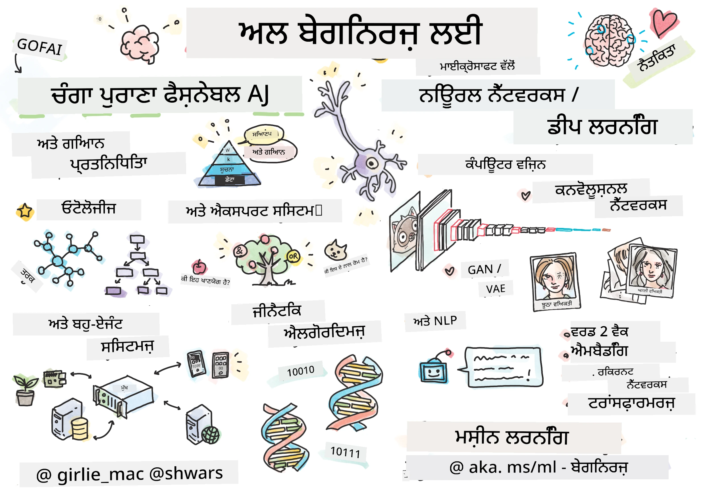

[](https://github.com/microsoft/AI-For-Beginners/blob/main/LICENSE)
[](https://GitHub.com/microsoft/AI-For-Beginners/graphs/contributors/)
[](https://GitHub.com/microsoft/AI-For-Beginners/issues/)
[](https://GitHub.com/microsoft/AI-For-Beginners/pulls/)
[](http://makeapullrequest.com)

[](https://GitHub.com/microsoft/AI-For-Beginners/watchers/)
[](https://GitHub.com/microsoft/AI-For-Beginners/network/)
[](https://GitHub.com/microsoft/AI-For-Beginners/stargazers/)
[](https://mybinder.org/v2/gh/microsoft/ai-for-beginners/HEAD)
[](https://gitter.im/Microsoft/ai-for-beginners?utm_source=badge&utm_medium=badge&utm_campaign=pr-badge)

[](https://discord.gg/nTYy5BXMWG)

# ਬੇਗਿਨਰਜ਼ ਲਈ ਕ੍ਰਿਤ੍ਰਿਮ ਬੁੱਧੀ - ਇੱਕ ਅਕਾਦਮਿਕ ਪਾਠਕ੍ਰਮ

||
|:---:|
| ਬੇਗਿਨਰਜ਼ ਲਈ ਕ੍ਰਿਤ੍ਰਿਮ ਬੁੱਧੀ - _ਸਕੇਚ ਨੋਟ ਬਾਈ [@girlie_mac](https://twitter.com/girlie_mac)_ |

ਸਾਡੀ 12 ਹਫ਼ਤੇ, 24 ਪਾਠਕਾਂ ਦਾ ਕੋਰਸ ਦੇ ਨਾਲ **ਕ੍ਰਿਤ੍ਰਿਮ ਬੁੱਧੀ** (AI) ਦੀ ਦੁਨੀਆਂ ਦੀ ਪੜਚੋਲ ਕਰੋ! ਇਸ ਵਿੱਚ ਪ੍ਰਯੋਗਾਤਮਕ ਪਾਠ, ਕੁਇਜ਼ ਅਤੇ ਲੈਬ ਸ਼ਾਮਿਲ ਹਨ। ਕੋਰਸ ਬੇਗਿਨਰ-ਮਿਤ੍ਰ ਹੈ ਅਤੇ ਟੈਂਸਰਫਲੋ ਅਤੇ ਪਾਈਟਾਰਚ ਜਿਹੇ ਟੂਲ ਨਾਲ-ਨਾਲ AI ਵਿੱਚ ਨੈਤਿਕਤਾ ਦਾ ਵਿਸਤਾਰ ਕਰਦਾ ਹੈ।


### 🌐 ਬਹੁਭਾਸ਼ੀ ਸਹਿਯੋਗ

#### GitHub ਐਕਸ਼ਨ ਰਾਹੀਂ ਸਮਰਥਿਤ (ਆਟੋਮੇਟਿਡ & ਹਮੇਸ਼ਾ ਤਾਜ਼ਾ)

<!-- CO-OP TRANSLATOR LANGUAGES TABLE START -->
[Arabic](../ar/README.md) | [Bengali](../bn/README.md) | [Bulgarian](../bg/README.md) | [Burmese (Myanmar)](../my/README.md) | [Chinese (Simplified)](../zh-CN/README.md) | [Chinese (Traditional, Hong Kong)](../zh-HK/README.md) | [Chinese (Traditional, Macau)](../zh-MO/README.md) | [Chinese (Traditional, Taiwan)](../zh-TW/README.md) | [Croatian](../hr/README.md) | [Czech](../cs/README.md) | [Danish](../da/README.md) | [Dutch](../nl/README.md) | [Estonian](../et/README.md) | [Finnish](../fi/README.md) | [French](../fr/README.md) | [German](../de/README.md) | [Greek](../el/README.md) | [Hebrew](../he/README.md) | [Hindi](../hi/README.md) | [Hungarian](../hu/README.md) | [Indonesian](../id/README.md) | [Italian](../it/README.md) | [Japanese](../ja/README.md) | [Kannada](../kn/README.md) | [Korean](../ko/README.md) | [Lithuanian](../lt/README.md) | [Malay](../ms/README.md) | [Malayalam](../ml/README.md) | [Marathi](../mr/README.md) | [Nepali](../ne/README.md) | [Nigerian Pidgin](../pcm/README.md) | [Norwegian](../no/README.md) | [Persian (Farsi)](../fa/README.md) | [Polish](../pl/README.md) | [Portuguese (Brazil)](../pt-BR/README.md) | [Portuguese (Portugal)](../pt-PT/README.md) | [Punjabi (Gurmukhi)](./README.md) | [Romanian](../ro/README.md) | [Russian](../ru/README.md) | [Serbian (Cyrillic)](../sr/README.md) | [Slovak](../sk/README.md) | [Slovenian](../sl/README.md) | [Spanish](../es/README.md) | [Swahili](../sw/README.md) | [Swedish](../sv/README.md) | [Tagalog (Filipino)](../tl/README.md) | [Tamil](../ta/README.md) | [Telugu](../te/README.md) | [Thai](../th/README.md) | [Turkish](../tr/README.md) | [Ukrainian](../uk/README.md) | [Urdu](../ur/README.md) | [Vietnamese](../vi/README.md)

> **ਕੀ ਤੁਸੀਂ ਸਥਾਨਕ ਤੌਰ 'ਤੇ ਕਲੋਨ ਕਰਨਾ ਪਸੰਦ ਕਰोगੇ?**

> ਇਹ ਰੇਪੋ ਸੈਂਕੜੇ ਭਾਸ਼ਾਈ ਅਨੁਵਾਦ ਸ਼ਾਮਿਲ ਕਰਦਾ ਹੈ ਜੋ ਡਾਊਨਲੋਡ ਦਾ ਆਕਾਰ ਕਾਫੀ ਵਧਾ ਦਿੰਦੇ ਹਨ। ਬਿਨਾ ਅਨੁਵਾਦਾਂ ਦੇ ਕਲੋਨ ਕਰਨ ਲਈ, sparse checkout ਦੀ ਵਰਤੋਂ ਕਰੋ:
> ```bash
> git clone --filter=blob:none --sparse https://github.com/microsoft/AI-For-Beginners.git
> cd AI-For-Beginners
> git sparse-checkout set --no-cone '/*' '!translations' '!translated_images'
> ```
> ਇਹ ਤੁਹਾਨੂੰ ਕੋਰਸ ਨੂੰ ਪੂਰਾ ਕਰਨ ਲਈ ਜ਼ਰੂਰੀ ਸਾਰਾ ਕੁਝ ਤੇਜ਼ ਡਾਊਨਲੋਡ ਵਿਸਤਾਰ ਨਾਲ ਦਿੰਦਾ ਹੈ।
<!-- CO-OP TRANSLATOR LANGUAGES TABLE END -->

**ਜੇ ਤੁਸੀਂ ਹੋਰ ਅਨੁਵਾਦ ਭਾਸ਼ਾਵਾਂ ਚਾਹੁੰਦੇ ਹੋ ਤਾਂ ਉਹ ਇੱਥੇ ਦਿੱਤੇ ਗਏ ਹਨ [ਇਥੇ](https://github.com/Azure/co-op-translator/blob/main/getting_started/supported-languages.md)**

## ਕਮਿਊਨਿਟੀ ਵਿੱਚ ਸ਼ਾਮਲ ਹੋਵੋ  
[](https://discord.gg/nTYy5BXMWG)

## ਤੁਸੀਂ ਕੀ ਸਿੱਖੋਗੇ

**[ਕੋਰਸ ਦਾ ਮਾਈੰਡਮੈਪ](http://soshnikov.com/courses/ai-for-beginners/mindmap.html)**

ਇਸ ਪਾਠਕ੍ਰਮ ਵਿੱਚ, ਤੁਸੀਂ ਸਿੱਖੋਗੇ:

* ਕ੍ਰਿਤ੍ਰਿਮ ਬੁੱਧੀ ਦੀਆਂ ਵੱਖ-ਵੱਖ ਪਹੁੰਚਾਂ, ਜਿਸ ਵਿੱਚ "ਚੰਗੀ ਪੁਰਾਣੀ" ਪ੍ਰਤੀਕਾਤਮਕ ਪਹੁੰਚ ਸ਼ਾਮਿਲ ਹੈ, ਜਿਸ ਵਿੱਚ **ਜਾਣਕਾਰੀ ਪ੍ਰਤਿਨਿਧਿਤਾ** ਅਤੇ ਤਰਕ ([GOFAI](https://en.wikipedia.org/wiki/Symbolic_artificial_intelligence))।
* **ਨਿਊਰਲ ਨੈੱਟਵਰਕਸ** ਅਤੇ **ਡੀਪ ਲਰਨਿੰਗ**, ਜੋ ਆਧੁਨਿਕ AI ਦੇ ਕੇਂਦਰ ਵਿੱਚ ਹਨ। ਅਸੀਂ ਇਹ ਜਰੂਰੀ ਵਿਸ਼ਿਆਂ ਨੂੰ ਦੋ ਸਭ ਤੋਂ ਲੋਕਪ੍ਰਿਯ ਫਰੇਮਵਰਕਾਂ ਵਿੱਚ ਕੋਡ ਰਾਹੀਂ ਦਰਸਾਵਾਂਗੇ - [TensorFlow](http://Tensorflow.org) ਅਤੇ [PyTorch](http://pytorch.org)।
* ਛਬੀਆਂ ਅਤੇ ਲਿਖਤ ਨਾਲ ਕੰਮ ਕਰਨ ਲਈ **ਨਿਊਰਲ ਆਰਕੀਟੈਕਚਰ**। ਅਸੀਂ ਹਾਲੀਆ ਮਾਡਲਾਂ ਨੂੰ ਕਵਰ ਕਰਾਂਗੇ, ਪਰ ਸਿਆਸਤ-ਕਾਰਗੁਜ਼ਾਰੀ ਵਿੱਚ ਕੁਝ ਘਾਟ ਹੋ ਸਕਦੀ ਹੈ।
* ਘੱਟ ਲੋਕਪ੍ਰਿਯ AI ਪਹੁੰਚਾਂ, ਜਿਵੇਂ ਕਿ **ਜੀਨੇਟਿਕ ਅਲਗੋਰਿਦਮਸ** ਅਤੇ **ਮਲਟੀ-ਏਜੰਟ ਸਿਸਟਮਸ**।

ਇਸ ਪਾਠਕ੍ਰਮ ਵਿੱਚ ਅਸੀਂ ਕੀ ਨਹੀਂ ਕਵਰ ਕਰਾਂਗੇ:

> [ਇਸ ਕੋਰਸ ਲਈ ਸਾਰੇ ਵਾਧੂ ਸਰੋਤ ਸਾਡੇ Microsoft Learn ਕਲెਕਸ਼ਨ ਵਿੱਚ ਲੱਭੋ](https://learn.microsoft.com/en-us/collections/7w28iy2xrqzdj0?WT.mc_id=academic-77998-bethanycheum)

* ਕਾਰੋਬਾਰੀ ਹਾਲਾਤਾਂ ਵਿੱਚ **ਬਿਜ਼ਨਸ ਵਿੱਚ AI ਦੀ ਵਰਤੋਂ**। Microsoft Learn 'ਤੇ [Introduction to AI for business users](https://docs.microsoft.com/learn/paths/introduction-ai-for-business-users/?WT.mc_id=academic-77998-bethanycheum) ਲਰਨਿੰਗ ਪਾਥ ਜਾਂ [AI Business School](https://www.microsoft.com/ai/ai-business-school/?WT.mc_id=academic-77998-bethanycheum) ਜੋ [INSEAD](https://www.insead.edu/) ਨਾਲ ਸਹਿਯੋਗ ਵਿੱਚ ਵਿਕਸਿਤ ਹੈ, ਦੀ ਸਿਫਾਰਸ਼ੀ ਕੀਤੀ ਜਾਂਦੀ ਹੈ।
* **ਪ੍ਰਮੁੱਖ ਮਸ਼ੀਨ ਲਰਨਿੰਗ**, ਜੋ ਸਾਡੇ [ਬੇਗਿਨਰਜ਼ ਲਈ ਮਸ਼ੀਨ ਲਰਨਿੰਗ ਕੋਰਸ](http://github.com/Microsoft/ML-for-Beginners) ਵਿੱਚ ਵਧੀਆ ਅੰਤਰਗਤ ਹੈ।
* **[ਕਾਗਨਿਟਿਵ ਸਰਵਿਸਿਜ਼](https://azure.microsoft.com/services/cognitive-services/?WT.mc_id=academic-77998-bethanycheum)** ਦੀ ਵਰਤੋਂ ਨਾਲ ਬਣਾਈਆਂ ਪ੍ਰਯੋਗਿਕ AI ਐਪਲੀਕੇਸ਼ਨਜ਼। ਇਨ੍ਹਾਂ ਲਈ ਸਾਡੀ ਸਿਫਾਰਸ਼ ਹੈ ਕਿ ਤੁਸੀਂ Microsoft Learn ਦੇ ਮਾਡਿਊਲਾਂ ਨਾਲ ਸ਼ੁਰੂਆਤ ਕਰੋ ਜਿਵੇਂ [ਦ੍ਰਿਸ਼ਟੀ](https://docs.microsoft.com/learn/paths/create-computer-vision-solutions-azure-cognitive-services/?WT.mc_id=academic-77998-bethanycheum), [ਕੁਦਰਤੀ ਭਾਸ਼ਾ ਪ੍ਰਸੈਸਿੰਗ](https://docs.microsoft.com/learn/paths/explore-natural-language-processing/?WT.mc_id=academic-77998-bethanycheum), **[Azure OpenAI ਸਰਵਿਸ ਨਾਲ ਜਨਰੈਟਿਵ AI](https://learn.microsoft.com/en-us/training/paths/develop-ai-solutions-azure-openai/?WT.mc_id=academic-77998-bethanycheum)** ਅਤੇ ਹੋਰ।
* ਵੱਖ-ਵੱਖ ML **ਕਲਾਉਡ ਫਰੇਮਵਰਕਜ਼**, ਜਿਵੇਂ [Azure Machine Learning](https://azure.microsoft.com/services/machine-learning/?WT.mc_id=academic-77998-bethanycheum), [Microsoft Fabric](https://learn.microsoft.com/en-us/training/paths/get-started-fabric/?WT.mc_id=academic-77998-bethanycheum), ਜਾਂ [Azure Databricks](https://docs.microsoft.com/learn/paths/data-engineer-azure-databricks?WT.mc_id=academic-77998-bethanycheum)। [Build and operate machine learning solutions with Azure Machine Learning](https://docs.microsoft.com/learn/paths/build-ai-solutions-with-azure-ml-service/?WT.mc_id=academic-77998-bethanycheum) ਅਤੇ [Build and Operate Machine Learning Solutions with Azure Databricks](https://docs.microsoft.com/learn/paths/build-operate-machine-learning-solutions-azure-databricks/?WT.mc_id=academic-77998-bethanycheum) ਲਰਨਿੰਗ ਪਾਥ ਦੀ ਵਰਤੋਂ ਕਰੋ।
* **ਵਾਰਤਾਲਾਪੀ AI** ਅਤੇ **ਚੈੱਟ ਬੋਟਸ**। ਇਹਨਾਂ ਲਈ ਵੱਖਰਾ [Create conversational AI solutions](https://docs.microsoft.com/learn/paths/create-conversational-ai-solutions/?WT.mc_id=academic-77998-bethanycheum) ਲਰਨਿੰਗ ਪਾਥ ਮੌਜੂਦ ਹੈ, ਅਤੇ ਤੁਸੀਂ ਹੋਰ ਵੇਰਵੇ ਲਈ [ਇਹ ਬਲੌਗ ਪੋਸਟ](https://soshnikov.com/azure/hello-bot-conversational-ai-on-microsoft-platform/) ਵੇਖ ਸਕਦੇ ਹੋ।
* **ਡੀਪ ਲਰਨਿੰਗ ਦੀ ਡੂੰਘੀ ਗਣਿਤ**। ਇਸ ਲਈ, ਅਸੀਂ [Deep Learning](https://www.amazon.com/Deep-Learning-Adaptive-Computation-Machine/dp/0262035618) ਆਈਐਨ ਗੁੱਡਫੈਲੋ, ਯੋਸ਼ੁਆ ਬੇਂਗਿਓ ਅਤੇ ਐਰਨ ਕੋਰਵਿਲ ਦੁਆਰਾ ਲਿਖੀ ਗਈ ਕਿਤਾਬ ਦੀ ਸਿਫਾਰਸ਼ ਕਰਾਂਗੇ, ਜੋ ਅਨਲਾਈਨ ਵੀ ਉਪਲਬਧ ਹੈ [https://www.deeplearningbook.org/](https://www.deeplearningbook.org/) 'ਤੇ।

_ਕਲਾਉਡ ਵਿੱਚ AI_ ਬਾਰੇ ਇੱਕ ਨਰਮ ਪਰਿਚਯ ਲਈ ਤੁਸੀਂ [Get started with artificial intelligence on Azure](https://docs.microsoft.com/learn/paths/get-started-with-artificial-intelligence-on-azure/?WT.mc_id=academic-77998-bethanycheum) ਲਰਨਿੰਗ ਪਾਥ ਲੈ ਸਕਦੇ ਹੋ।

# ਸਮੱਗਰੀ

|     |                                                                 ਪਾਠ ਲਿੰਕ                                                                  |                                           PyTorch/Keras/TensorFlow                                          | ਲੈਬ                                                            |
| :-: | :------------------------------------------------------------------------------------------------------------------------------------------: | :---------------------------------------------------------------------------------------------: | ------------------------------------------------------------------------------ |
| 0  |                                 [ਕੋਰਸ ਸੈੱਟਅਪ](./lessons/0-course-setup/setup.md)                                 |                      [ਆਪਣੇ ਵਿਕਾਸ ਦਾ ਵਾਤਾਵਰਣ ਸੈੱਟਅਪ ਕਰੋ](./lessons/0-course-setup/how-to-run.md)                       |   |
| I  |               [**AI ਦਾ ਪਰਿਚਯ**](./lessons/1-Intro/README.md)      | | |
| 01  |       [AI ਦਾ ਪਰਿਚਯ ਅਤੇ ਇਤਿਹਾਸ](./lessons/1-Intro/README.md)       |           -                            | -  |
| II |              **ਪ੍ਰਤੀਕਾਤਮਕ AI**              |
| 02  |       [ਜਾਣਕਾਰੀ ਪ੍ਰਤਿਨਿਧਿਤਾ ਅਤੇ ਵਿਸ਼ੇਸ਼ਾਗਿਆ ਪ੍ਰਣਾਲੀ](./lessons/2-Symbolic/README.md)       |            [ਵਿਸ਼ੇਸ਼ਾਗਿਆ ਪ੍ਰਣਾਲੀ](./lessons/2-Symbolic/Animals.ipynb) /  [ਓਨਟੋਲੋਜੀ](./lessons/2-Symbolic/FamilyOntology.ipynb) /[ਕਾਂਸੈਪਟ ਗ੍ਰਾਫ਼](./lessons/2-Symbolic/MSConceptGraph.ipynb)                             |  |
| III |                        [**ਨਿਊਰਲ ਨੈੱਟਵਰਕਸ ਦਾ ਪਰਚਿਆ**](./lessons/3-NeuralNetworks/README.md) |||
| 03  |                [ਪਰਸੈਪਟ੍ਰੌਨ](./lessons/3-NeuralNetworks/03-Perceptron/README.md)                 |                       [ਨੋਟਬੁੱਕ](./lessons/3-NeuralNetworks/03-Perceptron/Perceptron.ipynb)                      | [ਲੈਬ](./lessons/3-NeuralNetworks/03-Perceptron/lab/README.md) |
| 04  |                   [ਮਲਟੀ-ਲੇਅਰਡ ਪਰਸੈਪਟ੍ਰੌਨ ਅਤੇ ਆਪਣਾ ਫਰੇਮਵਰਕ ਤਿਆਰ ਕਰਨਾ](./lessons/3-NeuralNetworks/04-OwnFramework/README.md)                   |        [ਨੋਟਬੁੱਕ](./lessons/3-NeuralNetworks/04-OwnFramework/OwnFramework.ipynb)        | [ਲੈਬ](./lessons/3-NeuralNetworks/04-OwnFramework/lab/README.md) |
| 05  |            [ਫਰੇਮਵਰਕਾਂ ਦਾ ਪਰਚਿਆ (ਪਾਇਟੋਰਚ/ਟੈਂਸਰਫਲੋ) ਅਤੇ ਅਤਿ-ਫਿੱਟਿੰਗ](./lessons/3-NeuralNetworks/05-Frameworks/README.md)             |           [ਪਾਇਟੋਰਚ](./lessons/3-NeuralNetworks/05-Frameworks/IntroPyTorch.ipynb) / [ਕੇਰਾਸ](./lessons/3-NeuralNetworks/05-Frameworks/IntroKeras.ipynb) / [ਟੈਂਸਰਫਲੋ](./lessons/3-NeuralNetworks/05-Frameworks/IntroKerasTF.ipynb)             | [ਲੈਬ](./lessons/3-NeuralNetworks/05-Frameworks/lab/README.md) |
| IV  |            [**ਕੰਪਿਊਟਰ ਵਿਜ਼ਨ**](./lessons/4-ComputerVision/README.md)             | [ਪਾਇਟੋਰਚ](https://docs.microsoft.com/learn/modules/intro-computer-vision-pytorch/?WT.mc_id=academic-77998-cacaste) / [ਟੈਂਸਰਫਲੋ](https://docs.microsoft.com/learn/modules/intro-computer-vision-TensorFlow/?WT.mc_id=academic-77998-cacaste)| [ਮਾਈਕ੍ਰੋਸਾਫਟ ਐਜ਼ੂਅਰ 'ਤੇ ਕੰਪਿਊਟਰ ਵਿਜ਼ਨ ਦਾ ਅਨੁਸੰਧਾਨ ਕਰੋ](https://learn.microsoft.com/en-us/collections/7w28iy2xrqzdj0?WT.mc_id=academic-77998-bethanycheum) |
| 06  |            [ਕੰਪਿਊਟਰ ਵਿਜ਼ਨ ਦਾ ਪਰਚਿਆ. ਓਪਨਸੀਵੀ](./lessons/4-ComputerVision/06-IntroCV/README.md)             |           [ਨੋਟਬੁੱਕ](./lessons/4-ComputerVision/06-IntroCV/OpenCV.ipynb)         | [ਲੈਬ](./lessons/4-ComputerVision/06-IntroCV/lab/README.md) |
| 07  |            [ਕਨਵੋਲਯੂਸ਼ਨਲ ਨਿਊਰਲ ਨੈੱਟਵਰਕਸ](./lessons/4-ComputerVision/07-ConvNets/README.md) &  [ਸੀਐਨਐਨ ਆਰਕੀਟੈਕਚਰਜ਼](./lessons/4-ComputerVision/07-ConvNets/CNN_Architectures.md)             |           [ਪਾਇਟੋਰਚ](./lessons/4-ComputerVision/07-ConvNets/ConvNetsPyTorch.ipynb) /[ਟੈਂਸਰਫਲੋ](./lessons/4-ComputerVision/07-ConvNets/ConvNetsTF.ipynb)             | [ਲੈਬ](./lessons/4-ComputerVision/07-ConvNets/lab/README.md) |
| 08  |            [ਪੂਰਵ-ਤਿਆਰ ਨੈੱਟਵਰਕਸ ਅਤੇ ਟ੍ਰਾਂਸਫਰ ਲਰਨਿੰਗ](./lessons/4-ComputerVision/08-TransferLearning/README.md) ਅਤੇ [ਟ੍ਰੇਨਿੰਗ ਤਰੀਕੇ](./lessons/4-ComputerVision/08-TransferLearning/TrainingTricks.md)             |           [ਪਾਇਟੋਰਚ](./lessons/4-ComputerVision/08-TransferLearning/TransferLearningPyTorch.ipynb) / [ਟੈਂਸਰਫਲੋ](./lessons/3-NeuralNetworks/05-Frameworks/IntroKerasTF.ipynb)             | [ਲੈਬ](./lessons/4-ComputerVision/08-TransferLearning/lab/README.md) |
| 09  |            [ਆਟੋਇਨਕੋਡਰ ਅਤੇ ਵੀਏਸ](./lessons/4-ComputerVision/09-Autoencoders/README.md)             |           [ਪਾਇਟੋਰਚ](./lessons/4-ComputerVision/09-Autoencoders/AutoEncodersPyTorch.ipynb) / [ਟੈਂਸਰਫਲੋ](./lessons/4-ComputerVision/09-Autoencoders/AutoencodersTF.ipynb)             |  |
| 10  |            [ਜਨਰੇਟਿਵ ਐਡਵਰਸਰੀਅਲ ਨੈੱਟਵਰਕਸ ਅਤੇ ਕਲਾ ਸਟਾਈਲ ਟ੍ਰਾਂਸਫਰ](./lessons/4-ComputerVision/10-GANs/README.md)             |           [ਪਾਇਟੋਰਚ](./lessons/4-ComputerVision/10-GANs/GANPyTorch.ipynb) / [ਟੈਂਸਰਫਲੋ](./lessons/4-ComputerVision/10-GANs/GANTF.ipynb)             |  |
| 11  |            [ਆਬਜੈਕਟ ਡਿਟੈਕਸ਼ਨ](./lessons/4-ComputerVision/11-ObjectDetection/README.md)             |         [ਟੈਂਸਰਫਲੋ](./lessons/4-ComputerVision/11-ObjectDetection/ObjectDetection.ipynb)             | [ਲੈਬ](./lessons/4-ComputerVision/11-ObjectDetection/lab/README.md) |
| 12  |            [ਸੇਮਾਂਟਿਕ ਸੈਗਮੇਂਟੇਸ਼ਨ. ਯੂ-ਨੈੱਟ](./lessons/4-ComputerVision/12-Segmentation/README.md)             |           [ਪਾਇਟੋਰਚ](./lessons/4-ComputerVision/12-Segmentation/SemanticSegmentationPytorch.ipynb) / [ਟੈਂਸਰਫਲੋ](./lessons/4-ComputerVision/12-Segmentation/SemanticSegmentationTF.ipynb)             |  |
| V  |            [**ਕੁਦਰਤੀ ਭਾਸ਼ਾ ਪ੍ਰਕਿਰਿਆ**](./lessons/5-NLP/README.md)             | [ਪਾਇਟੋਰਚ](https://docs.microsoft.com/learn/modules/intro-natural-language-processing-pytorch/?WT.mc_id=academic-77998-cacaste) /[ਟੈਂਸਰਫਲੋ](https://docs.microsoft.com/learn/modules/intro-natural-language-processing-TensorFlow/?WT.mc_id=academic-77998-cacaste) | [ਮਾਈਕ੍ਰੋਸਾਫਟ ਐਜ਼ੂਅਰ 'ਤੇ ਕੁਦਰਤੀ ਭਾਸ਼ਾ ਪ੍ਰਕਿਰਿਆ ਦਾ ਅਨੁਸੰਧਾਨ ਕਰੋ](https://learn.microsoft.com/en-us/collections/7w28iy2xrqzdj0?WT.mc_id=academic-77998-bethanycheum)|
| 13  |            [ਪਾਠ ਪ੍ਰਤੀਕਰਣ. ਬੋ / ਟੀਐਫ-ਆਈਡੀਐਫ](./lessons/5-NLP/13-TextRep/README.md)             |           [ਪਾਇਟੋਰਚ](https://github.com/microsoft/AI-For-Beginners/blob/main/lessons/5-NLP/13-TextRep/TextRepresentationPyTorch.ipynb) / [ਟੈਂਸਰਫਲੋ](https://github.com/microsoft/AI-For-Beginners/blob/main/lessons/5-NLP/13-TextRep/TextRepresentationTF.ipynb)             | |
| 14  |            [ਸੇਮਾਂਟਿਕ ਸ਼ਬਦ ਸੰਸਕਾਰ. ਵਰਡ2ਵੇਕ ਅਤੇ ਗਲੋਵ](./lessons/5-NLP/14-Embeddings/README.md)             |           [ਪਾਇਟੋਰਚ](https://github.com/microsoft/AI-For-Beginners/blob/main/lessons/5-NLP/14-Embeddings/EmbeddingsPyTorch.ipynb) / [ਟੈਂਸਰਫਲੋ](https://github.com/microsoft/AI-For-Beginners/blob/main/lessons/5-NLP/14-Embeddings/EmbeddingsTF.ipynb)             |  |
| 15  |            [ਭਾਸ਼ਾ ਮਾਡਲਿੰਗ. ਆਪਣੀਆਂ ਸਾਂਝਾਂ ਬਣਾਉਣਾ](./lessons/5-NLP/15-LanguageModeling/README.md)             |           [ਪਾਇਟੋਰਚ](https://github.com/microsoft/AI-For-Beginners/blob/main/lessons/5-NLP/15-LanguageModeling/CBoW-PyTorch.ipynb) / [ਟੈਂਸਰਫਲੋ](https://github.com/microsoft/AI-For-Beginners/blob/main/lessons/5-NLP/15-LanguageModeling/CBoW-TF.ipynb)             | [ਲੈਬ](./lessons/5-NLP/15-LanguageModeling/lab/README.md) |
| 16  |            [ਰਿਕਰੈਂਟ ਨਿਊਰਲ ਨੈੱਟਵਰਕਸ](./lessons/5-NLP/16-RNN/README.md)             |           [ਪਾਇਟੋਰਚ](https://github.com/microsoft/AI-For-Beginners/blob/main/lessons/5-NLP/16-RNN/RNNPyTorch.ipynb) / [ਟੈਂਸਰਫਲੋ](https://github.com/microsoft/AI-For-Beginners/blob/main/lessons/5-NLP/16-RNN/RNNTF.ipynb)             |  |
| 17  |            [ਜਨਰੇਟਿਵ ਰਿਕਰੈਂਟ ਨੈੱਟਵਰਕਸ](./lessons/5-NLP/17-GenerativeNetworks/README.md)             |           [ਪਾਇਟੋਰਚ](https://github.com/microsoft/AI-For-Beginners/blob/main/lessons/5-NLP/17-GenerativeNetworks/GenerativePyTorch.ipynb) / [ਟੈਂਸਰਫਲੋ](https://github.com/microsoft/AI-For-Beginners/blob/main/lessons/5-NLP/17-GenerativeNetworks/GenerativeTF.ipynb)             | [ਲੈਬ](./lessons/5-NLP/17-GenerativeNetworks/lab/README.md) |
| 18  |            [ਟ੍ਰਾਂਸਫਰਮਰਜ਼. ਬਰਟ.](./lessons/5-NLP/18-Transformers/README.md)             |           [ਪਾਇਟੋਰਚ](https://github.com/microsoft/AI-For-Beginners/blob/main/lessons/5-NLP/18-Transformers/TransformersPyTorch.ipynb) /[ਟੈਂਸਰਫਲੋ](https://github.com/microsoft/AI-For-Beginners/blob/main/lessons/5-NLP/18-Transformers/TransformersTF.ipynb)             |  |
| 19  |            [ਨੇਮਡ ਐਂਟਿਟੀ ਰੀਕਗਨਿਸ਼ਨ](./lessons/5-NLP/19-NER/README.md)             |           [ਟੈਂਸਰਫਲੋ](https://microsoft.github.io/AI-For-Beginners/lessons/5-NLP/19-NER/NER-TF.ipynb)             | [ਲੈਬ](./lessons/5-NLP/19-NER/lab/README.md) |
| 20  |            [ਵੱਡੇ ਭਾਸ਼ਾ ਮਾਡਲ, ਪ੍ਰੌਂਪਟ ਪ੍ਰੋਗ੍ਰਾਮਿੰਗ ਅਤੇ ਫਿਊ-ਸ਼ਾਟ ਟਾਸਕ](./lessons/5-NLP/20-LangModels/README.md)             |           [ਪਾਇਟੋਰਚ](https://microsoft.github.io/AI-For-Beginners/lessons/5-NLP/20-LangModels/GPT-PyTorch.ipynb) | |
| VI |            **ਹੋਰ ਏਆਈ ਤਕਨੀਕਾਂ** || |
| 21  |            [ਜੀਨੈਟਿਕ ਅਲਗੋਰਿਦਮ](./lessons/6-Other/21-GeneticAlgorithms/README.md)             |           [ਨੋਟਬੁੱਕ](./lessons/6-Other/21-GeneticAlgorithms/Genetic.ipynb) | |
| 22  |            [ਡੀਪ ਰੀਇਨਫੋਰਸਮੈਂਟ ਲਰਨਿੰਗ](./lessons/6-Other/22-DeepRL/README.md)             |           [ਪਾਇਟੋਰਚ](./lessons/6-Other/22-DeepRL/CartPole-RL-PyTorch.ipynb) /[ਟੈਂਸਰਫਲੋ](./lessons/6-Other/22-DeepRL/CartPole-RL-TF.ipynb)             | [ਲੈਬ](./lessons/6-Other/22-DeepRL/lab/README.md) |
| 23  |            [ਮਲਟੀ-ਏਜੰਟ ਸਿਸਟਮ](./lessons/6-Other/23-MultiagentSystems/README.md)             |  | |
| VII |            **ਏਆਈ ਨੈਤਿਕਤਾ** | | |
| 24  |            [ਏਆਈ ਨੈਤਿਕਤਾ ਅਤੇ ਜ਼ਿੰਮੇਵਾਰ ਏਆਈ](./lessons/7-Ethics/README.md)             |           [ਮਾਈਕ੍ਰੋਸਾਫਟ ਲਰਨ: ਜ਼ਿੰਮੇਵਾਰ ਏਆਈ ਸਿਧਾਂਤ](https://docs.microsoft.com/learn/paths/responsible-ai-business-principles/?WT.mc_id=academic-77998-cacaste) | |
| IX  |            **ਵਾਧੂ** | | |
| 25  |            [ਮਲਟੀ-ਮੋਡਲ ਨੈੱਟਵਰਕਸ, ਕਲਿਪ ਅਤੇ ਵੀਕ੍ਯੂਜੀਐਨ](./lessons/X-Extras/X1-MultiModal/README.md)             |           [ਨੋਟਬੁੱਕ](./lessons/X-Extras/X1-MultiModal/Clip.ipynb)    | |

## ਹਰ ਪਾਠ ਵਿੱਚ ਸ਼ਾਮਲ ਹੈ

* ਪੜ੍ਹਾਈ ਤੋਂ ਪਹਿਲਾਂ ਦਾ ਸਮਗਰੀ
* ਚੱਲਣ ਯੋਗ ਜੁਪਾਈਟਰ ਨੋਟਬੁੱਕਸ, ਜੋ ਅਕਸਰ ਫਰੇਮਵਰਕ (**ਪਾਇਟੋਰਚ** ਜਾਂ **ਟੈਂਸਰਫਲੋ**) ਲਈ ਖਾਸ ਹੁੰਦੇ ਹਨ। ਚੱਲਣ ਯੋਗ ਨੋਟਬੁੱਕ ਵਿਚ ਬਹੁਤ ਸਿਧਾਂਤੀ ਸਮੱਗਰੀ ਵੀ ਹੁੰਦੀ ਹੈ, ਇਸ ਲਈ ਵਿਸ਼ੇ ਨੂੰ ਸਮਝਣ ਲਈ ਤੁਹਾਨੂੰ ਘੱਟੋ-ਘੱਟ ਇੱਕ ਨੋਟਬੁੱਕ (ਪਾਇਟੋਰਚ ਜਾਂ ਟੈਂਸਰਫਲੋ) ਦੇ ਵਰਜਨ ਵਿਚੋਂ ਇੱਕ ਨੂੰ ਸਮਝਣਾ ਪੈਣਾ ਹੈ।
* ਕੁਝ ਵਿਸ਼ਿਆਂ ਲਈ **ਲੈਬਾਂ** ਉਪਲਬਧ ਹਨ, ਜੋ ਤੁਹਾਨੂੰ ਸਿੱਖੇ ਹੋਏ ਸਮਗਰੀ ਨੂੰ ਕਿਸੇ ਖਾਸ ਸਮੱਸਿਆ 'ਤੇ ਲਾਗੂ ਕਰਨ ਦਾ ਮੌਕਾ ਦਿੰਦੇ ਹਨ।
* ਕੁਝ ਸੈਕਸ਼ਨਾਂ ਵਿੱਚ [**ਐਮਐਸ ਲਰਨ**](https://learn.microsoft.com/en-us/collections/7w28iy2xrqzdj0?WT.mc_id=academic-77998-bethanycheum) ਮੋਡਿਊਲਾਂ ਦੇ ਲਿੰਕ ਹਨ ਜੋ ਸੰਬੰਧਤ ਵਿਸ਼ਿਆਂ ਨੂੰ ਕਵਰ ਕਰਦੇ ਹਨ।

## ਸ਼ੁਰੂਆਤ ਕਰਨਾ

### 🎯 ਏਆਈ ਵਿੱਚ ਨਵਾਂ? ਇੱਥੇ ਸ਼ੁਰੂ ਕਰੋ!

ਜੇ ਤੁਸੀਂ ਏਆਈ ਵਿੱਚ ਬਿਲਕੁਲ ਨਵੇਂ ਹੋ ਅਤੇ ਤੇਜ਼, ਹੱਥ-ਇੱਲਾਜ਼ ਵਾਲੇ ਉਦਾਹਰਣ ਚਾਹੁੰਦੇ ਹੋ, ਤਾਂ ਸਾਡੇ [**ਨਵੀਂਆ ਵੇਖਦੀਆਂ ਉਦਾਹਰਣਾਂ**](./examples/README.md) ਨੂੰ ਵੇਖੋ! ਇਹ ਸ਼ਾਮਲ ਹਨ:

- 🌟 **ਹੈਲੋ ਏਆਈ ਵਰਲਡ** - ਤੁਹਾਡਾ ਪਹਿਲਾ ਏਆਈ ਪ੍ਰੋਗਰਾਮ (ਪੈਟਰਨ ਪਹਿਚਾਣ)
- 🧠 **ਸਾਦਾ ਨਿਊਰਲ ਨੈੱਟਵਰਕ** - ਖ਼ਾਲੀ ਜਗ੍ਹਾ ਤੋਂ ਨਿਊਰਲ ਨੈੱਟਵਰਕ ਬਣਾਉ  

- 🖼️ **ਛবি ਵਰਗੀਕਰਤਾ** - ਵਿਸਥਾਰਿਤ ਟਿੱਪਣੀ ਨਾਲ ਛਬੀਆਂ ਨੂੰ ਵਰਗੀਕ੍ਰਿਤ ਕਰੋ
- 💬 **ਲਿਖਤੀ ਭਾਵਨਾ** - ਸਕਾਰਾਤਮਕ/ਨਕਾਰਾਤਮਕ ਲਿਖਤੀ ਵਿਚਾਰ ਵਿਸ਼ਲੇਸ਼ਣ ਕਰੋ

ਇਹ ਉਦਾਹਰਣ ਤੁਹਾਨੂੰ ਪੂਰੇ ਪਾਠਕ੍ਰਮ ਵਿੱਚ ਡੁੱਬਣ ਤੋਂ ਪਹਿਲਾਂ AI ਧਾਰਨਾਵਾਂ ਨੂੰ ਸਮਝਣ ਵਿੱਚ ਮਦਦ ਕਰਨ ਲਈ ਬਣਾਏ ਗਏ ਹਨ।

### 📚 ਪੂਰਾ ਪਾਠਕ੍ਰਮ ਸੈੱਟਅੱਪ

- ਅਸੀਂ ਤੁਹਾਡੀ ਵਿਕਾਸ ਮਾਹੌਲ ਸੈੱਟਅੱਪ ਕਰਨ ਵਿੱਚ ਮਦਦ ਲਈ ਇੱਕ [ਸੈੱਟਅੱਪ ਪਾਠ](./lessons/0-course-setup/setup.md) ਬਣਾਇਆ ਹੈ। - ਸਿੱਖਿਆਕਾਰਾਂ ਲਈ ਵੀ ਅਸੀਂ ਇੱਕ [ਪਾਠਕ੍ਰਮ ਸੈੱਟਅੱਪ ਪਾਠ](./lessons/0-course-setup/for-teachers.md) ਬਣਾਇਆ ਹੈ!
- ਕਿਵੇਂ [VSCode ਜਾਂ Codespace ਵਿੱਚ ਕੋਡ ਚਲਾਉਣਾ ਹੈ](./lessons/0-course-setup/how-to-run.md)

ਇਹਨਾਂ ਕਦਮਾਂ ਦੀ ਪਾਲਣਾ ਕਰੋ:

ਰੈਪੋਜ਼ਟਰੀ ਫਾਰਕ ਕਰੋ: ਇਸ ਸਫ਼ੇ ਦੇ ਉੱਪਰ-ਸੱਜੇ ਕੋਨੇ ਵਿੱਚ "Fork" ਬਟਨ ਤੇ ਕਲਿੱਕ ਕਰੋ।

ਰੈਪੋਜ਼ਟਰੀ ਕਲੋਨ ਕਰੋ: `git clone https://github.com/microsoft/AI-For-Beginners.git`

ਇਸ ਰੈਪੋਜ਼ਟਰੀ ਨੂੰ ਬਾਅਦ ਵਿੱਚ ਸੌਖਾ ਲੱਭਣ ਲਈ ਸਿਤਾਰਾ (🌟) ਕਰਨਾ ਨਾ ਭੁੱਲੋ।

## ਹੋਰ ਸਿੱਖਣ ਵਾਲਿਆਂ ਨਾਲ ਮਿਲੋ

ਸਾਡੇ [ਅਧਿਕਾਰਕ AI Discord ਸਰਵਰ](https://aka.ms/genai-discord?WT.mc_id=academic-105485-bethanycheum) ਵਿੱਚ ਸ਼ਾਮਲ ਹੋਵੋ ਅਤੇ ਇਸ ਕੋਰਸ ਨੂੰ ਲੈ ਰਹੇ ਹੋਰ ਸਿੱਖਣ ਵਾਲਿਆਂ ਨਾਲ ਜੁੜੋ ਅਤੇ ਸਹਾਇਤਾ ਪ੍ਰਾਪਤ ਕਰੋ।

ਜੇ ਤੁਹਾਡੇ ਕੋਲ ਉਤਪਾਦ ਫੀਡਬੈਕ ਜਾਂ ਪ੍ਰਸ਼ਨ ਹਨ ਤਾਂ ਸਾਡੇ [Azure AI Foundry Developer Forum](https://aka.ms/foundry/forum) 'ਤੇ ਜਾਓ।

## ਕੁਈਜ਼

> **ਕੁਈਜ਼ ਬਾਰੇ ਇੱਕ ਨੋਟ**: ਸਾਰੇ ਕੁਈਜ਼ Quiz-app ਫੋਲਡਰ ਵਿੱਚ ਵਾਪਰੇ ਹਨ, ਜਿਵੇਂ ਕਿ etc\quiz-app, ਜਾਂ [ਅਨਲਾਈਨ ਇੱਥੇ](https://ff-quizzes.netlify.app/)। ਇਹ ਪਾਠਾਂ ਦੇ ਅੰਦਰ ਲਿੰਕ ਕੀਤੇ ਗਏ ਹਨ। ਕੁਈਜ਼ ਐਪ ਨੂੰ ਸਥਾਨਕ ਰੂਪ ਵਿੱਚ ਚਲਾਇਆ ਜਾ ਸਕਦਾ ਹੈ ਜਾਂ Azure 'ਤੇ ਤੈਨਾਤ ਕੀਤਾ ਜਾ ਸਕਦਾ ਹੈ; `quiz-app` ਫੋਲਡਰ ਵਿੱਚ ਦਿੱਤੀਆਂ ਹਦਾਇਤਾਂ ਦੀ ਪਾਲਣਾ ਕਰੋ। ਇਹ ਜਿਰੋਰੀ ਹੈ ਕਿ ਆਹਲੇ ਆਹਲੇ ਇਨ੍ਹਾਂ ਨੂੰ ਸਥਾਨਕ ਕਿੱਝ ਬਣਾਇਆ ਜਾ ਰਿਹਾ ਹੈ।

## ਮਦਦ ਦੀ ਲੋੜ

ਕੀ ਤੁਹਾਡੇ ਕੋਲ ਸੁਝਾਵ ਹਨ ਜਾਂ ਤੁਸੀਂ ਸਪੈਲਿੰਗ ਜਾਂ ਕੋਡ ਗਲਤੀਆਂ ਲੱਭੀਆਂ ਹਨ? ਇੱਕ ਇਸ਼ਯੂ ਉਠਾਓ ਜਾਂ ਪੁਲ ਰਿਕਵੇਸਟ ਬਣਾਓ।

## ਵਿਸ਼ੇਸ਼ ਧੰਨਵਾਦ

* **✍️ ਪ੍ਰਮੁੱਖ ਲੇਖਕ:** [Dmitry Soshnikov](http://soshnikov.com), PhD  
* **🔥 ਸੰਪਾਦਕ:** [Jen Looper](https://twitter.com/jenlooper), PhD  
* **🎨 ਸਕੈਚਨੋਟ ਚਿੱਤਰਕਾਰ:** [Tomomi Imura](https://twitter.com/girlie_mac)  
* **✅ ਕੁਈਜ਼ ਸਿਰਜਣਹਾਰ:** [Lateefah Bello](https://github.com/CinnamonXI), [MLSA](https://studentambassadors.microsoft.com/)  
* **🙏 ਮੁਖਿ ਯੋਗਦਾਨਕਾਰ:** [Evgenii Pishchik](https://github.com/Pe4enIks)  

## ਹੋਰ ਪਾਠਕ੍ਰਮ

ਸਾਡੀ ਟੀਮ ਹੋਰ ਪਾਠਕ੍ਰਮ ਵੀ ਤਿਆਰ ਕਰਦੀ ਹੈ! ਵੇਖੋ:

<!-- CO-OP TRANSLATOR OTHER COURSES START -->
### LangChain
[](https://aka.ms/langchain4j-for-beginners)
[](https://aka.ms/langchainjs-for-beginners?WT.mc_id=m365-94501-dwahlin)
[](https://github.com/microsoft/langchain-for-beginners?WT.mc_id=m365-94501-dwahlin)
---

### Azure / Edge / MCP / Agents
[](https://github.com/microsoft/AZD-for-beginners?WT.mc_id=academic-105485-koreyst)
[](https://github.com/microsoft/edgeai-for-beginners?WT.mc_id=academic-105485-koreyst)
[](https://github.com/microsoft/mcp-for-beginners?WT.mc_id=academic-105485-koreyst)
[](https://github.com/microsoft/ai-agents-for-beginners?WT.mc_id=academic-105485-koreyst)

---
 
### Generative AI Series
[](https://github.com/microsoft/generative-ai-for-beginners?WT.mc_id=academic-105485-koreyst)
[-9333EA?style=for-the-badge&labelColor=E5E7EB&color=9333EA)](https://github.com/microsoft/Generative-AI-for-beginners-dotnet?WT.mc_id=academic-105485-koreyst)
[-C084FC?style=for-the-badge&labelColor=E5E7EB&color=C084FC)](https://github.com/microsoft/generative-ai-for-beginners-java?WT.mc_id=academic-105485-koreyst)
[-E879F9?style=for-the-badge&labelColor=E5E7EB&color=E879F9)](https://github.com/microsoft/generative-ai-with-javascript?WT.mc_id=academic-105485-koreyst)

---
 
### Core Learning
[](https://aka.ms/ml-beginners?WT.mc_id=academic-105485-koreyst)
[](https://aka.ms/datascience-beginners?WT.mc_id=academic-105485-koreyst)
[](https://aka.ms/ai-beginners?WT.mc_id=academic-105485-koreyst)
[](https://github.com/microsoft/Security-101?WT.mc_id=academic-96948-sayoung)
[](https://aka.ms/webdev-beginners?WT.mc_id=academic-105485-koreyst)
[](https://aka.ms/iot-beginners?WT.mc_id=academic-105485-koreyst)
[](https://github.com/microsoft/xr-development-for-beginners?WT.mc_id=academic-105485-koreyst)

---
 
### Copilot Series
[](https://aka.ms/GitHubCopilotAI?WT.mc_id=academic-105485-koreyst)
[](https://github.com/microsoft/mastering-github-copilot-for-dotnet-csharp-developers?WT.mc_id=academic-105485-koreyst)
[](https://github.com/microsoft/CopilotAdventures?WT.mc_id=academic-105485-koreyst)
<!-- CO-OP TRANSLATOR OTHER COURSES END -->

## ਮਦਦ ਪ੍ਰਾਪਤ ਕਰਨਾ

ਜੇ ਤੁਸੀਂ ਫਸ ਗਏ ਹੋ ਜਾਂ AI ਐਪ ਬਣਾਉਣ ਬਾਰੇ ਕੋਈ ਪ੍ਰਸ਼ਨ ਹਨ, ਤਾਂ MCP ਬਾਰੇ ਚਰਚਾ ਕਰਨ ਲਈ ਹੋਰ ਸਿੱਖਣ ਵਾਲਿਆਂ ਅਤੇ ਤਜਰਬੇਕਾਰ ਵਿਕਾਸਕਾਰਾਂ ਦੇ ਨਾਲ ਸ਼ਾਮਲ ਹੋਵੋ। ਇਹ ਇੱਕ ਸਹਾਇਕ ਸਮੁਦਾਇ ਹੈ ਜਿੱਥੇ ਪ੍ਰਸ਼ਨ ਸਵਾਗਤਯੋਗ ਹਨ ਅਤੇ ਗਿਆਨ ਖੁੱਲ੍ਹੇ ਦਿਲ ਨਾਲ ਸਾਂਝਾ ਕੀਤਾ ਜਾਂਦਾ ਹੈ।

[](https://discord.gg/nTYy5BXMWG)

ਜੇ ਤੁਹਾਡੇ ਕੋਲ ਉਤਪਾਦ ਫੀਡਬੈਕ ਜਾਂ ਗਲਤੀਆਂ ਹਨ ਤਾਂ ਇੱਥੇ ਜਾਓ:

[](https://aka.ms/foundry/forum)

---

<!-- CO-OP TRANSLATOR DISCLAIMER START -->
**ਡਿਸਕਲੇਮਰ**:  
ਇਹ ਦਸਤਾਵੇਜ਼ ਏਆਈ ਅਨੁਵਾਦ ਸੇਵਾ [Co-op Translator](https://github.com/Azure/co-op-translator) ਦੀ ਵਰਤੋਂ ਕਰਕੇ ਅਨੁਵਾਦਿਤ ਕੀਤਾ ਗਿਆ ਹੈ। ਜਦੋਂ ਕਿ ਅਸੀਂ ਸਹੀਤਾ ਲਈ ਕੋਸ਼ਿਸ਼ ਕਰਦੇ ਹਾਂ, ਕਿਰਪਾ ਕਰਕੇ ਧਿਆਨ ਵਿੱਚ ਰੱਖੋ ਕਿ ਸਵਚਾਲਿਤ ਅਨੁਵਾਦਾਂ ਵਿੱਚ ਗਲਤੀਆਂ ਜਾਂ ਅਣਸਹੀਤੀਆਂ ਹੋ ਸਕਦੀਆਂ ਹਨ। ਮੂਲ ਦਸਤਾਵੇਜ਼ ਆਪਣੀ ਮੂਲ ਭਾਸ਼ਾ ਵਿੱਚ ਹੀ ਪ੍ਰਮਾਣਿਕ ਸਰੋਤ ਮੰਨਿਆ ਜਾਣਾ ਚਾਹੀਦਾ ਹੈ। ਜ਼ਰੂਰੀ ਜਾਣਕਾਰੀ ਲਈ ਪੇਸ਼ੇਵਰ ਮਨੁੱਖੀ ਅਨੁਵਾਦ ਸਿਫ਼ਾਰਸ਼ੀ ਹੈ। ਇਸ ਅਨੁਵਾਦ ਦੀ ਵਰਤੋਂ ਨਾਲ ਉਪੱਜਣ ਵਾਲੇ ਕਿਸੇ ਵੀ ਗਲਤਫਹਮੀ ਜਾਂ ਗਲਤ ਵਿਆਖਿਆ ਦੀ ਜ਼ਿੰਮੇਵਾਰੀ ਅਸੀਂ ਨਹੀਂ ਲੈਂਦੇ।
<!-- CO-OP TRANSLATOR DISCLAIMER END -->