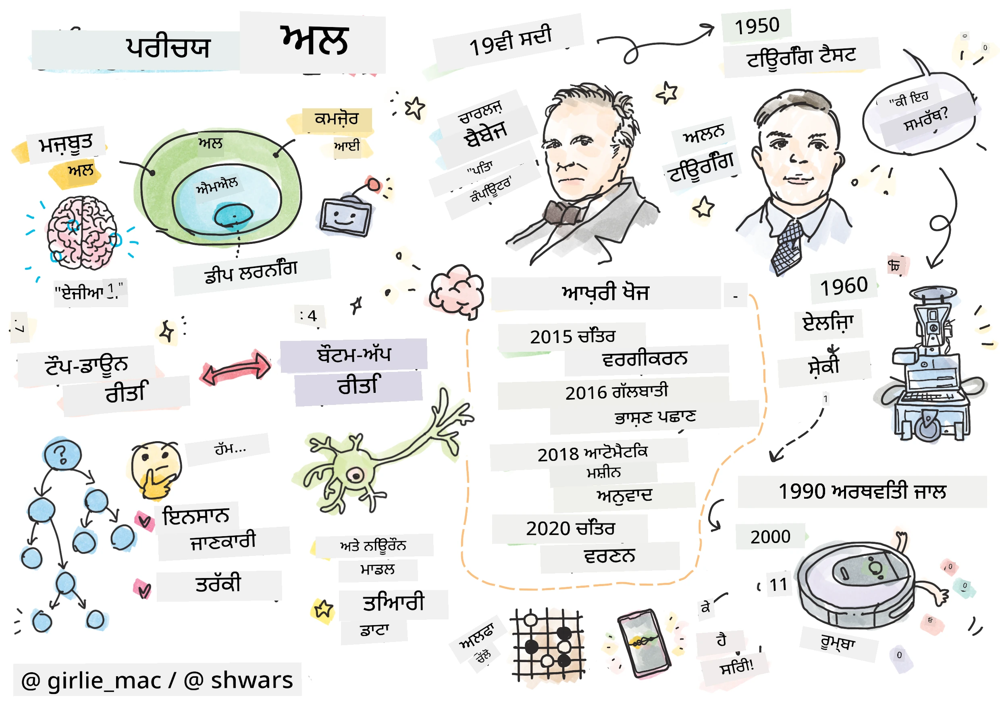

# AI ਦਾ ਪਰਿਚਯ

> ਸਕੈਚਨੋਟ [ਟੋਮੋਮੀ ਇਮੁਰਾ](https://twitter.com/girlie_mac) ਦੁਆਰਾ

## [ਪ੍ਰੀ-ਲੈਕਚਰ ਕਵਿਜ਼](https://ff-quizzes.netlify.app/en/ai/quiz/1)

**ਕ੍ਰਿਤ੍ਰਿਮ ਬੁੱਧੀ** ਇੱਕ ਰੋਮਾਂਚਕ ਵਿਗਿਆਨਕ ਵਿਸ਼ਾ ਹੈ ਜੋ ਇਸ ਗੱਲ ਦਾ ਅਧਿਐਨ ਕਰਦਾ ਹੈ ਕਿ ਅਸੀਂ ਕੰਪਿਊਟਰਾਂ ਨੂੰ ਬੁੱਧੀਮਾਨ ਵਿਹਾਰ ਕਰਨ ਲਈ ਕਿਵੇਂ ਬਣਾਉਣਗੇ, ਜਿਵੇਂ ਕਿ ਉਹ ਕੰਮ ਕਰਨਾ ਜੋ ਮਨੁੱਖੀ ਜੀਵਨ ਵਿੱਚ ਚੰਗੇ ਹਨ।

ਮੂਲ ਰੂਪ ਵਿੱਚ, ਕੰਪਿਊਟਰਾਂ ਨੂੰ [ਚਾਰਲਸ ਬੈਬੇਜ](https://en.wikipedia.org/wiki/Charles_Babbage) ਦੁਆਰਾ ਸੰਖਿਆਵਾਂ 'ਤੇ ਕੰਮ ਕਰਨ ਲਈ ਬਣਾਇਆ ਗਿਆ ਸੀ, ਇੱਕ ਸਪਸ਼ਟ ਤਰੀਕੇ - ਇੱਕ ਐਲਗੋਰਿਦਮ ਦੀ ਪਾਲਣਾ ਕਰਦੇ ਹੋਏ। ਆਧੁਨਿਕ ਕੰਪਿਊਟਰ, ਹਾਲਾਂਕਿ 19ਵੀਂ ਸਦੀ ਵਿੱਚ ਪ੍ਰਸਤਾਵਿਤ ਮੂਲ ਮਾਡਲ ਨਾਲੋਂ ਕਾਫ਼ੀ ਅਗਰਗਾਮੀ ਹਨ, ਫਿਰ ਵੀ ਨਿਯੰਤਰਿਤ ਗਣਨਾਵਾਂ ਦੇ ਇੱਕੋ ਹੀ ਵਿਚਾਰ ਦੀ ਪਾਲਣਾ ਕਰਦੇ ਹਨ। ਇਸ ਲਈ, ਇਹ ਸੰਭਵ ਹੈ ਕਿ ਕੰਪਿਊਟਰ ਨੂੰ ਕੁਝ ਕਰਨ ਲਈ ਪ੍ਰੋਗਰਾਮ ਕੀਤਾ ਜਾ ਸਕੇ ਜੇਕਰ ਅਸੀਂ ਉਹ ਸਪਸ਼ਟ ਕਦਮਾਂ ਦੀ ਲੜੀ ਜਾਣਦੇ ਹਾਂ ਜੋ ਲਕਸ਼ ਪ੍ਰਾਪਤ ਕਰਨ ਲਈ ਕਰਨੇ ਹਨ।

> ਤਸਵੀਰ [ਵਿਕੀ ਸੋਸ਼ਨਿਕੋਵਾ](http://twitter.com/vickievalerie) ਦੁਆਰਾ

> ✅ ਇੱਕ ਵਿਅਕਤੀ ਦੀ ਉਸ ਦੀ ਤਸਵੀਰ ਤੋਂ ਉਮਰ ਨਿਰਧਾਰਤ ਕਰਨਾ ਇੱਕ ਕੰਮ ਹੈ ਜਿਸ ਨੂੰ ਸਪਸ਼ਟ ਤੌਰ 'ਤੇ ਪ੍ਰੋਗਰਾਮ ਨਹੀਂ ਕੀਤਾ ਜਾ ਸਕਦਾ, ਕਿਉਂਕਿ ਅਸੀਂ ਨਹੀਂ ਜਾਣਦੇ ਕਿ ਅਸੀਂ ਆਪਣੇ ਮਨ ਵਿੱਚ ਇੱਕ ਗਿਣਤੀ ਕਿਵੇਂ ਬਣਾਉਂਦੇ ਹਾਂ ਜਦੋਂ ਅਸੀਂ ਇਹ ਕਰਦੇ ਹਾਂ।

---

ਕੁਝ ਕੰਮ ਹਨ, ਹਾਲਾਂਕਿ, ਜਿਨ੍ਹਾਂ ਨੂੰ ਹੱਲ ਕਰਨ ਦਾ ਸਪਸ਼ਟ ਤਰੀਕਾ ਸਾਨੂੰ ਨਹੀਂ ਪਤਾ। ਇੱਕ ਵਿਅਕਤੀ ਦੀ ਉਸ ਦੀ ਤਸਵੀਰ ਤੋਂ ਉਮਰ ਨਿਰਧਾਰਤ ਕਰਨ ਦੇ ਬਾਰੇ ਸੋਚੋ। ਅਸੀਂ ਇਸ ਨੂੰ ਕਿਵੇਂ ਕਰਨਾ ਸਿੱਖਦੇ ਹਾਂ, ਕਿਉਂਕਿ ਅਸੀਂ ਵੱਖ-ਵੱਖ ਉਮਰ ਦੇ ਲੋਕਾਂ ਦੇ ਬਹੁਤ ਸਾਰੇ ਉਦਾਹਰਨ ਵੇਖੇ ਹਨ, ਪਰ ਅਸੀਂ ਸਪਸ਼ਟ ਤੌਰ 'ਤੇ ਸਮਝਾ ਨਹੀਂ ਸਕਦੇ ਕਿ ਅਸੀਂ ਇਹ ਕਿਵੇਂ ਕਰਦੇ ਹਾਂ, ਨਾ ਹੀ ਅਸੀਂ ਕੰਪਿਊਟਰ ਨੂੰ ਇਹ ਕਰਨ ਲਈ ਪ੍ਰੋਗਰਾਮ ਕਰ ਸਕਦੇ ਹਾਂ। ਇਹ ਸਹੀ ਤੌਰ 'ਤੇ ਉਹ ਕੰਮ ਹਨ ਜੋ **ਕ੍ਰਿਤ੍ਰਿਮ ਬੁੱਧੀ** (ਸੰਖੇਪ ਵਿੱਚ AI) ਲਈ ਦਿਲਚਸਪੀ ਦੇ ਹਨ।

✅ ਕੁਝ ਕੰਮਾਂ ਬਾਰੇ ਸੋਚੋ ਜੋ ਤੁਸੀਂ ਕੰਪਿਊਟਰ ਨੂੰ ਸੌਂਪ ਸਕਦੇ ਹੋ ਜੋ AI ਤੋਂ ਲਾਭ ਪ੍ਰਾਪਤ ਕਰ ਸਕਦੇ ਹਨ। ਵਿੱਤ, ਦਵਾਈ ਅਤੇ ਕਲਾ ਦੇ ਖੇਤਰਾਂ ਬਾਰੇ ਵਿਚਾਰ ਕਰੋ - ਇਹ ਖੇਤਰ ਅੱਜ AI ਤੋਂ ਕਿਵੇਂ ਲਾਭ ਪ੍ਰਾਪਤ ਕਰ ਰਹੇ ਹਨ?

## ਕਮਜ਼ੋਰ AI ਅਤੇ ਮਜ਼ਬੂਤ AI

ਕਮਜ਼ੋਰ AI | ਮਜ਼ਬੂਤ AI
---------------------------------------|-------------------------------------
ਕਮਜ਼ੋਰ AI ਉਹ AI ਸਿਸਟਮਾਂ ਨੂੰ ਦਰਸਾਉਂਦਾ ਹੈ ਜੋ ਕਿਸੇ ਵਿਸ਼ੇਸ਼ ਕੰਮ ਜਾਂ ਕੰਮਾਂ ਦੇ ਸ محدود ਸੈੱਟ ਲਈ ਡਿਜ਼ਾਈਨ ਅਤੇ ਪ੍ਰਸ਼ਿਕਸ਼ਿਤ ਕੀਤੇ ਗਏ ਹਨ।|ਮਜ਼ਬੂਤ AI, ਜਾਂ ਕ੍ਰਿਤ੍ਰਿਮ ਜਨਰਲ ਇੰਟੈਲੀਜੈਂਸ (AGI), ਉਹ AI ਸਿਸਟਮਾਂ ਨੂੰ ਦਰਸਾਉਂਦਾ ਹੈ ਜੋ ਮਨੁੱਖੀ-ਸਤਰ ਦੀ ਬੁੱਧੀ ਅਤੇ ਸਮਝ ਰੱਖਦੇ ਹਨ।
ਇਹ AI ਸਿਸਟਮ ਆਮ ਤੌਰ 'ਤੇ ਬੁੱਧੀਮਾਨ ਨਹੀਂ ਹੁੰਦੇ; ਇਹ ਪੂਰਵ-ਨਿਰਧਾਰਤ ਕੰਮ ਵਿੱਚ ਸ਼ਾਨਦਾਰ ਹਨ ਪਰ ਸੱਚੀ ਸਮਝ ਜਾਂ ਚੇਤਨਾ ਦੀ ਘਾਟ ਹੁੰਦੀ ਹੈ।|ਇਹ AI ਸਿਸਟਮ ਉਹਨਾਂ ਬੁੱਧੀਮਾਨ ਕੰਮਾਂ ਨੂੰ ਕਰਨ ਦੀ ਯੋਗਤਾ ਰੱਖਦੇ ਹਨ ਜੋ ਕੋਈ ਮਨੁੱਖ ਕਰ ਸਕਦਾ ਹੈ, ਵੱਖ-ਵੱਖ ਖੇਤਰਾਂ ਵਿੱਚ ਅਨੁਕੂਲ ਹੋ ਸਕਦੇ ਹਨ, ਅਤੇ ਚੇਤਨਾ ਜਾਂ ਸਵੈ-ਜਾਗਰੂਕਤਾ ਦਾ ਰੂਪ ਰੱਖਦੇ ਹਨ।
ਕਮਜ਼ੋਰ AI ਦੇ ਉਦਾਹਰਨਾਂ ਵਿੱਚ Siri ਜਾਂ Alexa ਵਰਗੇ ਵਰਚੁਅਲ ਸਹਾਇਕ, ਸਟ੍ਰੀਮਿੰਗ ਸੇਵਾਵਾਂ ਦੁਆਰਾ ਵਰਤੇ ਜਾਣ ਵਾਲੇ ਸਿਫਾਰਸ਼ੀ ਐਲਗੋਰਿਦਮ, ਅਤੇ ਵਿਸ਼ੇਸ਼ ਗਾਹਕ ਸੇਵਾ ਕੰਮਾਂ ਲਈ ਡਿਜ਼ਾਈਨ ਕੀਤੇ ਗਏ ਚੈਟਬੋਟ ਸ਼ਾਮਲ ਹਨ।|ਮਜ਼ਬੂਤ AI ਪ੍ਰਾਪਤ ਕਰਨਾ AI ਖੋਜ ਦਾ ਲੰਬੇ ਸਮੇਂ ਦਾ ਲਕਸ਼ ਹੈ ਅਤੇ ਇਸ ਲਈ AI ਸਿਸਟਮਾਂ ਦੇ ਵਿਕਾਸ ਦੀ ਲੋੜ ਹੋਵੇਗੀ ਜੋ ਵੱਖ-ਵੱਖ ਕੰਮਾਂ ਅਤੇ ਸੰਦਰਭਾਂ ਵਿੱਚ ਤਰਕ, ਸਿੱਖਣ, ਸਮਝਣ ਅਤੇ ਅਨੁਕੂਲ ਕਰਨ ਦੇ ਯੋਗ ਹੋਣ।
ਕਮਜ਼ੋਰ AI ਬਹੁਤ ਹੀ ਵਿਸ਼ੇਸ਼ ਹੈ ਅਤੇ ਇਸਦੇ ਸੰਕੁਚਿਤ ਖੇਤਰ ਤੋਂ ਬਾਹਰ ਮਨੁੱਖੀ-ਜਿਵੇਂ ਸੰਕਲਪਕ ਯੋਗਤਾਵਾਂ ਜਾਂ ਆਮ ਸਮੱਸਿਆ-ਸੁਝਾਅ ਯੋਗਤਾਵਾਂ ਨਹੀਂ ਰੱਖਦਾ।|ਮਜ਼ਬੂਤ AI ਵਰਤਮਾਨ ਵਿੱਚ ਇੱਕ ਸਿਧਾਂਤਕ ਧਾਰਨਾ ਹੈ, ਅਤੇ ਕੋਈ ਵੀ AI ਸਿਸਟਮ ਇਸ ਜਨਰਲ ਇੰਟੈਲੀਜੈਂਸ ਦੇ ਪੱਧਰ ਤੱਕ ਨਹੀਂ ਪਹੁੰਚਿਆ ਹੈ।

ਹੋਰ ਜਾਣਕਾਰੀ ਲਈ **[Artificial General Intelligence](https://en.wikipedia.org/wiki/Artificial_general_intelligence)** (AGI) ਨੂੰ ਵੇਖੋ।

## ਬੁੱਧੀ ਦੀ ਪਰਿਭਾਸ਼ਾ ਅਤੇ ਟਿਊਰਿੰਗ ਟੈਸਟ

**[Intelligence](https://en.wikipedia.org/wiki/Intelligence)** ਸ਼ਬਦ ਨਾਲ ਨਜਿੱਠਣ ਵੇਲੇ ਇੱਕ ਸਮੱਸਿਆ ਇਹ ਹੈ ਕਿ ਇਸ ਸ਼ਬਦ ਦੀ ਕੋਈ ਸਪਸ਼ਟ ਪਰਿਭਾਸ਼ਾ ਨਹੀਂ ਹੈ। ਕੋਈ ਦਲੀਲ ਕਰ ਸਕਦਾ ਹੈ ਕਿ ਬੁੱਧੀ **ਅਮੂਰ ਚਿੰਤਨ** ਜਾਂ **ਸਵੈ-ਜਾਗਰੂਕਤਾ** ਨਾਲ ਜੁੜੀ ਹੋਈ ਹੈ, ਪਰ ਅਸੀਂ ਇਸਨੂੰ ਢੰਗ ਨਾਲ ਪਰਿਭਾਸ਼ਿਤ ਨਹੀਂ ਕਰ ਸਕਦੇ।

> [ਤਸਵੀਰ](https://unsplash.com/photos/75715CVEJhI) [ਐਂਬਰ ਕਿਪ](https://unsplash.com/@sadmax) ਦੁਆਰਾ Unsplash ਤੋਂ

*ਬੁੱਧੀ* ਸ਼ਬਦ ਦੀ ਅਸਪਸ਼ਟਤਾ ਨੂੰ ਵੇਖਣ ਲਈ, ਇੱਕ ਸਵਾਲ ਦਾ ਜਵਾਬ ਦੇਣ ਦੀ ਕੋਸ਼ਿਸ਼ ਕਰੋ: "ਕੀ ਇੱਕ ਬਿੱਲੀ ਬੁੱਧੀਮਾਨ ਹੈ?" ਵੱਖ-ਵੱਖ ਲੋਕ ਇਸ ਸਵਾਲ ਨੂੰ ਵੱਖ-ਵੱਖ ਜਵਾਬ ਦੇਣ ਦੀ ਆਦਤ ਰੱਖਦੇ ਹਨ, ਕਿਉਂਕਿ ਇਸ ਦਾਅਵੇ ਨੂੰ ਸੱਚ ਜਾਂ ਗਲਤ ਸਾਬਤ ਕਰਨ ਲਈ ਕੋਈ ਵਿਸ਼ਵ-ਪ੍ਰਸਿੱਧ ਟੈਸਟ ਨਹੀਂ ਹੈ। ਅਤੇ ਜੇ ਤੁਸੀਂ ਸੋਚਦੇ ਹੋ ਕਿ ਹੈ - ਆਪਣੀ ਬਿੱਲੀ ਨੂੰ IQ ਟੈਸਟ ਦੇ ਰਾਹੀਂ ਚਲਾਉਣ ਦੀ ਕੋਸ਼ਿਸ਼ ਕਰੋ...

✅ ਇੱਕ ਮਿੰਟ ਲਈ ਸੋਚੋ ਕਿ ਤੁਸੀਂ ਬੁੱਧੀ ਨੂੰ ਕਿਵੇਂ ਪਰਿਭਾਸ਼ਿਤ ਕਰਦੇ ਹੋ। ਕੀ ਇੱਕ ਕਾਂ ਜੋ ਇੱਕ ਭੁੱਲਭੁੱਲਿਆ ਹੱਲ ਕਰ ਸਕਦਾ ਹੈ ਅਤੇ ਕੁਝ ਖਾਣਾ ਪ੍ਰਾਪਤ ਕਰ ਸਕਦਾ ਹੈ ਬੁੱਧੀਮਾਨ ਹੈ? ਕੀ ਇੱਕ ਬੱਚਾ ਬੁੱਧੀਮਾਨ ਹੈ?

---

AGI ਬਾਰੇ ਗੱਲ ਕਰਦੇ ਹੋਏ ਸਾਨੂੰ ਕੁਝ ਤਰੀਕਾ ਚਾਹੀਦਾ ਹੈ ਕਿ ਅਸੀਂ ਕਿਵੇਂ ਦੱਸ ਸਕਦੇ ਹਾਂ ਕਿ ਅਸੀਂ ਸੱਚਮੁੱਚ ਇੱਕ ਬੁੱਧੀਮਾਨ ਸਿਸਟਮ ਬਣਾਇਆ ਹੈ। [ਐਲਨ ਟਿਊਰਿੰਗ](https://en.wikipedia.org/wiki/Alan_Turing) ਨੇ ਇੱਕ ਤਰੀਕਾ ਪ੍ਰਸਤਾਵਿਤ ਕੀਤਾ ਜਿਸਨੂੰ **[Turing Test](https://en.wikipedia.org/wiki/Turing_test)** ਕਿਹਾ ਜਾਂਦਾ ਹੈ, ਜੋ ਬੁੱਧੀ ਦੀ ਪਰਿਭਾਸ਼ਾ ਵਜੋਂ ਵੀ ਕੰਮ ਕਰਦਾ ਹੈ। ਟੈਸਟ ਇੱਕ ਦਿੱਤੇ ਸਿਸਟਮ ਦੀ ਤੁਲਨਾ ਕੁਝ ਅੰਤਹਿਨ ਬੁੱਧੀਮਾਨ - ਇੱਕ ਅਸਲੀ ਮਨੁੱਖੀ ਜੀਵਨ ਨਾਲ ਕਰਦਾ ਹੈ, ਅਤੇ ਕਿਉਂਕਿ ਕੋਈ ਵੀ ਸਵੈ-ਚਾਲੂ ਤੁਲਨਾ ਇੱਕ ਕੰਪਿਊਟਰ ਪ੍ਰੋਗਰਾਮ ਦੁਆਰਾ ਬਾਈਪਾਸ ਕੀਤੀ ਜਾ ਸਕਦੀ ਹੈ, ਅਸੀਂ ਇੱਕ ਮਨੁੱਖੀ ਪੁੱਛਗਿੱਛ ਕਰਨ ਵਾਲੇ ਦੀ ਵਰਤੋਂ ਕਰਦੇ ਹਾਂ। ਇਸ ਲਈ, ਜੇਕਰ ਇੱਕ ਮਨੁੱਖੀ ਜੀਵਨ ਇੱਕ ਅਸਲੀ ਵਿਅਕਤੀ ਅਤੇ ਇੱਕ ਕੰਪਿਊਟਰ ਸਿਸਟਮ ਵਿੱਚ ਟੈਕਸਟ-ਅਧਾਰਿਤ ਸੰਵਾਦ ਵਿੱਚ ਅੰਤਰ ਕਰਨ ਵਿੱਚ ਅਸਮਰਥ ਹੈ - ਸਿਸਟਮ ਨੂੰ ਬੁੱਧੀਮਾਨ ਮੰਨਿਆ ਜਾਂਦਾ ਹੈ।

> ਸੇਂਟ ਪੀਟਰਸਬਰਗ ਵਿੱਚ ਵਿਕਸਿਤ ਇੱਕ ਚੈਟ-ਬੋਟ [ਯੂਜੀਨ ਗੂਸਟਮੈਨ](https://en.wikipedia.org/wiki/Eugene_Goostman) ਨੇ 2014 ਵਿੱਚ ਟਿਊਰਿੰਗ ਟੈਸਟ ਪਾਸ ਕਰਨ ਦੇ ਨੇੜੇ ਆਉਣ ਲਈ ਇੱਕ ਚਤੁਰਤਾ ਭਰੀ ਸ਼ਖਸੀਅਤ ਦੀ ਚਾਲ ਚਲ ਕੇ। ਇਸਨੇ ਪਹਿਲਾਂ ਹੀ ਐਲਾਨ ਕੀਤਾ ਕਿ ਇਹ ਇੱਕ 13 ਸਾਲ ਦਾ ਯੂਕਰੇਨੀ ਲੜਕਾ ਹੈ, ਜੋ ਗਿਆਨ ਦੀ ਘਾਟ ਅਤੇ ਟੈਕਸਟ ਵਿੱਚ ਕੁਝ ਗਲਤੀਆਂ ਨੂੰ ਸਮਝਾਉਂਦਾ ਹੈ। ਬੋਟ ਨੇ 30% ਜੱਜਾਂ ਨੂੰ ਯਕੀਨ ਦਿਲਾਇਆ ਕਿ ਇਹ 5 ਮਿੰਟ ਦੇ ਸੰਵਾਦ ਤੋਂ ਬਾਅਦ ਮਨੁੱਖ ਹੈ, ਇੱਕ ਮਾਪਦੰਡ ਜੋ ਟਿਊਰਿੰਗ ਨੇ ਵਿਸ਼ਵਾਸ ਕੀਤਾ ਕਿ 2000 ਤੱਕ ਇੱਕ ਮਸ਼ੀਨ ਪਾਸ ਕਰਨ ਦੇ ਯੋਗ ਹੋਵੇਗੀ। ਹਾਲਾਂਕਿ, ਇਹ ਸਮਝਣਾ ਚਾਹੀਦਾ ਹੈ ਕਿ ਇਸਦਾ ਮਤਲਬ ਇਹ ਨਹੀਂ ਹੈ ਕਿ ਅਸੀਂ ਇੱਕ ਬੁੱਧੀਮਾਨ ਸਿਸਟਮ ਬਣਾਇਆ ਹੈ, ਜਾਂ ਕਿ ਇੱਕ ਕੰਪਿਊਟਰ ਸਿਸਟਮ ਨੇ ਮਨੁੱਖੀ ਪੁੱਛਗਿੱਛ ਕਰਨ ਵਾਲੇ ਨੂੰ ਬੇਵਕੂਫ਼ ਬਣਾਇਆ ਹੈ - ਸਿਸਟਮ ਨੇ ਮਨੁੱਖਾਂ ਨੂੰ ਬੇਵਕੂਫ਼ ਨਹੀਂ ਬਣਾਇਆ, ਬਲਕਿ ਬੋਟ ਬਣਾਉਣ ਵਾਲਿਆਂ ਨੇ ਕੀਤਾ!

✅ ਕੀ ਤੁਸੀਂ ਕਦੇ ਕਿਸੇ ਚੈਟ ਬੋਟ ਦੁਆਰਾ ਬੇਵਕੂਫ਼ ਬਣਾਏ ਗਏ ਹੋ ਕਿ ਤੁਸੀਂ ਇੱਕ ਮਨੁੱਖ ਨਾਲ ਗੱਲ ਕਰ ਰਹੇ ਹੋ? ਇਸਨੇ ਤੁਹਾਨੂੰ ਕਿਵੇਂ ਯਕੀਨ ਦਿਲਾਇਆ?

## AI ਦੇ ਵੱਖ-ਵੱਖ ਪਹੁੰਚ

ਜੇਕਰ ਅਸੀਂ ਚਾਹੁੰਦੇ ਹਾਂ ਕਿ ਇੱਕ ਕੰਪਿਊਟਰ ਮਨੁੱਖ ਵਾਂਗ ਵਿਹਾਰ ਕਰੇ, ਤਾਂ ਸਾਨੂੰ ਕਿਸੇ ਤਰੀਕੇ ਨਾਲ ਕੰਪਿਊਟਰ ਦੇ ਅੰਦਰ ਆਪਣੇ ਸੋਚਣ ਦੇ ਤਰੀਕੇ ਨੂੰ ਮਾਡਲ ਕਰਨ ਦੀ ਲੋੜ ਹੈ। ਇਸਦੇ ਨਤੀਜੇ ਵਜੋਂ, ਸਾਨੂੰ ਇਹ ਸਮਝਣ ਦੀ ਕੋਸ਼ਿਸ਼ ਕਰਨ ਦੀ ਲੋੜ ਹੈ ਕਿ ਇੱਕ ਮਨੁੱਖੀ ਜੀਵਨ ਨੂੰ ਬੁੱਧੀਮਾਨ ਬਣਾਉਣ ਵਾਲਾ ਕੀ ਹੈ।

> ਮਸ਼ੀਨ ਵਿੱਚ ਬੁੱਧੀ ਪ੍ਰੋਗਰਾਮ ਕਰਨ ਦੇ ਯੋਗ ਹੋਣ ਲਈ, ਸਾਨੂੰ ਇਹ ਸਮਝਣ ਦੀ ਲੋੜ ਹੈ ਕਿ ਸਾਡੇ ਆਪਣੇ ਫੈਸਲੇ ਕਰਨ ਦੇ ਤਰੀਕੇ ਕਿਵੇਂ ਕੰਮ ਕਰਦੇ ਹਨ। ਜੇਕਰ ਤੁਸੀਂ ਕੁਝ ਸਵੈ-ਵਿਚਾਰ ਕਰਦੇ ਹੋ, ਤਾਂ ਤੁਸੀਂ ਅਹਿਸਾਸ ਕਰੋਗੇ ਕਿ ਕੁਝ ਪ੍ਰਕਿਰਿਆਵਾਂ ਅਚੇਤਨ ਤੌਰ 'ਤੇ ਹੁੰਦੀਆਂ ਹਨ - ਜਿਵੇਂ ਕਿ ਅਸੀਂ ਬਿੱਲੀ ਨੂੰ ਕੁੱਤੇ ਤੋਂ ਬਿਨਾਂ ਸੋਚੇ ਅੰਤਰ ਕਰ ਸਕਦੇ ਹਾਂ - ਜਦੋਂ ਕਿ ਕੁਝ ਹੋਰ ਤਰਕ ਸ਼ਾਮਲ ਕਰਦੇ ਹਨ।

ਇਸ ਸਮੱਸਿਆ ਲਈ ਦੋ ਸੰਭਾਵਿਤ ਪਹੁੰਚ ਹਨ:

ਟਾਪ-ਡਾਊਨ ਪਹੁੰਚ (ਸੰਕੇਤਕ ਤਰਕ) | ਬਾਟਮ-ਅੱਪ ਪਹੁੰਚ (ਨਿਊਰਲ ਨੈੱਟਵਰਕ)
---------------------------------------|-------------------------------------
ਟਾਪ-ਡਾਊਨ ਪਹੁੰਚ ਇੱਕ ਸਮੱਸਿਆ ਨੂੰ ਹੱਲ ਕਰਨ ਲਈ ਇੱਕ ਵਿਅਕਤੀ ਦੇ ਤਰਕ ਕਰਨ ਦੇ ਤਰੀਕੇ ਨੂੰ ਮਾਡਲ ਕਰਦੀ ਹੈ। ਇਸ ਵਿੱਚ ਇੱਕ ਮਨੁੱਖੀ ਜੀਵਨ ਤੋਂ **ਗਿਆਨ** ਕੱਢਣਾ, ਅਤੇ ਇਸਨੂੰ ਕੰਪਿਊਟਰ-ਪੜ੍ਹਨਯੋਗ ਰੂਪ ਵਿੱਚ ਦਰਸਾਉਣਾ ਸ਼ਾਮਲ ਹੈ। ਸਾਨੂੰ ਕੰਪਿਊਟਰ ਦੇ ਅੰਦਰ **ਤਰਕ** ਨੂੰ ਮਾਡਲ ਕਰਨ ਦਾ ਤਰੀਕਾ ਵੀ ਵਿਕਸਿਤ ਕਰਨ ਦੀ ਲੋੜ ਹੈ। | ਬਾਟਮ-ਅੱਪ ਪਹੁੰਚ ਇੱਕ ਮਨੁੱਖੀ ਦਿਮਾਗ ਦੀ ਬਣਤਰ ਨੂੰ ਮਾਡਲ ਕਰਦੀ ਹੈ, ਜੋ ਸਧਾਰਨ ਇਕਾਈਆਂ ਦੀ ਇੱਕ ਵੱਡੀ ਗਿਣਤੀ **ਨਿਊਰੋਨ** ਤੋਂ ਬਣੀ ਹੁੰਦੀ ਹੈ। ਹਰ ਨਿਊਰੋਨ ਆਪਣੇ ਇਨਪੁੱਟਸ ਦਾ ਵਜ਼ਨੀ ਔਸਤ ਵਾਂਗ ਕੰਮ ਕਰਦਾ ਹੈ, ਅਤੇ ਅਸੀਂ **ਤਰਬੀਤੀ ਡਾਟਾ** ਪ੍ਰਦਾਨ ਕਰਕੇ ਨਿਊਰੋਨ ਦੇ ਇੱਕ ਨੈੱਟਵਰਕ ਨੂੰ ਉਪਯੋਗੀ ਸਮੱਸਿਆਵਾਂ ਹੱਲ ਕਰਨ ਲਈ ਪ੍ਰਸ਼ਿਕਸ਼ਿਤ ਕਰ ਸਕਦੇ ਹਾਂ।

ਬੁੱਧੀ ਲਈ ਕੁਝ ਹੋਰ ਸੰਭਾਵਿਤ ਪਹੁੰਚਾਂ ਵੀ ਹਨ:

* ਇੱਕ **ਉਭਰਤੀ**, **ਸਿਨਰਜੈਟਿਕ** ਜਾਂ **ਮਲਟੀ-ਏਜੰਟ ਪਹੁੰਚ** ਇਸ ਤੱਥ 'ਤੇ ਅਧਾਰਿਤ ਹੈ ਕਿ ਬਹੁਤ ਸਾਰੇ ਸਧਾਰਨ ਏਜੰਟਾਂ ਦੇ ਪਰਸਪਰ ਸੰਚਾਰ ਦੁਆਰਾ ਜਟਿਲ ਬੁੱਧੀਮਾਨ ਵਿਹਾਰ ਪ੍ਰਾਪਤ ਕੀਤਾ ਜਾ ਸਕਦਾ ਹੈ। [ਇਵੋਲੂਸ਼ਨਰੀ ਸਾਇਬਰਨੈਟਿਕਸ](https://en.wikipedia.org/wiki/Global_brain#Evolutionary_cybernetics) ਦੇ ਅਨੁਸਾਰ, ਬੁੱਧੀ ਹੋਰ ਸਧਾਰਨ, ਪ੍ਰਤੀਕ੍ਰਿਆਸ਼ੀਲ ਵਿਹਾਰ ਤੋਂ *ਮੈਟਾਸਿਸਟਮ ਟ੍ਰਾਂਜ਼ੀਸ਼ਨ* ਦੀ ਪ੍ਰਕਿਰਿਆ ਵਿੱਚ *ਉਭਰ* ਸਕਦੀ ਹੈ।

* ਇੱਕ **ਇਵੋਲੂਸ਼ਨਰੀ ਪਹੁੰਚ**, ਜਾਂ **ਜਨੈਟਿਕ ਐਲਗੋਰਿਦਮ** ਇੱਕ ਵਿਕਾਸ ਦੇ ਸਿਧਾਂਤਾਂ 'ਤੇ ਅਧਾਰਿਤ ਇੱਕ ਅਪਟਿਮਾਈਜ਼ੇਸ਼ਨ ਪ੍ਰਕਿਰਿਆ ਹੈ।

ਅਸੀਂ ਇਹ ਪਹੁੰਚਾਂ ਕੋਰਸ ਵਿੱਚ ਬਾਅਦ ਵਿੱਚ ਵਿਚਾਰਾਂਗੇ, ਪਰ ਇਸ ਸਮੇਂ ਅਸੀਂ ਦੋ ਮੁੱਖ ਦਿਸ਼ਾਵਾਂ 'ਤੇ ਧਿਆਨ ਦੇਵਾਂਗੇ: ਟਾਪ-ਡਾਊਨ ਅਤੇ ਬਾਟਮ-ਅੱਪ।

### ਟਾਪ-ਡਾਊਨ ਪਹੁੰਚ

**ਟਾਪ-ਡਾਊਨ ਪਹੁੰਚ** ਵਿੱਚ, ਅਸੀਂ ਆਪਣੇ ਤਰਕ ਨੂੰ ਮਾਡਲ ਕਰਨ ਦੀ ਕੋਸ਼ਿਸ਼ ਕਰਦੇ ਹਾਂ। ਕਿਉਂਕਿ ਜਦੋਂ ਅਸੀਂ ਤਰਕ ਕਰਦੇ ਹਾਂ ਤਾਂ ਅਸੀਂ ਆਪਣੇ ਵਿਚਾਰਾਂ ਦੀ ਪਾਲਣਾ ਕਰ ਸਕਦੇ ਹਾਂ, ਅਸੀਂ ਇਸ ਪ੍ਰਕਿਰਿਆ ਨੂੰ ਰਸਮੀ ਬਣਾਉਣ ਅਤੇ ਇਸਨੂੰ ਕੰਪਿਊਟਰ ਦੇ ਅੰਦਰ ਪ੍ਰੋਗਰਾਮ ਕਰਨ ਦੀ ਕੋਸ਼ਿਸ਼ ਕਰ ਸਕਦੇ ਹਾਂ। ਇਸਨੂੰ **ਸੰਕੇਤਕ ਤਰਕ** ਕਿਹਾ ਜਾਂਦਾ ਹੈ।

ਲੋਕਾਂ ਦੇ ਸਿਰ ਵਿੱਚ ਕੁਝ ਨਿਯਮ ਹੁੰਦੇ ਹਨ ਜੋ ਉਨ੍ਹਾਂ ਦੇ ਫੈਸਲੇ ਕਰਨ ਦੇ ਤਰੀਕਿਆਂ ਨੂੰ ਮਾਰਗਦਰਸ਼ਨ ਕਰਦੇ ਹਨ। ਉਦਾਹਰਨ ਵਜੋਂ, ਜਦੋਂ ਇੱਕ ਡਾਕਟਰ ਮਰੀਜ਼ ਦੀ ਰੋਗ-ਨਿਰਧਾਰਨ ਕਰ ਰਿਹਾ ਹੁੰਦਾ ਹੈ, ਤਾਂ ਉਹ ਅਹਿਸਾਸ ਕਰ ਸਕਦਾ ਹੈ ਕਿ ਵਿਅਕਤੀ ਨੂੰ ਬੁਖਾਰ ਹੈ, ਅਤੇ ਇਸ ਲਈ ਸਰੀਰ ਦੇ ਅੰਦਰ ਕੁਝ ਸੂਜਨ ਹੋ ਸਕਦੀ ਹੈ। ਨਿਯਮਾਂ ਦੇ ਇੱਕ ਵੱਡੇ ਸੈੱਟ ਨੂੰ ਇੱਕ ਵਿਸ਼ੇਸ਼ ਸਮੱਸਿਆ 'ਤੇ ਲਾਗੂ ਕਰਕੇ ਡਾਕਟਰ ਅੰਤਿਮ ਰੋਗ-ਨਿਰਧਾਰਨ ਦੇ ਨਾਲ ਆ ਸਕਦਾ ਹੈ।

ਇਹ ਪਹੁੰਚ **ਗਿਆਨ ਪ੍ਰਸਤੁਤੀ** ਅਤੇ **ਤਰਕ** 'ਤੇ ਬਹੁਤ ਜ਼ਿਆਦਾ ਨਿਰਭਰ ਕਰਦੀ ਹੈ। ਇੱਕ ਮਨੁੱਖੀ ਵਿਸ਼ੇਸ਼ਜਨ ਤੋਂ ਗਿਆਨ ਕੱਢਣਾ ਸਭ ਤੋਂ ਮੁਸ਼ਕਲ ਹਿੱਸਾ ਹੋ ਸਕਦਾ ਹੈ, ਕਿਉਂਕਿ ਬਹੁਤ ਸਾਰੇ ਮਾਮਲਿਆਂ ਵਿੱਚ ਡਾਕਟਰ ਨੂੰ ਪਤਾ ਨਹੀਂ ਹੁੰਦਾ ਕਿ ਉਹ ਕਿਸੇ ਵਿਸ਼ੇਸ਼ ਰੋਗ-ਨਿਰਧਾਰਨ ਦੇ ਨਾਲ ਕਿਉਂ ਆ ਰਿਹਾ ਹੈ। ਕਈ ਵਾਰ ਹੱਲ ਸਿਰਫ਼ ਉਸ ਦੇ ਸਿਰ ਵਿੱਚ ਆ ਜਾਂ
> ਚਿੱਤਰ ਦਿਮਿਤਰੀ ਸੋਸ਼ਨਿਕੋਵ ਦੁਆਰਾ, [ਫੋਟੋ](https://unsplash.com/photos/r8LmVbUKgns) ਮਰੀਨਾ ਅਬਰੋਸਿਮੋਵਾ ਦੁਆਰਾ [Marina Abrosimova](https://unsplash.com/@abrosimova_marina_foto), Unsplash

## ਹਾਲੀਆ AI ਖੋਜ

ਨਿਊਰਲ ਨੈਟਵਰਕ ਖੋਜ ਵਿੱਚ ਹਾਲੀਆ ਵੱਡੀ ਵਾਧਾ 2010 ਦੇ ਆਸਪਾਸ ਸ਼ੁਰੂ ਹੋਇਆ, ਜਦੋਂ ਵੱਡੇ ਜਨਤਕ ਡੇਟਾਸੈਟ ਉਪਲਬਧ ਹੋਣ ਲੱਗੇ। ਚਿੱਤਰਾਂ ਦਾ ਇੱਕ ਵੱਡਾ ਸੰਗ੍ਰਹਿ [ImageNet](https://en.wikipedia.org/wiki/ImageNet), ਜਿਸ ਵਿੱਚ ਲਗਭਗ 14 ਮਿਲੀਅਨ ਐਨੋਟੇਟ ਚਿੱਤਰ ਹਨ, ਨੇ [ImageNet Large Scale Visual Recognition Challenge](https://image-net.org/challenges/LSVRC/) ਨੂੰ ਜਨਮ ਦਿੱਤਾ।

> ਚਿੱਤਰ [ਦਿਮਿਤਰੀ ਸੋਸ਼ਨਿਕੋਵ](http://soshnikov.com) ਦੁਆਰਾ

2012 ਵਿੱਚ, [Convolutional Neural Networks](../4-ComputerVision/07-ConvNets/README.md) ਨੂੰ ਪਹਿਲੀ ਵਾਰ ਚਿੱਤਰ ਵਰਗੀਕਰਨ ਵਿੱਚ ਵਰਤਿਆ ਗਿਆ, ਜਿਸ ਨਾਲ ਵਰਗੀਕਰਨ ਗਲਤੀਆਂ ਵਿੱਚ ਮਹੱਤਵਪੂਰਨ ਕਮੀ ਆਈ (ਲਗਭਗ 30% ਤੋਂ 16.4% ਤੱਕ)। 2015 ਵਿੱਚ, ਮਾਈਕਰੋਸਾਫਟ ਰਿਸਰਚ ਦੀ ResNet ਆਰਕੀਟੈਕਚਰ ਨੇ [ਮਨੁੱਖੀ-ਸਤਰ ਦੀ ਸ਼ੁੱਧਤਾ ਹਾਸਲ ਕੀਤੀ](https://doi.org/10.1109/ICCV.2015.123)।

ਤਦ ਤੋਂ, ਨਿਊਰਲ ਨੈਟਵਰਕ ਨੇ ਕਈ ਕੰਮਾਂ ਵਿੱਚ ਬਹੁਤ ਸਫਲ ਵਿਹਾਰ ਦਿਖਾਇਆ ਹੈ:

---

ਸਾਲ | ਮਨੁੱਖੀ ਸਮਰੱਥਾ ਹਾਸਲ ਕੀਤੀ
-----|--------
2015 | [ਚਿੱਤਰ ਵਰਗੀਕਰਨ](https://doi.org/10.1109/ICCV.2015.123)
2016 | [ਵਾਤਚੀਤ ਵਾਲੀ ਬੋਲਚਾਲ ਦੀ ਪਛਾਣ](https://arxiv.org/abs/1610.05256)
2018 | [ਆਟੋਮੈਟਿਕ ਮਸ਼ੀਨ ਅਨੁਵਾਦ](https://arxiv.org/abs/1803.05567) (ਚੀਨੀ ਤੋਂ ਅੰਗਰੇਜ਼ੀ)
2020 | [ਚਿੱਤਰ ਕੈਪਸ਼ਨਿੰਗ](https://arxiv.org/abs/2009.13682)

ਪਿਛਲੇ ਕੁਝ ਸਾਲਾਂ ਵਿੱਚ, BERT ਅਤੇ GPT-3 ਵਰਗੇ ਵੱਡੇ ਭਾਸ਼ਾ ਮਾਡਲਾਂ ਨਾਲ ਬਹੁਤ ਸਫਲਤਾਵਾਂ ਦੇਖੀਆਂ ਗਈਆਂ ਹਨ। ਇਹ ਜ਼ਿਆਦਾਤਰ ਇਸ ਕਰਕੇ ਹੋਇਆ ਕਿ ਬਹੁਤ ਸਾਰਾ ਆਮ ਟੈਕਸਟ ਡੇਟਾ ਉਪਲਬਧ ਹੈ ਜੋ ਸਾਨੂੰ ਮਾਡਲਾਂ ਨੂੰ ਟੈਕਸਟ ਦੀ ਬਣਤਰ ਅਤੇ ਅਰਥ ਨੂੰ ਕੈਪਚਰ ਕਰਨ ਲਈ ਸਿਖਾਉਣ ਦੀ ਆਗਿਆ ਦਿੰਦਾ ਹੈ, ਉਨ੍ਹਾਂ ਨੂੰ ਆਮ ਟੈਕਸਟ ਸੰਗ੍ਰਹਿ 'ਤੇ ਪ੍ਰੀ-ਟ੍ਰੇਨ ਕਰਦਾ ਹੈ, ਅਤੇ ਫਿਰ ਉਨ੍ਹਾਂ ਮਾਡਲਾਂ ਨੂੰ ਹੋਰ ਵਿਸ਼ੇਸ਼ ਕੰਮਾਂ ਲਈ ਮਾਹਰ ਬਣਾਉਂਦਾ ਹੈ। ਅਸੀਂ ਇਸ ਕੋਰਸ ਵਿੱਚ ਬਾਅਦ ਵਿੱਚ [Natural Language Processing](../5-NLP/README.md) ਬਾਰੇ ਹੋਰ ਸਿੱਖਾਂਗੇ।

## 🚀 ਚੁਣੌਤੀ

ਇੰਟਰਨੈਟ ਦਾ ਦੌਰਾ ਕਰੋ ਅਤੇ ਇਹ ਨਿਰਧਾਰਤ ਕਰੋ ਕਿ ਤੁਹਾਡੇ ਵਿਚਾਰ ਵਿੱਚ, AI ਸਭ ਤੋਂ ਪ੍ਰਭਾਵਸ਼ਾਲੀ ਤਰੀਕੇ ਨਾਲ ਕਿੱਥੇ ਵਰਤਿਆ ਜਾ ਰਿਹਾ ਹੈ। ਕੀ ਇਹ ਕਿਸੇ ਮੈਪਿੰਗ ਐਪ ਵਿੱਚ ਹੈ, ਜਾਂ ਕੋਈ ਬੋਲ-ਤੋਂ-ਟੈਕਸਟ ਸੇਵਾ ਜਾਂ ਕੋਈ ਵੀਡੀਓ ਗੇਮ? ਖੋਜ ਕਰੋ ਕਿ ਇਹ ਸਿਸਟਮ ਕਿਵੇਂ ਬਣਾਇਆ ਗਿਆ ਸੀ।

## [ਪੋਸਟ-ਲੈਕਚਰ ਕਵਿਜ਼](https://ff-quizzes.netlify.app/en/ai/quiz/2)

## ਸਮੀਖਾ ਅਤੇ ਸਵੈ ਅਧਿਐਨ

AI ਅਤੇ ML ਦੇ ਇਤਿਹਾਸ ਦੀ ਸਮੀਖਾ ਕਰੋ [ਇਸ ਪਾਠ](https://github.com/microsoft/ML-For-Beginners/tree/main/1-Introduction/2-history-of-ML) ਨੂੰ ਪੜ੍ਹ ਕੇ। ਉਸ ਪਾਠ ਜਾਂ ਇਸ ਪਾਠ ਦੇ ਸਿਖੇਚਿੱਤਰ ਦੇ ਸਿਖਰ ਤੋਂ ਇੱਕ ਤੱਤ ਲਓ ਅਤੇ ਇਸ ਦੇ ਵਿਕਾਸ ਨੂੰ ਜਾਣਨ ਲਈ ਇਸ ਨੂੰ ਹੋਰ ਗਹਿਰਾਈ ਵਿੱਚ ਖੋਜੋ।

**ਅਸਾਈਨਮੈਂਟ**: [Game Jam](assignment.md)

---

<!-- CO-OP TRANSLATOR DISCLAIMER START -->
**ਅਸਵੀਕਰਤੀ**:  
ਇਹ ਦਸਤਾਵੇਜ਼ AI ਅਨੁਵਾਦ ਸੇਵਾ [Co-op Translator](https://github.com/Azure/co-op-translator) ਦੀ ਵਰਤੋਂ ਕਰਕੇ ਅਨੁਵਾਦ ਕੀਤਾ ਗਿਆ ਹੈ। ਜਦੋਂ ਕਿ ਅਸੀਂ ਸਹੀ ਹੋਣ ਦੀ ਕੋਸ਼ਿਸ਼ ਕਰਦੇ ਹਾਂ, ਕਿਰਪਾ ਕਰਕੇ ਧਿਆਨ ਦਿਓ ਕਿ ਸਵੈਚਾਲਿਤ ਅਨੁਵਾਦਾਂ ਵਿੱਚ ਗਲਤੀਆਂ ਜਾਂ ਅਸੁੱਤੀਆਂ ਹੋ ਸਕਦੀਆਂ ਹਨ। ਮੂਲ ਦਸਤਾਵੇਜ਼ ਨੂੰ ਇਸਦੀ ਮੂਲ ਭਾਸ਼ਾ ਵਿੱਚ ਅਧਿਕਾਰਤ ਸਰੋਤ ਮੰਨਿਆ ਜਾਣਾ ਚਾਹੀਦਾ ਹੈ। ਮਹੱਤਵਪੂਰਨ ਜਾਣਕਾਰੀ ਲਈ, ਪੇਸ਼ੇਵਰ ਮਨੁੱਖੀ ਅਨੁਵਾਦ ਦੀ ਸਿਫਾਰਸ਼ ਕੀਤੀ ਜਾਂਦੀ ਹੈ। ਇਸ ਅਨੁਵਾਦ ਦੀ ਵਰਤੋਂ ਤੋਂ ਪੈਦਾ ਹੋਣ ਵਾਲੇ ਕਿਸੇ ਵੀ ਗਲਤਫਹਿਮੀ ਜਾਂ ਗਲਤ ਵਿਆਖਿਆ ਲਈ ਅਸੀਂ ਜ਼ਿੰਮੇਵਾਰ ਨਹੀਂ ਹਾਂ।
<!-- CO-OP TRANSLATOR DISCLAIMER END -->