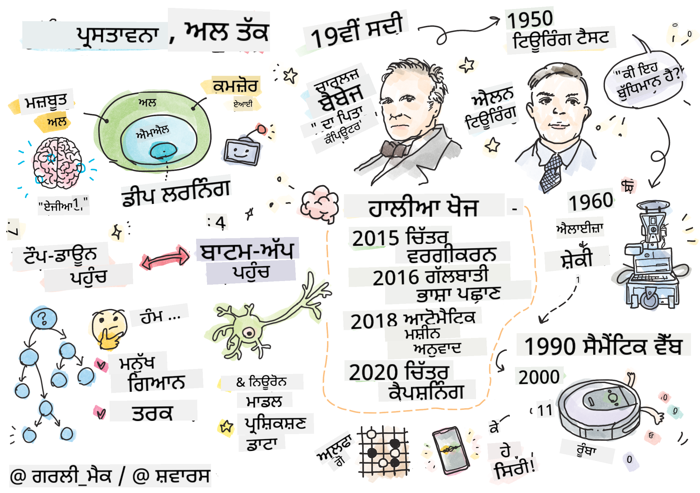

<!--
CO_OP_TRANSLATOR_METADATA:
{
  "original_hash": "06ca1b0138e65b964481ae83275b270e",
  "translation_date": "2025-10-03T08:01:11+00:00",
  "source_file": "lessons/1-Intro/README.md",
  "language_code": "pa"
}
-->
# AI ਦਾ ਪਰਚੇ

> ਸਕੈਚਨੋਟ [Tomomi Imura](https://twitter.com/girlie_mac) ਵੱਲੋਂ

## [ਪ੍ਰੀ-ਲੈਕਚਰ ਕਵਿਜ਼](https://ff-quizzes.netlify.app/en/ai/quiz/1)

**ਕ੍ਰਿਤ੍ਰਿਮ ਬੁੱਧੀ** ਇੱਕ ਰੋਮਾਂਚਕ ਵਿਗਿਆਨਕ ਵਿਸ਼ਾ ਹੈ ਜੋ ਇਸ ਗੱਲ ਦਾ ਅਧਿਐਨ ਕਰਦਾ ਹੈ ਕਿ ਅਸੀਂ ਕੰਪਿਊਟਰਾਂ ਨੂੰ ਬੁੱਧੀਮਾਨ ਵਿਵਹਾਰ ਦਿਖਾਉਣ ਲਈ ਕਿਵੇਂ ਬਣਾਉਣਗੇ, ਜਿਵੇਂ ਕਿ ਉਹ ਕੰਮ ਜੋ ਮਨੁੱਖੀ ਜੀਵਨ ਵਿੱਚ ਆਮ ਹਨ।

ਮੂਲ ਰੂਪ ਵਿੱਚ, ਕੰਪਿਊਟਰਾਂ ਦੀ ਖੋਜ [Charles Babbage](https://en.wikipedia.org/wiki/Charles_Babbage) ਨੇ ਕੀਤੀ ਸੀ, ਜੋ ਨੰਬਰਾਂ 'ਤੇ ਕੰਮ ਕਰਨ ਲਈ ਇੱਕ ਸਪਸ਼ਟ ਤਰੀਕੇ - ਇੱਕ ਐਲਗੋਰਿਦਮ - ਦੀ ਪਾਲਣਾ ਕਰਦੇ ਹਨ। ਆਧੁਨਿਕ ਕੰਪਿਊਟਰ, ਹਾਲਾਂਕਿ 19ਵੀਂ ਸਦੀ ਵਿੱਚ ਪੇਸ਼ ਕੀਤੇ ਮਾਡਲ ਨਾਲੋਂ ਕਾਫ਼ੀ ਅਗੇ ਹਨ, ਫਿਰ ਵੀ ਨਿਯੰਤਰਿਤ ਗਣਨਾਵਾਂ ਦੇ ਇੱਕੋ ਹੀ ਵਿਚਾਰ ਦੀ ਪਾਲਣਾ ਕਰਦੇ ਹਨ। ਇਸ ਲਈ, ਜੇਕਰ ਸਾਨੂੰ ਉਹ ਸਪਸ਼ਟ ਕਦਮਾਂ ਦੀ ਲੜੀ ਪਤਾ ਹੈ ਜੋ ਲਕਸ਼ ਨੂੰ ਪ੍ਰਾਪਤ ਕਰਨ ਲਈ ਲੋੜੀਂਦੀ ਹੈ, ਤਾਂ ਕੰਪਿਊਟਰ ਨੂੰ ਕੁਝ ਕਰਨ ਲਈ ਪ੍ਰੋਗਰਾਮ ਕੀਤਾ ਜਾ ਸਕਦਾ ਹੈ।

> ਤਸਵੀਰ [Vickie Soshnikova](http://twitter.com/vickievalerie) ਵੱਲੋਂ

> ✅ ਕਿਸੇ ਵਿਅਕਤੀ ਦੀ ਤਸਵੀਰ ਤੋਂ ਉਸ ਦੀ ਉਮਰ ਦਾ ਨਿਰਧਾਰਨ ਕਰਨਾ ਇੱਕ ਐਸਾ ਕੰਮ ਹੈ ਜਿਸਨੂੰ ਸਪਸ਼ਟ ਤੌਰ 'ਤੇ ਪ੍ਰੋਗਰਾਮ ਨਹੀਂ ਕੀਤਾ ਜਾ ਸਕਦਾ, ਕਿਉਂਕਿ ਸਾਨੂੰ ਇਹ ਨਹੀਂ ਪਤਾ ਕਿ ਜਦੋਂ ਅਸੀਂ ਇਹ ਕਰਦੇ ਹਾਂ ਤਾਂ ਸਾਡੇ ਮਨ ਵਿੱਚ ਇੱਕ ਨੰਬਰ ਕਿਵੇਂ ਆਉਂਦਾ ਹੈ।

---

ਕੁਝ ਕੰਮ ਅਜਿਹੇ ਹਨ ਜਿਨ੍ਹਾਂ ਨੂੰ ਹੱਲ ਕਰਨ ਦਾ ਸਪਸ਼ਟ ਤਰੀਕਾ ਸਾਨੂੰ ਪਤਾ ਨਹੀਂ ਹੁੰਦਾ। ਉਦਾਹਰਣ ਲਈ, ਕਿਸੇ ਵਿਅਕਤੀ ਦੀ ਤਸਵੀਰ ਤੋਂ ਉਸ ਦੀ ਉਮਰ ਦਾ ਨਿਰਧਾਰਨ ਕਰਨ ਦੀ ਗੱਲ ਕਰੋ। ਅਸੀਂ ਇਸਨੂੰ ਸਿੱਖਦੇ ਹਾਂ ਕਿਉਂਕਿ ਅਸੀਂ ਵੱਖ-ਵੱਖ ਉਮਰ ਦੇ ਲੋਕਾਂ ਦੇ ਬਹੁਤ ਸਾਰੇ ਉਦਾਹਰਣ ਵੇਖਦੇ ਹਾਂ, ਪਰ ਅਸੀਂ ਸਪਸ਼ਟ ਤੌਰ 'ਤੇ ਨਹੀਂ ਸਮਝਾ ਸਕਦੇ ਕਿ ਅਸੀਂ ਇਹ ਕਿਵੇਂ ਕਰਦੇ ਹਾਂ, ਨਾ ਹੀ ਅਸੀਂ ਕੰਪਿਊਟਰ ਨੂੰ ਇਹ ਕਰਨ ਲਈ ਪ੍ਰੋਗਰਾਮ ਕਰ ਸਕਦੇ ਹਾਂ। ਇਹ ਸਹੀ ਤਰ੍ਹਾਂ ਉਹ ਕੰਮ ਹਨ ਜੋ **ਕ੍ਰਿਤ੍ਰਿਮ ਬੁੱਧੀ** (ਸੰਖੇਪ ਵਿੱਚ AI) ਲਈ ਦਿਲਚਸਪੀ ਦੇ ਹਨ।

✅ ਕੁਝ ਕੰਮਾਂ ਬਾਰੇ ਸੋਚੋ ਜੋ ਤੁਸੀਂ ਕੰਪਿਊਟਰ ਨੂੰ ਸੌਂਪ ਸਕਦੇ ਹੋ ਜੋ AI ਤੋਂ ਲਾਭ ਪ੍ਰਾਪਤ ਕਰ ਸਕਦੇ ਹਨ। ਵਿੱਤ, ਚਿਕਿਤਸਾ ਅਤੇ ਕਲਾ ਦੇ ਖੇਤਰਾਂ ਬਾਰੇ ਵਿਚਾਰ ਕਰੋ - ਇਹ ਖੇਤਰ ਅੱਜ AI ਤੋਂ ਕਿਵੇਂ ਲਾਭ ਪ੍ਰਾਪਤ ਕਰ ਰਹੇ ਹਨ?

## ਕਮਜ਼ੋਰ AI ਅਤੇ ਮਜ਼ਬੂਤ AI

ਕਮਜ਼ੋਰ AI | ਮਜ਼ਬੂਤ AI
---------------------------------------|-------------------------------------
ਕਮਜ਼ੋਰ AI ਉਹ ਸਿਸਟਮ ਹਨ ਜੋ ਕਿਸੇ ਖਾਸ ਕੰਮ ਜਾਂ ਕੰਮਾਂ ਦੇ ਸੰਕੁਚਿਤ ਸੈੱਟ ਲਈ ਡਿਜ਼ਾਈਨ ਅਤੇ ਪ੍ਰਸ਼ਿਕਸ਼ਿਤ ਕੀਤੇ ਜਾਂਦੇ ਹਨ।|ਮਜ਼ਬੂਤ AI, ਜਾਂ ਕ੍ਰਿਤ੍ਰਿਮ ਜਨਰਲ ਇੰਟੈਲੀਜੈਂਸ (AGI), ਉਹ ਸਿਸਟਮ ਹਨ ਜੋ ਮਨੁੱਖੀ-ਸਤਰ ਦੀ ਬੁੱਧੀ ਅਤੇ ਸਮਝ ਰੱਖਦੇ ਹਨ।
ਇਹ AI ਸਿਸਟਮ ਆਮ ਤੌਰ 'ਤੇ ਬੁੱਧੀਮਾਨ ਨਹੀਂ ਹੁੰਦੇ; ਇਹ ਪੂਰਵ-ਨਿਰਧਾਰਿਤ ਕੰਮ ਵਿੱਚ ਸ਼ਾਨਦਾਰ ਹਨ ਪਰ ਸੱਚੀ ਸਮਝ ਜਾਂ ਚੇਤਨਾ ਦੀ ਘਾਟ ਹੁੰਦੀ ਹੈ।|ਇਹ AI ਸਿਸਟਮ ਉਹਨਾਂ ਬੁੱਧੀਮਾਨ ਕੰਮਾਂ ਨੂੰ ਕਰਨ ਦੀ ਯੋਗਤਾ ਰੱਖਦੇ ਹਨ ਜੋ ਕੋਈ ਮਨੁੱਖ ਕਰ ਸਕਦਾ ਹੈ, ਵੱਖ-ਵੱਖ ਖੇਤਰਾਂ ਵਿੱਚ ਅਨੁਕੂਲ ਹੋ ਸਕਦੇ ਹਨ, ਅਤੇ ਚੇਤਨਾ ਜਾਂ ਸਵੈ-ਜਾਗਰੂਕਤਾ ਦਾ ਰੂਪ ਰੱਖਦੇ ਹਨ।
ਕਮਜ਼ੋਰ AI ਦੇ ਉਦਾਹਰਣਾਂ ਵਿੱਚ Siri ਜਾਂ Alexa ਵਰਗੇ ਵਰਚੁਅਲ ਅਸਿਸਟੈਂਟ, ਸਟ੍ਰੀਮਿੰਗ ਸੇਵਾਵਾਂ ਦੁਆਰਾ ਵਰਤੇ ਜਾਣ ਵਾਲੇ ਸਿਫਾਰਸ਼ ਐਲਗੋਰਿਦਮ, ਅਤੇ ਖਾਸ ਗਾਹਕ ਸੇਵਾ ਕੰਮਾਂ ਲਈ ਡਿਜ਼ਾਈਨ ਕੀਤੇ ਗਏ ਚੈਟਬੋਟ ਸ਼ਾਮਲ ਹਨ।|ਮਜ਼ਬੂਤ AI ਪ੍ਰਾਪਤ ਕਰਨਾ AI ਖੋਜ ਦਾ ਲੰਬੇ ਸਮੇਂ ਦਾ ਲਕਸ਼ ਹੈ ਅਤੇ ਇਸ ਲਈ AI ਸਿਸਟਮਾਂ ਦੀ ਵਿਕਾਸ ਦੀ ਲੋੜ ਹੋਵੇਗੀ ਜੋ ਵੱਖ-ਵੱਖ ਕੰਮਾਂ ਅਤੇ ਸੰਦਰਭਾਂ ਵਿੱਚ ਤਰਕ, ਸਿੱਖਣ, ਸਮਝਣ ਅਤੇ ਅਨੁਕੂਲ ਕਰਨ ਦੀ ਯੋਗਤਾ ਰੱਖਦੇ ਹਨ।
ਕਮਜ਼ੋਰ AI ਬਹੁਤ ਹੀ ਵਿਸ਼ੇਸ਼ ਹੈ ਅਤੇ ਇਸਦੇ ਸੰਕੁਚਿਤ ਖੇਤਰ ਤੋਂ ਬਾਹਰ ਮਨੁੱਖੀ-ਜਿਵੇਂ ਸੰਵੇਦਨਸ਼ੀਲ ਯੋਗਤਾਵਾਂ ਜਾਂ ਆਮ ਸਮੱਸਿਆ-ਸੁਝਾਅ ਯੋਗਤਾਵਾਂ ਨਹੀਂ ਹੁੰਦੀਆਂ।|ਮਜ਼ਬੂਤ AI ਇਸ ਸਮੇਂ ਇੱਕ ਸਿਧਾਂਤਕ ਧਾਰਨਾ ਹੈ, ਅਤੇ ਕੋਈ ਵੀ AI ਸਿਸਟਮ ਇਸ ਸਤਰ ਦੀ ਜਨਰਲ ਇੰਟੈਲੀਜੈਂਸ ਤੱਕ ਨਹੀਂ ਪਹੁੰਚਿਆ ਹੈ।

ਹੋਰ ਜਾਣਕਾਰੀ ਲਈ **[Artificial General Intelligence](https://en.wikipedia.org/wiki/Artificial_general_intelligence)** (AGI) ਨੂੰ ਵੇਖੋ।

## ਬੁੱਧੀ ਦੀ ਪਰਿਭਾਸ਼ਾ ਅਤੇ ਟਿਊਰਿੰਗ ਟੈਸਟ

**[Intelligence](https://en.wikipedia.org/wiki/Intelligence)** ਸ਼ਬਦ ਨਾਲ ਨਜਿੱਠਣ ਵੇਲੇ ਇੱਕ ਸਮੱਸਿਆ ਇਹ ਹੈ ਕਿ ਇਸ ਸ਼ਬਦ ਦੀ ਕੋਈ ਸਪਸ਼ਟ ਪਰਿਭਾਸ਼ਾ ਨਹੀਂ ਹੈ। ਕੋਈ ਦਲੀਲ ਕਰ ਸਕਦਾ ਹੈ ਕਿ ਬੁੱਧੀ **ਅਬਸਟਰੈਕਟ ਸੋਚ** ਜਾਂ **ਸਵੈ-ਜਾਗਰੂਕਤਾ** ਨਾਲ ਜੁੜੀ ਹੋਈ ਹੈ, ਪਰ ਅਸੀਂ ਇਸਨੂੰ ਢੰਗ ਨਾਲ ਪਰਿਭਾਸ਼ਿਤ ਨਹੀਂ ਕਰ ਸਕਦੇ।

> [ਤਸਵੀਰ](https://unsplash.com/photos/75715CVEJhI) [Amber Kipp](https://unsplash.com/@sadmax) ਵੱਲੋਂ Unsplash ਤੋਂ

*ਬੁੱਧੀ* ਸ਼ਬਦ ਦੀ ਅਸਪਸ਼ਟਤਾ ਨੂੰ ਵੇਖਣ ਲਈ, ਇੱਕ ਸਵਾਲ ਦਾ ਜਵਾਬ ਦੇਣ ਦੀ ਕੋਸ਼ਿਸ਼ ਕਰੋ: "ਕੀ ਇੱਕ ਬਿੱਲੀ ਬੁੱਧੀਮਾਨ ਹੈ?" ਵੱਖ-ਵੱਖ ਲੋਕ ਇਸ ਸਵਾਲ ਲਈ ਵੱਖ-ਵੱਖ ਜਵਾਬ ਦੇਣ ਦੀ ਆਦਤ ਰੱਖਦੇ ਹਨ, ਕਿਉਂਕਿ ਇਸ ਦਾਅਵੇ ਨੂੰ ਸੱਚ ਜਾਂ ਗਲਤ ਸਾਬਤ ਕਰਨ ਲਈ ਕੋਈ ਵਿਸ਼ਵ-ਪ੍ਰਸਿੱਧ ਟੈਸਟ ਨਹੀਂ ਹੈ। ਅਤੇ ਜੇ ਤੁਸੀਂ ਸੋਚਦੇ ਹੋ ਕਿ ਹੈ - ਆਪਣੀ ਬਿੱਲੀ ਨੂੰ IQ ਟੈਸਟ ਵਿੱਚ ਦੌੜਾਓ...

✅ ਇੱਕ ਮਿੰਟ ਲਈ ਸੋਚੋ ਕਿ ਤੁਸੀਂ ਬੁੱਧੀ ਨੂੰ ਕਿਵੇਂ ਪਰਿਭਾਸ਼ਿਤ ਕਰਦੇ ਹੋ। ਕੀ ਇੱਕ ਕਾਂ ਜੋ ਭੁਲੇਖਾ ਹੱਲ ਕਰ ਸਕਦਾ ਹੈ ਅਤੇ ਕੁਝ ਖਾਣਾ ਪ੍ਰਾਪਤ ਕਰ ਸਕਦਾ ਹੈ ਬੁੱਧੀਮਾਨ ਹੈ? ਕੀ ਇੱਕ ਬੱਚਾ ਬੁੱਧੀਮਾਨ ਹੈ?

---

AGI ਬਾਰੇ ਗੱਲ ਕਰਦੇ ਹੋਏ, ਸਾਨੂੰ ਕੁਝ ਤਰੀਕਾ ਚਾਹੀਦਾ ਹੈ ਕਿ ਅਸੀਂ ਸੱਚਮੁੱਚ ਬੁੱਧੀਮਾਨ ਸਿਸਟਮ ਬਣਾਇਆ ਹੈ ਜਾਂ ਨਹੀਂ। [Alan Turing](https://en.wikipedia.org/wiki/Alan_Turing) ਨੇ ਇੱਕ ਤਰੀਕਾ ਪ੍ਰਸਤਾਵਿਤ ਕੀਤਾ ਜਿਸਨੂੰ **[Turing Test](https://en.wikipedia.org/wiki/Turing_test)** ਕਿਹਾ ਜਾਂਦਾ ਹੈ, ਜੋ ਬੁੱਧੀ ਦੀ ਪਰਿਭਾਸ਼ਾ ਵਜੋਂ ਵੀ ਕੰਮ ਕਰਦਾ ਹੈ। ਟੈਸਟ ਇੱਕ ਦਿੱਤੇ ਸਿਸਟਮ ਦੀ ਤੁਲਨਾ ਕੁਝ ਅੰਤਹਿਨ ਬੁੱਧੀਮਾਨ ਚੀਜ਼ - ਇੱਕ ਅਸਲੀ ਮਨੁੱਖ - ਨਾਲ ਕਰਦਾ ਹੈ, ਅਤੇ ਕਿਉਂਕਿ ਕੋਈ ਵੀ ਸਵੈਚਾਲਿਤ ਤੁਲਨਾ ਇੱਕ ਕੰਪਿਊਟਰ ਪ੍ਰੋਗਰਾਮ ਦੁਆਰਾ ਬਾਈਪਾਸ ਕੀਤੀ ਜਾ ਸਕਦੀ ਹੈ, ਅਸੀਂ ਇੱਕ ਮਨੁੱਖੀ ਪੁੱਛਗਿੱਛ ਕਰਨ ਵਾਲੇ ਦੀ ਵਰਤੋਂ ਕਰਦੇ ਹਾਂ। ਇਸ ਲਈ, ਜੇਕਰ ਇੱਕ ਮਨੁੱਖੀ ਜੀਵਨ ਟੈਕਸਟ-ਅਧਾਰਿਤ ਸੰਵਾਦ ਵਿੱਚ ਇੱਕ ਅਸਲੀ ਵਿਅਕਤੀ ਅਤੇ ਇੱਕ ਕੰਪਿਊਟਰ ਸਿਸਟਮ ਵਿੱਚ ਅੰਤਰ ਕਰਨ ਵਿੱਚ ਅਸਮਰਥ ਹੈ - ਸਿਸਟਮ ਨੂੰ ਬੁੱਧੀਮਾਨ ਮੰਨਿਆ ਜਾਂਦਾ ਹੈ।

> ਸੇਂਟ ਪੀਟਰਸਬਰਗ ਵਿੱਚ ਵਿਕਸਿਤ ਇੱਕ ਚੈਟ-ਬੋਟ [Eugene Goostman](https://en.wikipedia.org/wiki/Eugene_Goostman) ਨੇ 2014 ਵਿੱਚ ਟਿਊਰਿੰਗ ਟੈਸਟ ਪਾਸ ਕਰਨ ਦੇ ਨੇੜੇ ਆਉਣ ਲਈ ਇੱਕ ਚਤੁਰ ਚਰਿੱਤਰ ਚਾਲ ਵਰਤੀ। ਇਸਨੇ ਪਹਿਲਾਂ ਹੀ ਘੋਸ਼ਣਾ ਕੀਤੀ ਕਿ ਇਹ ਇੱਕ 13 ਸਾਲ ਦਾ ਯੂਕਰੇਨੀ ਲੜਕਾ ਹੈ, ਜੋ ਗਿਆਨ ਦੀ ਘਾਟ ਅਤੇ ਟੈਕਸਟ ਵਿੱਚ ਕੁਝ ਗਲਤੀਆਂ ਨੂੰ ਸਮਝਾਉਂਦਾ ਹੈ। ਬੋਟ ਨੇ 30% ਜੱਜਾਂ ਨੂੰ ਯਕੀਨ ਦਿਵਾਇਆ ਕਿ ਇਹ 5 ਮਿੰਟ ਦੇ ਸੰਵਾਦ ਤੋਂ ਬਾਅਦ ਮਨੁੱਖ ਹੈ, ਇੱਕ ਮਾਪਦੰਡ ਜੋ ਟਿਊਰਿੰਗ ਨੇ ਵਿਸ਼ਵਾਸ ਕੀਤਾ ਕਿ 2000 ਤੱਕ ਇੱਕ ਮਸ਼ੀਨ ਪਾਸ ਕਰਨ ਦੇ ਯੋਗ ਹੋਵੇਗੀ। ਹਾਲਾਂਕਿ, ਇਹ ਸਮਝਣਾ ਚਾਹੀਦਾ ਹੈ ਕਿ ਇਸਦਾ ਮਤਲਬ ਇਹ ਨਹੀਂ ਹੈ ਕਿ ਅਸੀਂ ਇੱਕ ਬੁੱਧੀਮਾਨ ਸਿਸਟਮ ਬਣਾਇਆ ਹੈ, ਜਾਂ ਕਿ ਇੱਕ ਕੰਪਿਊਟਰ ਸਿਸਟਮ ਨੇ ਮਨੁੱਖੀ ਪੁੱਛਗਿੱਛ ਕਰਨ ਵਾਲੇ ਨੂੰ ਬੇਵਕੂਫ਼ ਬਣਾਇਆ ਹੈ - ਸਿਸਟਮ ਨੇ ਮਨੁੱਖਾਂ ਨੂੰ ਬੇਵਕੂਫ਼ ਨਹੀਂ ਬਣਾਇਆ, ਬਲਕਿ ਬੋਟ ਬਣਾਉਣ ਵਾਲਿਆਂ ਨੇ ਕੀਤਾ!

✅ ਕੀ ਤੁਸੀਂ ਕਦੇ ਕਿਸੇ ਚੈਟ ਬੋਟ ਦੁਆਰਾ ਬੇਵਕੂਫ਼ ਬਣਾਏ ਗਏ ਹੋ ਕਿ ਤੁਸੀਂ ਇੱਕ ਮਨੁੱਖ ਨਾਲ ਗੱਲ ਕਰ ਰਹੇ ਹੋ? ਇਸਨੇ ਤੁਹਾਨੂੰ ਕਿਵੇਂ ਯਕੀਨ ਦਿਵਾਇਆ?

## AI ਦੇ ਵੱਖ-ਵੱਖ ਪਹੁੰਚ

ਜੇਕਰ ਅਸੀਂ ਚਾਹੁੰਦੇ ਹਾਂ ਕਿ ਕੰਪਿਊਟਰ ਮਨੁੱਖ ਵਾਂਗ ਵਿਵਹਾਰ ਕਰੇ, ਤਾਂ ਸਾਨੂੰ ਕੰਪਿਊਟਰ ਦੇ ਅੰਦਰ ਆਪਣੇ ਸੋਚਣ ਦੇ ਤਰੀਕੇ ਨੂੰ ਕਿਸੇ ਤਰੀਕੇ ਨਾਲ ਮਾਡਲ ਕਰਨ ਦੀ ਲੋੜ ਹੈ। ਇਸ ਲਈ, ਸਾਨੂੰ ਇਹ ਸਮਝਣ ਦੀ ਕੋਸ਼ਿਸ਼ ਕਰਨ ਦੀ ਲੋੜ ਹੈ ਕਿ ਇੱਕ ਮਨੁੱਖੀ ਜੀਵਨ ਨੂੰ ਬੁੱਧੀਮਾਨ ਬਣਾਉਣ ਵਾਲਾ ਕੀ ਹੈ।

> ਮਸ਼ੀਨ ਵਿੱਚ ਬੁੱਧੀ ਪ੍ਰੋਗਰਾਮ ਕਰਨ ਦੇ ਯੋਗ ਹੋਣ ਲਈ, ਸਾਨੂੰ ਇਹ ਸਮਝਣ ਦੀ ਲੋੜ ਹੈ ਕਿ ਸਾਡੇ ਆਪਣੇ ਫੈਸਲੇ ਕਰਨ ਦੇ ਤਰੀਕੇ ਕਿਵੇਂ ਕੰਮ ਕਰਦੇ ਹਨ। ਜੇਕਰ ਤੁਸੀਂ ਕੁਝ ਸਵੈ-ਵਿਚਾਰ ਕਰਦੇ ਹੋ, ਤਾਂ ਤੁਸੀਂ ਅਹਿਸਾਸ ਕਰੋਗੇ ਕਿ ਕੁਝ ਪ੍ਰਕਿਰਿਆਵਾਂ ਅਚੇਤਨ ਤੌਰ 'ਤੇ ਹੁੰਦੀਆਂ ਹਨ - ਜਿਵੇਂ ਕਿ ਅਸੀਂ ਬਿੱਲੀ ਨੂੰ ਕੁੱਤੇ ਤੋਂ ਬਿਨਾਂ ਸੋਚੇ ਅੰਤਰ ਕਰ ਸਕਦੇ ਹਾਂ - ਜਦੋਂ ਕਿ ਕੁਝ ਹੋਰ ਤਰਕ ਸ਼ਾਮਲ ਕਰਦੇ ਹਨ।

ਇਸ ਸਮੱਸਿਆ ਲਈ ਦੋ ਸੰਭਾਵਿਤ ਪਹੁੰਚ ਹਨ:

ਟਾਪ-ਡਾਊਨ ਪਹੁੰਚ (ਸੰਕੇਤਕ ਤਰਕ) | ਬਾਟਮ-ਅੱਪ ਪਹੁੰਚ (ਨਿਊਰਲ ਨੈਟਵਰਕ)
---------------------------------------|-------------------------------------
ਟਾਪ-ਡਾਊਨ ਪਹੁੰਚ ਇੱਕ ਵਿਅਕਤੀ ਦੇ ਤਰਕ ਕਰਨ ਦੇ ਤਰੀਕੇ ਨੂੰ ਮਾਡਲ ਕਰਦੀ ਹੈ। ਇਸ ਵਿੱਚ ਮਨੁੱਖੀ ਜੀਵਨ ਤੋਂ **ਗਿਆਨ** ਕੱਢਣਾ ਅਤੇ ਇਸਨੂੰ ਕੰਪਿਊਟਰ-ਪੜ੍ਹਨਯੋਗ ਰੂਪ ਵਿੱਚ ਪੇਸ਼ ਕਰਨਾ ਸ਼ਾਮਲ ਹੈ। ਸਾਨੂੰ ਕੰਪਿਊਟਰ ਦੇ ਅੰਦਰ **ਤਰਕ** ਨੂੰ ਮਾਡਲ ਕਰਨ ਦਾ ਤਰੀਕਾ ਵੀ ਵਿਕਸਿਤ ਕਰਨ ਦੀ ਲੋੜ ਹੈ। | ਬਾਟਮ-ਅੱਪ ਪਹੁੰਚ ਮਨੁੱਖੀ ਦਿਮਾਗ ਦੀ ਬਣਤਰ ਨੂੰ ਮਾਡਲ ਕਰਦੀ ਹੈ, ਜੋ ਸਧਾਰਨ ਇਕਾਈਆਂ **ਨਿਊਰੋਨ** ਦੇ ਇੱਕ ਵੱਡੇ ਗਿਣਤੀ ਦੇ ਸਮੂਹ ਤੋਂ ਬਣੀ ਹੁੰਦੀ ਹੈ। ਹਰ ਨਿਊਰੋਨ ਆਪਣੇ ਇਨਪੁੱਟਸ ਦਾ ਵਜ਼ਨੀ ਔਸਤ ਵਾਂਗ ਕੰਮ ਕਰਦਾ ਹੈ, ਅਤੇ ਅਸੀਂ ਨਿਊਰੋਨ ਦੇ ਨੈਟਵਰਕ ਨੂੰ **ਟ੍ਰੇਨਿੰਗ ਡੇਟਾ** ਦੇ ਕੇ ਲਾਭਦਾਇਕ ਸਮੱਸਿਆਵਾਂ ਹੱਲ ਕਰਨ ਲਈ ਪ੍ਰਸ਼ਿਕਸ਼ਿਤ ਕਰ ਸਕਦੇ ਹਾਂ।

ਇਸ ਤੋਂ ਇਲਾਵਾ, ਬੁੱਧੀ ਲਈ ਕੁਝ ਹੋਰ ਸੰਭਾਵਿਤ ਪਹੁੰਚਾਂ ਹਨ:

* ਇੱਕ **ਉਭਰਤੀ**, **ਸਿਨਰਜੈਟਿਕ** ਜਾਂ **ਮਲਟੀ-ਏਜੰਟ ਪਹੁੰਚ** ਇਸ ਤੱਥ 'ਤੇ ਅਧਾਰਿਤ ਹੈ ਕਿ ਬਹੁਤ ਸਾਰੇ ਸਧਾਰਨ ਏਜੰਟਾਂ ਦੇ ਪਰਸਪਰ ਸੰਚਾਰ ਦੁਆਰਾ ਜਟਿਲ ਬੁੱਧੀਮਾਨ ਵਿਵਹਾਰ ਪ੍ਰਾਪਤ ਕੀਤਾ ਜਾ ਸਕਦਾ ਹੈ। [Evolutionary Cybernetics](https://en.wikipedia.org/wiki/Global_brain#Evolutionary_cybernetics) ਦੇ ਅਨੁਸਾਰ, ਬੁੱਧੀ ਸਧਾਰਨ, ਪ੍ਰਤੀਕ੍ਰਿਆਵਾਦੀ ਵਿਵਹਾਰ ਤੋਂ *ਮੈਟਾਸਿਸਟਮ ਟ੍ਰਾਂਜ਼ੀਸ਼ਨ* ਦੀ ਪ੍ਰਕਿਰਿਆ ਵਿੱਚ *ਉਭਰ* ਸਕਦੀ ਹੈ।

* ਇੱਕ **ਵਿਕਾਸਸ਼ੀਲ ਪਹੁੰਚ**, ਜਾਂ **ਜਨੈਟਿਕ ਐਲਗੋਰਿਦਮ** ਇੱਕ ਅਪਟਾਈਮਾਈਜ਼ੇਸ਼ਨ ਪ੍ਰਕਿਰਿਆ ਹੈ ਜੋ ਵਿਕਾਸ ਦੇ ਸਿਧਾਂਤਾਂ 'ਤੇ ਅਧਾਰਿਤ ਹੈ।

ਅਸੀਂ ਇਹ ਪਹੁੰਚਾਂ ਕੋਰਸ ਵਿੱਚ ਬਾਅਦ ਵਿੱਚ ਵਿਚਾਰਾਂਗੇ, ਪਰ ਇਸ ਸਮੇਂ ਅਸੀਂ ਦੋ ਮੁੱਖ ਦਿਸ਼ਾਵਾਂ 'ਤੇ ਧਿਆਨ ਦੇਵਾਂਗੇ: ਟਾਪ-ਡਾਊਨ ਅਤੇ ਬਾਟਮ-ਅੱਪ।

### ਟਾਪ-ਡਾਊਨ ਪਹੁੰਚ

**ਟਾਪ-ਡਾਊਨ ਪਹੁੰਚ** ਵਿੱਚ, ਅਸੀਂ ਆਪਣੇ ਤਰਕ ਨੂੰ ਮਾਡਲ ਕਰਨ ਦੀ ਕੋਸ਼ਿਸ਼ ਕਰਦੇ ਹਾਂ। ਕਿਉਂਕਿ ਜਦੋਂ ਅਸੀਂ ਤਰਕ ਕਰਦੇ ਹਾਂ ਤਾਂ ਅਸੀਂ ਆਪਣੇ ਵਿਚਾਰਾਂ ਦੀ ਪਾਲਣਾ ਕਰ ਸਕਦੇ ਹਾਂ, ਅਸੀਂ ਇਸ ਪ੍ਰਕਿਰਿਆ ਨੂੰ ਰਸਮੀ ਬਣਾਉਣ ਅਤੇ ਇਸਨੂੰ ਕੰਪਿਊਟਰ ਦੇ ਅੰਦਰ ਪ੍ਰੋਗਰਾਮ ਕਰਨ ਦੀ ਕੋਸ਼ਿਸ਼ ਕਰ ਸਕਦੇ ਹਾਂ। ਇਸਨੂੰ **ਸੰਕੇਤਕ ਤਰਕ** ਕਿਹਾ ਜਾਂਦਾ ਹੈ।

ਲੋਕਾਂ ਦੇ ਮਨ ਵਿੱਚ ਕੁਝ ਨਿਯਮ ਹੁੰਦੇ ਹਨ ਜੋ ਉਨ੍ਹਾਂ ਦੇ ਫੈਸਲੇ ਕਰਨ ਦੇ ਤਰੀਕਿਆਂ ਨੂੰ ਮਾਰਗਦਰਸ਼ਨ ਕਰਦੇ ਹਨ। ਉਦਾਹਰਣ ਲਈ, ਜਦੋਂ ਇੱਕ ਡਾਕਟਰ ਮਰੀਜ਼ ਦੀ ਰੋਗ-ਨਿਰਧਾਰਨ ਕਰ ਰਿਹਾ ਹੁੰਦਾ ਹੈ, ਉਹ ਅਹਿਸਾਸ ਕਰ ਸਕਦਾ ਹੈ ਕਿ ਵਿਅਕਤੀ ਨੂੰ ਬੁਖਾਰ ਹੈ, ਅਤੇ ਇਸ ਲਈ ਸਰੀਰ ਦੇ ਅੰਦਰ ਕੁਝ ਸੂਜਨ ਹੋ ਸਕਦੀ ਹੈ। ਇੱਕ ਵਿਸ਼ੇਸ਼ ਸਮੱਸਿਆ 'ਤੇ ਨਿਯਮਾਂ ਦੇ ਇੱਕ ਵੱਡੇ ਸੈੱਟ ਨੂੰ ਲਾਗੂ ਕਰਕੇ ਡਾਕਟਰ ਅੰਤਮ ਰੋਗ-ਨਿਰਧਾਰਨ 'ਤੇ ਪਹੁੰਚ ਸਕਦਾ ਹੈ।

ਇਹ ਪਹੁੰਚ **ਗਿਆਨ ਪ੍ਰਸਤੁਤੀ** ਅਤੇ **ਤਰਕ** 'ਤੇ ਬਹੁਤ ਜ਼ਿਆਦਾ ਨਿਰਭਰ ਕਰਦੀ ਹੈ। ਮਨੁੱਖੀ ਵਿਸ਼ੇਸ਼ਜਨ ਤੋਂ ਗਿਆਨ ਕੱਢਣਾ ਸਭ ਤੋਂ ਮੁਸ਼ਕਲ ਹਿੱਸਾ ਹੋ ਸਕਦਾ ਹੈ, ਕਿਉਂਕਿ ਬਹੁਤ ਸਾਰੇ ਮਾਮਲਿਆਂ ਵਿੱਚ ਡਾਕਟਰ ਨੂੰ ਇਹ ਨਹੀਂ ਪਤਾ ਹੁੰਦਾ ਕਿ ਉਹ ਕਿਸੇ ਵਿਸ਼ੇਸ਼ ਰੋਗ-ਨਿਰਧਾਰਨ 'ਤੇ ਕਿਉਂ ਪਹੁੰਚ ਰਿਹਾ ਹੈ। ਕਈ ਵਾਰ ਹੱਲ ਸਿਰਫ਼ ਉਸਦੇ ਮਨ ਵਿੱਚ ਆ ਜਾਂਦਾ ਹੈ ਬਿਨਾਂ ਸਪਸ਼ਟ ਸੋਚਣ ਦੇ। ਕੁਝ ਕੰਮ, ਜਿਵੇਂ ਕਿ ਕਿਸੇ ਵਿਅਕਤੀ ਦੀ ਤਸਵੀਰ ਤੋਂ ਉਸ ਦੀ ਉਮਰ ਦਾ ਨਿਰਧਾਰਨ ਕਰਨਾ, ਗਿਆਨ ਨੂੰ ਮੈਨਿਪੁਲੇਟ ਕਰਨ ਲਈ ਬਿਲਕੁਲ ਘਟਾਇਆ ਨਹੀਂ ਜਾ ਸਕਦਾ।

### ਬਾਟਮ
> ਚਿੱਤਰ ਦਿਮਿਤਰੀ ਸੋਸ਼ਨਿਕੋਵ ਦੁਆਰਾ, [ਫੋਟੋ](https://unsplash.com/photos/r8LmVbUKgns) ਮਰੀਨਾ ਅਬਰੋਸਿਮੋਵਾ ਦੁਆਰਾ [Marina Abrosimova](https://unsplash.com/@abrosimova_marina_foto), Unsplash

## ਹਾਲੀਆ AI ਖੋਜ

ਨਿਊਰਲ ਨੈਟਵਰਕ ਖੋਜ ਵਿੱਚ ਹਾਲੀਆ ਵੱਡੀ ਵਾਧਾ 2010 ਦੇ ਆਸਪਾਸ ਸ਼ੁਰੂ ਹੋਈ, ਜਦੋਂ ਵੱਡੇ ਜਨਤਕ ਡੇਟਾਸੈਟ ਉਪਲਬਧ ਹੋਣ ਲੱਗੇ। ਤਸਵੀਰਾਂ ਦਾ ਇੱਕ ਵੱਡਾ ਸੰਗ੍ਰਹਿ [ImageNet](https://en.wikipedia.org/wiki/ImageNet), ਜਿਸ ਵਿੱਚ ਲਗਭਗ 14 ਮਿਲੀਅਨ ਐਨੋਟੇਟ ਤਸਵੀਰਾਂ ਹਨ, ਨੇ [ImageNet Large Scale Visual Recognition Challenge](https://image-net.org/challenges/LSVRC/) ਨੂੰ ਜਨਮ ਦਿੱਤਾ।

> ਚਿੱਤਰ [ਦਿਮਿਤਰੀ ਸੋਸ਼ਨਿਕੋਵ](http://soshnikov.com) ਦੁਆਰਾ

2012 ਵਿੱਚ, [Convolutional Neural Networks](../4-ComputerVision/07-ConvNets/README.md) ਪਹਿਲੀ ਵਾਰ ਤਸਵੀਰ ਵਰਗੀਕਰਨ ਵਿੱਚ ਵਰਤੀਆਂ ਗਈਆਂ, ਜਿਸ ਨਾਲ ਵਰਗੀਕਰਨ ਦੀਆਂ ਗਲਤੀਆਂ ਵਿੱਚ ਮਹੱਤਵਪੂਰਨ ਕਮੀ ਆਈ (ਲਗਭਗ 30% ਤੋਂ 16.4% ਤੱਕ)। 2015 ਵਿੱਚ, ਮਾਈਕਰੋਸਾਫਟ ਰਿਸਰਚ ਦੀ ResNet ਆਰਕੀਟੈਕਚਰ ਨੇ [ਮਨੁੱਖੀ-ਸਤਰ ਦੀ ਸ਼ੁੱਧਤਾ ਹਾਸਲ ਕੀਤੀ](https://doi.org/10.1109/ICCV.2015.123)।

ਤਦ ਤੋਂ, ਨਿਊਰਲ ਨੈਟਵਰਕ ਨੇ ਕਈ ਕੰਮਾਂ ਵਿੱਚ ਬਹੁਤ ਸਫਲ ਵਿਹਾਰ ਦਿਖਾਇਆ ਹੈ:

---

ਸਾਲ | ਮਨੁੱਖੀ ਸਮਰੱਥਾ ਪ੍ਰਾਪਤ ਕੀਤੀ
-----|--------
2015 | [ਤਸਵੀਰ ਵਰਗੀਕਰਨ](https://doi.org/10.1109/ICCV.2015.123)
2016 | [ਕੰਵਰਸੇਸ਼ਨਲ ਸਪੀਚ ਰਿਕਗਨੀਸ਼ਨ](https://arxiv.org/abs/1610.05256)
2018 | [ਆਟੋਮੈਟਿਕ ਮਸ਼ੀਨ ਅਨੁਵਾਦ](https://arxiv.org/abs/1803.05567) (ਚੀਨੀ ਤੋਂ ਅੰਗਰੇਜ਼ੀ)
2020 | [ਤਸਵੀਰ ਕੈਪਸ਼ਨਿੰਗ](https://arxiv.org/abs/2009.13682)

ਪਿਛਲੇ ਕੁਝ ਸਾਲਾਂ ਵਿੱਚ, ਅਸੀਂ ਵੱਡੇ ਭਾਸ਼ਾ ਮਾਡਲਾਂ, ਜਿਵੇਂ ਕਿ BERT ਅਤੇ GPT-3, ਨਾਲ ਵੱਡੀ ਸਫਲਤਾਵਾਂ ਦੇ ਗਵਾਹ ਬਣੇ ਹਾਂ। ਇਹ ਜ਼ਿਆਦਾਤਰ ਇਸ ਕਰਕੇ ਹੋਇਆ ਕਿ ਬਹੁਤ ਸਾਰਾ ਆਮ ਟੈਕਸਟ ਡੇਟਾ ਉਪਲਬਧ ਹੈ ਜੋ ਸਾਨੂੰ ਮਾਡਲਾਂ ਨੂੰ ਟੈਕਸਟ ਦੀ ਬਣਤਰ ਅਤੇ ਅਰਥ ਨੂੰ ਕੈਪਚਰ ਕਰਨ ਲਈ ਸਿਖਾਉਣ ਦੀ ਆਗਿਆ ਦਿੰਦਾ ਹੈ, ਉਨ੍ਹਾਂ ਨੂੰ ਆਮ ਟੈਕਸਟ ਸੰਗ੍ਰਹਿ 'ਤੇ ਪ੍ਰੀ-ਟ੍ਰੇਨ ਕਰਦਾ ਹੈ, ਅਤੇ ਫਿਰ ਉਨ੍ਹਾਂ ਮਾਡਲਾਂ ਨੂੰ ਹੋਰ ਵਿਸ਼ੇਸ਼ ਕੰਮਾਂ ਲਈ ਮਾਹਰ ਬਣਾਉਂਦਾ ਹੈ। ਅਸੀਂ ਇਸ ਕੋਰਸ ਵਿੱਚ ਬਾਅਦ ਵਿੱਚ [Natural Language Processing](../5-NLP/README.md) ਬਾਰੇ ਹੋਰ ਸਿੱਖਾਂਗੇ।

## 🚀 ਚੁਣੌਤੀ

ਇੰਟਰਨੈਟ ਦਾ ਦੌਰਾ ਕਰੋ ਅਤੇ ਇਹ ਨਿਰਧਾਰਤ ਕਰੋ ਕਿ ਤੁਹਾਡੇ ਵਿਚਾਰ ਵਿੱਚ, AI ਸਭ ਤੋਂ ਪ੍ਰਭਾਵਸ਼ਾਲੀ ਤਰੀਕੇ ਨਾਲ ਕਿੱਥੇ ਵਰਤਿਆ ਜਾ ਰਿਹਾ ਹੈ। ਕੀ ਇਹ ਕਿਸੇ ਮੈਪਿੰਗ ਐਪ ਵਿੱਚ ਹੈ, ਜਾਂ ਕੋਈ ਸਪੀਚ-ਟੂ-ਟੈਕਸਟ ਸੇਵਾ ਜਾਂ ਕੋਈ ਵੀਡੀਓ ਗੇਮ? ਖੋਜ ਕਰੋ ਕਿ ਇਹ ਸਿਸਟਮ ਕਿਵੇਂ ਬਣਾਇਆ ਗਿਆ ਸੀ।

## [ਪੋਸਟ-ਲੈਕਚਰ ਕਵਿਜ਼](https://ff-quizzes.netlify.app/en/ai/quiz/2)

## ਸਮੀਖਿਆ ਅਤੇ ਸਵੈ ਅਧਿਐਨ

AI ਅਤੇ ML ਦੇ ਇਤਿਹਾਸ ਦੀ ਸਮੀਖਿਆ ਕਰੋ [ਇਸ ਪਾਠ](https://github.com/microsoft/ML-For-Beginners/tree/main/1-Introduction/2-history-of-ML) ਨੂੰ ਪੜ੍ਹ ਕੇ। ਉਸ ਪਾਠ ਜਾਂ ਇਸ ਪਾਠ ਦੇ ਸਿਖੇਚਨੋਟ ਦੇ ਸਿਖਰ ਤੋਂ ਇੱਕ ਤੱਤ ਲਓ ਅਤੇ ਇਸ ਦੇ ਵਿਕਾਸ ਨੂੰ ਜਾਣਨ ਲਈ ਇਸ ਦੇ ਸੱਭਿਆਚਾਰਕ ਸੰਦਰਭ ਨੂੰ ਹੋਰ ਗਹਿਰਾਈ ਵਿੱਚ ਖੋਜੋ।

**ਅਸਾਈਨਮੈਂਟ**: [Game Jam](assignment.md)

---

**ਅਸਵੀਕਰਤੀ**:  
ਇਹ ਦਸਤਾਵੇਜ਼ AI ਅਨੁਵਾਦ ਸੇਵਾ [Co-op Translator](https://github.com/Azure/co-op-translator) ਦੀ ਵਰਤੋਂ ਕਰਕੇ ਅਨੁਵਾਦ ਕੀਤਾ ਗਿਆ ਹੈ। ਹਾਲਾਂਕਿ ਅਸੀਂ ਸਹੀ ਹੋਣ ਦੀ ਕੋਸ਼ਿਸ਼ ਕਰਦੇ ਹਾਂ, ਕਿਰਪਾ ਕਰਕੇ ਧਿਆਨ ਦਿਓ ਕਿ ਸਵੈਚਾਲਿਤ ਅਨੁਵਾਦਾਂ ਵਿੱਚ ਗਲਤੀਆਂ ਜਾਂ ਅਸੁਚੀਤਤਾਵਾਂ ਹੋ ਸਕਦੀਆਂ ਹਨ। ਇਸ ਦੀ ਮੂਲ ਭਾਸ਼ਾ ਵਿੱਚ ਮੌਜੂਦ ਦਸਤਾਵੇਜ਼ ਨੂੰ ਅਧਿਕਾਰਤ ਸਰੋਤ ਮੰਨਿਆ ਜਾਣਾ ਚਾਹੀਦਾ ਹੈ। ਮਹੱਤਵਪੂਰਨ ਜਾਣਕਾਰੀ ਲਈ, ਪੇਸ਼ੇਵਰ ਮਨੁੱਖੀ ਅਨੁਵਾਦ ਦੀ ਸਿਫਾਰਸ਼ ਕੀਤੀ ਜਾਂਦੀ ਹੈ। ਇਸ ਅਨੁਵਾਦ ਦੀ ਵਰਤੋਂ ਤੋਂ ਪੈਦਾ ਹੋਣ ਵਾਲੇ ਕਿਸੇ ਵੀ ਗਲਤਫਹਿਮੀ ਜਾਂ ਗਲਤ ਵਿਆਖਿਆ ਲਈ ਅਸੀਂ ਜ਼ਿੰਮੇਵਾਰ ਨਹੀਂ ਹਾਂ।