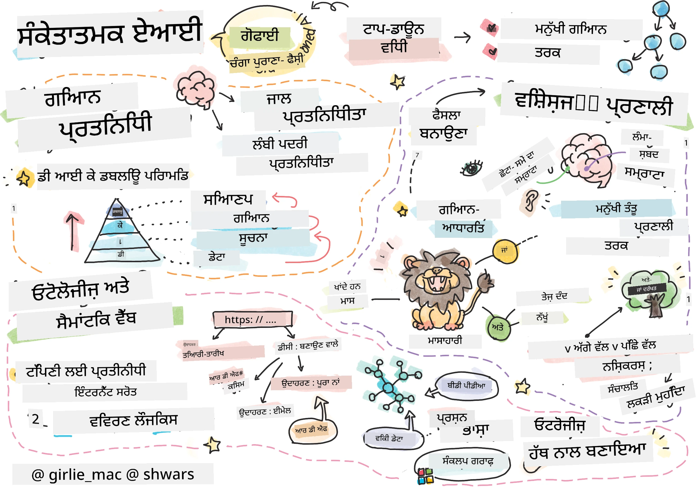
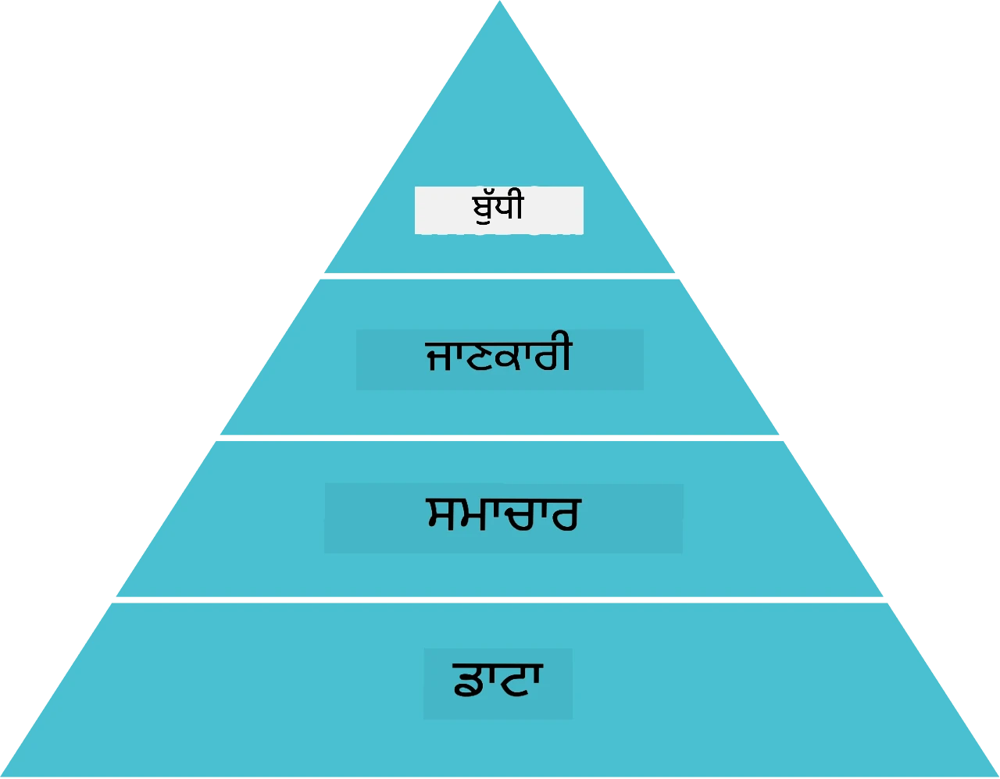
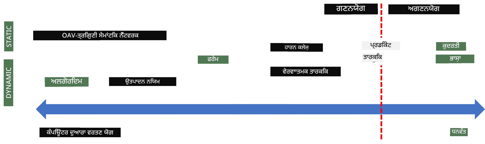
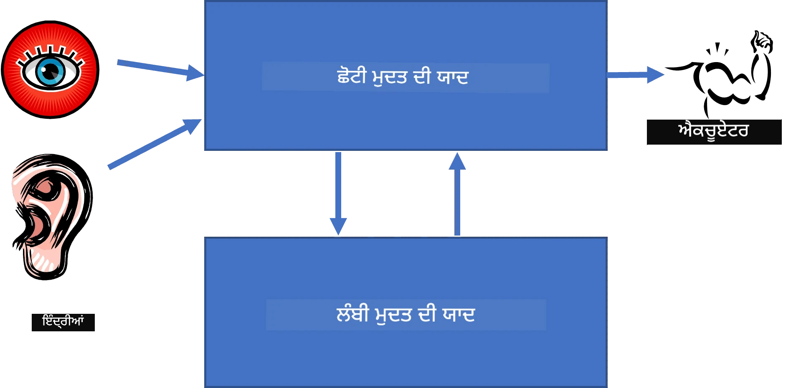
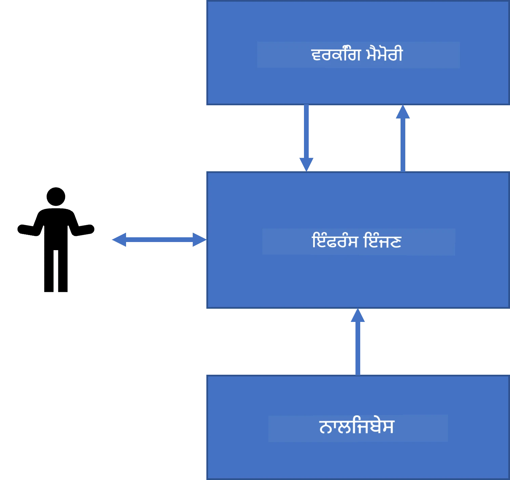
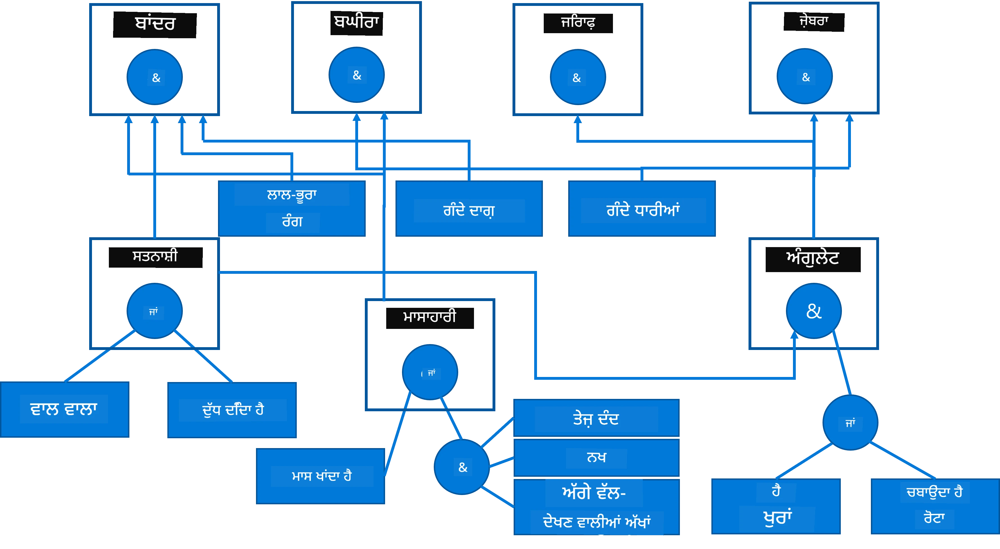
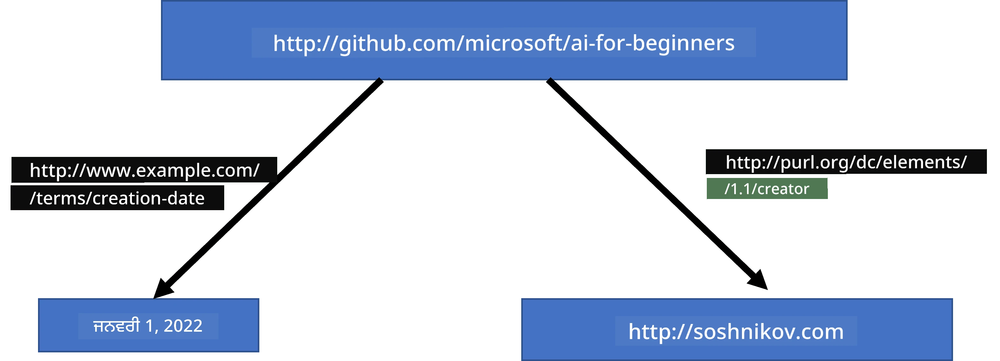
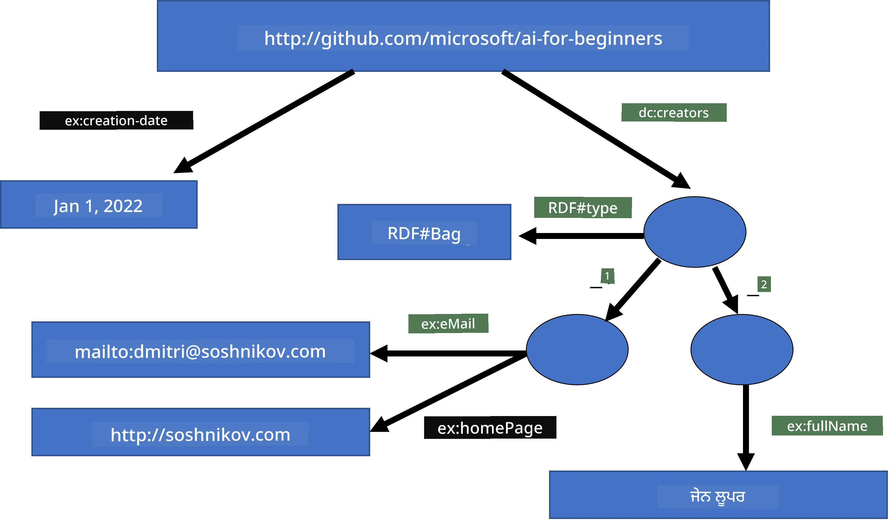
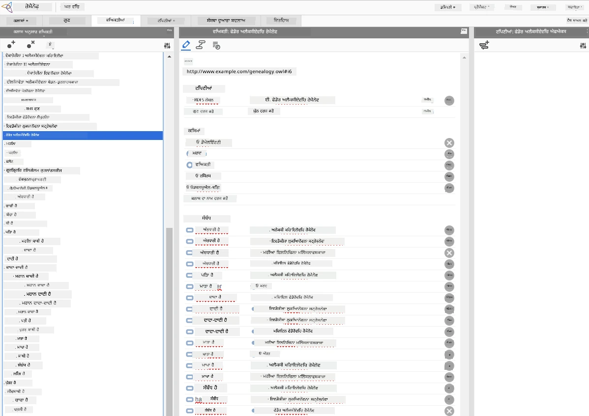

# ਗਿਆਨ ਪ੍ਰਤੀਨਿਧਿਤਾ ਅਤੇ ਮਾਹਿਰ ਪ੍ਰਣਾਲੀਆਂ



> ਸਕੈਚਨੋਟ ਦੁਆਰਾ [ਟੋਮੋਮੀ ਇਮੁਰਾ](https://twitter.com/girlie_mac)

ਕୃਤਿਮ ਬੁੱਧਿਮਤਾ ਦੀ ਖੋਜ ਗਿਆਨ ਲਈ ਇੱਕ ਤਲਾਸ਼ 'ਤੇ ਆਧਾਰਿਤ ਹੈ, ਤਾਂ ਜੋ ਦੁਨੀਆ ਨੂੰ ਮਨੁੱਖਾਂ ਵਰਗਾ ਸਮਝਿਆ ਜਾ ਸਕੇ। ਪਰ ਤੁਸੀਂ ਇਹ ਕਿਵੇਂ ਕਰ ਸਕਦੇ ਹੋ?

## [ਪੂਰਵ-ਵਿਆਖਿਆਣ ਕਵੀਜ਼](https://ff-quizzes.netlify.app/en/ai/quiz/3)

AI ਦੇ ਸ਼ੁਰੂਆਤੀ ਦਿਨਾਂ ਵਿੱਚ, ਬੁੱਧਿਮਾਨ ਸਿਸਟਮ ਬਣਾਉਣ ਲਈ ਉੱਪਰ-ਥੱਲੇ ਪਧਤੀ (ਜੋ ਪਿਛਲੇ ਪਾਠ ਵਿੱਚ ਚਰਚਾ ਕੀਤੀ ਗਈ ਸੀ) ਲੋਕਪਰੀਯ ਸੀ। ਵਿਚਾਰ ਇਹ ਸੀ ਕਿ ਲੋਕਾਂ ਤੋਂ ਗਿਆਨ ਨੂੰ ਮਸ਼ੀਨ-ਸਮਝਣਯੋਗ ਰੂਪ ਵਿੱਚ ਕੱਢਿਆ ਜਾਵੇ, ਅਤੇ ਫਿਰ ਇਸ ਨੂੰ ਆਟੋਮੈਟਿਕ ਤੌਰ 'ਤੇ ਸਮੱਸਿਆਵਾਂ ਹੱਲ ਕਰਨ ਲਈ ਵਰਤਿਆ ਜਾਵੇ। ਇਹ ਪਧਤੀ ਦੋ ਵੱਡੇ ਵਿਚਾਰਾਂ 'ਤੇ ਆਧਾਰਿਤ ਸੀ:

* ਗਿਆਨ ਪ੍ਰਤੀਨਿਧਿਤਾ
* ਤਰਕ ਕਰਨ

## ਗਿਆਨ ਪ੍ਰਤੀਨਿਧਿਤਾ

ਸੰਕੇਤਕ AI ਵਿੱਚ ਇੱਕ ਮਹੱਤਵਪੂਰਨ ਧਾਰਨਾ ਹੈ **ਗਿਆਨ**। ਗਿਆਨ ਨੂੰ *ਸੂਚਨਾ* ਜਾਂ *ਡੇਟਾ* ਤੋਂ ਵੱਖਰਾ ਕਰਨਾ ਜ਼ਰੂਰੀ ਹੈ। ਉਦਾਹਰਨ ਵਜੋਂ, ਕਿਹਾ ਜਾ ਸਕਦਾ ਹੈ ਕਿ ਕਿਤਾਬਾਂ ਵਿੱਚ ਗਿਆਨ ਹੁੰਦਾ ਹੈ, ਕਿਉਂਕਿ ਕਿਤਾਬਾਂ ਪੜ੍ਹ ਕੇ ਕੋਈ ਮਾਹਿਰ ਬਣ ਸਕਦਾ ਹੈ। ਹਾਲਾਂਕਿ, ਕਿਤਾਬਾਂ ਵਿੱਚ ਜੋ ਹੁੰਦਾ ਹੈ ਉਹ ਅਸਲ ਵਿੱਚ *ਡੇਟਾ* ਹੋਂਦਾ ਹੈ, ਅਤੇ ਕਿਤਾਬਾਂ ਪੜ੍ਹ ਕੇ ਅਤੇ ਇਸ ਡੇਟਾ ਨੂੰ ਆਪਣੀ ਦੁਨੀਆ ਦੇ ਮਾਡਲ ਵਿੱਚ ਇੱਕਠਾ ਕਰਕੇ ਅਸੀਂ ਇਸ ਡੇਟਾ ਨੂੰ ਗਿਆਨ ਵਿੱਚ ਬਦਲ ਦੇਂਦੇ ਹਾਂ।

> ✅ **ਗਿਆਨ** ਉਹ ਕੁਝ ਹੁੰਦਾ ਹੈ ਜੋ ਸਾਡੀ ਸਿਰ ਵਿੱਚ ਹੋੰਦਾ ਹੈ ਅਤੇ ਦੁਨੀਆ ਦੀ ਸਾਡੇ ਸਮਝ ਦਾ ਪ੍ਰਤੀਨਿਧਿਤਾ ਕਰਦਾ ਹੈ। ਇਹ ਇੱਕ ਸਰਗਰਮ **ਸਿੱਖਣ** ਪ੍ਰਕਿਰਿਆ ਦੁਆਰਾ ਪ੍ਰਾਪਤ ਹੁੰਦਾ ਹੈ, ਜੋ ਮਿਲਣ ਵਾਲੀਆਂ ਸੂਚਨਾਵਾਂ ਨੂੰ ਸਾਡੇ ਸਰਗਰਮ ਦੁਨੀਆ ਮਾਡਲ ਵਿੱਚ ਜੁੜਦਾ ਹੈ।

ਸਭ ਤੋਂ ਵੱਧ, ਅਸੀਂ ਕਮਜ਼ੋਰ ਤੌਰ ਤੇ ਗਿਆਨ ਨੂੰ ਪਰਿਭਾਸ਼ਿਤ ਕਰਦੇ ਹਾਂ, ਪਰ ਅਸੀਂ ਇਸ ਨੂੰ ਹੋਰ ਸੰਬੰਧਿਤ ਧਾਰਨਾਵਾਂ ਨਾਲ [DIKW ਪਿਰਾਮਿਡ](https://en.wikipedia.org/wiki/DIKW_pyramid) ਦੀ ਵਰਤੋਂ ਕਰਕੇ ਮਿਲਾਂਦੇ ਹਾਂ। ਇਸ ਵਿੱਚ ਨਿਮਨਲਿਖਤ ਧਾਰਨਾਵਾਂ ਹੁੰਦੀਆਂ ਹਨ:

* **ਡੇਟਾ** ਕੁਝ ਐਸੀ ਚੀਜ਼ ਹੈ ਜੋ ਭੌਤਿਕ ਮਾਧਿਅਮ ਵਿੱਚ ਪ੍ਰਤੀਨਿਧਿਤ ਕੀਤੀ ਜਾਂਦੀ ਹੈ, ਜਿਵੇਂ ਕਿ ਲਿਖਤੀ ਪਾਠ ਜਾਂ ਬੋਲੀ ਗਈਆਂ ਸ਼ਬਦ। ਡੇਟਾ ਮਨੁੱਖਾਂ ਤੋਂ ਸੁਤੰਤਰ ਹੁੰਦਾ ਹੈ ਅਤੇ ਲੋਕਾਂ ਵਿੱਚ ਸਾਂਝਾ ਕੀਤਾ ਜਾ ਸਕਦਾ ਹੈ।
* **ਸੂਚਨਾ** ਉਹ ਹੈ ਜਿਸ ਤਰ੍ਹਾਂ ਅਸੀਂ ਡੇਟਾ ਨੂੰ ਆਪਣੇ ਸਿਰ ਵਿੱਚ ਵਿਆਖਿਆ ਕਰਦੇ ਹਾਂ। ਉਦਾਹਰਨ ਵਜੋਂ, ਜਦੋਂ ਅਸੀਂ *ਕੰਪਿਊਟਰ* ਸ਼ਬਦ ਸੁਣਦੇ ਹਾਂ, ਤਾਂ ਸਾਨੂੰ ਕੁਝ ਸਮਝ ਹੁੰਦੀ ਹੈ ਕਿ ਇਹ ਕੀ ਹੈ।
* **ਗਿਆਨ** ਉਹ ਹੈ ਜਦ ਸੂਚਨਾ ਸਾਡੇ ਦੁਨੀਆ ਮਾਡਲ ਵਿੱਚ ਸ਼ਾਮਲ ਹੁੰਦੀ ਹੈ। ਉਦਾਹਰਨ ਵਜੋਂ, ਜਦੋਂ ਅਸੀਂ ਸਿੱਖ ਲੈਂਦੇ ਹਾਂ ਕਿ ਕੰਪਿਊਟਰ ਕੀ ਹੈ, ਤਾਂ ਸਾਨੂੰ ਇਸ ਬਾਰੇ ਕੁਝ ਵਿਚਾਰ ਮਿਲਦੇ ਨਿਵੱਸ, ਕਿੰਨਾ ਮਹਿਲਾ ਹੈ, ਅਤੇ ਇਸ ਨੂੰ ਕਿਸ ਲਈ ਵਰਤਿਆ ਜਾ ਸਕਦਾ ਹੈ। ਇਹ ਪਰਸਪਰ ਜੁੜੀਆਂ ਹੋਈਆਂ ਧਾਰਨਾਵਾਂ ਦਾ ਜਾਲ ਸਾਡਾ ਗਿਆਨ ਬਣਾਉਂਦਾ ਹੈ।
* **ਬੁੱਧਿਮਤਾ** ਇੱਕ ਹੋਰ ਸਤਰ ਹੈ ਸਾਡੇ ਦੁਨੀਆ ਦੀ ਸਮਝ ਦਾ, ਜੋ *ਮੇਟਾ-ਗਿਆਨ* ਨੂੰ ਦਰਸਾਉਂਦੀ ਹੈ, ਉਦਾਹਰਨ ਵਜੋਂ, ਇਹ ਕਿਹੜੇ ਤਰੀਕੇ ਨਾਲ ਅਤੇ ਕਦੋਂ ਗਿਆਨ ਦੀ ਵਰਤੋਂ ਕਰਨੀ ਚਾਹੀਦੀ ਹੈ।



*ਚਿੱਤਰ [ਵਿਕੀਪੀਡੀਆ ਤੋਂ](https://commons.wikimedia.org/w/index.php?curid=37705247), ਲੇਖਕ Longlivetheux - ਆਪਣਾ ਕੰਮ, CC BY-SA 4.0*

ਇਸ ਤਰ੍ਹਾਂ, **ਗਿਆਨ ਪ੍ਰਤੀਨਿਧਿਤਾ** ਸਮੱਸਿਆ ਇਹ ਹੈ ਕਿ ਕਿਵੇਂ ਕੰਪਿਊਟਰ ਵਿੱਚ ਡੇਟਾ ਦੇ ਰੂਪ ਵਿੱਚ ਗਿਆਨ ਨੂੰ ਪ੍ਰਭਾਵਸ਼ਾਲੀ ਤਰੀਕੇ ਨਾਲ ਪ੍ਰਤੀਨਿਧਿਤ ਕੀਤਾ ਜਾਵੇ ਤਾਂ ਜੋ ਇਹ ਆਟੋਮੈਟਿਕ ਤੌਰ 'ਤੇ ਵਰਤੋਂ ਯੋਗ ਹੋਵੇ। ਇਸਨੂੰ ਇੱਕ ਸਪੈਕਟਰਮ ਵਜੋਂ ਵੇਖਿਆ ਜਾ ਸਕਦਾ ਹੈ:



> ਚਿੱਤਰ [ਦਿਮਿਤਰੀ ਸੋਸ਼ਨਿਕੋਵ](http://soshnikov.com) ਵੱਲੋਂ

* ਖੱਬੇ ਪਾਸੇ ਉਹ ਬਹੁਤ ਸਧਾਰਣ ਕਿਸਮਾਂ ਦੀਆਂ ਗਿਆਨ ਪ੍ਰਤੀਨਿਧਿਤਾਵਾਂ ਹੁੰਦੀਆਂ ਹਨ ਜਿਹਨੂੰ ਕੰਪਿਊਟਰ ਪ੍ਰਭਾਵਸ਼ਾਲੀ ਤਰੀਕੇ ਨਾਲ ਵਰਤ ਸਕਦੇ ਹਨ। ਸਭ ਤੋਂ ਸਧਾਰਣ ਹੈ ਅਲਗੋਰਿਦਮਿਕ ਜਦੋਂ ਗਿਆਨ ਇੱਕ ਕੰਪਿਊਟਰ ਪ੍ਰੋਗਰਾਮ ਦੁਆਰਾ ਪ੍ਰਤੀਨਿਧਿਤ ਹੁੰਦਾ ਹੈ। ਇਸ ਤਰੀਕੇ ਨਾਲ ਗਿਆਨ ਪ੍ਰਤੀਨਿਧਿਤ ਕਰਨਾ ਸਭ ਤੋਂ ਵਧੀਆ ਨਹੀਂ ਹੈ ਕਿਉਂਕਿ ਇਹ ਲਚਕੀਲਾ ਨਹੀਂ ਹੁੰਦਾ। ਸਾਡੀ ਸਿਰ ਵਿੱਚ ਗਿਆਨ ਅਕਸਰ ਗੈਰ-ਅਲਗੋਰਿਦਮਿਕ ਹੁੰਦਾ ਹੈ।
* ਸੱਜੇ ਪਾਸੇ ਐਸੀਆਂ ਪ੍ਰਤੀਨਿਧਿਤਾਵਾਂ ਹਨ ਜਿਵੇਂ ਕੁਦਰਤੀ ਪਾਠ। ਇਹ ਸਭ ਤੋਂ ਸ਼ਕਤੀਸ਼ਾਲੀ ਹੈ, ਪਰ ਆਟੋਮੈਟਿਕ ਤਰਕ ਲਈ ਵਰਤੀ ਨਹੀਂ ਜਾ ਸਕਦੀ।

> ✅ ਇਕ ਮਿੰਟ ਲਈ ਸੋਚੋ ਕਿ ਤੁਸੀਂ ਆਪਣੀ ਸਿਰ ਵਿੱਚ ਗਿਆਨ ਨੂੰ ਕਿਵੇਂ ਪ੍ਰਤੀਨਿਧਿਤ ਕਰਦੇ ਹੋ ਅਤੇ ਇਸਨੂੰ ਨੋਟਾਂ ਵਿੱਚ ਕਿਵੇਂ ਬਦਲਦੇ ਹੋ। ਕੀ ਤੁਹਾਡੇ ਲਈ ਕੋਈ ਵਿਸ਼ੇਸ਼ ਫਾਰਮੈਟ ਹੈ ਜੋ ਯਾਦਸ਼ਤ ਲਈ ਮਦਦਗਾਰ ਹੁੰਦਾ ਹੈ?

## ਕੰਪਿਊਟਰ ਗਿਆਨ ਪ੍ਰਤੀਨਿਧਿਤਾਵਾਂ ਦੀ ਵਰਗੀਕਰਨ

ਅਸੀਂ ਵੱਖ-ਵੱਖ ਕੰਪਿਊਟਰ ਗਿਆਨ ਪ੍ਰਤੀਨਿਧਿਤਾ ਢੰਗਾਂ ਨੂੰ ਹੇਠ ਲਿਖੀਆਂ ਸ਼੍ਰੇਣੀਆਂ ਵਿੱਚ ਵੰਡ ਸਕਦੇ ਹਾਂ:

* **ਨੈੱਟਵਰਕ ਪ੍ਰਤੀਨਿਧਿਤਾਵਾਂ** ਅਧਾਰਿਤ ਹੁੰਦੀਆਂ ਹਨ ਇਸ ਗੱਲ 'ਤੇ ਕਿ ਸਾਡੇ ਸਿਰ ਵਿੱਚ ਪਰਸਪਰ ਜੁੜੇ ਧਾਰਨਾਵਾਂ ਦਾ ਜਾਲ ਹੁੰਦਾ ਹੈ। ਅਸੀਂ ਇਹੇ ਨੈੱਟਵਰਕ ਕੰਪਿਊਟਰ ਵਿੱਚ ਇੱਕ ਗ੍ਰਾਫ ਵਜੋਂ ਦੁਹਰਾਉਣ ਦੀ ਕੋਸ਼ਿਸ਼ ਕਰ ਸਕਦੇ ਹਾਂ - ਜਿਸਨੂੰ ਕਿਹਾ ਜਾਂਦਾ ਹੈ **ਸੈਮਾਂਟਿਕ ਨੈੱਟਵਰਕ**।

1. **ਵਸਤੂ-ਵਿਸ਼ੇਸ਼ਤਾ-ਮੁੱਲ ਤ੍ਰਿਪੇਟ** ਜਾਂ **ਵਿਸ਼ੇਸ਼ਤਾ-ਮੁੱਲ ਜੋੜੇ**। ਕਿਉਂਕਿ ਗ੍ਰਾਫ ਕੰਪਿਊਟਰ ਵਿੱਚ ਨੋਡਜ਼ ਅਤੇ ਐਜਜ਼ ਦੀ ਸੂਚੀ ਵਜੋਂ ਪ੍ਰਤੀਨਿਧਿਤ ਕੀਤਾ ਜਾ ਸਕਦਾ ਹੈ, ਅਸੀਂ ਸੈਮਾਂਟਿਕ ਨੈੱਟਵਰਕ ਨੂੰ ਤ੍ਰਿਪੇਟ ਦੀ ਸੂਚੀ ਵਜੋਂ ਪ੍ਰਤੀਨਿਧਿਤ ਕਰ ਸਕਦੇ ਹਾਂ, ਜਿਸ ਵਿੱਚ ਵਸਤੂਆਂ, ਵਿਸ਼ੇਸ਼ਤਾਵਾਂ ਅਤੇ ਮੁੱਲ ਹੁੰਦੇ ਹਨ। ਉਦਾਹਰਨ ਵਜੋਂ, ਅਸੀਂ ਪ੍ਰੋਗ੍ਰਾਮਿੰਗ ਭਾਸ਼ਾਵਾਂ ਬਾਰੇ ਹੇਠ ਲਿਖੇ ਤ੍ਰਿਪੇਟ ਬਣਾਉਂਦੇ ਹਾਂ:

ਵਸਤੂ | ਵਿਸ਼ੇਸ਼ਤਾ | ਮੁੱਲ
-------|-----------|------
Python | ਹੈ | Untyped-Language
Python | ਦੀ ਖੋਜ | Guido van Rossum ਨੇ ਕੀਤੀ
Python | ਬਲਾਕ-ਸਿੰਟੈਕਸ | ਇੰਡੈਂਟੇਸ਼ਨ
Untyped-Language | ਨਹੀਂ ਹੈ | ਟਾਈਪ ਪਰਿਭਾਸ਼ਾਵਾਂ

> ✅ ਸੋਚੋ ਕਿ ਤ੍ਰਿਪੇਟ ਹੋਰ ਕਿਸਮਾਂ ਦੇ ਗਿਆਨ ਨੂੰ ਪ੍ਰਤੀਨਿਧਿਤ ਕਰਨ ਲਈ ਕਿਵੇਂ ਵਰਤੇ ਜਾ ਸਕਦੇ ਹਨ।

2. **ਹਾਇਰਾਰਕੀਕ ਪ੍ਰਤੀਨਿਧਿਤਾਵਾਂ** ਇਹ ਦਰਸਾਉਂਦੀਆਂ ਹਨ ਕਿ ਅਸੀਂ ਅਕਸਰ ਵਸਤੂਆਂ ਦੀ ਇੱਕ ਹਾਇਰਾਰਕੀ ਸਿਰਜਦੇ ਹਾਂ। ਉਦਾਹਰਨ ਵਜੋਂ, ਅਸੀਂ ਜਾਣਦੇ ਹਾਂ ਕਿ ਕੈਨੇਰੀ ਇੱਕ ਪੰਛੀ ਹੈ, ਅਤੇ ਸਾਰੇ ਪੰਛੀਆਂ ਦੇ ਪੰਛ ਹੁੰਦੇ ਹਨ। ਸਾਡੇ ਕੋਲ ਕੈਨੇਰੀ ਦਾ ਰੰਗ ਅਤੇ ਉਡਾਣ ਦੀ ਗਤੀ ਬਾਰੇ ਵੀ ਧਿਆਨ ਹੁੰਦਾ ਹੈ।

   - **ਫਰੇਮ ਪ੍ਰਤੀਨਿਧਿਤਾ** ਹਰ ਵਸਤੂ ਜਾਂ ਵਸਤੂਆਂ ਦੀ ਵਰਗ ਨੂੰ ਇੱਕ **ਫਰੇਮ** ਵਜੋਂ ਦਰਸਾਉਂਦੀ ਹੈ ਜਿਸ ਵਿੱਚ **ਸਲਾਟ** ਹੁੰਦੇ ਹਨ। ਸਲਾਟز ਦੇ ਸੰਭਾਵਿਤ ਡਿਫਾਲਟ ਮੁੱਲ, ਮੁੱਲ ਦੀਆਂ ਪਾਬੰਦੀਆਂ ਜਾਂ ਸਟੋਰ ਕੀਤੀਆਂ ਪ੍ਰਕਿਰਿਆਵਾਂ ਹੁੰਦੀਆਂ ਹਨ ਜਿਨ੍ਹਾਂ ਨੂੰ ਸਲਾਟ ਦਾ ਮੁੱਲ ਪ੍ਰਾਪਤ ਕਰਨ ਲਈ ਕਾਲ ਕੀਤਾ ਜਾ ਸਕਦਾ ਹੈ। ਸਾਰੇ ਫਰੇਮ ਇੱਕ ਹਾਇਰਾਰਕੀ ਬਣਾਉਂਦੇ ਹਨ ਜੋ ਵਸਤੂ-ਮੁਖੀ ਪ੍ਰੋਗ੍ਰਾਮਿੰਗ ਭਾਸ਼ਾਵਾਂ ਦੇ ਵਸਤੂ ਹਾਇਰਾਰਕੀ ਵਾਂਗ ਹੈ।
   - **ਦ੍ਰਿਸ਼** ਇੱਕ ਖ਼ਾਸ ਕਿਸਮ ਦੇ ਫਰੇਮ ਹੁੰਦੇ ਹਨ ਜੋ ਸਮੇਂ ਵਿੱਚ ਵਿਸ਼ਤ੍ਰਿਤ ਹੋ ਸਕਣ ਵਾਲੀਆਂ ਸੁਕੁਲਤ ਸਥਿਤੀਆਂ ਨੂੰ ਦਰਸਾਉਂਦੇ ਹਨ।

**Python**

ਸਲਾਟ | ਮੁੱਲ | ਡਿਫਾਲਟ ਮੁੱਲ | ਸੀਮਾ |
-----|-------|---------------|----------|
ਨਾਂ | Python | | |
ਇੱਕ-ਹੈ | Untyped-Language | | |
ਵੈਰੀਏਬਲ ਕੇਸ | | CamelCase | |
ਪ੍ਰੋਗਰਾਮ ਦੀ ਲੰਬਾਈ | | | 5-5000 ਲਾਈਨਾਂ |
ਬਲਾਕ ਸਿੰਟੈਕਸ | ਇੰਡੈਂਟ | | |

3. **ਪ੍ਰਕਿਰਿਆਤਮਕ ਪ੍ਰਤੀਨਿਧਿਤਾਵਾਂ** ਗਿਆਨ ਨੂੰ ਕਾਰਵਾਈਆਂ ਦੀ ਸੂਚੀ ਵਜੋਂ ਦਰਸਾਉਂਦੀਆਂ ਹਨ ਜੋ ਕਿਸੇ ਖਾਸ ਸਥਿਤੀ ਵਿੱਚ ਚਲਾਈਆਂ ਜਾ ਸਕਦੀਆਂ ਹਨ।
   - ਪ੍ਰੋਡਕਸ਼ਨ ਨਿਯਮ ਜੇ-ਤਦ ਬਿਆਨਾਂ ਹਨ ਜੋ ਸਾਨੂੰ ਨਤੀਜੇ ਕੱਢਣ ਦੀ ਆਗਿਆ ਦਿੰਦੇ ਹਨ। ਉਦਾਹਰਨ ਵਜੋਂ, ਇੱਕ ਡਾਕਟਰ ਕੋਲ ਇੱਕ ਨਿਯਮ ਹੋ ਸਕਦਾ ਹੈ ਜੋ ਕਹਿੰਦਾ ਹੈ ਕਿ **ਜੇ** ਮਰੀਜ਼ ਨੂੰ ਉੱਚ ਜ਼ੁਕਾਮ ਹੋਵੇ **ਜਾਂ** ਖੂਨ ਵਿੱਚ C-ਰਿਏਕਟਿਵ ਪ੍ਰੋਟੀਨ ਦੀ ਉੱਚ ਵਰਦਾਨ ਹੋਵੇ **ਤਦ** ਉਹਨਾਂ ਨੂੰ ਸੋਜ ਹੋਈ ਹੈ। ਜਦੋਂ ਅਸੀਂ ਹਾਲਤ ਵਿੱਚੋਂ ਇੱਕ ਦਾ ਸਾਹਮਣਾ ਕਰਦੇ ਹਾਂ, ਅਸੀਂ ਸੋਜ ਬਾਰੇ ਨਤੀਜਾ ਕੱਢ ਸਕਦੇ ਹਾਂ ਅਤੇ ਫਿਰ ਅੱਗੇ ਤਰਕ ਕਰਨ ਵਿੱਚ ਇਸਨੂੰ ਵਰਤਦੇ ਹਾਂ।
   - ਅਲਗੋਰਿਦਮ ਪ੍ਰਕਿਰਿਆਤਮਕ ਪ੍ਰਤੀਨਿਧਿਤਾ ਦਾ ਇੱਕ ਹੋਰ ਰੂਪ ਹੋ ਸਕਦੇ ਹਨ, ਹਾਲਾਂਕਿ ਉਹ ਗਿਆਨ ਅਧਾਰਿਤ ਪ੍ਰਣਾਲੀਆਂ ਵਿੱਚ ਸਿੱਧਾ ਵਰਤੇ ਨਹੀਂ ਜਾਂਦੇ।

4. **ਤਰਕਸ਼ਾਸਤਰ** ਮੂਲ ਰੂਪ ਵਿੱਚ ਅਰਿਸਟੋਟਲ ਵੱਲੋਂ ਸੁਝਾਇਆ ਗਿਆ ਸੀ ਜੋ ਮਨੁੱਖੀ ਵਿਸ਼ਵ ਗਿਆਨ ਨੂੰ ਦਰਸਾਉਣ ਲਈ ਇੱਕ ਤਰੀਕਾ ਸੀ।
   - ਪ੍ਰੇਡੀਕੇਟ ਲੋਜਿਕ ਇੱਕ ਗਣਿਤੀ ਸਿਧਾਂਤ ਵਜੋਂ ਬਹੁਤ ਧਨਾਧਿਕ ਹੈ ਜਿਸਨੂੰ ਗਣਨਾ ਯੋਗ ਬਣਾਉਣਾ ਮੁਸ਼ਕਲ ਹੈ, ਇਸ ਲਈ ਇਸ ਦਾ ਕੁਝ ਹਿੱਸਾ ਆਮ ਤੌਰ 'ਤੇ ਵਰਤਿਆ ਜਾਂਦਾ ਹੈ, ਜਿਵੇਂ ਪ੍ਰੋਲੌਗ ਵਿੱਚ ਵਰਤੇ ਜਾਣ ਵਾਲੇ ਹਾਰਨ ਕ੍ਰੌਸ।
   - ਵਰਣਨਾਤਮਕ ਤਰਕਸ਼ਾਸਤਰ ਤਰਕਸ਼ਾਸਤਰੀ ਪ੍ਰਣਾਲੀਆਂ ਦੀ ਇੱਕ ਪਰਿਵਾਰ ਹੈ ਜੋ ਵਸਤੂਆਂ ਦੀ ਹਾਇਰਾਰਕੀ ਅਤੇ ਵਿਤਰਿਤ ਗਿਆਨ ਦਾ ਪ੍ਰਤੀਨਿਧਾਨ ਅਤੇ ਤਰਕ ਕਰਨ ਲਈ ਵਰਤੀ ਜਾਂਦੀ ਹੈ, ਜਿਵੇਂ ਕਿ *ਸੈਮਾਂਟਿਕ ਵੈੱਬ*।

## ਮਾਹਿਰ ਪ੍ਰਣਾਲੀਆਂ

ਸੰਕੇਤਕ AI ਦੀਆਂ ਪਹਿਲੀਆਂ ਸਫਲਤਾਵਾਂ ਵਿੱਚੋਂ ਇੱਕ ਸਨ **ਮਾਹਿਰ ਪ੍ਰਣਾਲੀਆਂ** - ਐਸੀਆਂ ਕੰਪਿਊਟਰ ਪ੍ਰਣਾਲੀਆਂ ਜਿਹੜੀਆਂ ਕਿਸੇ ਸੀਮਤ ਸਮੱਸਿਆ ਖੇਤਰ ਵਿੱਚ ਮਾਹਿਰ ਵਜੋਂ ਕੰਮ ਕਰਨ ਲਈ ਤਿਆਰ ਕੀਤੀਆਂ ਗਈਆਂ ਸਨ। ਇਹ ਇਕ ਜਾਂ ਵੱਧ ਮਨੁੱਖੀ ਮਾਹਿਰਾਂ ਤੋਂ ਕੱਢੇ ਗਿਆਨ ਦੇ **ਗਿਆਨ ਬੇਸ** ਤੇ ਆਧਾਰਿਤ ਹੁੰਦੀਆਂ ਸਨ, ਅਤੇ ਇਹਨਾਂ ਵਿੱਚ ਇੱਕ **ਤਰਕ ਯੰਤਰ** ਹੁੰਦਾ ਹੈ ਜੋ ਇਸ 'ਤੇ ਕੁਝ ਤਰਕ ਕਰਦਾ ਹੈ।

 | 
---------------------------------------------|------------------------------------------------
ਮਨੁੱਖੀ ਨਿuroਲ ਪ੍ਰਣਾਲੀ ਦੀ ਸਧਾਰਿਤ ਬਣਤਰ | ਗਿਆਨ-ਅਧਾਰਿਤ ਪ੍ਰਣਾਲੀ ਦੀ ਸੰਰਚਨਾ

ਮਾਹਿਰ ਪ੍ਰਣਾਲੀਆਂ ਮਨੁੱਖੀ ਤਰਕ ਪ੍ਰਣਾਲੀ ਵਾਂਗ ਬਣਾਈਆਂ ਜਾਂਦੀਆਂ ਹਨ, ਜਿਸ ਵਿੱਚ **ਟਕਸਾਲ-ਸਮੌਖਿਕ ਯਾਦਾਸ਼ਤ** ਅਤੇ **ਲੰਬੀ ਅਤੇ ਸਮੌਖਿਕ ਯਾਦਾਸ਼ਤ** ਹੁੰਦੀ ਹੈ। ਇਸੇ ਤਰ੍ਹਾਂ, ਗਿਆਨ-ਅਧਾਰਿਤ ਪ੍ਰਣਾਲੀਆਂ ਵਿੱਚ ਅਸੀਂ ਹੇਠ ਲਿਖੇ ਹਿੱਸਿਆਂ ਨੂੰ ਵੱਖ ਕਰਦੇ ਹਾਂ:

* **ਸਮੱਸਿਆ ਯਾਦਾਸ਼ਤ**: ਉਸ ਸਮੱਸਿਆ ਬਾਰੇ ਗਿਆਨ ਸੰਭਾਲਦੀ ਹੈ ਜੋ ਇਸ ਸਮੇਂ ਹੱਲ ਕੀਤੀ ਜਾ ਰਹੀ ਹੈ, ਜਿਵੇਂ ਮਰੀਜ਼ ਦਾ ਤਾਪਮਾਨ ਜਾਂ ਖੂਨ ਦਾ ਦਬਾਅ, ਕੀ ਉਸਨੂੰ ਸੋਜ ਹੈ ਜਾਂ ਨਹੀਂ। ਇਹ ਗਿਆਨ **ਸਟੈਟਿਕ ਗਿਆਨ** ਕਹਿੰਦੇ ਹਨ ਕਿਉਂਕਿ ਇਸ ਵਿੱਚ ਸਮੱਸਿਆ ਦਾ ਸਨੈਪਸ਼ਾਟ ਹੁੰਦਾ ਹੈ - ਜਿਸਨੂੰ ਕਿਹਾ ਜਾਂਦਾ ਹੈ *ਸਮੱਸਿਆ ਸਥਿਤੀ*।
* **ਗਿਆਨ ਬੇਸ**: ਸਮੱਸਿਆ ਖੇਤਰ ਬਾਰੇ ਲੰਬੇ ਸਮੇਂ ਦਾ ਗਿਆਨ ਦਰਸਾਉਂਦਾ ਹੈ। ਇਹ ਮਨੁੱਖੀ ਮਾਹਿਰਾਂ ਤੋਂ ਹੱਥੋਂ ਕੱਢਿਆ ਗਿਆ ਹੁੰਦਾ ਹੈ ਅਤੇ ਪਰਾਮਰਸ਼ ਤੋਂ ਪਰਾਮਰਸ਼ ਤੱਕ ਨਹੀਂ ਬਦਲਦਾ। ਕਿਉਂਕਿ ਇਹ ਸਾਨੂੰ ਇੱਕ ਸਮੱਸਿਆ ਸਥਿਤੀ ਤੋਂ ਦੂਜੇ ਤੱਕ ਜਾਣ ਦੀ ਆਗਿਆ ਦਿੰਦਾ ਹੈ, ਇਸਨੂੰ **ਗਤਿਵਿਧਿਗਿਆਨ** ਵੀ ਕਹਿੰਦੇ ਹਨ।
* **ਤਰਕ ਯੰਤਰ**: ਸਮੱਸਿਆ ਸਥਿਤੀ ਦੀ ਖੋਜ ਕਰਨ ਦੀ ਸਾਰੀ ਪ੍ਰਕਿਰਿਆ ਨੂੰ ਸੰਚਾਲਿਤ ਕਰਦਾ ਹੈ, ਜਦ ਲੋੜ ਹੋਵੇ, ਉਪਭੋਗਤਾ ਨਾਲ ਸਵਾਲ ਕਰਦਾ ਹੈ। ਇਹ ਹਰ ਸਥਿਤੀ 'ਤੇ ਲਾਗੂ ਕਰਨ ਲਈ ਸਹੀ ਨਿਯਮ ਲੱਭਣ ਦਾ ਵੀ ਜ਼ਿੰਮੇਵਾਰ ਹੁੰਦਾ ਹੈ।

ਇਸਦਾ ਉਦਾਹਰਨ ਵਜੋਂ, ਆਓ ਕਿਸੇ ਜਾਨਵਰ ਨੂੰ ਉਸ ਦੀ ਭੌਤਿਕ ਵਿਸ਼ੇਸ਼ਤਾਵਾਂ ਦੇ ਆਧਾਰ 'ਤੇ ਸੰਪੂਰਨ ਕਰਨ ਵਾਲੀ ਮਾਹਿਰ ਪ੍ਰਣਾਲੀ ਬਾਰੇ ਸੋਚੀਏ:



> ਚਿੱਤਰ [ਦਿਮਿਤਰੀ ਸੋਸ਼ਨਿਕੋਵ](http://soshnikov.com) ਵੱਲੋਂ

ਇਹ ਡਾਇਗ੍ਰਾਮ ਨੂੰ **AND-OR ਟ੍ਰੀ** ਕਿਹਾ ਜਾਂਦਾ ਹੈ, ਅਤੇ ਇਹ ਪ੍ਰੋਡਕਸ਼ਨ ਨਿਯਮਾਂ ਦੇ ਗ੍ਰਾਫਿਕ ਰੂਪ ਵਿੱਚ ਪ੍ਰਤੀਨਿਧਿਤ ਕਰਦਾ ਹੈ। ਨਿਯਮ ਸੂਤਰ ਬਾਹਰ ਕੱਢਣ ਦੀ ਸ਼ੁਰੂਆਤ ਵਿੱਚ ਟ੍ਰੀ ਡਰਾਂ ਕਰਨਾ ਲਾਭਕਾਰੀ ਹੁੰਦਾ ਹੈ। ਕਮਪਿਊਟਰ ਵਿੱਚ ਗਿਆਨ ਪ੍ਰਤੀਨਿਧਿਤ ਕਰਨ ਲਈ ਨਿਯਮ ਵਰਤਣਾ ਜ਼ਿਆਦਾ ਸੁਵਿਧਾਜਨਕ ਹੈ:

```
IF the animal eats meat
OR (animal has sharp teeth
    AND animal has claws
    AND animal has forward-looking eyes
) 
THEN the animal is a carnivore
```

ਤੁਸੀਂ ਨੋਟ ਕਰ ਸਕਦੇ ਹੋ ਕਿ ਨਿਯਮ ਦੇ ਖੱਬੇ ਪਾਸੇ ਦੀ ਹਰ ਸਥਿਤੀ ਅਤੇ ਕਾਰਵਾਈ ਦਰਅਸਲ ਵਸਤੂ-ਵਿਸ਼ੇਸ਼ਤਾ-ਮੁੱਲ (OAV) ਤ੍ਰਿਪੇਟ ਹਨ। **ਕਾਮ ਕਰਨ ਵਾਲੀ ਯਾਦਾਸ਼ਤ** ਉਹ OAV ਤ੍ਰਿਪੇਟ ਦੇ ਸੈੱਟ ਨੂੰ ਸੰਭਾਲਦੀ ਹੈ ਜੋ ਸਮੱਸਿਆ ਜਿਸ 'ਤੇ ਕੰਮ ਕੀਤਾ ਜਾ ਰਿਹਾ ਹੈ, ਉਸ ਨਾਲ ਸਬੰਧਤ ਹਨ। **ਨਿਯਮ ਇੰਜਣ** ਉਹ ਨਿਯਮ ਲੱਭਦਾ ਹੈ ਜਿਨ੍ਹਾਂ ਦੀ ਸਥਿਤੀ ਪੂਰੀ ਹੁੰਦੀ ਹੈ ਅਤੇ ਉਹਨਾਂ ਨੂੰ ਲਾਗੂ ਕਰਦਾ ਹੈ, ਜੋ ਕਾਮ ਕਰਨ ਵਾਲੀ ਯਾਦਾਸ਼ਤ ਵਿੱਚ ਹੋਰ ਤ੍ਰਿਪੇਟ ਸ਼ਾਮਲ ਕਰਦਾ ਹੈ।

> ✅ ਆਪਣੇ ਪਸੰਦੀਂ ਵਿਸ਼ੇ ਤੇ ਆਪਣਾ AND-OR ਟ੍ਰੀ ਬਣਾਓ!

### ਅੱਗੇਵਾਲੀ ਅਤੇ ਪਿੱਛੇਵਾਲੀ ਤਰਕ

ਉਪਰ ਦਿੱਤੇ ਗਏ ਪ੍ਰਕਿਰਿਆ ਨੂੰ **ਅੱਗੇਵਾਲੀ ਤਰਕ** ਕਹਿੰਦੇ ਹਨ। ਇਹ ਸਮੱਸਿਆ ਬਾਰੇ ਸਰਵਪ੍ਰਥਮ ਡੇਟਾ ਨਾਲ ਸ਼ੁਰੂ ਹੁੰਦੀ ਹੈ ਜੋ ਕਾਮ ਕਰਨ ਵਾਲੀ ਯਾਦਾਸ਼ਤ ਵਿੱਚ ਹੁੰਦਾ ਹੈ, ਅਤੇ ਫਿਰ ਹੇਠਾਂ ਦਿੱਤਾ ਗਿਆ ਤਰਕ ਲੂਪ ਚਲਾਉਂਦੀ ਹੈ:

1. ਜੇ ਲਕੜੀ ਦਾ ਲੱਛਣ ਕਾਮ ਕਰਨ ਵਾਲੀ ਯਾਦਾਸ਼ਤ ਵਿੱਚ ਮੌਜੂਦ ਹੈ - ਰੋਕੋ ਅਤੇ ਨਤੀਜਾ ਦਿਓ
2. ਸਾਰਿਆਂ ਨਿਯਮਾਂ ਦੀ ਖੋਜ ਕਰੋ ਜਿਨ੍ਹਾਂ ਦੀ ਸਥਿਤੀ ਇਸ ਵੇਲੇ ਸੱਚੀ ਹੈ - ਨਿਯਮਾਂ ਦਾ **ਟਕਰਾਅ ਸੈੱਟ** ਪ੍ਰਾਪਤ ਕਰੋ।
3. **ਟਕਰਾਅ ਨਿਵਾਰਣ** ਕਰੋ - ਇਕ ਨਿਯਮ ਚੁਣੋ ਜੋ ਇਸ ਕਦਮ 'ਤੇ ਲਾਗੂ ਕੀਤਾ ਜਾਵੇ। ਵੱਖ-ਵੱਖ ਟਕਰਾਅ ਨਿਵਾਰਣ ਦੀਆਂ ਯੋਜਨਾਵਾਂ ਹੋ ਸਕਦੀਆਂ ਹਨ:
   - ਗਿਆਨ ਬੇਸ ਵਿੱਚ ਪਹਿਲਾ ਲਾਗੂ ਯੋਗ ਨਿਯਮ ਚੁਣਨਾ
   - ਰੈਂਡਮ ਨਿਯਮ ਚੁਣਨਾ
   - ਇੱਕ *ਵਧੇਰੇ ਵਿਸ਼ੇਸ਼* ਨਿਯਮ ਚੁਣਨਾ, ਜਿਵੇਂ ਜੋ "ਖੱਬੇ-ਪਾਸੇ" (LHS) ਵਿੱਚ ਸਭ ਤੋਂ ਜ਼ਿਆਦਾ ਸਥਿਤੀਆਂ ਨੂੰ ਪੂਰਾ ਕਰਦਾ ਹੋਵੇ
4. ਚੁਣਿਆ ਨਿਯਮ ਲਾਗੂ ਕਰੋ ਅਤੇ ਸਮੱਸਿਆ ਸਥਿਤੀ ਵਿੱਚ ਨਵਾਂ ਗਿਆਨ ਸ਼ਾਮਲ ਕਰੋ
5. ਕਦਮ 1 ਤੋਂ ਦੁਹਰਾਓ।

ਹਾਲਾਂਕਿ ਕਿਸੇ ਖਾਸ ਹਾਲਾਤ ਵਿੱਚ ਅਸੀਂ ਸਮੱਸਿਆ ਬਾਰੇ ਖਾਲੀ ਗਿਆਨ ਨਾਲ ਸ਼ੁਰੂ ਕਰਨਾ ਚਾਹੁੰਦੇ ਹਾਂ, ਅਤੇ ਸਵਾਲ ਪੁੱਛਣੀ ਚਾਹੁੰਦੇ ਹਾਂ ਜੋ ਸਾਡੇ ਨੂੰ ਨਤੀਜੇ ਤੇ ਲੈ ਜਾਵੇ। ਉਦਾਹਰਨ ਵਜੋਂ, ਮੈਡੀਕਲ ਨਿਧਾਰਨ ਦੌਰਾਨ, ਅਸੀਂ ਆਮ ਤੌਰ 'ਤੇ ਸਾਰੇ ਮੈਡੀਕਲ ਟੈਸਟ ਪਹਿਲਾਂ ਨਹੀਂ ਕਰਦੇ। ਅਸੀਂ ਉਹ ਟੈਸਟ ਕਰਵਾਏ ਜਾਂਦੇ ਹਾਂ ਜਦੋਂ ਫ਼ੈਸਲਾ ਲੈਣਾ ਲਾਜ਼ਮੀ ਹੁੰਦਾ ਹੈ।

ਇਸ ਪ੍ਰਕਿਰਿਆ ਨੂੰ **ਪਿਛੇਵਾਲੀ ਤਰਕ** ਨਾਲ ਮਾਡਲ ਕੀਤਾ ਜਾ ਸਕਦਾ ਹੈ। ਇਹ **ਲਕੜੀ** ਦੁਆਰਾ ਸੰਚਾਲਿਤ ਹੁੰਦੀ ਹੈ - ਉਹ ਵਿਸ਼ੇਸ਼ਤਾ ਜਿਹਦੀ ਅਸੀਂ ਲੱਭਣਾ ਚਾਹੁੰਦੇ ਹਾਂ:

1. ਸਾਰੇ ਨਿਯਮ ਚੁਣੋ ਜੋ ਸਾਨੂੰ ਲਕੜੀ ਦਾ ਮੁੱਲ ਦੇ ਸਕਦੇ ਹਨ (ਯਾਨੀ RHS 'ਤੇ ਲਕੜੀ ਹੈ) - ਟਕਰਾਅ ਸੈੱਟ
1. ਜੇ ਇਸ ਵਿਸ਼ੇਸ਼ਤਾ ਲਈ ਕੋਈ ਨਿਯਮ ਨਹੀਂ ਹੈ, ਜਾਂ ਕਿਸੇ ਨਿਯਮ ਵਿੱਚ ਕਹਿੰਦਾ ਹੈ ਕਿ ਸਾਨੂੰ ਉਪਭੋਗਤਾ ਤੋਂ ਮੁੱਲ ਪੁੱਛਣਾ ਚਾਹੀਦਾ ਹੈ - ਤਾਂ ਪੁੱਛੋ, ਨਹੀਂ ਤਾਂ:
1. ਟਕਰਾਅ ਨਿਵਾਰਣ ਨੀਤੀ ਦੀ ਵਰਤੋਂ ਕਰਕੇ ਇੱਕ ਨਿਯਮ ਚੁਣੋ ਜੋ ਅਸੀਂ *ਅਨੁਮਾਨ* ਵਜੋਂ ਵਰਤਾਂਗੇ - ਅਸੀਂ ਇਸ ਪ੍ਰਮਾਣਿਤ ਕਰਨ ਦੀ ਕੋਸ਼ਿਸ਼ ਕਰਾਂਗੇ
1. ਨਿਯਮ ਦੇ ਖੱਬੇ ਪਾਸੇ (LHS) ਦੀਆਂ ਸਮੂਹ ਵਿਸ਼ੇਸ਼ਤਾਵਾਂ ਲਈ ਵਾਪਸੀ ਪ੍ਰਕਿਰਿਆ ਦੁਹਰਾਓ, ਉਨ੍ਹਾਂ ਨੂੰ ਲਕੜੀਆਂ ਵਜੋਂ ਪਰਖਦੇ ਹੋਏ
1. ਜੇ ਕਿਸੇ ਵੀ ਪੜਾਅ 'ਤੇ ਪ੍ਰਕਿਰਿਆ ਅਸਫਲ ਰਹੇ - ਕਦਮ 3 'ਤੇ ਕੋਈ ਹੋਰ ਨਿਯਮ ਵਰਤੋਂ।

> ✅ ਕਿਹੜੀਆਂ ਸਥਿਤੀਆਂ ਵਿੱਚ ਅੱਗੇਵਾਲੀ ਤਰਕ ਜ਼ਿਆਦਾ ਉਚਿਤ ਹੈ? ਪਿੱਛੇਵਾਲੀ ਤਰਕ ਬਾਰੇ ਕੀ ਸੋਚਦੇ ਹੋ?

### ਮਾਹਿਰ ਪ੍ਰਣਾਲੀਆਂ ਦਾ ਲਾਗੂ ਕਰਨਾ

ਮਾਹਿਰ ਪ੍ਰਣਾਲੀਆਂ ਵੱਖ-ਵੱਖ ਸੰਦਾਂ ਦੀ ਵਰਤੋਂ ਨਾਲ ਲਾਗੂ ਕੀਤੀਆਂ ਜਾ ਸਕਦੀਆਂ ਹਨ:

* ਕਿਸੇ ਉੱਚ-ਸਤਿਹ ਪ੍ਰੋਗ੍ਰਾਮਿੰਗ ਭਾਸ਼ਾ ਵਿੱਚ ਸਿੱਧਾ ਕਾਰਜਕਾਰੀ ਬਣਾਉਣਾ। ਇਹ ਸਭ ਤੋਂ ਵਧੀਆ ਵਿਚਾਰ ਨਹੀਂ ਹੈ ਕਿਉਂਕਿ ਗਿਆਨ-ਅਧਾਰਿਤ ਪ੍ਰਣਾਲੀ ਦਾ ਮੁੱਖ ਲਾਭ ਇਹ ਹੈ ਕਿ ਗਿਆਨ ਤਰਕ ਤੋਂ ਵੱਖਰਾ ਹੁੰਦਾ ਹੈ, ਅਤੇ ਸੰਭਵ ਹੈ ਕਿ ਸਮੱਸਿਆ ਖੇਤਰ ਦਾ ਮਾਹਿਰ ਟਰਕ ਪ੍ਰਕਿਰਿਆ ਨੂੰ ਸਮਝਣ ਬਗੈਰ ਨਿਯਮ ਲਿਖ ਸਕੇ।
* **ਮਾਹਿਰ ਪ੍ਰਣਾਲੀ ਸ਼ੈੱਲ** ਦੀ ਵਰਤੋਂ ਕਰਨਾ, ਜੋ ਇਕ ਵਿਸ਼ੇਸ਼ ਤੌਰ 'ਤੇ ਗਿਆਨ ਪ੍ਰਤੀਨਿਧਿਤਾ ਭਾਸ਼ਾ ਦੀ ਵਰਤੋਂ ਨਾਲ ਗਿਆਨ ਨਾਲ ਭਰਣ ਲਈ ਬਣਾਈ ਗਈ ਪ੍ਰਣਾਲੀ ਹੈ।

## ✍️ ਅਭਿਆਸ: ਜਾਨਵਰ ਤਰਕ

ਅੱਗੇਵਾਲੀ ਅਤੇ ਪਿੱਛੇਵਾਲੀ ਤਰਕ ਵਾਲੀ ਮਾਹਿਰ ਪ੍ਰਣਾਲੀ ਲਾਗੂ ਕਰਨ ਦਾ ਉਦਾਹਰਨ ਵੇਖਣ ਲਈ [Animals.ipynb](https://github.com/microsoft/AI-For-Beginners/blob/main/lessons/2-Symbolic/Animals.ipynb) ਵੇਖੋ।

> **ਨੋਟ**: ਇਹ ਉਦਾਹਰਨ ਕਾਫੀ ਸਧਾਰਣ ਹੈ, ਅਤੇ ਸਿਰਫ਼ ਮਾਹਿਰ ਪ੍ਰਣਾਲੀ ਦੇ ਚਿਹਰੇ ਦੀ ਜਾਣਕਾਰੀ ਦਿੰਦੀ ਹੈ। ਜਦੋਂ ਤੁਸੀਂ ਐਸੀ ਪ੍ਰਣਾਲੀ ਬਣਾਉਣੀ ਸ਼ੁਰੂ ਕਰਦੇ ਹੋ ਤਾਂ ਤੁਸੀਂ ਇਹ ਹੁਸ਼ਿਆਰ ਵਰਤੋਂ ਦੇਖੋਗੇ ਜਦੋਂ ਨਿਯਮ ਲਗਭਗ 200+ ਹੋ ਜਾਣ। ਕਿਸੇ ਸਮੇਂ, ਨਿਯਮ ਬਹੁਤ ਜਟਿਲ ਹੋ ਜਾਂਦੇ ਹਨ ਅਤੇ ਤੁਸੀਂ ਸੋਚਨ ਲੱਗਦੇ ਹੋ ਕਿ ਸਿਸਟਮ ਕਿਸ ਤਰਾਂ ਫੈਸਲੇ ਕਰ ਰਿਹਾ ਹੈ। ਪਰ, ਗਿਆਨ-ਅਧਾਰਿਤ ਪ੍ਰਣਾਲੀਆਂ ਦੀ ਸਭ ਤੋਂ ਮਹੱਤਵਪੂਰਨ ਖਾਸੀਅਤ ਇਹ ਹੈ ਕਿ ਤੁਸੀਂ ਹਮੇਸ਼ਾ ਕੋਈ ਵੀ ਫੈਸਲਾ ਕਿਵੇਂ ਬਣਿਆ ਯਕੀਨ ਦੇ ਨਾਲ ਸਮਝਾ ਸਕਦੇ ਹੋ।

## ਔਂਟੋਲੋਜੀਆਂ ਅਤੇ ਸੈਮਾਂਟਿਕ ਵੈੱਬ

20ਵੀਂ ਸਦੀ ਦੇ ਅਖੀਰ ਵਿੱਚ ਐਸਾ ਉੱਦਮ ਹੋਇਆ ਕਿ ਗਿਆਨ ਪ੍ਰਤੀਨਿਧਿਤਾ ਦੀ ਵਰਤੋਂ ਕਰਕੇ ਇੰਟਰਨੈੱਟ ਸਰੋਤਾਂ ਨੂੰ ਟੈਗ ਕੀਤਾ ਜਾਵੇ ਤਾਂ ਜੋ ਬਹੁਤ ਵਿਸ਼ੇਸ਼ ਪ੍ਰਸ਼ਨਾਂ ਨਾਲ ਮੈਚ ਕਰਨ ਵਾਲੇ ਸਰੋਤ ਲਭੇ ਜਾ ਸਕਣ। ਇਸ ਮੁਹਿੰਮ ਨੂੰ **ਸੈਮਾਂਟਿਕ ਵੈੱਬ** ਕਿਹਾ ਗਿਆ, ਅਤੇ ਇਸ ਵਿੱਚ ਕਈ ਧਾਰਨਾਵਾਂ ਸੀ:

- ਇੱਕ ਖ਼ਾਸ ਗਿਆਨ ਪ੍ਰਤੀਨਿਧਿਤਾ ਜੋ **[ਵਰਨਨਾਤਮਕ ਤਰਕਸ਼ਾਸਤਰ](https://en.wikipedia.org/wiki/Description_logic)** (DL) 'ਤੇ ਆਧਾਰਿਤ ਸੀ। ਇਹ ਫਰੇਮ ਗਿਆਨ ਪ੍ਰਤੀਨਿਧਿਤਾ ਦੇ ਸਮਾਨ ਹੈ ਕਿਉਂਕਿ ਇਹ ਵਸਤੂਆਂ ਦੀ ਇੱਕ ਹਾਇਰਾਰਕੀ ਬਣਾਂਦਾ ਹੈ ਜਿਨ੍ਹਾਂ ਦੀਆਂ ਸੰਪਤੀਆਂ ਹੁੰਦੀਆਂ ਹਨ, ਪਰ ਇਸਦੇ ਕੋਲ ਅਧਿਕਾਰਿਕ ਤਰਕ ਸ਼ਾਸਤਰੀ ਸੇਮਾਂਟਿਕਸ ਅਤੇ ਤਰਕ ਹੁੰਦਾ ਹੈ। DL ਦਾ ਇੱਕ ਪੂਰਾ ਪਰਿਵਾਰ ਹੈ ਜੋ ਤਰਕ ਦੀ ਵਿਅਕਤੀਗਤਤਾ ਅਤੇ ਅਲਗੋਰਿਦਮਿਕ ਸංකੂਚਨ ਨੂੰ ਬਾਲੈਂਸ ਕਰਦਾ ਹੈ।
- ਵਿਤਰਿਤ ਗਿਆਨ ਪ੍ਰਤੀਨਿਧਿਤਾ, ਜਿੱਥੇ ਸਾਰੇ ਧਾਰਣਾ ਇੱਕ ਵਿਸ਼ਵ ਵਿਆਪੀ URI ਪਹਚਾਣ ਨਾਲ ਦਰਸਾਈਆਂ ਜਾਂਦੀਆਂ ਹਨ, ਜੋ ਇੰਟਰਨੈੱਟ 'ਤੇ ਵਿਸ਼ੇਵਾਂ ਦੀ ਹਾਇਰਾਰਕੀ ਬਣਾਉਣਾ ਸੰਭਵ ਬਨਾਉਂਦਾ ਹੈ।
- ਜਾਣਕਾਰੀ ਵਰਣਨ ਲਈ XML-ਆਧਾਰਿਤ ਭਾਸ਼ਾਵਾਂ ਦਾ ਪਰਿਵਾਰ: RDF (ਰਿਸੋਰਸ ਡਿਸਕ੍ਰਿਪਸ਼ਨ ਫਰੇਮਵਰਕ), RDFS (RDF ਸਕੀਮਾ), OWL (ਓਂਟੋਲੋਜੀ ਵੈੱਬ ਭਾਸ਼ਾ)।

ਸੈਮੈਂਟਿਕ ਵੈੱਬ ਵਿੱਚ ਇੱਕ ਮੁੱਖ ਧਾਰਨਾ **ਓਂਟੋਲੋਜੀ** ਦੀ ਧਾਰਨਾ ਹੈ। ਇਹ ਕਿਸੇ ਸਮੱਸਿਆ ਖੇਤਰ ਦੀ ਖੁੱਲ੍ਹੀ ਸਪષ્ટ ਵਿਸ਼ੇਸ਼ਤਾ ਲਈ ਹੁੰਦੀ ਹੈ, ਜੋ ਕੁਝ ਰਾਸ਼ਟਰੀ ਗਿਆਨ ਪ੍ਰਸਤੁਤੀ ਬਾਰੇ ਵਰਤੋਂ ਕਰਦੀ ਹੈ। ਸਭ ਤੋਂ ਸਾਦਾ ਓਂਟੋਲੋਜੀ ਸਿਰਫ ਸਮੱਸਿਆ ਖੇਤਰ ਵਿੱਚ ਵਸਤੂਆਂ ਦੀ ਇੱਕ ਹੇਰਾਰਕੀ ਹੋ ਸਕਦੀ ਹੈ, ਪਰ ਜ਼ਿਆਦਾ ਜਟਿਲ ਓਂਟੋਲੋਜੀਆਂ ਵਿੱਚ ਅਜਿਹੇ ਨਿਯਮ ਸ਼ਾਮਲ ਹੁੰਦੇ ਹਨ ਜੋ ਤਰਕ ਲਾਗੂ ਕਰਨ ਲਈ ਵਰਤੇ ਜਾ ਸਕਦੇ ਹਨ।

ਸੈਮੈਂਟਿਕ ਵੈੱਬ ਵਿੱਚ, ਸਾਰੀਆਂ ਪ੍ਰਸਤੁਤੀਆਂ ਤ੍ਰਿਪਲੈਟਸ ’ਤੇ ਆਧਾਰਿਤ ਹੁੰਦੀਆਂ ਹਨ। ਹਰ ਵਸਤੂ ਅਤੇ ਹਰ ਸੰਬੰਧ ਨੂੰ ਯੂਨੀਕ ਤੌਰ ’ਤੇ URI ਨਾਲ ਪਹਚਾਣਿਆ ਜਾਂਦਾ ਹੈ। ਉਦਾਹਰਨ ਵਜੋਂ, ਜੇ ਅਸੀਂ ਇਹ ਕਹਿਣਾ ਚਾਹੁੰਦੇ ਹਾਂ ਕਿ ਇਹ AI ਕੋਰਸ Дмитрий ਸошников ਵੱਲੋਂ 1 ਜਨਵਰੀ, 2022 ਨੂੰ ਵਿਕਸਤ ਕੀਤਾ गया ਹੈ, ਤਾਂ ਇੱਥੇ ਤ੍ਰਿਪਲੈਟ ਹਨ ਜਿਨ੍ਹਾਂ ਦਾ ਇਸਤੇਮਾਲ ਕਰ ਸਕਦੇ ਹਾਂ:



```
http://github.com/microsoft/ai-for-beginners http://www.example.com/terms/creation-date “Jan 1, 2022”
http://github.com/microsoft/ai-for-beginners http://purl.org/dc/elements/1.1/creator http://soshnikov.com
```

> ✅ ਇੱਥੇ `http://www.example.com/terms/creation-date` ਅਤੇ `http://purl.org/dc/elements/1.1/creator` ਕੁਝ ਪ੍ਰਸਿੱਧ ਅਤੇ ਵਿਸ਼ਵਪ੍ਰਸਿੱਧ URIs ਹਨ ਜੋ *ਸਿਰਜਣਹਾਰ* ਅਤੇ *ਤਾਰੀਖ ਬਣਾਉਣ* ਦੇ ਅਰਥ ਨੂੰ ਵਿਅਕਤ ਕਰਨ ਲਈ ਵਰਤੇ ਜਾਂਦੇ ਹਨ।

ਇੱਕ ਜ਼ਿਆਦਾ ਜਟਿਲ ਹਾਲਤ ਵਿੱਚ, ਜੇ ਅਸੀਂ ਸਿਰਜਣਹਾਰਾਂ ਦੀ ਸੂਚੀ ਪਰਿਭਾਸ਼ਿਤ ਕਰਨੀ ਹੈ, ਤਾਂ ਅਸੀਂ RDF ਵਿੱਚ ਪਰਿਭਾਸ਼ਿਤ ਕੁਝ ਡੇਟਾ ਸਟ੍ਰਕਚਰਾਂ ਨੂੰ ਵਰਤ ਸਕਦੇ ਹਾਂ।



> ਉੱਪਰ ਦਿੱਤੀ ਡਾਇਗ੍ਰਾਮਾਂ Dmitry Soshnikov ਵੱਲੋਂ

ਸੈਮੈਂਟਿਕ ਵੈੱਬ ਬਣਾਉਣ ਦੀ ਪ੍ਰਗਟਾਊ ਕੁਝ ਹੱਦ ਤੱਕ ਖੋਜ ਇੰਜਨਾਂ ਅਤੇ ਕੁਦਰਤੀ ਭਾਸ਼ਾ ਪ੍ਰਕਿਰਿਆ ਦੀਆਂ ਤਕਨੀਕਾਂ ਦੀ ਸਫਲਤਾ ਕਾਰਨ ਹੌਲੀ ਪਈ, ਜੋ ਲਿਖਤੀ ਪਾਠ ਤੋਂ ਸਠਿਕ ਡਾਟਾ ਕੱਢਣ ਦੀ ਆਗਿਆ ਦਿੰਦੀਆਂ ਹਨ। ਫਿਰ ਵੀ, ਕੁਝ ਖੇਤਰਾਂ ਵਿੱਚ ਓਂਟੋਲੋਜੀਆਂ ਅਤੇ ਗਿਆਨ ਅਧਾਰਾਂ ਨੂੰ ਬਰਕਰਾਰ ਰੱਖਣ ਲਈ ਮਹੱਤਵਪੂਰਣ ਕੌਸ਼ਿਸ਼ਾਂ ਜਾਰੀ ਹਨ। ਕੁਝ ਪ੍ਰੋਜੈਕਟ ਜੇਹੜੇ ਝੱਲਣ ਯੋਗ ਹਨ:

* [WikiData](https://wikidata.org/) ਵਿੱਕੀਪੀਡੀਆ ਨਾਲ ਸੰਬੰਧਤ ਮਸ਼ੀਨ ਪੜ੍ਹਨ ਯੋਗ ਗਿਆਨ ਬੇਸਾਂ ਦਾ ਇਕ ਇਕੱਠ ਹੈ। ਬਹੁਤ ਸਾਰਾ ਡਾਟਾ ਵਿਕੀਪੀਡੀਆ *ਇੰਫੋਬੌਕਸ* ਤੋਂ ਖੋਜਿਆ ਜਾਂਦਾ ਹੈ, ਜੋ ਕਿ ਵਿਕੀਪੀਡੀਆ ਪੰਨਿਆਂ ਵਿੱਚ ਸਮਰਚਿਤ ਸਮੱਗਰੀ ਦੇ ਟੁਕੜੇ ਹੁੰਦੇ ਹਨ। ਤੁਸੀਂ [ਪ੍ਰਸ਼ਨ](https://query.wikidata.org/) ਕਰ ਸਕਦੇ ਹੋ SPARQL ਵਿੱਚ, ਜੋ ਕਿ ਸੈਮੈਂਟਿਕ ਵੈੱਬ ਲਈ ਇੱਕ ਖ਼ਾਸ ਪੁੱਛਗਿੱਛ ਭਾਸ਼ਾ ਹੈ। ਇਹ ਇੱਕ ਨਮੂਨਾ ਪੁੱਛਗਿੱਛ ਹੈ ਜੋ ਮਨੁੱਖਾਂ ਵਿੱਚ ਸਭ ਤੋਂ ਪ੍ਰਸਿੱਧ ਅੱਖ ਰੰਗ ਦਿਖਾਉਂਦੀ ਹੈ:

```sparql
#defaultView:BubbleChart
SELECT ?eyeColorLabel (COUNT(?human) AS ?count)
WHERE
{
  ?human wdt:P31 wd:Q5.       # human instance-of homo sapiens
  ?human wdt:P1340 ?eyeColor. # human eye-color ?eyeColor
  SERVICE wikibase:label { bd:serviceParam wikibase:language "en". }
}
GROUP BY ?eyeColorLabel
```

* [DBpedia](https://www.dbpedia.org/) ਵ੍ਹਿਕੀਡੇਟਾ ਨਾਲ ਮਿਲਦਾ ਜੁਲਦਾ ਇੱਕ ਹੋਰ ਯਤਨ ਹੈ।

> ✅ ਜੇ ਤੁਸੀਂ ਆਪਣੀਆਂ ਖੁਦ ਦੀਆਂ ਓਂਟੋਲੋਜੀਆਂ ਬਣਾਉਣ ਜਾਂ ਮੌਜੂਦਾ ਓਂਟੋਲੋਜੀਆਂ ਖੋਲ੍ਹਣ ਵਿਚ ਪ੍ਰਯੋਗ ਕਰਨਾ ਚਾਹੁੰਦੇ ਹੋ, ਤਾਂ ਇੱਕ ਵਧੀਆ ਵਿਜ਼ੂਅਲ ਓਂਟੋਲੋਜੀ ਸੰਪਾਦਕ ਹੈ ਜੋ [Protégé](https://protege.stanford.edu/) ਕਹਾਂਦੇ ਹਨ। ਇਸ ਨੂੰ ਡਾਊਨਲੋਡ ਕਰੋ, ਜਾਂ ਆਨਲਾਈਨ ਵਰਤੋ।



*Web Protégé ਸੰਪਾਦਕ ਰੋਮਾਨੋਵ ਪਰਿਵਾਰ ਦੀ ਓਂਟੋਲੋਜੀ ਨਾਲ ਖੁੱਲ੍ਹਾ। ਸਕਰੀਨਸ਼ਾਟ Dmitry Soshnikov ਵੱਲੋਂ*

## ✍️ ਅਭਿਆਸ: ਪਰਿਵਾਰ ਓਂਟੋਲੋਜੀ

ਸੈਮੈਂਟਿਕ ਵੈੱਬ ਤਕਨੀਕਾਂ ਦੀ ਵਰਤੋਂ ਕਰਕੇ ਪਰਿਵਾਰਕ ਸੰਬੰਧਾਂ ਬਾਰੇ ਤਰਕ ਕਰਨ ਲਈ ਉਦਾਹਰਨ ਵੇਖਣ ਲਈ [FamilyOntology.ipynb](https://github.com/Ezana135/AI-For-Beginners/blob/main/lessons/2-Symbolic/FamilyOntology.ipynb) ਵੇਖੋ। ਅਸੀਂ ਇੱਕ ਪਰਿਵਾਰਕ ਵੂੰਝੀ ਨੂੰ ਜੋ ਆਮ GEDCOM ਫਾਰਮੈਟ ਵਿੱਚ ਦਰਸਾਇਆ ਗਿਆ ਹੈ ਅਤੇ ਪਰਿਵਾਰਕ ਸੰਬੰਧਾਂ ਦੀ ਓਂਟੋਲੋਜੀ ਨੂੰ ਲੈ ਕੇ ਦਿੱਤੇ ਗਏ ਵਿਅਕਤੀਆਂ ਲਈ ਸਾਰੇ ਪਰਿਵਾਰਕ ਸੰਬੰਧਾਂ ਦਾ ਗ੍ਰਾਫ ਬਣਾਵਾਂਗੇ।

## Microsoft Concept Graph

ਅਕਸਰ, ਓਂਟੋਲੋਜੀਆਂ ਧਿਆਨ ਨਾਲ ਹੱਥ ਨਾਲ ਬਣਾਈਆਂ ਜਾਂਦੀਆਂ ਹਨ। ਪਰ, ਇਹ ਸੰਭਵ ਹੈ ਕਿ ਅਸੀਂ ਪ੍ਰਭਾਵਹੀਨ ਡਾਟਾ, ਉਦਾਹਰਨ ਵਜੋਂ ਕੁਦਰਤੀ ਭਾਸ਼ਾ ਟੈਕਸਟ ਵਰਗਾ ਡਾਟਾ ਤੋਂ ਓਂਟੋਲੋਜੀਆਂ **ਖੋਜ** ਕਰ ਸਕੀਏ।

ਇੱਕ ਅਜਿਹਾ ਯਤਨ Microsoft Research ਵੱਲੋਂ ਕੀਤਾ ਗਿਆ ਸੀ, ਜਿਸ ਦਾ ਨਤੀਜਾ [Microsoft Concept Graph](https://blogs.microsoft.com/ai/microsoft-researchers-release-graph-that-helps-machines-conceptualize/?WT.mc_id=academic-77998-cacaste) ਹੈ।

ਇਹ ਇਕ ਵੱਡਾ ਇਹਾੜਾ ਹੈ ਜਿਸ ਵਿੱਚ ਇਕ ਜਿਹੜੇ ਨੌਕਰੀਏ `is-a` ਵਾਰਿਸਤાની ਸੰਬੰਧ ਨਾਂਲ ਜੋੜੇ ਗਏ ਹਨ। ਇਹ ਇੰਝ ਸਵਾਲਾਂ ਦੇ ਜਵਾਬ ਦੇ ਸਕਦਾ ਹੈ "Microsoft ਕੀ ਹੈ?" - ਜਵਾਬ ਕੁਝ ਇਸ ਤਰ੍ਹਾਂ ਹੋ ਸਕਦਾ ਹੈ "ਇੱਕ ਕੰਪਨੀ ਜਿਸ ਦੇ ਹੋਣ ਦੀ ਸੰਭਾਵਨਾ 0.87 ਹੈ, ਅਤੇ ਇੱਕ ਬ੍ਰਾਂਡ ਜਿਸ ਦੀ ਸੰਭਾਵਨਾ 0.75 ਹੈ"।

ਇਹ ਗ੍ਰਾਫ REST API ਵਜੋਂ ਉਪਲਬਧ ਹੈ, ਜਾਂ ਇੱਕ ਵੱਡੀ ਡਾਊਨਲੋਡ ਕਰਨ ਯੋਗ ਟੈਕਸਟ ਫਾਈਲ ਵਜੋਂ, ਜੋ ਸਾਰੇ ਇਕਾਈ ਜੋੜੇ ਦਰਸਾਉਂਦੀ ਹੈ।

## ✍️ ਅਭਿਆਸ: ਇੱਕ ਸੰਕਲਪ ਗ੍ਰਾਫ

ਵੱਖ-ਵੱਖ ਖਬਰਾਂ ਦੇ ਲੇਖਾਂ ਨੂੰ ਕਈ ਸ਼੍ਰੇਣੀਆਂ ਵਿੱਚ ਵੰਡਣ ਲਈ Microsoft Concept Graph ਨੂੰ ਕਿਵੇਂ ਵਰਤਿਆ ਜਾ ਸਕਦਾ ਹੈ, ਇਹ ਵੇਖਣ ਲਈ [MSConceptGraph.ipynb](https://github.com/microsoft/AI-For-Beginners/blob/main/lessons/2-Symbolic/MSConceptGraph.ipynb) ਨੋਟਬੁੱਕ ਕੋਸ਼ਿਸ਼ ਕਰੋ।

## ਨਤੀਜਾ

ਅੱਜਕੱਲ੍ਹ, AI ਨੂੰ ਅਕਸਰ *ਮਸ਼ੀਨ ਲਰਨਿੰਗ* ਜਾਂ *ਨਿਊਰਲ ਨੈਟਵਰਕਸ* ਦੇ ਸਮਾਨ ਸਮਝਿਆ ਜਾਂਦਾ ਹੈ। ਫਿਰ ਵੀ, ਇੱਕ ਮਨੁੱਖ ਸਪਸ਼ਟ ਤਰਕ ਦਿਖਾਉਂਦਾ ਹੈ, ਜੋ ਕਿ ਅਜੇ ਤੱਕ ਨਿਊਰਲ ਨੈਟਵਰਕਸ ਦਾ ਹਿੱਸਾ ਨਹੀਂ ਹੈ। ਅਸਲੀ ਦੁਨੀਆ ਦੇ ਪ੍ਰੋਜੈਕਟਾਂ ਵਿੱਚ, ਸਪਸ਼ਟ ਤਰਕਵੀਚਾਰ ਅਜੇ ਵੀ ਉਹ ਕੰਮ ਕਰਨ ਲਈ ਵਰਤੀ ਜਾਂਦੀ ਹੈ ਜਿਨ੍ਹਾਂ ਲਈ ਵਿਆਖਿਆ ਦੀ ਲੋੜ ਹੋਵੇ ਜਾਂ ਪ੍ਰਣਾਲੀ ਦੇ ਵਿਹਾਰ ਵਿੱਚ ਨਿਯੰਤਰਿਤ ਤਰੀਕੇ ਨਾਲ ਸੋਧ ਕਰਨ ਯੋਗ ਹੋਣਾ ਜਰੂਰੀ ਹੈ।

## 🚀 ਚੁਣੌਤੀ

ਇਸ ਪਾਠ ਨਾਲ ਸੰਬੰਧਿਤ Family Ontology ਨੋਟਬੁੱਕ ਵਿੱਚ ਹੋਰ ਪਰਿਵਾਰਕ ਸੰਬੰਧਾਂ ਨਾਲ ਪ੍ਰਯੋਗ ਕਰਨ ਦਾ ਮੌਕਾ ਹੈ। ਪਰਿਵਾਰਕ ਵੂੰਝੀ ਵਿੱਚ ਲੋਕਾਂ ਦੇ ਨਵੇਂ ਸੰਬੰਧ ਲੱਭਣ ਦੀ ਕੋਸ਼ਿਸ਼ ਕਰੋ।

## [ਪੋਸਟ-ਲੈਕਚਰ ਕਵਿਜ਼](https://ff-quizzes.netlify.app/en/ai/quiz/4)

## ਸਮੀਖਿਆ ਅਤੇ ਖੁਦ ਅਧਿਐਨ

ਇੰਟਰਨੈੱਟ ’ਤੇ ਖੋਜ ਕਰਕੇ ਉਹ ਖੇਤਰ ਪਤਾ ਲਗਾਓ ਜਿੱਥੇ ਮਨੁੱਖਾਂ ਨੇ ਗਿਆਨ ਨੂੰ ਮਾਪਣ ਅਤੇ ਕੈਟਲੌਗ ਕਰਨ ਦੀ ਕੋਸ਼ਿਸ਼ ਕੀਤੀ ਹੈ। Bloom’s Taxonomy ਨੂੰ ਵੇਖੋ, ਅਤੇ ਇਤਿਹਾਸ ਵਿੱਚ ਵਾਪਸ ਜਾ ਕੇ ਦੇਖੋ ਕਿ ਮਨੁੱਖਾਂ ਨੇ ਆਪਣੇ ਸੰਸਾਰ ਨੂੰ ਸਮਝਣ ਲਈ ਕਿਵੇਂ ਕੋਸ਼ਿਸ਼ ਕੀਤੀ। Linnaeus ਦੇ ਕੰਮ ਨੂੰ ਵੇਖੋ, ਜਿਸ ਵਿੱਚ ਜੀਵਾਂ ਦੀ ਇੱਕ ਟੈਕਸੋਨੋਮੀ ਬਣਾਈ ਗਈ, ਅਤੇ Dmitri Mendeleev ਦੇ ਕੰਮ ਨੂੰ ਅਧਿਐਨ ਕਰੋ ਜਿੱਥੇ ਉਹਨਾਂ ਨੇ ਰਸਾਇਣਿਕ ਤੱਤਾਂ ਨੂੰ ਵਰਣਿਤ ਅਤੇ ਗਰੁੱਪ ਕਰਨਾ ਸਿਖਾਇਆ। ਹੋਰ ਕਿਹੜੇ ਦਿਲਚਸਪ ਉਦਾਹਰਨ ਤੁਸੀਂ ਲੱਭ ਸਕਦੇ ਹੋ?

**ਐਸਾਈਨਮੈਂਟ**: [ਇੱਕ ਓਂਟੋਲੋਜੀ ਬਣਾਓ](assignment.md)

---

<!-- CO-OP TRANSLATOR DISCLAIMER START -->
**ਅਸਵੀਕਾਰੋਪਣ**:  
ਇਹ ਦਸਤਾਵੇਜ਼ AI ਅਨੁਵਾਦ ਸੇਵਾ [Co-op Translator](https://github.com/Azure/co-op-translator) ਦੀ ਵਰਤੋਂ ਕਰਕੇ ਅਨੁਵਾਦਿਤ ਕੀਤਾ ਗਿਆ ਹੈ। ਜਦੋਂ ਕਿ ਅਸੀਂ ਸਚਾਈ ਲਈ ਕੋਸ਼ਿਸ਼ ਕਰਦੇ ਹਾਂ, ਕਿਰਪਾ ਕਰਕੇ ਧਿਆਨ ਦਿਓ ਕਿ ਆਟੋਮੈਟਿਕ ਅਨੁਵਾਦਾਂ ਵਿੱਚ ਗਲਤੀਆਂ ਜਾਂ ਅਸੁਚਿਤਾਂ ਹੋ ਸਕਦੀਆਂ ਹਨ। ਮੂਲ ਦਸਤਾਵੇਜ਼ ਆਪਣੀ ਮੂਲ ਭਾਸ਼ਾ ਵਿੱਚ ਹੀ ਪ੍ਰਮਾਣਿਕ ਸਰੋਤ ਮੰਨਿਆ ਜਾਣਾ ਚਾਹੀਦਾ ਹੈ। ਜ਼ਰੂਰੀ ਜਾਣਕਾਰੀ ਲਈ, ਪੇਸ਼ੇਵਰ ਮਨੁੱਖੀ ਅਨੁਵਾਦ ਦੀ ਸਿਫ਼ਾਰਸ਼ ਕੀਤੀ ਜਾਂਦੀ ਹੈ। ਇਹ ਅਨੁਵਾਦ ਵਰਤੋਂ ਨਾਲ ਹੋਣ ਵਾਲੀਆਂ ਕਿਸੇ ਵੀ ਗਲਤਫਹਿਮੀਆਂ ਜਾਂ ਗਲਤ ਵਿਆਖਿਆਵਾਂ ਲਈ ਅਸੀਂ ਜ਼ਿੰਮੇਵਾਰ ਨਹੀਂ ਹਾਂ।
<!-- CO-OP TRANSLATOR DISCLAIMER END -->