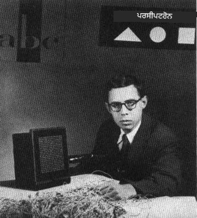
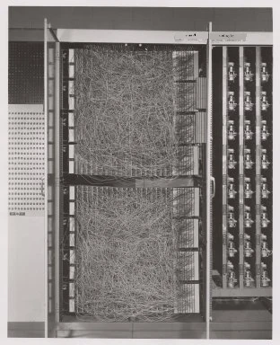
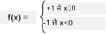

# ਨਿਊਰਲ ਨੈਟਵਰਕਸ ਦਾ ਪਰਚੇ: ਪਰਸੈਪਟ੍ਰਾਨ

## [ਪ੍ਰੀ-ਲੈਕਚਰ ਕਵਿਜ਼](https://ff-quizzes.netlify.app/en/ai/quiz/5)

1957 ਵਿੱਚ, ਕਾਰਨੇਲ ਏਰੋਨਾਟਿਕਲ ਲੈਬੋਰਟਰੀ ਦੇ ਫ੍ਰੈਂਕ ਰੋਜ਼ਨਬਲਾਟ ਨੇ ਮੌਜੂਦਾ ਨਿਊਰਲ ਨੈਟਵਰਕ ਵਰਗੇ ਕੁਝ ਬਣਾਉਣ ਦੀ ਪਹਿਲੀ ਕੋਸ਼ਿਸ਼ ਕੀਤੀ। ਇਹ ਇੱਕ ਹਾਰਡਵੇਅਰ ਇੰਪਲੀਮੈਂਟੇਸ਼ਨ ਸੀ ਜਿਸਨੂੰ "ਮਾਰਕ-1" ਕਿਹਾ ਜਾਂਦਾ ਸੀ, ਜੋ ਤਿਕੋਣ, ਵਰਗ ਅਤੇ ਗੋਲਾਕਾਰ ਵਰਗੇ ਆਦਿ ਜਾਮਿਤੀ ਆਕਰਤੀਆਂ ਨੂੰ ਪਛਾਣਨ ਲਈ ਡਿਜ਼ਾਈਨ ਕੀਤਾ ਗਿਆ ਸੀ।

|      |      |
|--------------|-----------|
| | |

> ਚਿੱਤਰ [ਵਿਕੀਪੀਡੀਆ ਤੋਂ](https://en.wikipedia.org/wiki/Perceptron)

ਇੱਕ ਇਨਪੁਟ ਚਿੱਤਰ ਨੂੰ 20x20 ਫੋਟੋਸੈਲ ਐਰੇ ਦੁਆਰਾ ਦਰਸਾਇਆ ਗਿਆ ਸੀ, ਇਸ ਲਈ ਨਿਊਰਲ ਨੈਟਵਰਕ ਵਿੱਚ 400 ਇਨਪੁਟ ਅਤੇ ਇੱਕ ਬਾਈਨਰੀ ਆਉਟਪੁਟ ਸੀ। ਇੱਕ ਸਧਾਰਨ ਨੈਟਵਰਕ ਵਿੱਚ ਇੱਕ ਨਿਊਰਾਨ ਹੁੰਦਾ ਸੀ, ਜਿਸਨੂੰ **ਥ੍ਰੈਸ਼ਹੋਲਡ ਲਾਜਿਕ ਯੂਨਿਟ** ਵੀ ਕਿਹਾ ਜਾਂਦਾ ਹੈ। ਨਿਊਰਲ ਨੈਟਵਰਕ ਦੇ ਵਜ਼ਨ ਪੋਟੈਂਸ਼ੀਓਮੀਟਰ ਵਾਂਗ ਕੰਮ ਕਰਦੇ ਸਨ, ਜਿਨ੍ਹਾਂ ਨੂੰ ਟ੍ਰੇਨਿੰਗ ਦੌਰਾਨ ਹੱਥੋਂ ਸਹੀ ਕੀਤਾ ਜਾਂਦਾ ਸੀ।

> ✅ ਪੋਟੈਂਸ਼ੀਓਮੀਟਰ ਇੱਕ ਜੰਤਰ ਹੈ ਜੋ ਵਰਤੋਂਕਾਰ ਨੂੰ ਸਰਕਟ ਦੀ ਰੋਧ ਨੂੰ ਸਹੀ ਕਰਨ ਦੀ ਆਗਿਆ ਦਿੰਦਾ ਹੈ।

> ਉਸ ਸਮੇਂ ਨਿਊਯਾਰਕ ਟਾਈਮਜ਼ ਨੇ ਪਰਸੈਪਟ੍ਰਾਨ ਬਾਰੇ ਲਿਖਿਆ: *ਇਲੈਕਟ੍ਰਾਨਿਕ ਕੰਪਿਊਟਰ ਦਾ ਭ੍ਰੂਣ ਜਿਸ ਤੋਂ [ਨੈਵੀ] ਉਮੀਦ ਕਰਦੀ ਹੈ ਕਿ ਇਹ ਤੁਰ ਸਕੇਗਾ, ਬੋਲ ਸਕੇਗਾ, ਵੇਖ ਸਕੇਗਾ, ਲਿਖ ਸਕੇਗਾ, ਆਪਣੇ ਆਪ ਨੂੰ ਦੁਬਾਰਾ ਬਣਾਉਣ ਸਕੇਗਾ ਅਤੇ ਆਪਣੇ ਅਸਤੀਤਵ ਦਾ ਜ਼ਮੀਰ ਰੱਖ ਸਕੇਗਾ।*

## ਪਰਸੈਪਟ੍ਰਾਨ ਮਾਡਲ

ਮੰਨ ਲਓ ਕਿ ਸਾਡੇ ਮਾਡਲ ਵਿੱਚ N ਫੀਚਰ ਹਨ, ਇਸ ਸਥਿਤੀ ਵਿੱਚ ਇਨਪੁਟ ਵੇਕਟਰ N ਆਕਾਰ ਦਾ ਇੱਕ ਵੇਕਟਰ ਹੋਵੇਗਾ। ਪਰਸੈਪਟ੍ਰਾਨ ਇੱਕ **ਬਾਈਨਰੀ ਕਲਾਸੀਫਿਕੇਸ਼ਨ** ਮਾਡਲ ਹੈ, ਅਰਥਾਤ ਇਹ ਦੋ ਕਲਾਸਾਂ ਦੇ ਇਨਪੁਟ ਡਾਟਾ ਵਿੱਚ ਅੰਤਰ ਕਰ ਸਕਦਾ ਹੈ। ਅਸੀਂ ਮੰਨਦੇ ਹਾਂ ਕਿ ਹਰ ਇਨਪੁਟ ਵੇਕਟਰ x ਲਈ ਸਾਡੇ ਪਰਸੈਪਟ੍ਰਾਨ ਦਾ ਆਉਟਪੁਟ +1 ਜਾਂ -1 ਹੋਵੇਗਾ, ਕਲਾਸ ਦੇ ਅਨੁਸਾਰ। ਆਉਟਪੁਟ ਹੇਠਾਂ ਦਿੱਤੇ ਫਾਰਮੂਲੇ ਦੀ ਵਰਤੋਂ ਕਰਕੇ ਗਣਨਾ ਕੀਤੀ ਜਾਵੇਗੀ:

y(x) = f(w<sup>T</sup>x)

ਜਿੱਥੇ f ਇੱਕ ਸਟੀਪ ਐਕਟੀਵੇਸ਼ਨ ਫੰਕਸ਼ਨ ਹੈ

<!-- img src="http://www.sciweavers.org/tex2img.php?eq=f%28x%29%20%3D%20%5Cbegin%7Bcases%7D%0A%20%20%20%20%20%20%20%20%20%2B1%20%26%20x%20%5Cgeq%200%20%5C%5C%0A%20%20%20%20%20%20%20%20%20-1%20%26%20x%20%3C%200%0A%20%20%20%20%20%20%20%5Cend%7Bcases%7D%20%5C%5C%0A&bc=White&fc=Black&im=jpg&fs=12&ff=arev&edit=0" align="center" border="0" alt="f(x) = \begin{cases} +1 & x \geq 0 \\ -1 & x < 0 \end{cases} \\" width="154" height="50" / -->


## ਪਰਸੈਪਟ੍ਰਾਨ ਦੀ ਟ੍ਰੇਨਿੰਗ

ਪਰਸੈਪਟ੍ਰਾਨ ਨੂੰ ਟ੍ਰੇਨ ਕਰਨ ਲਈ ਸਾਨੂੰ ਇੱਕ ਵਜ਼ਨ ਵੇਕਟਰ w ਲੱਭਣ ਦੀ ਲੋੜ ਹੈ ਜੋ ਜ਼ਿਆਦਾਤਰ ਮੁੱਲਾਂ ਨੂੰ ਸਹੀ ਤਰੀਕੇ ਨਾਲ ਕਲਾਸੀਫਾਈ ਕਰਦਾ ਹੈ, ਅਰਥਾਤ ਸਭ ਤੋਂ ਘੱਟ **ਗਲਤੀ** ਦਾ ਨਤੀਜਾ ਦਿੰਦਾ ਹੈ। ਇਹ ਗਲਤੀ E ਨੂੰ **ਪਰਸੈਪਟ੍ਰਾਨ ਮਾਪਦੰਡ** ਦੁਆਰਾ ਹੇਠਾਂ ਦਿੱਤੇ ਤਰੀਕੇ ਨਾਲ ਪਰਿਭਾਸ਼ਿਤ ਕੀਤਾ ਜਾਂਦਾ ਹੈ:

E(w) = -&sum;w<sup>T</sup>x<sub>i</sub>t<sub>i</sub>

ਜਿੱਥੇ:

* ਜੋ ਟ੍ਰੇਨਿੰਗ ਡਾਟਾ ਪੌਇੰਟ i ਗਲਤ ਕਲਾਸੀਫਿਕੇਸ਼ਨ ਦਾ ਨਤੀਜਾ ਦਿੰਦੇ ਹਨ, ਉਨ੍ਹਾਂ 'ਤੇ ਜੋੜ ਲਿਆ ਜਾਂਦਾ ਹੈ
* x<sub>i</sub> ਇਨਪੁਟ ਡਾਟਾ ਹੈ, ਅਤੇ t<sub>i</sub> ਨਕਾਰਾਤਮਕ ਅਤੇ ਸਕਾਰਾਤਮਕ ਉਦਾਹਰਣਾਂ ਲਈ -1 ਜਾਂ +1 ਹੈ।

ਇਸ ਮਾਪਦੰਡ ਨੂੰ ਵਜ਼ਨ w ਦੇ ਫੰਕਸ਼ਨ ਵਜੋਂ ਮੰਨਿਆ ਜਾਂਦਾ ਹੈ, ਅਤੇ ਸਾਨੂੰ ਇਸਨੂੰ ਘਟਾਉਣਾ ਹੈ। ਅਕਸਰ, **ਗ੍ਰੇਡੀਅੰਟ ਡਿਸੈਂਟ** ਨਾਮਕ ਇੱਕ ਵਿਧੀ ਦੀ ਵਰਤੋਂ ਕੀਤੀ ਜਾਂਦੀ ਹੈ, ਜਿਸ ਵਿੱਚ ਅਸੀਂ ਕੁਝ ਸ਼ੁਰੂਆਤੀ ਵਜ਼ਨ w<sup>(0)</sup> ਨਾਲ ਸ਼ੁਰੂ ਕਰਦੇ ਹਾਂ, ਅਤੇ ਫਿਰ ਹਰ ਕਦਮ 'ਤੇ ਹੇਠਾਂ ਦਿੱਤੇ ਫਾਰਮੂਲੇ ਦੇ ਅਨੁਸਾਰ ਵਜ਼ਨ ਨੂੰ ਅਪਡੇਟ ਕਰਦੇ ਹਾਂ:

w<sup>(t+1)</sup> = w<sup>(t)</sup> - &eta;&nabla;E(w)

ਇੱਥੇ &eta; ਨੂੰ **ਲਰਨਿੰਗ ਰੇਟ** ਕਿਹਾ ਜਾਂਦਾ ਹੈ, ਅਤੇ &nabla;E(w) E ਦਾ **ਗ੍ਰੇਡੀਅੰਟ** ਦਰਸਾਉਂਦਾ ਹੈ। ਜਦੋਂ ਅਸੀਂ ਗ੍ਰੇਡੀਅੰਟ ਦੀ ਗਣਨਾ ਕਰਦੇ ਹਾਂ, ਤਾਂ ਅਸੀਂ ਹਾਸਲ ਕਰਦੇ ਹਾਂ:

w<sup>(t+1)</sup> = w<sup>(t)</sup> + &sum;&eta;x<sub>i</sub>t<sub>i</sub>

ਪਾਇਥਨ ਵਿੱਚ ਐਲਗੋਰਿਥਮ ਇਸ ਤਰ੍ਹਾਂ ਦਿਖਾਈ ਦਿੰਦਾ ਹੈ:

```python
def train(positive_examples, negative_examples, num_iterations = 100, eta = 1):

    weights = [0,0,0] # Initialize weights (almost randomly :)
        
    for i in range(num_iterations):
        pos = random.choice(positive_examples)
        neg = random.choice(negative_examples)

        z = np.dot(pos, weights) # compute perceptron output
        if z < 0: # positive example classified as negative
            weights = weights + eta*weights.shape

        z  = np.dot(neg, weights)
        if z >= 0: # negative example classified as positive
            weights = weights - eta*weights.shape

    return weights
```

## ਨਿਸਕਰਸ਼

ਇਸ ਪਾਠ ਵਿੱਚ, ਤੁਸੀਂ ਪਰਸੈਪਟ੍ਰਾਨ ਬਾਰੇ ਸਿੱਖਿਆ, ਜੋ ਕਿ ਇੱਕ ਬਾਈਨਰੀ ਕਲਾਸੀਫਿਕੇਸ਼ਨ ਮਾਡਲ ਹੈ, ਅਤੇ ਇਸਨੂੰ ਵਜ਼ਨ ਵੇਕਟਰ ਦੀ ਵਰਤੋਂ ਕਰਕੇ ਟ੍ਰੇਨ ਕਰਨ ਦਾ ਤਰੀਕਾ।

## 🚀 ਚੁਣੌਤੀ

ਜੇ ਤੁਸੀਂ ਆਪਣਾ ਪਰਸੈਪਟ੍ਰਾਨ ਬਣਾਉਣ ਦੀ ਕੋਸ਼ਿਸ਼ ਕਰਨਾ ਚਾਹੁੰਦੇ ਹੋ, ਤਾਂ [ਮਾਈਕਰੋਸਾਫਟ ਲਰਨ](https://docs.microsoft.com/en-us/azure/machine-learning/component-reference/two-class-averaged-perceptron?WT.mc_id=academic-77998-cacaste) 'ਤੇ ਇਸ ਲੈਬ ਨੂੰ ਅਜ਼ਮਾਓ ਜੋ [Azure ML designer](https://docs.microsoft.com/en-us/azure/machine-learning/concept-designer?WT.mc_id=academic-77998-cacaste) ਦੀ ਵਰਤੋਂ ਕਰਦੀ ਹੈ।

## [ਪੋਸਟ-ਲੈਕਚਰ ਕਵਿਜ਼](https://ff-quizzes.netlify.app/en/ai/quiz/6)

## ਸਮੀਖਿਆ ਅਤੇ ਸਵੈ ਅਧਿਐਨ

ਇਹ ਦੇਖਣ ਲਈ ਕਿ ਅਸੀਂ ਪਰਸੈਪਟ੍ਰਾਨ ਦੀ ਵਰਤੋਂ ਕਰਕੇ ਇੱਕ ਸਧਾਰਨ ਸਮੱਸਿਆ ਅਤੇ ਅਸਲ-ਜੀਵਨ ਸਮੱਸਿਆਵਾਂ ਨੂੰ ਕਿਵੇਂ ਹੱਲ ਕਰ ਸਕਦੇ ਹਾਂ, ਅਤੇ ਸਿੱਖਿਆ ਜਾਰੀ ਰੱਖਣ ਲਈ - [Perceptron](Perceptron.ipynb) ਨੋਟਬੁੱਕ 'ਤੇ ਜਾਓ।

ਇਹ ਇੱਕ ਦਿਲਚਸਪ [ਲੇਖ ਪਰਸੈਪਟ੍ਰਾਨ ਬਾਰੇ](https://towardsdatascience.com/what-is-a-perceptron-basics-of-neural-networks-c4cfea20c590) ਵੀ ਹੈ।

## [ਅਸਾਈਨਮੈਂਟ](lab/README.md)

ਇਸ ਪਾਠ ਵਿੱਚ, ਅਸੀਂ ਇੱਕ ਬਾਈਨਰੀ ਕਲਾਸੀਫਿਕੇਸ਼ਨ ਟਾਸਕ ਲਈ ਪਰਸੈਪਟ੍ਰਾਨ ਨੂੰ ਲਾਗੂ ਕੀਤਾ ਹੈ, ਅਤੇ ਅਸੀਂ ਇਸਦੀ ਵਰਤੋਂ ਦੋ ਹੱਥੋਂ ਲਿਖੇ ਅੰਕਾਂ ਵਿੱਚ ਅੰਤਰ ਕਰਨ ਲਈ ਕੀਤੀ। ਇਸ ਲੈਬ ਵਿੱਚ, ਤੁਹਾਨੂੰ ਪੂਰੀ ਤਰ੍ਹਾਂ ਅੰਕਾਂ ਦੀ ਕਲਾਸੀਫਿਕੇਸ਼ਨ ਦੀ ਸਮੱਸਿਆ ਹੱਲ ਕਰਨ ਲਈ ਕਿਹਾ ਜਾਂਦਾ ਹੈ, ਅਰਥਾਤ ਇਹ ਨਿਰਧਾਰਤ ਕਰਨਾ ਕਿ ਦਿੱਤੇ ਚਿੱਤਰ ਨਾਲ ਸਭ ਤੋਂ ਵੱਧ ਸੰਭਾਵਨਾ ਵਾਲਾ ਅੰਕ ਕਿਹੜਾ ਹੈ।

* [ਹਦਾਇਤਾਂ](lab/README.md)
* [ਨੋਟਬੁੱਕ](lab/PerceptronMultiClass.ipynb)

---

